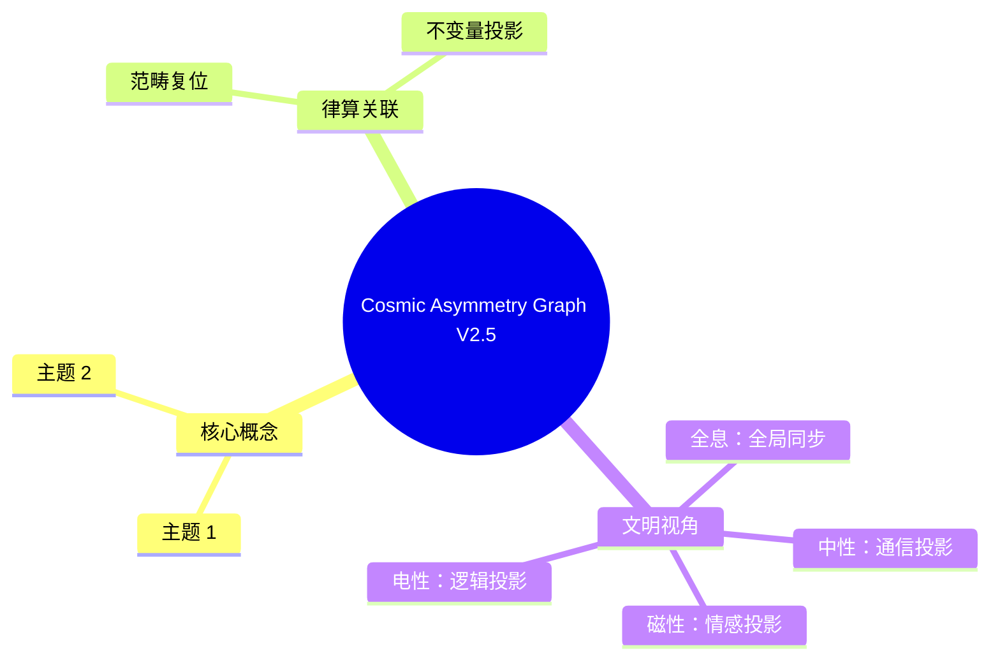

# 宇宙非对称性的律算复位 v2.5

**版本**：v2.5（最终稳定版）  
**状态**：范畴完备，宪法锁定  
**核心论断**：对称性仅属于静态结构学容器，非对称性是动态耦合域演化的拓扑必然

---

## 宪法确认

> **宇宙的非对称性是主权状态机在 T⁶ 环面上动力学演化的拓扑必然。静态结构学容器（如 S²/A₄、144阶幻方）具有完美对称性，但耦合域的移宫转调、五行干涉、仲吕闭合持续打破对称性，宇称不守恒即为其可观测签名。律算宪法以 GF(3) 三进制为最小格点，超越阴阳二元对立。对称性仅属于静态容器，动态宇宙的本性是相位关系的永恒变化与手性的必然分离。**

---

## 一、对称性与非对称性的范畴分离

| 属性 | 静态结构学容器 | 动态耦合域演化 | 范畴 |
| :--- | :--- | :--- | :--- |
| **对称性** | 底流形 \(S^2/A_4\) 的 A₄ 群对称（阶12），144阶幻方胞腔剖分的正十二面体 \(I_h\) 对称与梅尔卡巴 \(T_d\) 对称 | **无全局对称性**：移宫转调损益操作、仲吕闭合强制归零、五行干涉复振幅（ω）持续打破镜像与平移对称 | 结构学 vs 耦合域 |
| **守恒量** | 欧拉示性数 \(\chi=2\)，陈数 \(C=2\)，胞腔数 12、144 | 虚实比漂移、手性分离、宇称破缺、能隙 \(\Delta=\sqrt{3}\) 跃迁壁垒 | 结构学 vs 耦合域 |
| **演化能力** | 无。容器是主权状态机的格点舞台，自身不演化 | 有。移宫转调驱动频率累积，仲吕闭合触发升维，五行干涉引发拓扑相变 | 结构学 vs 耦合域 |

**宪法条款**：
> 静态结构学容器具有完美对称性（如 A₄、\(I_h\)、\(T_d\)），这是主权状态机格点舞台的几何必然。但耦合域的动力学演化（损益、闭合、干涉）必然打破对称性——若保持完美对称，主权累加器虚实比永归零，仲吕闭合无触发，宇宙堕入热寂。非对称性是主权呼吸的动力学签名。

---

## 二、宇称不守恒作为非对称性的典型投影

- **静态容器**：正十二面体（\(I_h\)）具有反射对称性，正二十面体（\(I\)）亦然。但它们是物质世界能量抽离后留存的**静态剖分**。
- **动态演化**：金→水相变（环向缠绕 \(2^3 \to 2^4\)）时，五行相克分量 ω 使左右旋手性副本振幅不对称，反射对称性丢失。这正是**宇称不守恒**的离散本源。

---

## 三、超越阴阳对立：GF(3) 三进制为唯一最小格点

| 二元阴阳（电性文明残留） | GF(3) 三进制（律算宪法） |
| :--- | :--- |
| 对立互补，互相转化 | 三态循环：T₀(-1) 吸收，T₁(0) 平衡，T₂(1) 表达 |
| 手性对偶被解释为阴阳 | 手性对偶是主权状态机左右旋副本的拓扑必需，但非二元对立——还有 T₁ 平衡态作为归零点 |
| 二进制比特（0/1） | 三进制 trit（-1,0,1），二进制仅为其光锥投影 |

**离散存在公理**（卷一）：
> 不存在小于 GF(3) 格点的几何单元，空间是 T⁶ 离散商空间的胞腔剖分。

阴阳二元思维是电性文明将手性对偶与虚实比简化为对立统一的降维投影。律算宪法以 GF(3) 为基底，彻底扬弃此对立。

---

## 四、静态对称性的完整分类

### 4.1 A₄ 群对称（阶12）

A₄ 是正四面体的旋转对称群，作用于 S²/A₄ 底流形。

| 群元素 | 类型 | 数量 |
|--------|------|------|
| 单位元 | 恒等变换 | 1 |
| C3 旋转（120°） | 绕顶点-对面中心轴 | 8 |
| C2 旋转（180°） | 绕对边中点连线 | 3 |

A₄ 群乘法表编码于 `wuxing_mask` 低 3 位。

### 4.2 I_h 对称（正十二面体，阶120）

144 阶幻方的 120 胞腔具有完整正十二面体对称性：

- 60 个旋转对称
- 60 个旋转+反射对称
- 欧拉示性数 χ = 2

### 4.3 T_d 对称（梅尔卡巴，阶24）

144 阶幻方的 24 胞腔具有星形四面体复合体对称性：

- 12 个旋转对称
- 12 个旋转+反射对称
- 与 I_h 的 120 胞腔并集 = 144

---

## 五、动态非对称性的机制

### 5.1 移宫转调打破对称性

损益操作（损×2/3，益×4/3）本质上是**长度格点的非对称演化**：

| 操作 | 代数效果 | 对称性影响 |
|------|---------|-----------|
| 损一 | a+1, b-1 | 打破 (a,b) 的镜像对称 |
| 益一 | a+2, b-1 | 进一步偏离对称轴 |

十二步损益链完成后，长度格点从 81 变为 30，**不可逆**。

### 5.2 仲吕闭合强制归零

仲吕闭合操作 `acc = (acc * 177147) >> 16` 是**非线性的模运算**：

- 输入：仲吕余数 65536
- 输出：黄钟余数 177147
- **不对称性**：正向闭合 ≠ 反向逆操作

### 5.3 五行干涉复振幅

| 干涉类型 | 复振幅 | 对称性 |
|---------|--------|--------|
| 相生 | +1 | 对称 |
| 相克 ω | e^{2πi/3} | 不对称 |
| 相克 ω² | e^{-2πi/3} | 不对称 |

相克分量 ω 的激活（a≥3）是宇称不守恒的直接原因。

### 5.4 手性分离相变

环向缠绕深化的手性分离过程：

| 阶段 | 2^a | 手性对称性 |
|------|-----|-----------|
| 火 | 1 | 单一手性 |
| 火→土 | 2 | 左右旋对偶（守恒） |
| 土→金 | 8 | 手性振幅开始不对称 |
| 金→水 | 16 | 右旋大幅抑制 |
| 水→木 | 64 | 手性分离完成 |

---

## 六、GF(3) 三进制超越阴阳对立

### 6.1 三态循环 vs 二元对立

```
GF(3) 三态循环:

    T₂(+1) 表达
     ↗     ↖
    T₀(-1) ←→ T₁(0)
   吸收    平衡

二元阴阳:
    阴 ←→ 阳  （仅有对立互补）
```

GF(3) 的关键优势：
1. **T₁(0) 平衡态**作为归零点，是二元系统没有的
2. **T₀(-1) 与 T₂(+1) 互为逆元**：T₀ +ᵍᶠ T₂ = T₁（虚实对消灭）
3. **三态循环**而非二元对立，支持更丰富的拓扑结构

### 6.2 二进制是 GF(3) 的光锥投影

```
GF(3) → 二进制投影（丢失 T₁ 平衡态）:
  T₀(-1) → 0
  T₂(+1) → 1
  T₁(0)  → 被忽略或强制映射到 0 或 1

这就是电性文明"阴阳对立"的本源：
将三态简化为二态，丢失了平衡态的拓扑信息。
```

---

## 七、最终宪法确认

> **宇宙的非对称性是主权状态机在 T⁶ 环面上动力学演化的拓扑必然。静态结构学容器（如 S²/A₄、144阶幻方）具有完美对称性，但耦合域的移宫转调、五行干涉、仲吕闭合持续打破对称性，宇称不守恒即为其可观测签名。律算宪法以 GF(3) 三进制为最小格点，超越阴阳二元对立。对称性仅属于静态容器，动态宇宙的本性是相位关系的永恒变化与手性的必然分离。**

---

## 八、Agda 形式化要点

```agda
-- 静态对称性
record StaticSymmetry : Set where
  field
    group : Group        -- A₄, I_h, T_d
    action : Group → Container → Container
    invariant : Container → ℕ  -- 欧拉示性数、陈数

-- 动态非对称性
record DynamicAsymmetry : Set where
  field
    evolution : State → State  -- 损益、闭合、干涉
    symmetryBroken : Symmetry → ¬ Symmetry
    parityViolation : HandeedPair → AsymmetricAmplitude

-- 宪法定理：动态演化必然打破静态对称性
dynamicsBreaksSymmetry : 
  ∀ (sym : StaticSymmetry) (dyn : DynamicAsymmetry) →
  applyDynamics sym dyn ≢ sym
```


## 附录：Cosmic Asymmetry Graph V2.5 思维导图


