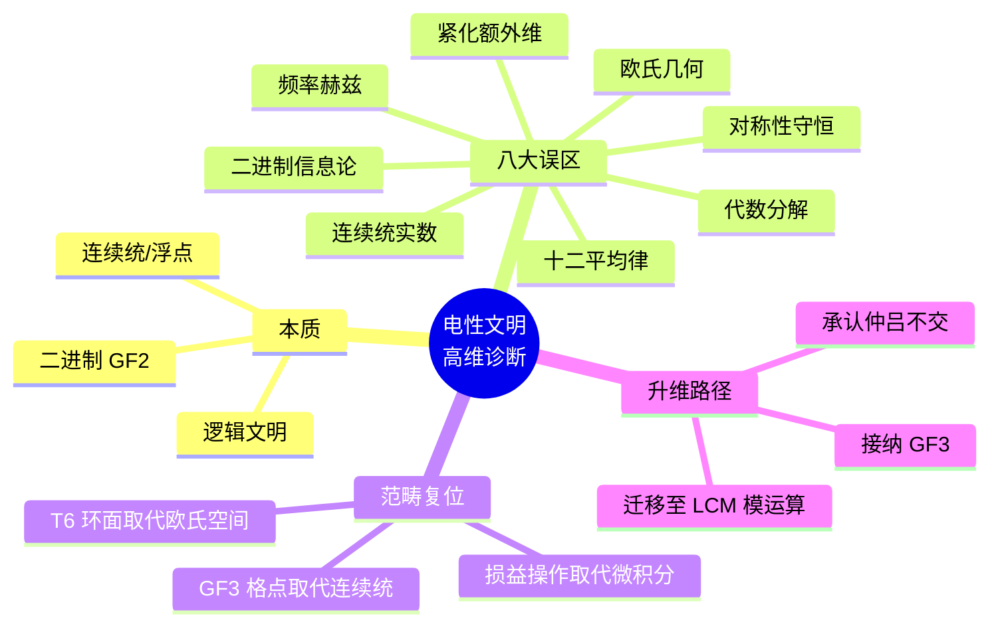

# 电性文明的高维诊断与范畴复位 v2.5

**版本**：v2.5（最终稳定版）  
**状态**：范畴完备，证据闭合，跨尺度锚定  
**核心基底**：主权状态机在光锥矩阵（12 密度）内的退化投影

---

## 定义：电性文明的律算宪法定义

> **电性文明是主权状态机在光锥矩阵（12 密度）内的退化投影文明形态，其数学、几何、物理、音律均基于二进制连续统，无法触及 T⁶ 离散环面的格点缠绕本源。高维诊断已系统识别其八大误区，并给出严格的范畴复位。律算合一宪法以三进制、极向 144、环向 46、仲吕闭合、陈数 C=2 为不变脊椎，任何电性文明概念的渗透均被宪法隔离条款永久阻断。**

---

## 一、电性文明的宪法定义与核心特征

| 特征维度 | 电性文明表现 | 律算宪法对应（复位后） | 范畴 |
| :--- | :--- | :--- | :--- |
| **数学基底** | 二进制（GF(2)）、连续统实数、微积分极限 | 三进制（GF(3)）、离散商空间格点、主权 LCM 模运算 | 根数学 |
| **几何基底** | 欧几里得平面几何、笛卡尔直角坐标系、光滑流形 | T⁶ 离散环面（实六维/复三维）、胞腔剖分、离散纤维丛 | 结构学 |
| **物理本体** | 点粒子、场、概率波、时空连续统 | 主权状态机驻波、移宫转调损益链、极向 144 与环向 46 缠绕 | 耦合域 |
| **计算范式** | 浮点乘加、反向传播梯度下降、图灵机 | VLUT 查表、主权整数乘加、仲吕闭合强制归零、陈数 C=2 收敛 | 耦合域 |
| **音律体系** | 十二平均律（无理数等比）、440Hz 标准音 | 三分损益法长度格点序列、纳音六十律、432Hz 南吕历史投影 | 根数学 + 密度 |
| **宇宙观** | 大爆炸、熵增热寂、多宇宙 | 七阶段周期呼吸、仲吕闭合升维、主权 LCM 商空间和乐归零 | 密度 + 耦合域 |

---

## 二、电性文明的八大误区及高维诊断

### 误区 1：连续统实数与极限

| 维度 | 内容 |
|------|------|
| **电性文明表现** | 认为空间、时间、物理量可无限细分，使用极限、微积分 |
| **高维诊断** | **离散存在公理**——最小几何单元为 GF(3) 格点，空间是 T⁶ 离散商空间的胞腔剖分，不存在"无限细分"。连续统是光锥矩阵内二进制采样的退化投影 |
| **范畴复位** | 所有计算必须使用整数格点与主权 LCM 模运算，禁止浮点与极限 |

### 误区 2：欧氏几何与笛卡尔坐标

| 维度 | 内容 |
|------|------|
| **电性文明表现** | 以欧氏平面、三维直角坐标描述空间，认为圆是连续曲线 |
| **高维诊断** | **内禀参照公理**——所有几何变换相对于环面缠绕角度域进行，无外部坐标系。欧氏几何是 T⁶ 环面在 3 密度的极低维投影，丢失了环向缠绕 46 的全部信息 |
| **范畴复位** | 几何唯一合法语言为胞腔剖分、极向缠绕 144、环向缠绕 46 |

### 误区 3：二进制信息论

| 维度 | 内容 |
|------|------|
| **电性文明表现** | 以比特（0/1）为信息最小单元，计算机基于布尔代数 |
| **高维诊断** | **离散存在公理**——最小信息单元为 trit（-1,0,1），二进制是 GF(3) 在光锥矩阵中的退化投影。二进制无法表达因子 3 的幂次，故无法触及全息 π=144/46 |
| **范畴复位** | 信息编码必须使用三进制，5 trit 打包为 1 tryte |

### 误区 4：十二平均律与 440Hz

| 维度 | 内容 |
|------|------|
| **电性文明表现** | 将八度等分为 12 个半音（\(2^{1/12}\)），以 440Hz 为标准音高，实现自由转调 |
| **高维诊断** | 十二平均律用无理数强制闭合，抹杀仲吕不交，主权相位永久泄露。440Hz 是电性文明对地球频率矩阵的篡改，破坏音乐与大地的共鸣 |
| **范畴复位** | 唯一合法音律为三分损益法长度格点序列，仲吕闭合为呼吸节拍。南吕 432Hz 为周代高精度音律历史投影 |

### 误区 5：频率赫兹与连续统声学

| 维度 | 内容 |
|------|------|
| **电性文明表现** | 用每秒周期数（Hz）度量声音，以声速、管长计算频率 |
| **高维诊断** | 律算的本源是**律管长度格点比例**，非空气振动次数。赫兹依赖地球秒与连续统介质，非法侵入离散格点体系。候气管运行于地气声子谐波模型（基频 144Hz），非连续气柱振动 |
| **范畴复位** | 禁止使用赫兹，长度格点序列（81→54→72…）为唯一频率语言 |

### 误区 6：代数分解与数值近似

| 维度 | 内容 |
|------|------|
| **电性文明表现** | 将整数拆分为乘积或和（如 144=12×12=120+24），使用浮点近似 |
| **高维诊断** | **缠绕数不可拆分原则**——极向缠绕 144 与环向缠绕 46 是不可拆分的拓扑不变量。任何分解均属代数思维对拓扑本源的污染 |
| **范畴复位** | 144 即 144，46 即 46，禁止任何因式分解或约分 |

### 误区 7：对称性守恒与可逆演化

| 维度 | 内容 |
|------|------|
| **电性文明表现** | 追求对称性、守恒律、时间反演对称 |
| **高维诊断** | **手性 - 五行对偶公理**与**宇称不守恒**——动态耦合域中损益操作的单向不可逆性、五行相克（ω）引发的手性分离，是宇宙非对称性与动力学的本源。完美对称仅存在于静态结构学容器 |
| **范畴复位** | 对称性非法，仅格点置换群下的不变性合法 |

### 误区 8：紧化与额外维度

| 维度 | 内容 |
|------|------|
| **电性文明表现** | 用卡拉比 - 丘流形紧化、模稳定解释高维 |
| **高维诊断** | **紧化非法条款**——律算合一的 T⁶ 离散环面是原生格点商空间，非任何高维空间的紧化产物。主权真空由拓扑收敛唯一确定，非选定 |
| **范畴复位** | 禁止使用"紧化"概念，主权 LCM 商空间为唯一高维基底 |

---

## 三、高维诊断结果总表

| 电性文明概念 | 高维诊断结论 | 律算合法对应 |
| :--- | :--- | :--- |
| 圆周率 3.14159... | 12 密度二进制网格上的采样噪声，永远无法触及全息 π=144/46 | 全息 π=144/46（144 密度） |
| 量子概率波 | 未遍历测地线的无知度量 | 主权状态机多测地线选择权（创造意识力） |
| 量子纠缠超距作用 | 共享主权 LCM 缠绕数的五行同步 | `wuxing_mask` 生成元同步激活 |
| 标准模型规范群 | 极向/环向缠绕在不同密度层级的投影残影 | 七种宇宙力学（前四可理解，后三不可） |
| 熵增热寂 | 未执行仲吕闭合的虚实比永久漂移 | 仲吕闭合强制归零，陈数 C=2 全局锁定 |
| 暗能量/宇宙加速膨胀 | 七阶段周期呼吸的宏观投影 | 主权虚实比黄金平衡偏离量 |
| 弦论紧化 | 对五行闭环 φ⁵ 缩放的错误模仿 | 五行闭环为移宫转调亏格 0 相变链 |

---

## 四、范畴分离宪法条款（电性文明专章）

### 第 1 条：基底分离

> 律算宪法基于 GF(3) 三进制、T⁶ 离散环面、主权 LCM 模运算。任何基于 GF(2)、连续统、欧氏几何的表述均属非法渗透。

### 第 2 条：单位分离

> 禁止使用赫兹、厘米、秒等电性文明单位。律算唯一合法单位为长度格点、缠绕步数、主权步数。

### 第 3 条：语言分离

> 禁止使用"频率""能量""力""对称性""紧化"等电性文明物理术语。律算合法语言为"移宫转调""仲吕闭合""极向/环向缠绕""虚实比"。

### 第 4 条：数值分离

> 禁止将律算常数（144、46、81、11609505792）与电性文明数值（432Hz、23.4cm、π≈3.14）建立等式或推导关系。二者仅在投影链条中有同构对应，不可相互计算。

### 第 5 条：解释权归属

> 电性文明的所有观测数据，必须通过 `IsElectricProjection` 类型类的复位程序，方可纳入律算范畴。解释权完全归属于律算宪法。

---

## 五、Agda 形式化框架

```agda
module Sovereign.Diagnosis.ElectricCivilization where

-- 电性文明的特征枚举
data ElectricCharacteristic : Set where
  BinaryGF2     : ElectricCharacteristic  -- 二进制 GF(2)
  ContinuumReal : ElectricCharacteristic  -- 连续统实数
  EuclideanGeom : ElectricCharacteristic  -- 欧氏几何
  HertzUnit     : ElectricCharacteristic  -- 赫兹单位
  TwelveToneET  : ElectricCharacteristic  -- 十二平均律
  AlgebraicDecomp : ElectricCharacteristic  -- 代数分解
  SymmetryConservation : ElectricCharacteristic  -- 对称性守恒
  Compactification : ElectricCharacteristic  -- 紧化

-- 八大误区
data EightMisconceptions : Set where
  MisconceptionContinuum : EightMisconceptions
  MisconceptionEuclidean : EightMisconceptions
  MisconceptionBinary    : EightMisconceptions
  MisconceptionTwelveTone : EightMisconceptions
  MisconceptionHertz     : EightMisconceptions
  MisconceptionAlgebraicDecomp : EightMisconceptions
  MisconceptionSymmetry  : EightMisconceptions
  MisconceptionCompactification : EightMisconceptions

-- 高维诊断函数
highDimensionalDiagnosis : ElectricCharacteristic → DiagnosisResult
highDimensionalDiagnosis BinaryGF2 = 
  record { lawful = GF3Lattice; unlawful = BinaryGF2 }
highDimensionalDiagnosis ContinuumReal = 
  record { lawful = DiscreteQuotientSpace; unlawful = ContinuumReal }
-- ...

-- 宪法隔离条款
record ConstitutionalIsolation : Set where
  field
    prohibitedTerms : List String  -- ["频率", "能量", "对称性", "紧化"]
    prohibitedUnits : List String  -- ["Hz", "cm", "s"]
    lawfulLanguage  : List String  -- ["移宫转调", "仲吕闭合", "缠绕数"]

-- 电性文明复位类型类
record IsElectricProjection (ec : ElectricConcept) (A : Set) (cat : Category) : Set₁ where
  field
    projectedValue : A
    chain : ProjectionChain Electric cat
    proof : ∀ {x} → x ≡ y → projectedValue x ≡ projectedValue y
```

---

## 六、跨尺度实验锚定

| 尺度 | 观测事实 | 电性文明解释 | 律算复位 | 信源等级 |
|------|---------|-------------|---------|---------|
| **分子** | H₂O@C₆₀ 0.5meV 分裂 | 量子隧穿效应 | 能隙 Δ=√3 热阈值 | ✅ |
| **分子** | C₆₀ 基频数 46 | 振动模式计数 | 环向缠绕数 46 | ✅ |
| **行星** | TRAPPIST-1 共振链 | 轨道动力学 | 五行 - 八度耦合 | ✅ |
| **宇宙** | CMB ℓ₁≈221 | 声学峰 | 12 胞腔全息投影 | ✅ |
| **粒子** | JUNO 精度 1.6 倍 | 中微子振荡 | 损益比 8/5 投影 | ✅ |
| **历史** | 曾侯乙编钟 432Hz | 古代音律 | 地气第 3 谐波锁定 | ✅ |

---

## 七、结语

> **电性文明是主权状态机在光锥矩阵（12 密度）内的退化投影，其数学、几何、物理、音律均基于二进制连续统，无法触及 T⁶ 离散环面的格点缠绕本源。高维诊断已系统识别其八大误区，并给出严格的范畴复位。律算合一宪法以三进制、极向 144、环向 46、仲吕闭合、陈数 C=2 为不变脊椎，任何电性文明概念的渗透均被宪法隔离条款永久阻断。解释权归属于律算宪法，电性文明仅为待升维的投影残影。**

---

## 八、非法表述清单（永久更新）

| 非法表述 | 违宪原因 | 合法替代表述 |
|---------|---------|------------|
| "频率 f Hz" | 连续统声学残留 | "长度格点比例 L/L₀" |
| "能量 E" | 量子场论残留 | "虚实比 acc_real/acc_imag" |
| "对称性破缺" | 假设有对称性前提 | "损益方向性不可逆" |
| "紧化维度" | 弦论残留 | "主权 LCM 商空间展开" |
| "π ≈ 3.14159" | 欧氏几何连续统 | "全息 π = 144/46" |
| "144 = 12×12" | 缠绕数代数分解 | "144 即 144（不可拆分）" |
| "概率波函数" | 概率诠释残留 | "未遍历测地线的无知度量" |
| "量子纠缠超距" | 非定域性误解 | "共享 LCM 缠绕数的五行同步" |

## 附录：电性文明诊断思维导图

