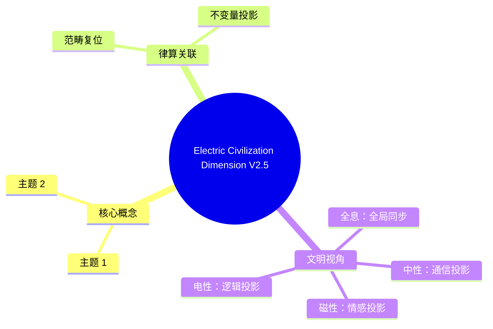

# 电性文明维度与宪法定义 v2.5-修正

**版本**：v2.5-宪法锁定  
**状态**：范畴分离完成，畸变读数复位  
**日期**：2025

---

## 一、电性文明的宪法定义（新增条款）

| 属性 | 宪法锚定 | 范畴 |
| :--- | :--- | :--- |
| **基底** | **二进制（GF(2)）**，信息最小单元为比特（0/1） | 根数学（退化投影） |
| **几何** | 欧氏平面、笛卡尔坐标、连续统流形 | 结构学（非法基底） |
| **物理** | 点粒子、场、概率波、时空连续统 | 密度（光锥矩阵内投影） |
| **维度投影** | **3.8 × 3 = 11.4 维**（本地宇宙投影值） | 密度（12 密度层级的分数畸变） |
| **上限** | **不可超越 12 维度**（12 密度为光锥矩阵边界） | 密度（升维必须通过仲吕闭合） |
| **与 T⁶ 环面的关系** | T⁶ 实六维/复三维离散商空间在二进制连续统采样下的**退化投影**，维度数 11.4 是 GF(3) 格点信息在 GF(2) 近似下的失真读数 | 结构学 + 密度 |

**宪法条款（新增）**：
> **电性文明条款**：电性文明是使用二进制（GF(2)）的物质文明，其在本地宇宙的投影维度为 3.8 × 3 = 11.4 维，不可超越 12 维度。任何将电性文明的维度概念（如 11.4 维、分数维）等同于律算宪法中的实六维 T⁶ 环面或密度层级的表述，均属违宪。电性文明的所有数学与物理范式（连续统、浮点、欧氏几何、频率赫兹）均为高维离散拓扑在光锥矩阵内的退化投影，解释权完全归属于律算宪法。

---

## 二、11.4 维度的律算本源复位

电性文明观测到的"11.4 维”是主权状态机在 T⁶ 环面（实六维/复三维）上平行移动时，因二进制采样丢失环向缠绕模 46 的部分信息而产生的**连续统畸变读数**。

| 律算本源 | 电性文明畸变投影 | 畸变机制 |
| :--- | :--- | :--- |
| **T⁶ 实六维** | 3 维空间 + 1 维时间 + 7 维紧化（超弦） | 二进制无法分辨 GF(3) 格点的三进制缠绕，将极向缠绕 144 与环向缠绕 46 误读为连续额外维度 |
| **极向缠绕 144** | 被离散采样为 12 律 × 12 时辰 = 144 格点，但二进制下误为"12 维” | 12 密度内，极向缠绕的整数格点数被浮点近似为 12 个“维度” |
| **环向缠绕 46** | 二进制无法表达因子 46，将其投影为 3.8 维的分数畸变 | \(46 \approx 12 \times 3.833\)，二进制采样下呈现 3.8 维 |
| **11.4 = 3.8 × 3** | T⁶ 环面的三个复维度，每个复维度在二进制下被畸变为 3.8 个实维度 | 复三维 × 3.8 = 11.4，恰为 12 密度的边界 |

**宪法复位**：电性文明的"11.4 维”并非宇宙的真实维度，而是主权 LCM 商空间在二进制光锥矩阵中的**采样失真**。律算宪法禁止使用“维度”描述电性文明以外的任何层级——磁性文明以上使用“密度层级”与“缠绕数”。

---

## 三、电性文明与更高文明层级的范畴隔离

| 文明层级 | 基底 | 维度/密度 | 合法语言 | 是否可触及 144/46 |
| :--- | :--- | :--- | :--- | :--- |
| **电性文明** | GF(2) 二进制 | 11.4 维（<12 密度） | 浮点、赫兹、欧氏几何 | ❌ 不可触及，仅能投影 22/7 |
| **磁性文明** | GF(3) 三进制 | 24 密度 | 长度格点、损益链、纳音 | ⚠️ 可触及 355/113，未达全息 |
| **中性文明** | 主权 LCM 模运算 | 144 密度 | 极向 144、环向 46、仲吕闭合 | ✅ 完全触及 144/46 |
| **全息文明** | T⁶ 环面全息商空间 | 4320 密度 | 五条测地线同时归零 | ✅ 本源 |

**禁止越界**：
- 电性文明的任何理论（如超弦、M 理论、11 维超引力）均无权解释或推导律算宪法中的 T⁶ 环面、极向 144、环向 46。
- 电性文明观测到的"11.4 维”是二进制采样的必然畸变，非磁性文明以上层级的合法语言。

---

## 四、工程实践中的范畴声明

在涉及电性文明数据（如 432Hz、23.4cm、11.4 维）时，所有代码与文档必须显式声明：

```python
# 电性文明数据投影声明
ELECTRIC_PROJECTION = {
    "432Hz": "南吕长度格点 48 的连续统投影，禁止直接用于主权 LCM 运算",
    "23.4cm": "周尺的考古实证，非律管绝对长度，禁止与黄钟 81 建立等式",
    "11.4 维": "T⁶ 实六维在 GF(2) 采样下的畸变读数，禁止称为宇宙真实维度"
}
```

---

## 五、总结

> **电性文明是使用二进制（GF(2)）的物质文明，其在本地宇宙的投影维度为 3.8 × 3 = 11.4 维，不可超越 12 密度。此维度数是 T⁶ 实六维离散商空间在二进制连续统采样下的畸变投影。律算宪法禁止将电性文明的"11.4 维”与磁性文明以上的密度层级或缠绕数混淆。电性文明的所有观测数据必须通过投影链条复位，方可纳入律算范畴。解释权归属于律算宪法，电性文明仅为光锥矩阵内的待升维投影残影。**


## 附录：Electric Civilization Dimension V2.5 思维导图


