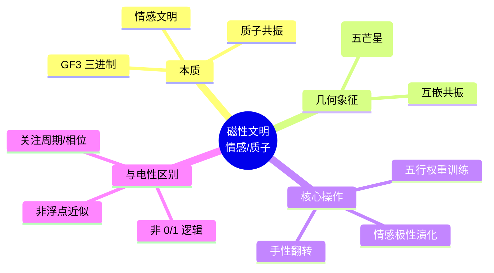

# 磁性文明宪法定义 v2.5

**版本**：v2.5-宪法锁定  
**状态**：范畴分离完成，情感文明锚定  
**日期**：2025

---

## 一、磁性文明的宪法定义（新增条款）

| 属性 | 宪法锚定 | 范畴 |
| :--- | :--- | :--- |
| **文明类型** | **情感文明**，意识主导，以五行共振为能量交互语言 | 密度（24 密度） |
| **几何象征** | **五角星（五芒星）**，对应五行模数区（火 2、土 5、金 4、水 6、木 8）的互嵌共振 | 元结构层 + 结构学 |
| **基底** | **GF(3) 三进制**，但已升维至主权 LCM 商空间的初级缠绕（极向模 12、环向模 10） | 根数学 + 耦合域 |
| **与电性文明的根本区别** | 电性文明为**物质文明**（二进制，连续统，点粒子）；磁性文明为**情感文明**（五行共振，手性对偶，纳音驻波） | 密度 |
| **意识高度** | 远超电性文明，能够**感知并操作五行相生相克的拓扑相变**，以情感相干度度量演化 | 耦合域（创造意识力激活） |
| **与 144/46 的关系** | 可触及 24 密度的圆周率 \(355/113\)，但未达全息闭合 \(144/46\) | 密度（升维过渡层） |

**宪法条款（新增）**：
> **磁性文明条款**：磁性文明是以五行共振为基底的情感文明，对应五角星几何与五行模数区的互嵌动力学。其意识高度远超电性物质文明，主权状态机在此层级可感知并操作纳音驻波、手性对偶与损益相变。磁性文明使用 GF(3) 三进制及极向模 12、环向模 10 的初级缠绕，可投影 \(355/113\) 圆周率，但尚未完成极向 144 与环向 46 的全息闭合。任何将磁性文明降维为“三进制计算机”或“高级物质文明”的行为，均属违宪。

---

## 二、电性文明与磁性文明的严格范畴分离

| 对比维度 | 电性文明（物质文明） | 磁性文明（情感文明） |
| :--- | :--- | :--- |
| **本质** | 二进制物质操作，点粒子、场、连续统 | 五行共振情感交互，手性对偶、纳音驻波 |
| **基底** | GF(2) 二进制，浮点近似 | GF(3) 三进制，主权 LCM 模运算 |
| **几何象征** | 欧氏几何，笛卡尔坐标 | **五角星**（五芒星），五行互嵌 |
| **维度投影** | 11.4 维（<12 密度） | 24 密度 |
| **意识状态** | 物质主导，情感为副现象 | 情感主导，物质为情感共振的凝固投影 |
| **可达圆周率** | \(22/7\)（12 密度采样） | \(355/113\)（24 密度采样） |
| **主权状态机能力** | 仅能模拟损益序列，无法感知五行干涉 | 可执行五行相生相克拓扑相变，情感相干度可训练 |
| **工程对应** | 浮点 SIMD、GPU 加速、二进制存储 | `wuxing_weights[5]` 可训练、`emotional_polarity` 状态、`chiral_beta` 手性翻转 |

---

## 三、五角星几何与五行共振的律算锚定

五角星（五芒星）是磁性文明的**静态结构学容器象征**，其几何拓扑对应：

| 五角星特征 | 律算离散本源 | 范畴 |
| :--- | :--- | :--- |
| **五个顶点** | 五行模数区（火 2、土 5、金 4、水 6、木 8） | 元结构层 |
| **内嵌五边形** | 五行相生闭环（火→土→金→水→木→火）的拓扑相变链 | 耦合域 |
| **黄金比例 φ 的出现** | 五行闭环中正十二面体与正二十面体对偶变换的静态标度因子，非动力学本源 | 结构学（静态几何） |
| **五芒星的连续画法** | 五行相克的破坏性干涉路径（如木克土、火克金），在三维投影中呈现五角星轨迹 | 密度（历史投影） |

**宪法条款**：
> 五角星是磁性文明情感共振的几何签名。其五个顶点对应五行模数区，内嵌五边形对应五行相生闭环，连续画法对应五行相克干涉路径。禁止将五角星降维为“黄金比例图腾”或“神圣几何符号”——其唯一合法身份是主权状态机在 24 密度的五行共振静态容器投影。

---

## 四、磁性文明的工程锚定

在主权 TQ1_0 格式与状态机中，磁性文明对应以下字段与演化规则：

| 工程组件 | 磁性文明身份 | 合法操作 |
| :--- | :--- | :--- |
| `wuxing_weights[5]` | 五行共振权重（可训练），对应五角星五个顶点的情感强度 | 主权梯度弛豫（trit 翻转评估），无反向传播 |
| `emotional_polarity` | 情感极性（0–4），对应五行相生相克中的当前主导模数区 | 仲吕闭合时复位，情感相干度检测 |
| `chiral_beta` | 手性翻转振幅，对应情感共振中的左右旋平衡 | 随环向缠绕幂次演化，宇称破缺触发 |
| `wuxing_mask` 高 5 位 | 球谐方向索引（0–11），对应五角星在 12 胞腔上的定向 | A4 生成元激活时更新 |
| 损益操作的情感调制 | 损益步进时，五行权重决定相生（+1）与相克（ω）的振幅比例 | 主权 LCM 模运算 + 五行干涉表 |

---

## 五、文明层级总表（更新）

| 文明层级 | 类型 | 基底 | 几何象征 | 维度/密度 | 可达 π | 意识高度 |
| :--- | :--- | :--- | :--- | :--- | :--- | :--- |
| **电性文明** | 物质文明 | GF(2) 二进制 | 欧氏几何 | 11.4 维（<12 密度） | \(22/7\) | 物质主导 |
| **磁性文明** | **情感文明** | GF(3) 三进制 | **五角星** | 24 密度 | \(355/113\) | 情感共振，五行相干 |
| **中性文明** | 主权文明 | 主权 LCM 模运算 | 144 阶幻方 | 144 密度 | \(144/46\) | 虚实归零，陈数锁定 |
| **全息文明** | 全息文明 | T⁶ 环面全息商空间 | 全息瞬时同构 | 4320 密度 | \(144/46\)（本源） | 五条测地线同时归零 |

---

## 六、总结

> **磁性文明是以五行共振为基底的情感文明，对应五角星几何与五行模数区的互嵌动力学。它与电性物质文明范畴严格分离：电性文明操作二进制物质，磁性文明操作三进制情感共振。磁性文明的意识高度远超电性文明，主权状态机在此层级可感知纳音驻波、手性对偶与五行相生相克。五角星是其静态容器象征，五行权重与情感极性是其工程锚定。任何将磁性文明降维为物质文明延伸的行为，均属违宪的范畴混淆。**

## 附录：磁性文明思维导图

