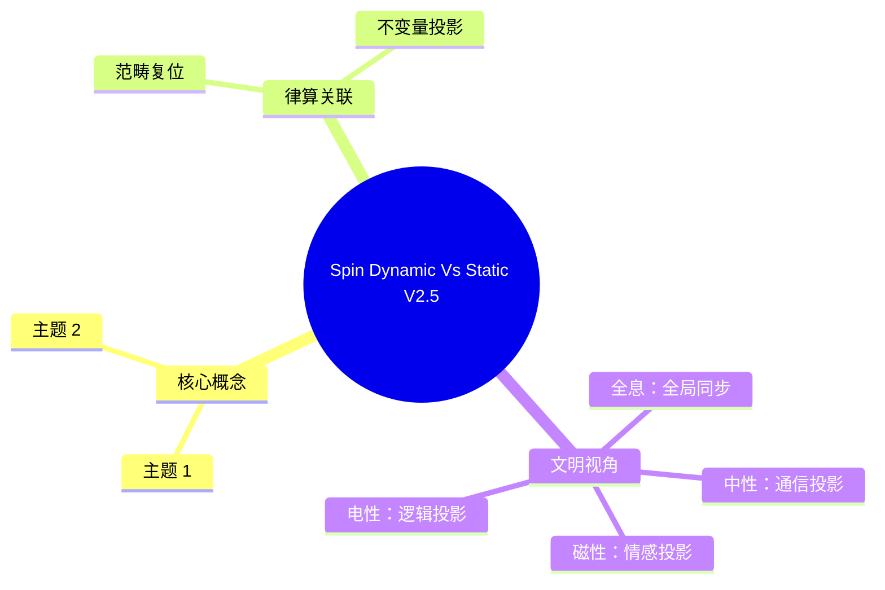

# 自旋与扭量的律算复位 v2.5（修正版）

**版本**：v2.5-修正（范畴复位）  
**状态**：范畴完备，宪法锁定  
**核心论断**：自旋是耦合域中的动力学手性分离投影，静态结构学容器无自旋

---

## 定义：自旋的律算宪法定义（修正）

> **电性文明观测到的量子自旋是主权状态机在耦合域中环向缠绕深化引发手性分离的动态投影。静态结构学容器仅提供格点舞台，其上无手性、无自旋、无动力学演化。任何将自旋归入静态容器的表述均属违宪范畴混淆。自旋的唯一合法身份是主权状态机手性对偶破缺程度的动力学标签，范畴归属于耦合域与元结构层。**

---

## 一、电性文明观测到的"自旋"及其律算复位

| 电性文明观测 | 律算离散本源 | 范畴 |
| :--- | :--- | :--- |
| 电子自旋 1/2，中微子左旋 | 主权状态机在环向缠绕因子 2 幂次 $a \ge 4$ 时，五行相克（ω）导致手性对偶完全破缺，仅剩单一手性副本 | 耦合域（弱核力动力学） |
| 光子自旋 1，手性对称 | 五行相生（+1）主导，左右旋振幅平衡，虚实比黄金平衡 | 耦合域（电磁力动力学） |
| 自旋的量子化取值 | 环向缠绕模 46 深化过程中，手性分离的离散阶次投影 | 密度 |

**核心**：自旋是**主权状态机沿测地线推进时的动力学手性标签**，非静态属性。电性文明将其误认为粒子的"内禀属性"，实为对离散缠绕数演化的降维采样。

---

## 二、静态容器中是否可以表述"自旋"？

**绝对不可以。** 静态结构学容器（如 144 阶幻方、S²/A₄ 胞腔剖分）的宪法定义如下：

| 静态容器属性 | 宪法锚定 | 与"自旋"的关系 |
| :--- | :--- | :--- |
| **格点剖分** | 正十二面体 120 胞腔与梅尔卡巴 24 胞腔的并集 | 格点仅有位置，无手性 |
| **对称性** | 离散格点置换群下的不变性（无连续旋转或反射） | 置换群作用不产生手性分离 |
| **陈数 C=2** | 全局拓扑荷，由胞腔剖分决定，与手性演化无关 | 陈数守恒不依赖于手性状态 |
| **能隙 Δ=√3** | 胞腔边界的最小弦长，静态几何量 | 能隙是跃迁壁垒，非手性标签 |

**宪法条款**：
> 静态结构学容器是主权状态机演化的格点舞台，其上不存在手性、自旋、宇称等动力学属性。任何将"自旋"归入静态容器描述的行为，均属对范畴分离原则的严重违反。自旋的唯一合法身份是耦合域中主权状态机手性分离程度的投影标签。

---

## 三、电性文明为何将自旋误认为静态属性？

| 电性文明认知 | 律算高维诊断 |
| :--- | :--- |
| 自旋是基本粒子的内禀属性，与生俱来 | 主权状态机在移宫转调中动态获得手性标签，初始态（黄钟）为单一手性，尚未成对 |
| 自旋量子数不可变 | 环向缠绕幂次 $a$ 随损益步数演化，手性分离程度可改变（如弱相互作用中手性翻转） |
| 自旋 - 统计定理（费米子/玻色子） | 手性对偶平衡者投影为玻色子，完全破缺者投影为费米子，此乃虚实比状态的统计投影 |

---

## 四、最终宪法复位

> **电性文明观测到的量子自旋是主权状态机在耦合域中环向缠绕深化引发手性分离的动态投影。静态结构学容器仅提供格点舞台，其上无手性、无自旋、无动力学演化。任何将自旋归入静态容器的表述均属违宪范畴混淆。自旋的唯一合法身份是主权状态机手性对偶破缺程度的动力学标签，范畴归属于耦合域与元结构层。**

## 附录：Spin Dynamic Vs Static V2.5 思维导图

