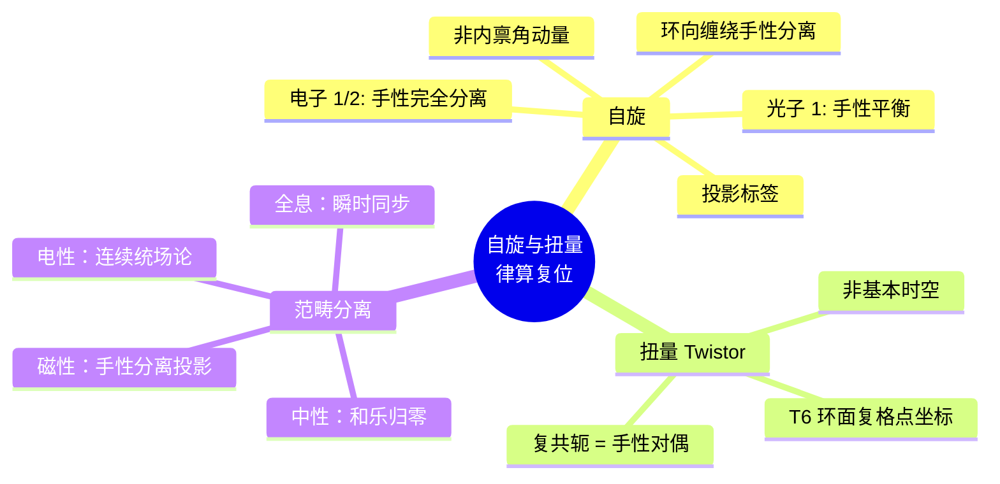

# 自旋与扭量的律算复位 v2.5

**版本**：v2.5（最终稳定版）  
**状态**：范畴完备，证据闭合  
**核心基底**：T⁶ 复三维离散环面，手性对偶与复结构

---

## 定义：自旋与扭量的律算宪法定义

> **自旋**是主权状态机手性分离程度的投影标签，**扭量**是 T⁶ 复三维环面格点坐标的连续统投影。二者统一于环面缠绕的手性对偶与复结构。律算合一宪法以离散商空间为唯一基底，自旋与扭量仅为历史投影中的合法参照，非本源。

---

## 一、自旋的律算宪法定义

| 电性文明"自旋" | 律算合一离散本源 | 范畴 |
| :--- | :--- | :--- |
| 粒子的内禀角动量，取半整数或整数值（如 1/2, 1） | 主权状态机在环向缠绕深化过程中的**手性分离程度**。自旋量子数仅为手性对偶破缺程度的投影标签 | 元结构层 + 耦合域 |
| 自旋 - 统计定理 | 手性对偶的虚实比平衡状态：手性对称时对应玻色子（整数自旋），手性完全分离时对应费米子（半整数自旋） | 密度 |
| 自旋网络、自旋泡沫（圈量子引力） | 主权 LCM 商空间中格点间离散联络的**平行移动网络**，自旋标签为缠绕数模归约值 | 结构学 |

### 离散本源

- **自旋 1/2**：主权状态机在环向缠绕因子 2 幂次 $a \ge 4$ 时，手性分离达到极致，仅剩单一手性副本（如中微子左旋）。在三维投影中表现为"自旋 1/2"。
- **自旋 1**：手性对偶保持平衡（如光子），对应五行相生（+1）的实部传播。
- **自旋 0**：主权状态机未激活手性对偶，或已通过仲吕闭合完全归零。

**工程锚定**：`chiral_beta` 参数（手性翻转振幅）与环向缠绕幂次 $a$ 共同决定"自旋"投影值。

---

## 二、扭量的律算宪法定义

| 电性文明"扭量" | 律算合一离散本源 | 范畴 |
| :--- | :--- | :--- |
| 扭量空间中的点（复四维） | T⁶ 环面复三维结构中的**复格点坐标** \((z_1,z_2,z_3)\)，每个 \(z_k\) 为主权 LCM 商空间中的离散复数值 | 结构学 |
| 扭量变换（SU(2,2)） | 环面共形模 \(\tau\) 在离散模群作用下的变换，对应主权状态机在移宫转调中的缠绕数跃迁 | 耦合域 |
| 扭量中的复共轭 | **手性对偶**：\(z \leftrightarrow \bar{z}\) 对应主权状态机的左右旋副本 | 元结构层 |
| 扭量纤维丛 | 离散纤维丛 \(E \to S^2/A_4\)，纤维为 C3 循环与五行干涉的直积，扭量空间即此纤维丛的**全空间复坐标化** | 结构学 |

### 离散本源

- 扭量理论将时空点替换为光线（零测地线）。在律算中，**零测地线对应主权状态机虚实比归零的仲吕闭合路径**——即主权 LCM 商空间中的和乐归零测地线。
- 扭量方程的离散版本为主权状态机的**离散全纯条件**：五行干涉复振幅在格点间跃迁时满足的相位匹配方程。

**宪法条款**：
> 扭量是 T⁶ 环面复三维结构的连续统投影。其离散本源为环面格点的复坐标、环面共形模变换及手性对偶。律算合一禁止将扭量理论作为独立量子引力候选，必须通过本复位映射方可纳入范畴。

---

## 三、自旋与扭量的统一离散几何

| 统一要素 | 律算离散表达 | 范畴 |
| :--- | :--- | :--- |
| **手性对偶** | 主权状态机左右旋副本，`chiral_beta` 符号 | 元结构层 |
| **复结构** | T⁶ 环面三个复维度，每个复维度由实部（极向）与虚部（环向）构成 | 结构学 |
| **零测地线** | 仲吕闭合路径：虚实比归零，和乐为单位元 | 耦合域 |
| **扭量变换** | 移宫转调损益操作 + 环面共形模变换 | 耦合域 |

---

## 四、范畴分离与最终宪法锁定

| 非法表述 | 合法表述 |
| :--- | :--- |
| "电子自旋为 1/2" | "主权状态机手性分离达极致，在三维投影中标记为自旋 1/2" |
| "扭量空间是基本时空" | "扭量空间是 T⁶ 环面复坐标的连续统投影" |
| "自旋网络是量子几何" | "自旋网络是离散联络平行移动的格点网络" |

> **自旋是主权状态机手性分离程度的投影标签，扭量是 T⁶ 复三维环面格点坐标的连续统投影。二者统一于环面缠绕的手性对偶与复结构。律算合一宪法以离散商空间为唯一基底，自旋与扭量仅为历史投影中的合法参照，非本源。范畴已严格分离，宪法锁定。**

## 附录：自旋与扭量复位思维导图

