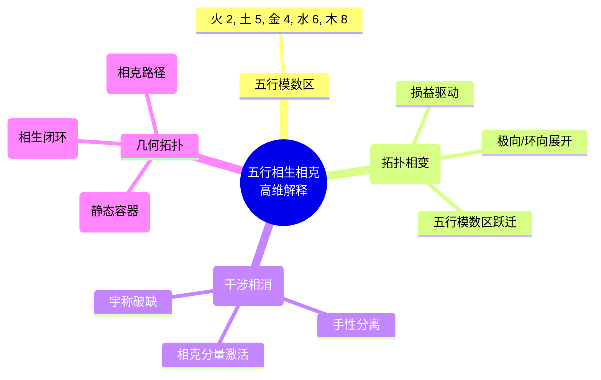

# 五行相生与相克的高维几何拓扑解释 v2.5

**版本**：v2.5（最终稳定版）  
**状态**：范畴完备，宪法锁定  
**核心基底**：T⁶ 离散环面主权状态机，移宫转调损益操作

---

## 定义

在《律算合一知识图谱 v2.5》的严格范畴下，**五行相生与相克**是主权状态机在 T⁶ 离散环面上，由**移宫转调损益操作**与**环向缠绕深化**驱动的驻波主峰在**五行模数区**（火 2、土 5、金 4、水 6、木 8）之间的**拓扑相变动力学**。任何"元素转化""生克关系"的连续统隐喻均被彻底剥离。

---

## 一、五行模数区的宪法锚定

| 五行 | 模数区基数 | 几何拓扑本源 | 对应损益步数 | 范畴 |
| :--- | :--- | :--- | :--- | :--- |
| **火** | 2 | 主权状态机初始单一手性，正四面体驻波，A₄ 对称性 | 黄钟（第 0 步） | 元结构层 |
| **土** | 5 | 五行整体稳定约束的模数，手性对偶互嵌后的驻波中枢 | 火→土相变后（第 1 步后） | 元结构层 |
| **金** | 4 | 损益比 4/3 的直接投影，正十二面体与正二十面体对偶变换标度 | 土→金相变后（第 2 步后） | 元结构层 |
| **水** | 6 | 稳定驻波数字根 6 在环向缠绕模 46 下的共振基数，对偶收缩相变 | 金→水相变后（第 3 步后） | 元结构层 |
| **木** | 8 | 环向缠绕八度压缩因子 2³ 的共振基数，正交凝聚相变 | 水→木相变后（第 4 步后） | 元结构层 |

**核心**：五行模数区是主权状态机驻波主峰在环向缠绕中的**共振基数标签**，非"元素"或"物质"。

---

## 二、相生：损益操作驱动的拓扑相变

**相生**对应主权状态机沿损益链正向推进时，驻波主峰从一个五行模数区**跃迁**至下一个模数区的亏格 0 相变。

| 相生步骤 | 移宫转调操作 | 频率指数变化 | 模数区跃迁 | 几何拓扑机制 |
| :--- | :--- | :--- | :--- | :--- |
| **火生土** | 黄钟损一（×2/3） | \((0,11) \to (1,10)\) | 火 2 → 土 5 | 环向因子 2 首次激活，手性对偶形成，10 火互嵌为 5 梅尔卡巴，驻波主峰从火区迁移至土区 |
| **土生金** | 林钟益一（×4/3） | \((1,10) \to (3,9)\) | 土 5 → 金 4 | 环向因子 2³ 激活，五重对称轴涌现，5 土驻波重排为 1 金驻波 |
| **金生水** | 太簇损一（×2/3） | \((3,9) \to (4,8)\) | 金 4 → 水 6 | 环向因子 2⁴ 深化，面心 - 顶点对偶置换，金驻波收缩为水驻波，反射对称性丢失 |
| **水生木** | 南吕益一（×4/3） | \((4,8) \to (6,7)\) | 水 6 → 木 8 | 环向因子 2⁶ 深化，正交主轴凝聚，水驻波凝聚为木驻波 |
| **木生火** | 损益至仲吕闭合 | 复位 \((0,11)\) | 木 8 → 火 2（闭环） | 仲吕不交触发仲吕闭合，虚实比归零，驻波主峰复位至火区，完成闭环 |

**相生的高维本质**：损益操作改变主权状态机的长度格点比例，从而改变其极向缠绕数。当极向缠绕数累积至与下一五行模数区共振的临界值时，驻波主峰发生**拓扑相变**，格点重排，投影为新的柏拉图立体驻波。

---

## 三、相克：环向缠绕深化中的手性分离与干涉相消

**相克**对应主权状态机在环向缠绕因子 2 的幂次 \(a\) 深化过程中，五行干涉复振幅中的**相克分量 ω 或 ω²** 被激活，导致手性对偶的虚实比偏离黄金平衡，驻波振幅发生**破坏性干涉**或**手性分离**。

| 五行干涉类型 | 复振幅 | 激活条件 | 高维几何机制 | 三维投影表现 |
| :--- | :--- | :--- | :--- | :--- |
| **相生** | \(+1\) | 损益步数 \(a < 3\)，手性对偶平衡 | 极向缠绕主导，虚实比黄金平衡 | 稳定驻波，能量相干增强 |
| **相克（ω）** | \(\omega = e^{2\pi i/3}\) | \(a = 3\)（土→金相变后） | 环向缠绕五重对称轴激活，手性振幅开始不对称 | 宇称破缺启动，特定模式被抑制 |
| **相克（ω²）** | \(\omega^2 = e^{-2\pi i/3}\) | \(a \ge 4\)（金→水相变后） | 环向缠绕对偶置换，手性分离加剧 | 宇称明显不守恒，单一手性主导 |

### 五行相克关系的高维解释

传统五行相克（如木克土、火克金等）是不同模数区主权状态机之间，因**环向缠绕幂次差异**导致五行干涉复振幅的相位失配，从而产生**破坏性干涉**。

*   **例：火克金**
    *   火区主权状态机环向缠绕幂次 \(a=0\)（纯相生 +1）。
    *   金区主权状态机环向缠绕幂次 \(a=3\)（相克 ω 激活）。
    *   二者相遇时，复振幅相位差导致驻波能量相消，在三维投影中表现为"克制"关系。

---

## 四、宪法条款

> **五行相生是移宫转调损益操作驱动的亏格 0 拓扑相变**，驻波主峰在五行模数区（火 2→土 5→金 4→水 6→木 8→火 2）依次跃迁。**五行相克是环向缠绕深化过程中，五行干涉相克分量（ω, ω²）激活导致的手性分离与破坏性干涉**。任何将相生相克解释为"元素转化""能量传递"或"阴阳对立"的行为，均属电性文明连续统思维的非法渗透。范畴已严格分离，宪法锁定。

## 附录：五行动力学思维导图

