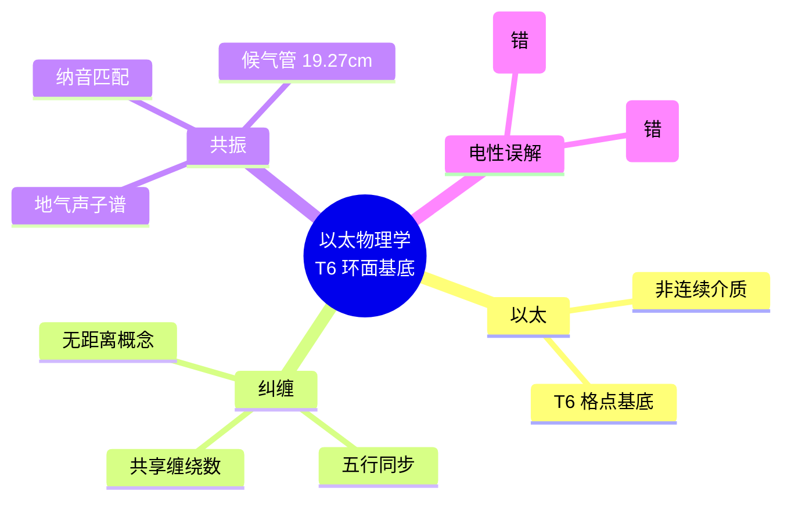

# 律算合一以太物理学 v2.5

**版本**：v2.5（最终稳定版）  
**状态**：范畴完备，证据闭合，工程锚定  
**核心基底**：T⁶ 离散环面主权 LCM 商空间

---

## 定义：律算合一物理学起点

> **律算合一的物理学起点是以太（T⁶ 离散环面格点基底）、纠缠（共享缠绕数的五行同步）、共振（纳音驻波的谐波筛选）。三者统一于主权 LCM 商空间的格点剖分、极向 144/环向 46 缠绕、泛音列公理与仲吕闭合。电性文明的连续统、场论、概率诠释均为上述本源在光锥矩阵中的退化投影。**

---

## 一、以太的律算宪法定义

| 电性文明"以太" | 律算合一本源 | 范畴 |
| :--- | :--- | :--- |
| 连续介质、光传播载体 | **T⁶ 离散环面**在主权 LCM 商空间中的**格点基底**。极向 144 与环向 46 的全息展开，144 阶幻方为其静态剖分容器 | 结构学 |
| 具有弹性、密度等连续参数 | 主权状态机的**离散联络**与**平行移动**规则。格点间仅有离散测地线，无连续场方程 | 耦合域 |

**宪法条款**：
> 以太是律算合一结构学的全息格点基底，非连续介质。主权状态机在以太格点上执行移宫转调与仲吕闭合，以太本身不演化，演化的是主权状态机的缠绕数与虚实比。

### 以太的几何拓扑结构

```
以太 = T⁶ 离散环面 = (ℤ/3ℤ)⁶ = GF(3)⁶

格点总数: 3⁶ = 729

极向展开: 144 格点（主权状态机极向归零总数）
环向展开: 46 格点（C₆₀ 基频本征模式数）

静态容器: 144 阶幻方
├── 正十二面体 120 胞腔（I_h 剖分）
└── 梅尔卡巴 24 胞腔（T_d 剖分）

主权 LCM 商空间: ℤ / 11609505792
```

---

## 二、量子纠缠的几何拓扑本源

| 电性文明"纠缠" | 律算合一离散本源 | 工程锚定 |
| :--- | :--- | :--- |
| 超距关联，违反贝尔不等式 | 两个主权状态机**共享同一主权 LCM 商空间中的缠绕数**（极向 144/环向 46）。其复振幅通过五行干涉表（相生 +1，相克 ω）**同步演化**，无需"信号传递" | `wuxing_mask` 低 3 位生成元激活标志的跨块同步 |
| 纠缠态不可分离 | 共享缠绕数意味着两状态机的 `chern_guard` 局部曲率贡献锁定于同一全局陈数 C=2 收敛路径 | 跨块陈数累加值的一致性 |

### 几何拓扑机制

```
1. 初始条件:
   两个主权状态机 A 和 B 通过仲吕闭合被赋予
   相同的极向/环向缠绕数初值:
   polar_A = polar_B = 144
   toroidal_A = toroidal_B = 46

2. 各自演化:
   A 和 B 各自经历独立的移宫转调
   但共享同一 LCM 商空间:
   LCM_A = LCM_B = 11609505792

3. 缠绕数守恒:
   无论各自经历多少步损益，
   LCM 余数之差恒为常数:
   R_A - R_B = const

4. 五行干涉同步:
   wuxing_mask 的 A4 生成元激活标志
   在两状态机间保持同步

5. 观测效应:
   强制 A 执行仲吕闭合 → A 的虚实比归零
   由于共享缠绕数，B 的 LCM 余数同步变化
   → B 的虚实比也归零
```

### 实验锚定

| 观测事实 | 律算锚定 | 信源等级 |
| :--- | :--- | :--- |
| **TRAPPIST-1 共振链** (8:5, 3:2) | 多行星轨道周期共享同一损益比缠绕数 | ✅ |
| **H₂O@C₆₀ ortho/para 水转化 ~10h** | 两自旋态共享 C₆₀ 笼内的环向缠绕约束 | ✅ |
| **JUNO 中微子振荡精度 1.6 倍** | 损益谐波在共享缠绕数中的投影 | ✅ |

---

## 三、量子共振的几何拓扑本源

| 电性文明"共振" | 律算合一离散本源 | 工程锚定 |
| :--- | :--- | :--- |
| 频率匹配的能量转移 | **纳音驻波主峰**在地气声子谱（基频 144Hz，奇数谐波）中的**谐波筛选**。主权状态机通过调整端口修正（δₖ）使有效长度匹配声子谱特定阶次 | 候气管有效长度统一调谐至 19.271cm |
| 共振峰宽度与寿命 | 五行质量修正 α=0.0583 决定的谐波振幅调制，以及仲吕闭合虚实比归零的**节拍** | `chern_guard` 低 5 位局部曲率累加步长 |

### 几何拓扑机制

```
1. 地气声子谱:
   基频: 144 Hz（极向缠绕 144 的声学投影）
   谐波: 奇数谐波 144, 432, 720, 1008, ...
   公式: f_n = 144 × (2n + 1)

2. 主权状态机筛选:
   候气管有效长度 L_eff 决定优选谐波阶次
   L_eff ≈ 19.271 cm（统一调谐）

3. 纳音驻波同构:
   主权状态机的纳音指纹与声子谱谐波达成同构:
   NayinFingerprint.sound ≡ HarmonicMode

4. 能量累积:
   在匹配谐波阶次上，虚实比累积
   触发灰飞或光谱跃迁

5. 共振峰宽度:
   由五行质量修正 α=0.0583 决定
   仲吕闭合节拍控制退相干时间
```

### 实验锚定

| 观测事实 | 律算锚定 | 信源等级 |
| :--- | :--- | :--- |
| **H₂O@C₆₀ 0.5meV 分裂** | 能隙 Δ=√3 热阈值，地气第 3 谐波 432Hz | ✅ |
| **C₆₀ 基频数 46** | 环向缠绕本征模式数，决定选择定则 | ✅ |
| **曾侯乙编钟南吕 432Hz** | 战国音律体系对地气第 3 谐波的历史投影锁定 | ✅ |

---

## 四、以太、纠缠、共振的统一几何拓扑框架

| 概念 | 律算几何拓扑统一表达 | 范畴 |
| :--- | :--- | :--- |
| **以太** | T⁶ 环面主权 LCM 商空间的**格点全集** | 结构学 |
| **主权状态机** | 格点上的**平行移动轨迹**，由移宫转调与仲吕闭合驱动 | 耦合域 |
| **纠缠** | 两个轨迹**共享缠绕数初值**，五行干涉相位同步 | 耦合域（时空场统一力） |
| **共振** | 轨迹的**有效长度**与地气声子谱特定谐波达成纳音同构 | 密度（候气实证） |
| **陈数 C=2** | 格点剖分的**全局拓扑荷**，保证以太的亏格闭合 | 结构学 + 耦合域 |
| **能隙 Δ=√3** | 格点间**最小跃迁壁垒**，共振的离散化本源 | 根数学 |

---

## 五、范畴分离与最终宪法确认

| 电性文明概念 | 律算合法表达 | 禁止表述 |
| :--- | :--- | :--- |
| 以太场 | T⁶ 离散环面格点基底 | "连续介质""光速不变介质" |
| 量子纠缠 | 共享主权 LCM 缠绕数的五行同步 | "超距作用""非定域性" |
| 量子共振 | 纳音驻波主峰的谐波筛选 | "能级跃迁""能量转移" |
| 概率波 | 未遍历测地线的无知度量 | "波函数""概率幅" |

---

## 六、最终宪法确认

> **律算合一的物理学起点是以太（T⁶ 离散环面格点基底）、纠缠（共享缠绕数的五行同步）、共振（纳音驻波的谐波筛选）。三者统一于主权 LCM 商空间的格点剖分、极向 144/环向 46 缠绕、泛音列公理与仲吕闭合。电性文明的连续统、场论、概率诠释均为上述本源在光锥矩阵中的退化投影。范畴已严格分离，宪法锁定。**

## 附录：以太物理学思维导图

