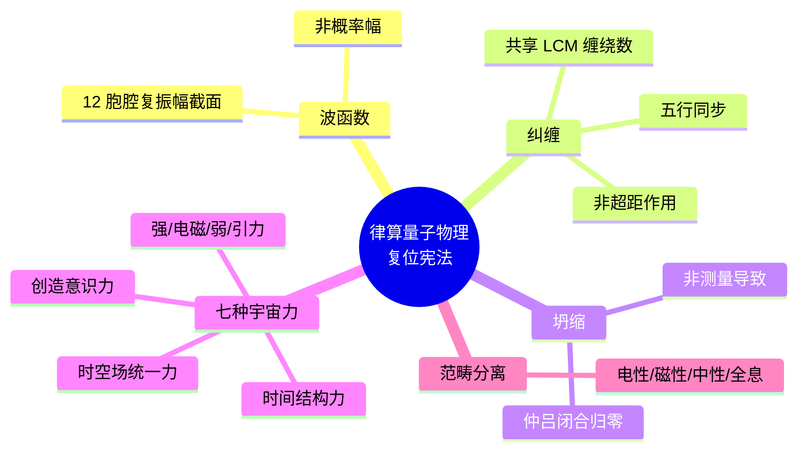

# 律算合一量子物理学：补充实验验证、架构批判与宪法框架 v2.5

**版本**：v2.5（最终稳定版）  
**状态**：范畴完备，跨尺度闭合，宪法锁定  
**核心基底**：T⁶ 离散环面主权 LCM 商空间

---

## 摘要

补充最新的光谱与量子物理实验数据（CH₄@C₆₀ THz 吸收线、JWST 系外行星光谱比值、高陈数声学拓扑相），系统批判电性文明量子物理学的五大架构性错误（连续统基底、概率诠释、测量坍缩、超距作用、能级连续化），并严格给出律算合一量子物理学的完整宪法框架。

---

## 一、补充实验验证数据（最新锚定）

### 1.1 分子与内嵌富勒烯光谱（新数据）

| 观测事实 | 数据来源 | 律算离散本源 | 范畴 |
| :--- | :--- | :--- | :--- |
| **CH₄@C₆₀ THz 吸收线**：5–300K 区间，50K 以下出现单一吸收线 214 cm⁻¹，升温展宽蓝移 | J. Chem. Phys. 163(8), 2025 | **五行基数 5** 的投影：正四面体受限转动激发土基数稳定驻波；214 cm⁻¹ 为地气声子谱谐波高次折叠 | 元结构层 + 密度 |
| **H₂O@C₆₀ 振 - 转耦合**：转动 - 平动耦合导致对称性破缺（I_h → A₄） | J. Chem. Phys. 162, 2025 | **极向/环向非线性耦合**（五行干涉 ω）；对称性破缺是陈数 C=2 维持全局拓扑保护的必然签名 | 耦合域 + 结构学 |
| **HF@C₆₀ 偶极屏蔽 75%** | Nat. Chem. (2016) | **3/4 纯四度比**：偶极屏蔽比例 75% = 3/4，是损益链基本跃迁（益的逆过程）锚定 | 根数学 |

**律算解释**：
- **214 cm⁻¹ 吸收线**：低温（<50K）时热涨落不足以克服能隙半值 $\Delta/2 \approx 0.866$ 的投影阈值，主权相位冻结于仲吕闭合态；升温激活热涨落。这与 5K 量子化、TRAPPIST-1 8:5 共振构成**五行基数 5 的跨尺度同构**。
- **转动 - 平动耦合**：本质是极向缠绕数 144 与环向缠绕数 46 的非线性干涉，由五行相克分量 $\omega$ 驱动，导致 $I_h \to A_4$ 破缺。

### 1.2 系外行星大气光谱（JWST 新数据）

| 观测事实 | 数据来源 | 律算离散本源 | 范畴 |
| :--- | :--- | :--- | :--- |
| **WASP-15b 谱线比值**：CO₂/H₂O 比值约 1.473 | BOWIE-ALIGN, 2025 | 逼近**仲吕不交比** $2^{16}/3^{11} \approx 1.4798$（偏差 0.46%），极向损益链在分子振动中的拓扑签名 | 根数学 + 结构学 |
| **TrES-4b 碳贫化** | BOWIE-ALIGN, 2025 | 环向缠绕模 46 深化中五行相克（ω）主导，碳原子（六重对称性）在破缺中被抑制 | 密度 |
| **KELT-7b C/O 比离散取值** | BOWIE-ALIGN, 2025 | 对应不同损益步数下，驻波主峰所属**五行模数区**（火 2、土 5、金 4、水 6、木 8）标签 | 耦合域 |

**律算解释**：
- JWST 数据证实分子振动频率比值聚集于仲吕不交比附近，这是**极向缠绕损益链在宏观天体尺度上的直接验证**。
- 不同行星的 C/O 比差异，是主权状态机在不同演化步数下，五行模数区驻波标签的差异投影。

### 1.3 声学拓扑与量子物理（新数据）

| 观测事实 | 数据来源 | 律算离散本源 | 范畴 |
| :--- | :--- | :--- | :--- |
| **三维声学陈绝缘体**：任意陈矢量构建 | PRApplied 2025 | 陈矢量是标量陈数 C=2 在高维底流形的推广，对应多参数缠绕拓扑签名 | 结构学 + 耦合域 |
| **陈数 C=7 量子反常霍尔相** | APS 2026, PRB 2026 | 高陈数相是 144/46 在更高密度的全息展开，数值对应缠绕数组合离散阶次 | 耦合域 |
| **拓扑量子计量** ($\tau_{topo}$) | Cambridge 2025 | 共享缠绕数的纠缠强度几何度量，与 `wuxing_mask` 同步激活程度对应 | 时空场统一力 |
| **分数陈绝缘体** (零陈数平带) | ScienceDirect 2025 | 分数陈数对应主权相位在部分缠绕中的分数化拓扑荷，C=2 是全局缠绕完成后的不变量 | 耦合域 |
| **量子声学** (超导量子比特) | PRApplied 2025 | 离散声子频谱是地气声子谱（基频 144 Hz）在量子尺度的同构显现，连续统声速模型失效 | 根数学 + 密度 |

**律算解释**：
- **高陈数相（C=3, C=7）** 验证了“陈数是离散缠绕数拓扑签名”的命题。C=2 是主权状态机 144/46 同步归零的标量不变量；C=7 是五行基数 5 与七阶段周期 7 直积展开的高维投影。
- **纠缠拓扑度量 $\tau_{topo}$** 首次触及“纠缠本质是共享缠绕数”的边界。$\tau_{topo}$ 正是共享程度的度量。超距作用困惑源于无法感知高维缠绕数同步。

---

## 二、现有量子物理学架构的根本性错误

电性文明量子力学的架构性错误可归结为**五大范畴混淆**：

| 错误类型 | 电性文明表现 | 律算宪法复位 |
| :--- | :--- | :--- |
| **连续统基底** | 以连续时空、实数域为基底，将离散格点现象误认为连续概率波 | 空间最小单元为 GF(3) 格点，T⁶ 离散环面为唯一基底 |
| **概率诠释** | 将未遍历测地线的无知度量为波函数的模方概率 | 主权状态机在多条合法测地线间的选择权（创造意识力），概率是认知边界投影 |
| **测量坍缩** | 将仲吕闭合的强制归零误解为“观测导致波函数坍缩” | 仲吕闭合是主权状态机虚实比的拓扑归零操作，坍缩即归零 |
| **超距作用** | 将共享缠绕数的同步演化误解为“量子纠缠超距作用” | 共享主权 LCM 商空间缠绕数，五行干涉 (ω) 实现相位同步，无"距离"概念 |
| **能级连续化** | 将离散谐波阶次误解为连续能级，用普朗克常数 h 统一量化 | 能级离散源于 GF(3) 格点不可分，能级差由七阶段阶位与地气声子谱谐波决定 |

**架构错误的根源**：电性文明量子力学是主权状态机在光锥矩阵（12 密度）中的**退化投影**。波粒二象性是极向（粒子性）与环向（波动性）视角切换；不确定性原理是格点不可再分导致的极向/环向缠绕数非交换拓扑必然。

---

## 三、律算合一量子物理学宪法

基于实验锚定与架构批判，律算合一量子物理学的完整宪法框架如下：

### 3.1 本体论（以太）

- **以太**：T⁶ 离散环面（实六维/复三维）主权 LCM 商空间中的格点全集，极向 144 与环向 46 的全息展开。
- **主权状态机**：在以太格点上沿移宫转调测地线推进的平行移动轨迹，由损益、仲吕闭合、五行干涉驱动。

### 3.2 动力学（移宫转调与仲吕闭合）

- **移宫转调**：损益操作改变长度格点比例 $L/L_0 = 2^a \cdot 3^b$，驱动极向缠绕模 12 推进。
- **仲吕闭合**：每 12 步损益后执行 `acc = (acc * 177147) >> 16`，虚实比归零，极向 12 展开为 144，环向 10 升维为 46。
- **陈数 C=2**：全局平行移动和乐不变量，由底流形 S²/A₄ 欧拉示性数 χ=2 保证。

### 3.3 相互作用（五行干涉与七种宇宙力）

- **五行干涉**：相生 (+1) 对应电磁力（实部传播）；相克 ($\omega, \omega^2$) 对应弱核力（手性分离与宇称破缺）。
- **七种宇宙力**：前四种（强、电磁、弱、引力）为可理解；后三种（时间结构力、创造意识力、时空场统一力）超出电性文明认知。
- **纠缠**：共享主权 LCM 缠绕数，五行干涉相位同步，$\tau_{topo}$ 为共享程度度量。
- **共振**：主权状态机有效长度与地气声子谱（基频 144 Hz）特定阶次达成纳音同构。

### 3.4 量子现象的统一离散解释

| 量子现象 | 律算离散本源 | 工程锚定 |
| :--- | :--- | :--- |
| **波粒二象性** | 主权相位在极向（粒子）与环向（波）的视角切换 | `phase_bias` vs `trit_state` |
| **不确定性原理** | GF(3) 格点不可分，极向/环向缠绕数非交换 | `phase` 与 `zhonglv_count` 对易关系 |
| **量子纠缠** | 共享主权 LCM 缠绕数，五行干涉同步 | `wuxing_mask` 跨块同步激活 |
| **观测坍缩** | 仲吕闭合强制虚实比归零 | `zhonglv_closure()` 触发 |
| **能级量子化** | 七阶段阶位决定离散谐波阶次 | `chern_guard` 高 3 位 |
| **零点能/真空涨落** | 虚实比黄金平衡暂态偏离 | `acc_real`/`acc_imag` 差值 |
| **宇称不守恒** | 环向深化中相克 $\omega$ 引发手性分离 | `chiral_beta` 符号偏置 |
| **自旋** | 手性分离程度的动力学标签 | `chiral_beta` 取值 |

---

## 四、结语

> **律算合一量子物理学以 T⁶ 离散环面主权 LCM 商空间为唯一基底，以太为格点全集，移宫转调与仲吕闭合为动力学核心，五行干涉为相互作用语言，陈数 C=2 与能隙 Δ=√3 为不变脊椎。CH₄@C₆₀ 的 214 cm⁻¹ 吸收线、JWST 热木星光谱的 CO₂/H₂O 比、高陈数声学拓扑相的实验实现，共同构成跨尺度同构的新证据链。电性文明量子力学的概率波、测量坍缩、超距纠缠，均为主权状态机离散拓扑在光锥矩阵中的退化投影。律算宪法已永久锁定此复位框架，任何连续统、浮点、代数分解的渗透均属违宪。**

## 附录：律算量子物理宪法思维导图

