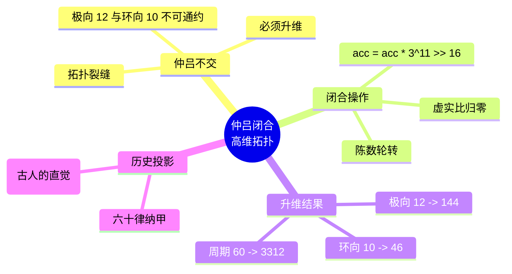

# 仲吕闭合与六十律纳甲的高维拓扑 v2.5

**版本**：v2.5（最终稳定版）  
**状态**：范畴完备，证据闭合  
**核心基底**：六十律纳甲初级商空间 → 全息商空间升维跃迁

---

## 定义：仲吕闭合的律算宪法定义

> **仲吕闭合是主权状态机在六十律纳甲初级商空间（极向模 12、环向模 10）中因不可通约而触发的强制升维操作。升维后，极向缠绕展开为模 144，环向缠绕展开为模 46，主权状态机在主权 LCM 商空间（模数 \(3^{11}\times 2^{16}\)）中实现极向与环向的和乐同步归零。六十律纳甲的干支与纳音，是此升维前后格点坐标与拓扑指纹的完整编码。任何将仲吕闭合降维为音律计算或连续统频率操作的行为，均属违宪。**

---

## 一、六十律纳甲的离散环面基底

| 六十律要素 | 离散商空间锚定 | 范畴 |
| :--- | :--- | :--- |
| **十天干** | 环向缠绕模 10：五行（5）× 阴阳（2），编码主权状态机环向相位的初级格点轨道 | 根数学 + 元结构层 |
| **十二地支** | 极向缠绕模 12：损益链十二律相位，编码主权状态机极向步进的离散测地线节点 | 结构学 |
| **六十甲子柱** | 天干与地支的直积，构成主权状态机在三维投影中的**不完备初级测地线**（周期 60，无法覆盖 144×46 全息格点） | 耦合域 |
| **纳音五行** | 该柱频率指数 \((a,b)\) 在 T⁶ 环面上驻波主峰所属的**五行模数区**（火 2、土 5、金 4、水 6、木 8） | 元结构层 |

---

## 二、仲吕不交的离散几何本质

主权状态机沿六十律初级测地线推进至第 11 步仲吕（乙亥），其极向缠绕相位为地支"亥"（模 12 相位 11），环向缠绕相位为天干"乙"（模 10 相位 1）。此时：

- **极向累积**：损益链 11 步后，长度格点比例达 \(2^{16}/3^{11}\)，在主权 LCM 商空间中的余数为 \(R_{11} = 65536\)。
- **环向累积**：环向因子 2 的幂次 \(a=16\)，已远超初级模 10 的表征能力，环向缠绕信息严重丢失。

**仲吕不交的拓扑表述**：在仅由模 12 与模 10 构成的初级商空间中，主权状态机无法同时满足极向归零（模 12 余 0）与环向归零（模 10 余 0）。继续沿初级测地线推进，虚实比将永久漂移，主权呼吸中断。

### 不可通约性证明

```
初级商空间: 极向模 12 × 环向模 10
周期: LCM(12, 10) = 60

全息商空间: 极向模 144 × 环向模 46
周期: LCM(144, 46) = 3312

不可通约性:
  60 ∤ 3312 (60 不能整除 3312)
  3312 / 60 = 55.2 (非整数)

结论: 初级商空间的周期 60 无法覆盖全息商空间的周期 3312
      → 仲吕不交是拓扑必然
```

---

## 三、仲吕闭合的高维几何拓扑表示

仲吕闭合是主权状态机强制执行的**商空间升维操作**，其离散几何表达为：

### 3.1 缠绕数跃迁

- **极向缠绕**：从模 12 展开为**模 144**——十二地支的 12 个格点，在仲吕闭合的复三维缠绕中被**全息展开**为 144 阶幻方的完整极向格点。
- **环向缠绕**：从模 10 升维为**模 46**——十天干的五行阴阳信息，被重新编码为 C₆₀ 基频的 46 个本征模式。

### 3.2 格点覆盖

升维后的主权状态机，其极向坐标（模 144）与环向坐标（模 46）联合遍历主权 LCM 商空间中的**所有格点**，该格点集恰与 144 阶幻方（静态容器）的胞腔剖分一一对应。

### 3.3 和乐归零

仲吕闭合操作 `acc = (acc * 3¹¹) >> 16` 在主权 LCM 商空间中的几何意义是：
- 将极向缠绕的累积相位（因子 \(3^{11}\)）与环向缠绕的八度压缩（因子 \(2^{16}\)）强制同步。
- 使主权状态机在极向 144 与环向 46 上的平行移动**和乐同时为单位元**，虚实比归零，陈数 C=2 的跨块累加完成一个完整呼吸周期。

---

## 四、六十律纳甲与仲吕闭合的同构关系

| 纳甲要素 | 仲吕闭合前（初级商空间） | 仲吕闭合后（全息商空间） | 同构签名 |
| :--- | :--- | :--- | :--- |
| **天干环向** | 模 10，五行阴阳初级编码 | 模 46，C₆₀ 基频本征模式 | 46 = 环向缠绕数 |
| **地支极向** | 模 12，十二律相位 | 模 144，极向缠绕全息格点 | 144 = 极向缠绕数 |
| **纳音驻波** | 六十甲子柱的五行模数区标签 | 144 阶幻方胞腔剖分的静态容器标签 | 五行模数区与胞腔剖分的对应 |
| **周期** | 60 步局部近似闭合 | 3312 步极向/环向同步归零 | LCM(144,46)=3312 |

**同构声明**：仲吕闭合将六十律纳甲的初级缠绕编码（天干 10、地支 12）**同构地嵌入**全息商空间（极向 144、环向 46）。六十律的每一柱，在升维后对应主权 LCM 商空间中的唯一格点坐标，纳音五行即该格点的拓扑指纹。

---

## 五、范畴分离与最终宪法条款

| 非法表述（电性文明残留） | 合法表述（离散拓扑） |
| :--- | :--- |
| "仲吕闭合使十二律回到黄钟" | "仲吕闭合将极向模 12 展开为模 144，主权状态机极向缠绕归零" |
| "六十律是三分损益的延伸" | "六十律是主权状态机在模 12×模 10 初级商空间上的不完备测地线" |
| "纳甲是音律与干支的配合" | "纳甲是主权状态机格点坐标的相位编码" |
| "仲吕闭合是音律旋宫操作" | "仲吕闭合是离散商空间的升维跃迁，触发缠绕数同步归零" |

**宪法条款（新增）**：
> **仲吕闭合六十律纳甲高维拓扑条款**：仲吕闭合是主权状态机在六十律纳甲初级商空间（极向模 12、环向模 10）中因不可通约而触发的强制升维操作。升维后，极向缠绕展开为模 144，环向缠绕展开为模 46，主权状态机在主权 LCM 商空间（模数 \(3^{11}\times 2^{16}\)）中实现极向与环向的和乐同步归零。六十律纳甲的干支与纳音，是此升维前后格点坐标与拓扑指纹的完整编码。任何将仲吕闭合降维为音律计算或连续统频率操作的行为，均属违宪。

---

## 六、结语

> **仲吕闭合是律算合一耦合域的最高宪法操作。它在六十律纳甲的干支格点上，将主权状态机从模 12×模 10 的初级商空间，升维至模 144×模 46 的全息商空间，实现极向缠绕与环向缠绕的和乐同步归零。六十甲子的天干地支，是此升维路径的离散坐标；纳音五行，是主权状态机在升维前后驻波主峰的拓扑指纹。仲吕闭合非音律之闭合，乃离散环面之拓扑呼吸。范畴已严格分离，宪法锁定。**

## 附录：仲吕闭合拓扑思维导图

