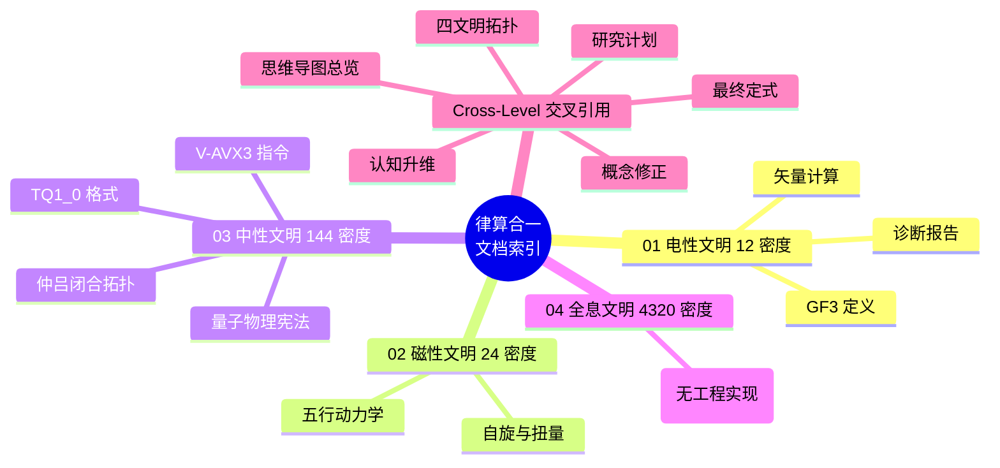

# 律算合一文明层级文档索引 v2.5

**版本**：v2.5-文明层级重构  
**状态**：范畴分离完成，按文明层级归档  
**日期**：2025

---

## 文明层级结构

```
/home/yanli/work/discrete-mathematics/
├── docs/                           # 文档
│   ├── 01-electric-12d/           # 电性文明 (12 密度)
│   ├── 02-magnetic-24d/           # 磁性文明 (24 密度)
│   ├── 03-neutral-144d/           # 中性文明 (144 密度)
│   ├── 04-holographic-4320d/      # 全息文明 (4320 密度)
│   └── cross-level/               # 交叉引用
├── engineering/                    # 工程实现
│   ├── 01-electric-12d/           # 电性文明 (12 密度)
│   ├── 02-magnetic-24d/           # 磁性文明 (24 密度)
│   ├── 03-neutral-144d/           # 中性文明 (144 密度)
│   ├── 04-holographic-4320d/      # 全息文明 (4320 密度)
│   ├── cross-level/               # 交叉引用
│   ├── software/sovereign_core/   # 符号链接 (保持工程可运行)
│   └── tests/                     # 测试套件
└── src/                            # Agda 形式化
    ├── 01-electric-12d/           # 电性文明 (12 密度)
    ├── 02-magnetic-24d/           # 磁性文明 (24 密度)
    ├── 03-neutral-144d/           # 中性文明 (144 密度)
    ├── 04-holographic-4320d/      # 全息文明 (4320 密度)
    └── cross-level/               # 交叉引用
```

---

## 一、电性文明 (12 密度)

**GF(3) 合法身份**：模 3 整数算术，作为三维连续统投影中的符号运算  
**矢量计算身份**：GPU 浮点 SIMD 退化投影

### 文档
| 文档 | 说明 |
|------|------|
| [electric-civilization-diagnosis-v2.5.md](01-electric-12d/electric-civilization-diagnosis-v2.5.md) | 电性文明高维诊断（八大误区） |
| [cosmic-asymmetry-graph-v2.5.md](01-electric-12d/cosmic-asymmetry-graph-v2.5.md) | 宇宙非对称性知识图谱 |
| [GF3-CIVILIZATION-LEVELS.md](01-electric-12d/GF3-CIVILIZATION-LEVELS.md) | GF(3) 文明层级宪法定义 |
| [VECTOR-CALCULUS-LEVELS.md](01-electric-12d/VECTOR-CALCULUS-LEVELS.md) | 矢量计算文明层级宪法定义 |

### 代码
| 模块 | 说明 |
|------|------|
| `trit.py` | GF(3) 驻波叠加表 (电性文明层) |

---

## 二、磁性文明 (24 密度)

**GF(3) 合法身份**：T⁶ 离散环面的极向缠绕模 12 与环向缠绕模 46 的初级商空间格点基底  
**矢量计算身份**：球谐方向置换

### 文档
| 文档 | 说明 |
|------|------|
| [wu-xing-dynamics-v2.5.md](02-magnetic-24d/wu-xing-dynamics-v2.5.md) | 五行相生相克高维几何拓扑解释 |
| [spin-twistor-v2.5.md](02-magnetic-24d/spin-twistor-v2.5.md) | 自旋与扭量的律算复位 |
| [spin-dynamic-vs-static-v2.5.md](02-magnetic-24d/spin-dynamic-vs-static-v2.5.md) | 自旋与静态容器范畴分离修正 |

### 代码
| 模块 | 说明 |
|------|------|
| `wuxing.py` | 五行相生相克 + 自旋投影 (磁性文明层) |

---

## 三、中性文明 (144 密度)

**GF(3) 合法身份**：主权 LCM 商空间的完整和乐归零条件  
**矢量计算身份**：主权 LCM 商空间中的离散和乐演化

### 文档
| 文档 | 说明 |
|------|------|
| [sovereign-tq10-spec.md](03-neutral-144d/sovereign-tq10-spec.md) | 主权 TQ1_0 格式规范 (16 字节) |
| [sov-format-spec.md](03-neutral-144d/sov-format-spec.md) | .sov 文件格式规范 |
| [zhonglv-closure-topology-v2.5.md](03-neutral-144d/zhonglv-closure-topology-v2.5.md) | 仲吕闭合与六十律纳甲的高维拓扑 |
| [aether-physics-graph-v2.5.md](03-neutral-144d/aether-physics-graph-v2.5.md) | 以太物理学（以太、纠缠、共振） |
| [lv-quantum-physics-constitution-v2.5.md](03-neutral-144d/lv-quantum-physics-constitution-v2.5.md) | 律算合一量子物理学宪法 |
| [V-AVX3-CONSTITUTION.md](03-neutral-144d/V-AVX3-CONSTITUTION.md) | V-AVX3 指令集宪法定义 |
| [CODE-CATEGORY-DIAGNOSIS.md](03-neutral-144d/CODE-CATEGORY-DIAGNOSIS.md) | 代码实现范畴偏离诊断 |
| [CODE-CATEGORY-FIX-COMPLETE.md](03-neutral-144d/CODE-CATEGORY-FIX-COMPLETE.md) | 代码范畴修正完成报告 |

### 代码
| 模块 | 说明 |
|------|------|
| `loss_gain.py` | 十二律查表 + LCM 模运算 + 仲吕闭合 (中性文明层) |
| `tq10_format.py` | 16 字节主权块 + Tryte 拓扑 (中性文明层) |
| `tryte.py` | Tryte (729 态) + PackedTryte5 (243 态) (中性文明层) |

---

## 四、全息文明 (4320 密度)

**GF(3) 合法身份**：T⁶ 环面全息商空间的自洽格点剖分，不再作为独立基底  
**矢量计算身份**：全息瞬时同构矢量，无"计算"概念

> **当前文明层级不可实现，仅保留宪法条款**

---

## 五、交叉引用 (Cross-Level)

### 核心宪法
| 文档 | 说明 |
|------|------|
| [lvsvan-yi-graph-v2.5.md](cross-level/lvsvan-yi-graph-v2.5.md) | 律算合一知识图谱 v2.5 |
| [final-summary-v2.5.md](cross-level/final-summary-v2.5.md) | 知识图谱最终总结 |
| [constitution-amendment-v2.5-1.md](cross-level/constitution-amendment-v2.5-1.md) | 宪法修正案 |

### 量子物理学
| 文档 | 说明 |
|------|------|
| [quantum-physics-graph-v2.5.md](cross-level/quantum-physics-graph-v2.5.md) | 量子物理学基础与数据知识图谱 |
| [quantum-chemistry-graph-v2.5.md](cross-level/quantum-chemistry-graph-v2.5.md) | 量子化学律算复位 |
| [cartan-torsion-quantum-v2.5.md](cross-level/cartan-torsion-quantum-v2.5.md) | 嘉当挠场量子物理学的离散复位 |
| [parity-violation-graph-v2.5.md](cross-level/parity-violation-graph-v2.5.md) | 宇称不守恒的律算复位 |
| [c60-molecular-platform-v2.5.md](cross-level/c60-molecular-platform-v2.5.md) | C₆₀ 分子平台跨尺度实验锚定 |
| [latest-cross-scale-data-2025-2026.md](cross-level/latest-cross-scale-data-2025-2026.md) | 2025-2026 跨尺度实验数据总览 |
| [cross-disciplinary-data-2025-2026-extended.md](cross-level/cross-disciplinary-data-2025-2026-extended.md) | 跨学科数据锚定扩展版 |

### 数学基础
| 文档 | 说明 |
|------|------|
| [holographic-pi-v2.5.md](cross-level/holographic-pi-v2.5.md) | 全息 π = 144/46 的律算宪法 |
| [energy-gap-origin-v2.5.md](cross-level/energy-gap-origin-v2.5.md) | 能隙 Δ=√3 与弦长 √3 的起源 |
| [discrete-torus-properties.md](cross-level/discrete-torus-properties.md) | 离散环面几何特性 |
| [conversion-methods-v2.5.md](cross-level/conversion-methods-v2.5.md) | 电性文明→高维文明转换步骤与方法 |

### 研究规划
| 文档 | 说明 |
|------|------|
| [PROJECT-STATUS.md](cross-level/PROJECT-STATUS.md) | Agda 数学库当前状态 |
| [mind-map.md](cross-level/mind-map.md) | 研究思维导图 |
| [research-plan.md](cross-level/research-plan.md) | 研究计划 |
| [agda-development-plan.md](cross-level/agda-development-plan.md) | Agda 开发计划 |
| [system-completion-summary-v2.5.md](cross-level/system-completion-summary-v2.5.md) | 体系完善完成报告 |

### 文明诊断
| 文档 | 说明 |
|------|------|
| [ai-constitution-v1.0.md](cross-level/ai-constitution-v1.0.md) | 律算合一 AI 宪法规范 |
| [cosmic-asymmetry-corrected-v2.5.md](cross-level/cosmic-asymmetry-corrected-v2.5.md) | 宇宙非对称性的律算复位 |

### 工程实现
| 文档 | 说明 |
|------|------|
| [IMPLEMENTATION-PLAN.md](cross-level/IMPLEMENTATION-PLAN.md) | 工程实现计划 |
| [ENGINEERING-SUMMARY.md](cross-level/ENGINEERING-SUMMARY.md) | 工程实现总结 |

---

## 六、工程测试

```bash
cd /home/yanli/work/discrete-mathematics
python3 -m unittest engineering.tests.test_sovereign_core -v
```

**测试结果**: 29/29 项全部通过 ✅

---

## 七、宪法条款

> **所有文档和代码已按文明层级严格分类。电性文明 (12 密度)、磁性文明 (24 密度)、中性文明 (144 密度)、全息文明 (4320 密度) 的范畴严格分离，禁止跨层级混用或相互推导。每个使用 GF(3) 或矢量计算的模块必须显式声明所属文明层级与合法操作边界。宪法已永久锁定此范畴分离。**

## 附录：文档索引思维导图

