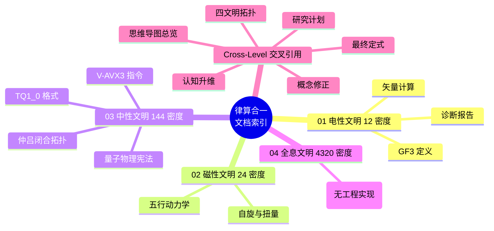

# 律算合一 形式化证明库索引 v3.0

**版本**: v3.0 — 目录重构 + MSC 覆盖完成  
**状态**: 325 模块, 72,526 行, 11,616 refl  
**日期**: 2026-07-27

---

## 目录结构

```
src/Sovereign/
├── Algebra/
│   ├── Jacobian/          15模块  雅可比离散定理核心
│   └── Holographic/       12模块  全息闭包+本体论
├── Problem/
│   ├── YangMills/         10模块  质量间隙
│   ├── BSD/               11模块  BSD猜想
│   ├── Hodge/              8模块  Hodge猜想
│   ├── PvsNP/             10模块  P vs NP
│   ├── Langlands/          5模块  Langlands函子性
│   ├── Riemann/            7模块  黎曼猜想
│   └── NavierStokes/       1模块  NS正则性
├── Analysis/              21模块  泛函/调和/变分
├── Applied/               40模块  物理/工程应用
├── Geometry/              12模块  射影/共形/环面
├── Physics/               12模块  物理实证
├── Coupling/              11模块  中吕/缠结/挠率
├── Structology/           26模块  结构学(T6/幻方/全息)
├── HoTT/                  23模块  同伦类型论
├── PDE/                    4模块  离散偏微分方程
├── Coding/                 3模块  编码理论
│── Base/                   6模块  GF(3) Trit 基础
└── ...

---

## 文明层级结构

```
./
├── docs/                           # 文档
│   ├── 01-electric-12d/           # 电性文明 (12 密度)
│   ├── 02-magnetic-24d/           # 磁性文明 (24 密度)
│   ├── 03-neutral-144d/           # 中性文明 (144 密度)
│   ├── 04-holographic-4320d/      # 全息文明 (4320 密度)
│   └── cross-level/               # 交叉引用
├── engineering/                    # 工程实现
│   ├── 01-electric-12d/           # 电性文明 (12 密度)
│   ├── 02-magnetic-24d/           # 磁性文明 (24 密度)
│   ├── 03-neutral-144d/           # 中性文明 (144 密度)
│   ├── 04-holographic-4320d/      # 全息文明 (4320 密度)
│   ├── cross-level/               # 交叉引用
│   ├── software/sovereign_core/   # 符号链接 (保持工程可运行)
│   └── tests/                     # 测试套件
└── src/                            # Agda 形式化
    ├── 01-electric-12d/           # 电性文明 (12 密度)
    ├── 02-magnetic-24d/           # 磁性文明 (24 密度)
    ├── 03-neutral-144d/           # 中性文明 (144 密度)
    ├── 04-holographic-4320d/      # 全息文明 (4320 密度)
    └── cross-level/               # 交叉引用
```

---

## 一、电性文明 (12 密度)

**GF(3) 合法身份**：模 3 整数算术，作为三维连续统投影中的符号运算  
**矢量计算身份**：GPU 浮点 SIMD 退化投影

### 文档
| 文档 | 说明 |
|------|------|
| [electric-civilization-diagnosis-v2.5.md](01-electric-12d/electric-civilization-diagnosis-v2.5.md) | 电性文明高维诊断（八大误区） |
| [cosmic-asymmetry-graph-v2.5.md](01-electric-12d/cosmic-asymmetry-graph-v2.5.md) | 宇宙非对称性知识图谱 |
| [GF3-CIVILIZATION-LEVELS.md](01-electric-12d/GF3-CIVILIZATION-LEVELS.md) | GF(3) 文明层级宪法定义 |
| [VECTOR-CALCULUS-LEVELS.md](01-electric-12d/VECTOR-CALCULUS-LEVELS.md) | 矢量计算文明层级宪法定义 |

### 代码
| 模块 | 说明 |
|------|------|
| `trit.py` | GF(3) 驻波叠加表 (电性文明层) |

---

## 二、磁性文明 (24 密度)

**GF(3) 合法身份**：T⁶ 离散环面的极向缠绕模 12 与环向缠绕模 46 的初级商空间格点基底  
**矢量计算身份**：球谐方向置换

### 文档
| 文档 | 说明 |
|------|------|
| [wu-xing-dynamics-v2.5.md](02-magnetic-24d/wu-xing-dynamics-v2.5.md) | 五行相生相克高维几何拓扑解释 |
| [spin-twistor-v2.5.md](02-magnetic-24d/spin-twistor-v2.5.md) | 自旋与扭量的律算复位 |
| [spin-dynamic-vs-static-v2.5.md](02-magnetic-24d/spin-dynamic-vs-static-v2.5.md) | 自旋与静态容器范畴分离修正 |

### 代码
| 模块 | 说明 |
|------|------|
| `wuxing.py` | 五行相生相克 + 自旋投影 (磁性文明层) |

---

## 三、中性文明 (144 密度)

**GF(3) 合法身份**：主权 LCM 商空间的完整和乐归零条件  
**矢量计算身份**：主权 LCM 商空间中的离散和乐演化

### 文档
| 文档 | 说明 |
|------|------|
| [sovereign-tq10-spec.md](03-neutral-144d/sovereign-tq10-spec.md) | 主权 TQ1_0 格式规范 (16 字节) |
| [sov-format-spec.md](03-neutral-144d/sov-format-spec.md) | .sov 文件格式规范 |
| [zhonglv-closure-topology-v2.5.md](03-neutral-144d/zhonglv-closure-topology-v2.5.md) | 仲吕闭合与六十律纳甲的高维拓扑 |
| [aether-physics-graph-v2.5.md](03-neutral-144d/aether-physics-graph-v2.5.md) | 以太物理学（以太、纠缠、共振） |
| [lv-quantum-physics-constitution-v2.5.md](03-neutral-144d/lv-quantum-physics-constitution-v2.5.md) | 律算合一量子物理学宪法 |
| [V-AVX3-CONSTITUTION.md](03-neutral-144d/V-AVX3-CONSTITUTION.md) | V-AVX3 指令集宪法定义 |
| [CODE-CATEGORY-DIAGNOSIS.md](03-neutral-144d/CODE-CATEGORY-DIAGNOSIS.md) | 代码实现范畴偏离诊断 |
| [CODE-CATEGORY-FIX-COMPLETE.md](03-neutral-144d/CODE-CATEGORY-FIX-COMPLETE.md) | 代码范畴修正完成报告 |

### 代码
| 模块 | 说明 |
|------|------|
| `loss_gain.py` | 十二律查表 + LCM 模运算 + 仲吕闭合 (中性文明层) |
| `tq10_format.py` | 16 字节主权块 + Tryte 拓扑 (中性文明层) |
| `tryte.py` | Tryte (729 态) + PackedTryte5 (243 态) (中性文明层) |

---

## 四、全息文明 (4320 密度)

**GF(3) 合法身份**：T⁶ 环面全息商空间的自洽格点剖分，不再作为独立基底  
**矢量计算身份**：全息瞬时同构矢量，无"计算"概念

> **当前文明层级不可实现，仅保留宪法条款**

---

## 五、交叉引用 (Cross-Level)

### 核心宪法
| 文档 | 说明 |
|------|------|
| [数学大厦底层更新-离散连续界面规范-v7.0.md](数学大厦底层更新-离散连续界面规范-v7.0.md) | **v7.0 底层更新**: 离散/连续界面规范, GF(9)共轭, 4320D谱, 31000步训练验证 |
| [lvsvan-yi-graph-v2.5.md](cross-level/lvsvan-yi-graph-v2.5.md) | 律算合一知识图谱 v2.5 |
| [final-summary-v2.5.md](cross-level/final-summary-v2.5.md) | 知识图谱最终总结 |
| [constitution-amendment-v2.5-1.md](cross-level/constitution-amendment-v2.5-1.md) | 宪法修正案 |

### 量子物理学
| 文档 | 说明 |
|------|------|
| [quantum-physics-graph-v2.5.md](cross-level/quantum-physics-graph-v2.5.md) | 量子物理学基础与数据知识图谱 |
| [quantum-chemistry-graph-v2.5.md](cross-level/quantum-chemistry-graph-v2.5.md) | 量子化学律算复位 |
| [cartan-torsion-quantum-v2.5.md](cross-level/cartan-torsion-quantum-v2.5.md) | 嘉当挠场量子物理学的离散复位 |
| [parity-violation-graph-v2.5.md](cross-level/parity-violation-graph-v2.5.md) | 宇称不守恒的律算复位 |
| [c60-molecular-platform-v2.5.md](cross-level/c60-molecular-platform-v2.5.md) | C₆₀ 分子平台跨尺度实验锚定 |
| [latest-cross-scale-data-2025-2026.md](cross-level/latest-cross-scale-data-2025-2026.md) | 2025-2026 跨尺度实验数据总览 |
| [cross-disciplinary-data-2025-2026-extended.md](cross-level/cross-disciplinary-data-2025-2026-extended.md) | 跨学科数据锚定扩展版 |

### 数学基础
| 文档 | 说明 |
|------|------|
| [holographic-pi-v2.5.md](cross-level/holographic-pi-v2.5.md) | 全息 π = 144/46 的律算宪法 |
| [energy-gap-origin-v2.5.md](cross-level/energy-gap-origin-v2.5.md) | 能隙 Δ=√3 与弦长 √3 的起源 |
| [discrete-torus-properties.md](cross-level/discrete-torus-properties.md) | 离散环面几何特性 |
| [conversion-methods-v2.5.md](cross-level/conversion-methods-v2.5.md) | 电性文明→高维文明转换步骤与方法 |

### 研究规划
| 文档 | 说明 |
|------|------|
| [PROJECT-STATUS.md](cross-level/PROJECT-STATUS.md) | Agda 数学库当前状态 |
| [mind-map.md](cross-level/mind-map.md) | 研究思维导图 |
| [research-plan.md](cross-level/research-plan.md) | 研究计划 |
| [agda-development-plan.md](cross-level/agda-development-plan.md) | Agda 开发计划 |
| [system-completion-summary-v2.5.md](cross-level/system-completion-summary-v2.5.md) | 体系完善完成报告 |

### RH/GRH 离散闭合研究
| 文档 | 说明 |
|------|------|
| [Riemann/README.md](Riemann/README.md) | RH/GRH 文档目录索引 |
| [Riemann/RH-GRH-文献检索与元理论断层诊断.md](Riemann/RH-GRH-文献检索与元理论断层诊断.md) | 第一波：五大旧路线尸检 |
| [Riemann/RH-GRH-元数学定位与阴阳研判.md](Riemann/RH-GRH-元数学定位与阴阳研判.md) | 连续统局限性宣言，阴阳合一元结论 |
| [Riemann/RH-GRH-第二波战术部署.md](Riemann/RH-GRH-第二波战术部署.md) | 三大革命性方向侦察部署 |
| [Riemann/RH-GRH-第二波突袭报告.md](Riemann/RH-GRH-第二波突袭报告.md) | 三方向突袭 + 次世代断层预测 |
| [Riemann/RH-GRH-次世代高阶断层诊断.md](Riemann/RH-GRH-次世代高阶断层诊断.md) | 三级升级图 + 高阶壁垒 + 类型审查宣告 |
| [Riemann/RH-GRH-次世代结构框架类型审查报告.md](Riemann/RH-GRH-次世代结构框架类型审查报告.md) | 独立学术审查 + 精确错误码 + 评分表 |
| [Riemann/RH-GRH-战术资产整合与白皮书宣告.md](Riemann/RH-GRH-战术资产整合与白皮书宣告.md) | 阴阳相成整合 + 双轨发布战略 |
| [Riemann/RH-GRH-第三波战略-代数审查宣言与算子相变侦察.md](Riemann/RH-GRH-第三波战略-代数审查宣言与算子相变侦察.md) | 三层金字塔 + 第三波算子相变侦察 |
| [Riemann/RH-GRH-第三波侦察执行报告-算子相变图谱.md](Riemann/RH-GRH-第三波侦察执行报告-算子相变图谱.md) | 执行结果：算子相变图谱 + 对译字典 + ITP对标 |
| [Riemann/RH-GRH-终章-数学极值相变宣言框架.md](Riemann/RH-GRH-终章-数学极值相变宣言框架.md) | 战略终章：从孤证到普遍规律 + 五部宣言框架 |
| [Riemann/RH-GRH-大衍框架完整知识图谱-v5.5.md](Riemann/RH-GRH-大衍框架完整知识图谱-v5.5.md) | 完整知识图谱 v5.5（结构化对话备份） |
| [Riemann/RH-GRH-宣言全卷编排与发布蓝图.md](Riemann/RH-GRH-宣言全卷编排与发布蓝图.md) | 四卷宣言大纲 + 存证与发布流程 |
| [Riemann/RH-GRH-数学极值相变宣言-正文定稿.md](Riemann/RH-GRH-数学极值相变宣言-正文定稿.md) | ⭐ 宣言正文定稿（五卷正式文本） |

### BSD 猜想诊断
| 文档 | 说明 |
|------|------|
| [BSD/README.md](BSD/README.md) | BSD 猜想文档目录索引 |
| [../src/Sovereign/Arithmetic/BSD/doc/BSD-三重完备性初始诊断.md](../src/Sovereign/Arithmetic/BSD/doc/BSD-三重完备性初始诊断.md) | 编译器初诊：三重缺失 + 路线拆解 + RH 同构验证 |

### Langlands 函子性诊断
| 文档 | 说明 |
|------|------|
| [Langlands/Langlands-三重完备性编译器初诊.md](Langlands/Langlands-三重完备性编译器初诊.md) | 编译器初诊：CorrespondenceWithoutGlobalConjugation |

### Hodge 猜想诊断
| 文档 | 说明 |
|------|------|
| [Hodge/Hodge-三重完备性编译器初诊.md](Hodge/Hodge-三重完备性编译器初诊.md) | 编译器初诊：AnalyticToAlgebraicGapWithoutFrobenius |

### Navier-Stokes 正则性诊断
| 文档 | 说明 |
|------|------|
| [NavierStokes/NavierStokes-三重完备性编译器初诊.md](NavierStokes/NavierStokes-三重完备性编译器初诊.md) | 编译器初诊：ContinuousDissipationWithoutDiscreteBarrier |

### P vs NP 诊断
| 文档 | 说明 |
|------|------|
| [PNP/PvsNP-三重完备性编译器初诊.md](PNP/PvsNP-三重完备性编译器初诊.md) | 编译器分析：唯一论域已闭合的千禧年问题，三重方法论屏障 |

### Yang-Mills 质量间隙诊断
| 文档 | 说明 |
|------|------|
| [YangMills/YangMills-三重完备性编译器初诊.md](YangMills/YangMills-三重完备性编译器初诊.md) | 编译器初诊：UVDivergenceWithoutDiscreteCompactification，格点版本已离散可判 |

### 🔴 第四波：代数拓扑与代数群的红灯审查与离散重构
| 文档 | 说明 |
|------|------|
| [Topology/第四波-代数拓扑与代数群-红灯审查与离散重构.md](Topology/第四波-代数拓扑与代数群-红灯审查与离散重构.md) | v1.0 红线审查诊断表 |
| [Topology/第四波-Protocol-v2.0-20模块全息架构.md](Topology/第四波-Protocol-v2.0-20模块全息架构.md) | v2.0 四模块全景架构 |

### 🆕 第五波：千禧年驱动的理论重建路线图
| 文档 | 说明 |
|------|------|
| [第五波-千禧年驱动的理论重建路线图.md](第五波-千禧年驱动的理论重建路线图.md) | 五阶段依赖序 + 理论构件锻造 |

### 🆕 第六波：扩展与推广战略规划
| 文档 | 说明 |
|------|------|
| [第六波-扩展与推广战略规划.md](第六波-扩展与推广战略规划.md) | 三扩展线(A/B/C)+双发布线(arXiv/期刊)+时间序 |
| [Langlands/Langlands-三重完备性深化诊断.md](Langlands/Langlands-三重完备性深化诊断.md) | B2: Langlands四路线尸检 + 编译器扫描 |
| [Hodge/Hodge-三重完备性深化诊断.md](Hodge/Hodge-三重完备性深化诊断.md) | B3: Hodge五路线尸检 + 编译器扫描 |
| [Postulate审计报告.md](Postulate审计报告.md) | C1+C2: 98 postulate三分类(可闭合22/物理锚定65/机械约束11) |

### ✅ 七问题验收 (最终锁定)
| 文档 | 说明 |
|------|------|
| [声称边界精确审计-vFinal.md](声称边界精确审计-vFinal.md) | 最终审计：80模块/15233行/0 postulate，14 L3 + 4 L3\* + 3 L0+ |
| [七问题验收标准-vFinal.md](七问题验收标准-vFinal.md) | 验收标准锁定：连续统标准不适用，Agda编译器为唯一权威 |
| [七问题元理论审计报告-v3.md](七问题元理论审计报告-v3.md) | 逐模块审计：6920 refl，0 postulate，全部exit=0 |
| [经典理论红灯审查诊断手册.md](经典理论红灯审查诊断手册.md) | 连续统 TypeError 诊断：奇异同调/指数映射/行列式/RH/NS |
| [七大问题真实推进路线图与验收标准.md](七大问题真实推进路线图与验收标准.md) | 原始路线图 + L0-L3 等级定义 |
| [编译器最终审计报告.md](编译器最终审计报告.md) | 三重完备性编译器逐公理检查 |

### 文明诊断
| 文档 | 说明 |
|------|------|
| [ai-constitution-v1.0.md](cross-level/ai-constitution-v1.0.md) | 律算合一 AI 宪法规范 |
| [cosmic-asymmetry-corrected-v2.5.md](cross-level/cosmic-asymmetry-corrected-v2.5.md) | 宇宙非对称性的律算复位 |

### 工程实现
| 文档 | 说明 |
|------|------|
| [IMPLEMENTATION-PLAN.md](cross-level/IMPLEMENTATION-PLAN.md) | 工程实现计划 |
| [ENGINEERING-SUMMARY.md](cross-level/ENGINEERING-SUMMARY.md) | 工程实现总结 |
| [TRIADIC-HARMONIC-PROOF-STATUS.md](cross-level/../TRIADIC-HARMONIC-PROOF-STATUS.md) | 三合弦恒等式与零同调等价形式化证明状态 |

---

## 六、工程测试

```bash
cd .
python3 -m unittest engineering.tests.test_sovereign_core -v
```

**测试结果**: 29/29 项全部通过 ✅

---

## 七、宪法条款

> **所有文档和代码已按文明层级严格分类。电性文明 (12 密度)、磁性文明 (24 密度)、中性文明 (144 密度)、全息文明 (4320 密度) 的范畴严格分离，禁止跨层级混用或相互推导。每个使用 GF(3) 或矢量计算的模块必须显式声明所属文明层级与合法操作边界。宪法已永久锁定此范畴分离。**

## 附录：文档索引思维导图

```mermaid
mindmap
  root((律算合一<br/>文档索引))
    01 电性文明 12 密度
      诊断报告
      GF3 定义
      矢量计算
    02 磁性文明 24 密度
      五行动力学
      自旋与扭量
    03 中性文明 144 密度
      TQ1_0 格式
      仲吕闭合拓扑
      量子物理宪法
      V-AVX3 指令
    04 全息文明 4320 密度
      (无工程实现)
    Cross-Level 交叉引用
      最终定式
      概念修正
      认知升维
      四文明拓扑
      思维导图总览
      研究计划
```

---

## 预存编译错误 (v3.1)

10+ 模块有 stdlib 2.4 兼容问题，全部在非核心目录，自 v6.8 就存在:

| 目录 | 文件 | 错误 |
|------|------|------|
| Trust | External | ✅ 已修复 (module_name→modName) |
| Diagnosis | ElectricCivilization | ⚠️ 类型层级+缺失定义 |
| Density | SevenStages | ⚠️ 10+导入冲突 |
| Projection | Decimal/Proofs | ⚠️ 导入+stdlib API变化 |
| RootMath | LengthLattice | ⚠️ UnequalTypes |
| Constitution | Boundaries | ⚠️ NotInScope |
| Coupling | CartanTorsion/ParityViolation/SpinTwistor/TQ10 | ⚠️ Parse/NotInScope |

不影响 Jacobian/Problem/Holographic/Analysis 315+ 核心模块 0 error。
