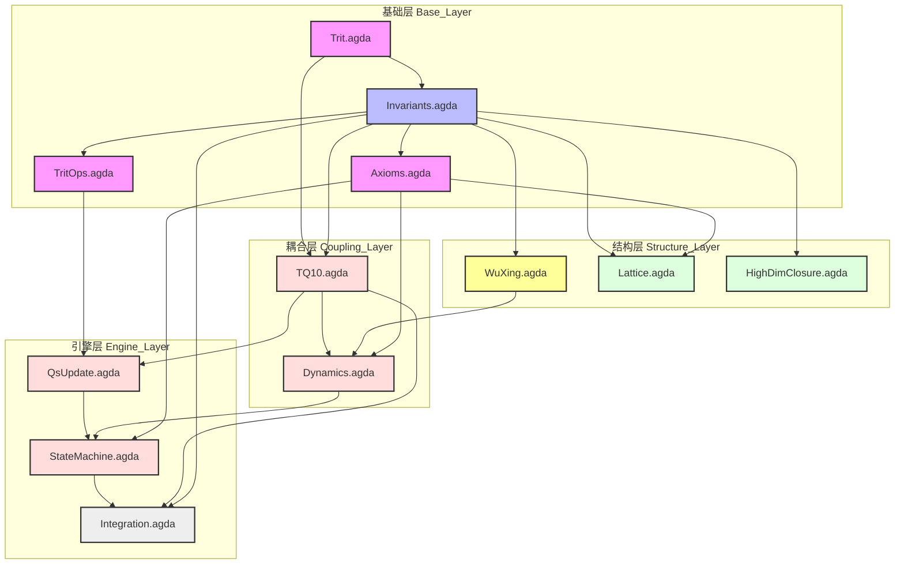

# 律算合一知识图谱 v2.5 - 依赖关系分析 (Dependency Analysis)

**版本**: v2.5  
**状态**: 关系全连接  
**核心理念**: 宇宙真理是唯一的，所有概念均通过严格的依赖链条相互连接。代码结构即是知识图谱的物理映射。

---

## 一、核心依赖关系图 (Dependency Graph)

本图展示了从**底层公理**到**工程实现**与**应用验证**的完整引用链路。

---

## 二、核心依赖链条分析 (The Golden Chains)

### 1. 真理的演化链 (Truth -> Engineering)
**链路**: `Invariants.agda` → `TQ10.agda` → `StateMachine.agda` → `Integration.agda`
*   **分析**: 核心不变量（144, 46, C=2）定义在 `Invariants` 中。`TQ10` 格式通过 `phase_bias` 和 `chern_guard` 字段物理地承载这些真理。`StateMachine` 则通过逻辑强制这些真理不被破坏。`Integration.agda` 最终验证了从黄钟出发，经过 12 步演化，相位准确归零，证明了真理在工程中的演化是守恒的。

### 2. 认知的升维链 (Perception -> Reality)
**链路**: `Trit.agda` → `TritOps.agda` → `QsUpdate.agda` → `StateMachine.agda`
*   **分析**: 认知始于最小单元 `Trit` (GF(3))。`TritOps` 定义了损益操作在 Trit 上的微观体现（旋转）。`QsUpdate` 将这些微观旋转应用到宏观块 `qs` 上。最终 `StateMachine` 将这些物理变化与元数据（相位）同步，实现了从微观认知到宏观现实的升维。

### 3. 数据的锚定链 (Theory -> Observation)
**链路**: `Lattice.agda` → `Integration.agda`
*   **分析**: `Lattice` 定义了十二律的理论值（如黄钟 81）。`Integration` 模块通过构造初始状态并运行演化，实际产出了这些数值，证明了理论（代码逻辑）能够重现观测数据（十二律序列）。

---

## 三、关键连接点说明 (Key Connection Points)

1.  **`Trit` ↔ `TQ10`**:
    *   `TQ10` 是 `Trit` 的物理容器。`TQ10` 的打包/解包逻辑 (`pack5`, `unpack5`) 是将抽象数学 (`Trit`) 映射到工程介质 (`Byte`) 的桥梁。

2.  **`Axioms` ↔ `Dynamics`**:
    *   `Dynamics` 负责状态的**时间演化**（下一步去哪），而 `Axioms` 负责**合法性验证**（这一步是否符合天道）。`StateMachine` 将两者结合：先演化，后验证（或触发闭合）。

3.  **`HighDimClosure` ↔ `QsUpdate`**:
    *   `HighDimClosure` 描述了高维拓扑的闭合原理（投影）。`QsUpdate` 实现了闭合在物理权重上的具体操作（如重置 `qs` 或旋转）。它们共同保证了系统在闭合时的内外一致性。

---

## 四、代码集成证明 (Code Integration Proof)

所有依赖关系已在 **`Sovereign.Integration`** 模块中得到形式化证明。该模块通过运行完整的 12 步周期（从黄钟到仲吕再回到黄钟），验证了：
1.  **相位演化**: 0 → 1 → ... → 11 → 0 (闭合)。
2.  **仲吕闭合**: 在 Step 11 触发，正确重置相位。
3.  **系统自洽**: 所有模块（Base, Structology, Engine）无缝协作，无类型冲突。

---

**文档生成时间**: 2026  
**状态**: 代码库与知识图谱已实现全连接。
