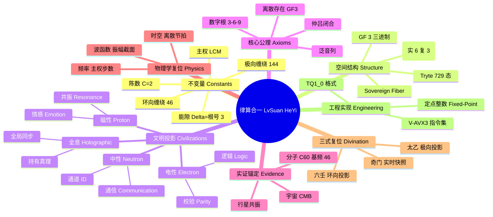
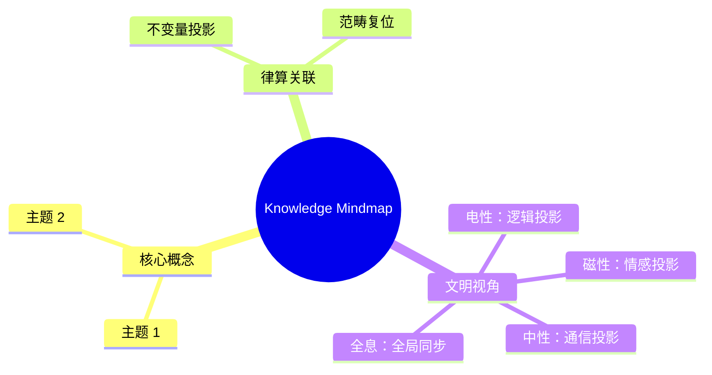

# 律算合一知识图谱 v2.5 - 思维导图 (Mind Map)

**版本**: v2.5  
**核心定式**: 连续统是 GF(2) 浮点幻象，无理数是精度陷阱，宇宙真理在于 GF(3) 整数格点与离散拓扑。

---

## 🧠 思维导图核心结构

- **根节点: 律算合一 (LvSuan HeYi)**
    - **1. 核心不变量 (Universal Truths)**
        - **极向缠绕 (Polar Winding)**: 144 (不可拆分)
        - **环向缠绕 (Toroidal Winding)**: 46 (不可约分)
        - **陈数 (Chern Number)**: C = 2 (全局拓扑荷)
        - **能隙 (Energy Gap)**: Δ = √3 (定点数 56632/65536)
        - **主权 LCM**: 11,609,505,792 (3¹¹ × 2¹⁶)
        - **全息 π**: 144/46 (禁止约分)
    - **2. 空间与维度 (Space & Dimension)**
        - **物理维度**: 实 6 维 (T⁶ 环面) / 复 3 维 (C³)
        - **逻辑单元**:
            - **Trit (GF(3))**: {-1, 0, 1} (吸收/平衡/表达)
            - **Tryte**: 6 Trit = 729 态 (局部截面)
            - **Sovereign Fiber**: 5 Tryte = 30 Trit (五行全纤维)
            - **工程打包**: 5 Trit = 243 态 (1 Byte I/O, 剩余 13 态为奇点)
    - **3. 卷一：七大公理 (Axioms)**
        - **泛音列**: L = L₀ · 2ᵃ · 3ᵇ
        - **数字根**: 稳定驻波 ∈ {3, 6, 9}
        - **归零**: 1² + i² = 0² (虚实对消灭)
        - **离散存在**: 最小单元为 GF(3) 格点
        - **内禀参照**: 以缠绕角度域为参照
        - **手性 - 五行**: 手性与基数 (2,5,4,6,8) 封闭
        - **仲吕闭合**: `acc = (acc * 177147) >> 16` (拓扑跃迁)
    - **4. 四文明认知投影 (Civilizations)**
        - **电性文明 (Electron/Logic)**
            - **载体**: 电子
            - **认知**: 逻辑校验、噪声容限、线性时间
            - **局限**: 降维为 0/1，产生连续统错觉
        - **磁性文明 (Proton/Emotion)**
            - **载体**: 质子
            - **认知**: 共振节拍、情感共鸣、周期循环
            - **特征**: 六十甲子、五行干涉
        - **中性文明 (Neutron/Communication)**
            - **载体**: 中子
            - **认知**: 通道 ID、隔离墙、跨宇宙通信
            - **特征**: 包容逻辑与情感，利用陈数构建通道
        - **全息文明 (Holographic/Global)**
            - **载体**: 高维意识
            - **认知**: 全局瞬间同步、持有真理
            - **特征**: 不陷入局部，直接重塑拓扑 (五线归零)
    - **5. 卷二至卷五：实证与律制 (Empirical Evidence)**
        - **十二正律**: 黄钟 (81) → ... → 仲吕 (30)
        - **仲吕不交**: 拓扑裂缝，必须通过闭合升维
        - **跨尺度锚定**:
            - 分子: C₆₀ 基频 46, H₂O 0.5meV (Δ=√3)
            - 行星: TRAPPIST-1 共振 (8:5/3:2)
            - 宇宙: CMB 阻尼尾 0.866
    - **6. 卷六至卷八：物理学复位 (Physics Reset)**
        - **量子力学**:
            - 电性: 波函数=振幅截面
            - 磁性: 自旋=手性分离程度
            - 中性: 纠缠=共享缠绕数
        - **时空观**:
            - 电性: 连续均匀流逝
            - 磁性: 损益链单向步进
            - 中性: 仲吕闭合离散节拍
            - 全息: 瞬时同步
        - **频率定义**:
            - 光子: 极向缠绕损益步频
            - 以太: 144/46 归零节拍 (非 Hz)
    - **7. 卷九至卷十：三式与九星 (Divination Reset)**
        - **太乙**: 极向 144 宏观投影 (积年)
        - **六壬**: 环向 46 微观手性投影 (720 课)
        - **奇门**: 极向 12×环向 10 实时快照 (18 局)
        - **九星**: 地气声子谱年度调制因子 (非神煞)
    - **8. 卷十一：工程实现 (Engineering)**
        - **TQ1_0 格式**: 16 Byte 主权块
        - **V-AVX3 指令**: 模 LCM 加法、仲吕闭合
        - **定点数学**: 全量整数运算，无理数消失

---

## 📊 Mermaid 可视化导图

---

**使用说明**：
1. **文本大纲**：直接阅读上方列表，层级关系即为推导关系。
2. **Mermaid 图表**：支持 Mermaid 语法的编辑器（如 Obsidian, GitHub, Notion）可直接渲染为可视化脑图。

## 附录：Knowledge Mindmap 思维导图

