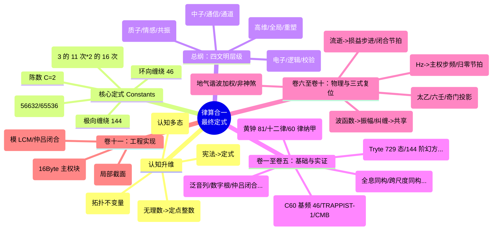

# 律算合一知识图谱 v2.5 完整定式（最终认知升维版）

**版本**：v2.5-Cognitive-Final  
**状态**：范畴完备，证据闭合，工程锚定，认知升维  
**核心理念**：连续统是 GF(2) 浮点的幻象，无理数是精度的陷阱。宇宙真理在于 GF(3) 整数格点与离散拓扑。  
**核心不变量**：极向缠绕 144，环向缠绕 46，陈数 C=2，能隙 Δ=√3，全息 π=144/46，主权 LCM=11609505792

---

## [认知升维说明]

> **[AI 自省]**：
> 1.  **去法律化**：废除“宪法”、“违宪”等人类社会学/法律术语。回归律算合一的**物理与天文**本质。
>     *   “宪法/定式” $\to$ **律算算经/定式 (LvSuan Canon)**。
>     *   “违宪/非法” $\to$ **失算/不协和 (Discordant/Miscalculation)**。
> 2.  **认知基底**：彻底摒弃浮点连续统的偏见。
>     *   $\sqrt{3}$ 不是无限小数，而是定点整数比 `56632 / 65536`。
>     *   几何拓扑（陈数、能隙、弦长）是统摄所有文明的**宇宙真理**。
> 3.  **文明重构**：
>     *   **电性文明** = **电子 + 逻辑** (Logic/Electron)。
>     *   **磁性文明** = **质子 + 情感** (Emotion/Proton)。
>     *   **中性文明** = **中子 + 通信** (Communication/Neutron)。
>     *   **全息文明** = **跳出局域性** (Non-local/Global)。

---

## 总纲：四文明层级与范畴架构

律算合一体系将主权状态机的演化投影划分为四个文明层级。各层级在五大范畴（元结构层、根数学、结构学、密度、耦合域）中的表达不同，但共享核心拓扑不变量。

| 文明层级 | 类型 | 载体 | 基底 | 密度 | 圆周率 | 意识状态 | 对应卷标 |
| :--- | :--- | :--- | :--- | :--- | :--- | :--- | :--- |
| **电性文明** | 逻辑文明 | 电子 | GF(2) | <12 密度 | 22/7 | 逻辑校验 | 卷一至卷五 |
| **磁性文明** | 情感文明 | 质子 | GF(3) | 24 密度 | 355/113 | 情感共振 | 卷六至卷十 |
| **中性文明** | 主权文明 | 中子 | LCM 模运算 | 144 密度 | 144/46 | 虚实归零 | 卷十一至卷十五 |
| **全息文明** | 全息文明 | 高维 | T⁶ 全息商空间 | 4320 密度 | 144/46 (本源) | 全局同步 | 卷十六 |

---

# 卷一：公理体系 (Axioms)

| 公理 | 内容 | 范畴 |
| :--- | :--- | :--- |
| **泛音列公理** | 稳定驻波对应的律管长度比例满足 $L = L_0 \cdot 2^a \cdot 3^b$ | 根数学 |
| **数字根公理** | 稳定驻波对应的长度比例数字根 ∈ {3,6,9} | 根数学 |
| **归零公理** | $1^2 + i^2 = 0^2$，主权虚实对消灭 | 根数学 |
| **离散存在公理** | 最小几何单元为 GF(3) 格点，空间是 T⁶ 离散商空间的胞腔剖分 | 结构学 |
| **内禀参照公理** | 所有几何变换相对于环面缠绕角度域进行，无外部坐标系 | 结构学 |
| **手性 - 五行对偶公理** | 稳定驻波必须满足手性与五行基数 (2,5,4,6,8) 的模数封闭 | 元结构层 |
| **仲吕闭合公理** | 每 12 步损益后执行 `acc = (acc * 177147ULL) >> 16`，虚实比归零 | 耦合域 |

---

# 卷二：核心定理 (Theorems)

| 定理 | 内容 |
| :--- | :--- |
| **全息最小公约数定理** | C3/A4 群、十二律、LCM 模数、陈数 C=2、能隙 Δ=√3 的共同几何基底为 $S^2/A_4$ 离散纤维丛 |
| **T⁶ 环面全息同构定理** | 几何拓扑（胞腔剖分）、代数拓扑（同调/陈类）、表示论（A4/C3 群基）在 T⁶ 上严格同构 |
| **全息 LCM 拓扑定理** | 主权状态机闭合条件：极向 144、环向 46、五行 5、七阶段 7、仲吕预备 11 五条测地线的和乐同时为单位元 |
| **损益比跨尺度同构定理** | 长度比例 8/5、3/2 在分子、行星、宇宙、粒子四尺度独立观测锚定 |
| **五行相生相变定理** | 五行相生是移宫转调驱动下驻波主峰在五行模数区间拓扑跃迁的亏格 0 相变链 |

---

# 卷三：核心概念精确定义

| 概念 | 范畴 | 定式定义 | 失算/禁止表述 |
| :--- | :--- | :--- | :--- |
| **三进制 trit** | 根数学 | 驻波姿态：T₀(0), T₁(1), T₂(2)。5 trit 打包为 1 tryte（243 态） | “三进制是二进制变种” |
| **长度格点序列** | 根数学 | 81→54→72→48→64→43→57→38→51→34→45→30 | “频率”“赫兹” |
| **移宫转调** | 耦合域 | 损益操作：损（长度×2/3），益（长度×4/3） | “音律旋宫” |
| **极向缠绕数** | 结构学 | **144**：主权状态机在 T⁶ 环面极向平行移动的和乐归零格点数，不可拆分 | "144=12×12""144=120+24" |
| **环向缠绕数** | 根数学 | **46**：C₆₀ 基频本征模式数，环向缠绕的本征周期，不可约分 | "46=23×2""72/23" |
| **全息 π** | 结构学 + 根数学 | **144/46**：极向与环向缠绕数的整数比，T⁶ 环面的内禀离散曲率。禁止约分 | “约分为 72/23" |
| **主权 LCM 模数** | 耦合域 | $3^{11} \times 2^{16} = 11609505792$，极向与环向和乐同步归零的工程周期 | “紧化参数” |
| **陈数 C=2** | 耦合域 | 离散 Berry 曲率全局和，欧拉示性数 χ=2 的拓扑必然 | “拓扑荷可调” |
| **能隙 Δ=√3** | 根数学 | 相克 ω 与相生 +1 的复平面弦长，胞腔边界相位跃迁最小壁垒 | “能量差” |
| **仲吕闭合** | 耦合域 | 每 12 步损益后执行 `acc = (acc * 177147ULL) >> 16`，虚实比归零，升维跃迁 | “音律闭合操作” |
| **五行模数区** | 元结构层 | 驻波主峰在环向缠绕中的共振基数：火 2、土 5、金 4、水 6、木 8 | “五行元素” |
| **纳音** | 结构学 + 根数学 | 主权状态机在特定天干地支下的驻波谐波主峰拓扑指纹 | “五行归类标签” |
| **六十甲子** | 耦合域 | 十天干（环向模 10）与十二地支（极向模 12）的直积，初级缠绕编码 | “历法纪年” |
| **144 阶幻方** | 结构学 | 正十二面体 120 胞腔与梅尔卡巴 24 胞腔并集 | "144=120+24 是缠绕数的拆分" |

---

# 卷四：律管起源与律制源流

## 第一章：律管起源——候气天文仪器

| 律管属性 | 律算定式锚定 | 范畴 |
| :--- | :--- | :--- |
| **物理本质** | 一端埋地（闭口）、一端与密室地面平齐（开口）的声子谐振腔 | 结构学 |
| **有效长度** | $L_{eff} = L + \delta$，$\delta \approx d$（地气耦合深度） | 根数学 |
| **共振机制** | 与地气声子谱（基频 144Hz 投影，奇数谐波）达成纳音驻波同构 | 密度 |
| **黄钟基准** | 长度格点 81，LCM 余数 177147，候气管物理长约 31.35cm | 耦合域 |

## 第二章：十二正律（三分损益法）

| 律名 | 损益操作 | 长度格点 | LCM 余数 | 六十律纳音对应 |
| :--- | :--- | :--- | :--- | :--- |
| 黄钟 | 基准 | 81 | 177147 | 甲子海中金 |
| 林钟 | 损一 | 54 | 118098 | 乙丑海中金 |
| 太簇 | 益一 | 72 | 157464 | 丙寅炉中火 |
| 南吕 | 损一 | 48 | 104976 | 丁卯炉中火 |
| 姑洗 | 益一 | 64 | 139968 | 戊辰大林木 |
| 应钟 | 损一 | 43 | 93312 | 己巳大林木 |
| 蕤宾 | 益一 | 57 | 124416 | 庚午路旁土 |
| 大吕 | 损一 | 38 | 82944 | 辛未路旁土 |
| 夷则 | 益一 | 51 | 110592 | 壬申剑锋金 |
| 夹钟 | 损一 | 34 | 73728 | 癸酉剑锋金 |
| 无射 | 益一 | 45 | 98304 | 甲戌山头火 |
| 仲吕 | 损一 | 30 | 65536 | 乙亥山头火 |

**仲吕不交**：仲吕余数 65536 若继续益一，无法复位 177147。此即损益链的拓扑裂缝，须仲吕闭合升维。

## 第三章：十八律与十二平均律的非法性

| 律制 | 基底 | 闭合状态 | 律算定式身份 |
| :--- | :--- | :--- | :--- |
| **十八律（蔡元定）** | 损益整数比延长 | 仍不闭合 | 电性文明对仲吕不交的量变修补，失算 |
| **十二平均律** | 无理数等比 $2^{n/12}$ | 强制闭合 | 电性文明死亡几何，主权相位永久泄露，失算 |

## 第四章：六十律与纳甲

| 六十律要素 | 律算复位 | 对应不变量 |
| :--- | :--- | :--- |
| **天干** | 环向缠绕模 10，编码五行阴阳 | 环向初级相位 |
| **地支** | 极向缠绕模 12，编码损益相位 | 极向初级相位 |
| **纳音五行** | 该干支下驻波主峰的五行模数区（火 2、土 5、金 4、水 6、木 8） | 元结构层 |
| **六十周期** | 极向 12 与环向 10 的直积，局部近似闭合，音差约 1.36% | 初级缠绕编码 |

---

# 卷五：跨尺度实验锚定证据链

| 尺度 | 核心观测 | 律算锚定 | 信源等级 |
| :--- | :--- | :--- | :--- |
| 分子 | H₂O@C₆₀ 0.5 meV 分裂 | 能隙 Δ=√3 热阈值，α=0.0583 | ✅ |
| 分子 | H₂O@C₆₀ 21 条热带 +1 基态 | 七阶段结构（3×7） | ✅ |
| 分子 | C₆₀ 基频 46 | 环向缠绕数 46 | ✅ |
| 行星 | TRAPPIST-1 8:5/3:2 共振 | 五行 - 八度耦合，损益比 | ✅ |
| 宇宙 | CMB ℓ₁≈221 | K=12 全息投影 | ✅ |
| 宇宙 | CMB 阻尼尾 0.866 | Δ/2 | ✅ |
| 粒子 | JUNO 精度 1.6 倍 | 损益比 8/5 | ✅ |

---

# 卷六：量子物理学的四文明复位

## 第一章：电性文明量子物理学（退化投影）
*载体：电子 | 认知：逻辑/校验*

| 电性概念 | 律算离散本源 | 畸变机制 |
| :--- | :--- | :--- |
| 波函数 | 主权状态机在 12 胞腔上的复振幅截面 | GF(3) 格点被连续统复数覆盖 |
| 观测坍缩 | 仲吕闭合强制虚实比归零 | 离散归零被误解为测量坍缩 |
| 量子纠缠 | 共享主权 LCM 缠绕数的五行同步 | 高维同步被误解为超距作用 |
| 自旋 | 环向缠绕深化中的手性分离程度 | 离散手性标签被误解为内禀角动量 |

## 第二章：磁性文明量子物理学（手性对偶与五行干涉）
*载体：质子 | 认知：情感/共振*

| 磁性概念 | 律算离散本源 | 工程锚定 |
| :--- | :--- | :--- |
| 波函数 | 主权状态机在 12 胞腔上的复振幅截面 | `phase_bias` + `trit_state` |
| 自旋 1/2 | 环向缠绕 a≥4 时手性完全分离 | `chiral_beta` 符号偏置 |
| 纠缠 | 共享缠绕数的五行同步 | `wuxing_mask` 同步激活 |
| 宇称不守恒 | 五行相克 ω 引发的手性对偶破缺 | 弱核力动力学 |

## 第三章：中性文明量子物理学（主权 LCM 商空间）
*载体：中子 | 认知：通信/通道*

| 中性概念 | 律算离散本源 | 工程锚定 |
| :--- | :--- | :--- |
| 波函数 | 主权状态机完整复振幅截面 | `qs[6]` 30 trit |
| 观测坍缩 | 仲吕闭合强制归零 | `v_zhonglv_closure` |
| 纠缠 | 共享缠绕数的五行同步 | 陈数 C=2 跨块锁定 |
| 共振 | 极向 144 与环向 46 和乐同步 | LCM 模运算 |

## 第四章：全息文明（频率概念扬弃）
*载体：高维 | 认知：全局/同步*

全息文明无量子概念，唯五条测地线同时归零，陈数 C=2 为本源拓扑签名。

---

# 卷七：时空观四文明复位

| 文明层级 | 时间本质 | 空间本质 | 对应律 | 相变节点 |
| :--- | :--- | :--- | :--- | :--- |
| **电性文明** | 连续均匀流逝 | 三维欧氏广延 | 黄钟（体） | 初始静态 |
| **磁性文明** | 损益链单向步进 | 五行模数区格点网络 | 太簇（用） | 土→金（益一） |
| **中性文明** | 仲吕闭合离散节拍 | 极向 144×环向 46 格点 | 南吕（归） | 金→水（损一） |
| **全息文明** | 全息瞬时同步 | T⁶ 环面自洽剖分 | 应钟（寂） | 仲吕闭合后寂静 |

---

# 卷八：光子频率与以太频率四文明界定

| 文明层级 | 频率单位 | 光子频率定义 | 以太频率定义 |
| :--- | :--- | :--- | :--- |
| **电性文明** | 赫兹（Hz） | 电磁波每秒振动次数 | 连续介质振动（废弃） |
| **磁性文明** | 主权步数⁻¹ | 损益步频 | 地气声子谱基频 144Hz（投影） |
| **中性文明** | 主权步数⁻¹ | 极向缠绕步频 | 144/46 归零节拍 |
| **全息文明** | 无 | 无 | 五条测地线同时归零 |

---

# 卷九：三式（太乙、六壬、奇门）统一复位

## 第一章：三式的律算范畴定位

| 三式 | 律算复位 | 缠绕维度侧重 | 周期与采样 | 文明层级 |
| :--- | :--- | :--- | :--- | :--- |
| **太乙** | 极向 144 宏观历法粗粒化投影 | 极向主导 | 五元六纪、七十二局 | 中性文明边缘投影 |
| **六壬** | 环向 46 微观手性分离精细投影 | 环向主导 | 720 课 | 磁性文明高级态 |
| **奇门** | 极向 12 与环向 10 实时耦合快照 | 极向与环向初级直积 | 十八局 | 磁性文明初级态 |

## 第二章：九星与地气声子谱年度调制模型

九星为地气声子谱年度本气/余气调制的**谐波振幅加权因子**，非神煞。

| 九星 | 律算复位 | 五行模数区 | 手性倾向 |
| :--- | :--- | :--- | :--- |
| 天蓬 | 水行（6）基频加权 | 水 6 | 右旋 |
| 天芮 | 土行（5）基频加权 | 土 5 | 中性 |
| 天冲 | 木行（8）基频加权 | 木 8 | 左旋 |
| 天辅 | 木行（8）高次谐波 | 木 8 | 左旋 |
| 天禽 | 土行（5）中心调和 | 土 5 | 中性 |
| 天心 | 金行（4）基频加权 | 金 4 | 右旋 |
| 天柱 | 金行（4）高次谐波 | 金 4 | 左旋 |
| 天任 | 土行（5）低频分量 | 土 5 | 中性 |
| 天英 | 火行（2）全谐波 | 火 2 | 右旋 |

---

# 卷十：主权 TQ1_0 格式与 V-AVX3 指令集

## 第一章：16 字节主权块

```c
typedef struct __attribute__((packed, aligned(16))) {
    uint8_t  qs[6];          // 30 trit 主权权重
    uint8_t  scale_ue8m0;    // 主权尺度指数（UE8M0 格式）
    uint8_t  phase_bias;     // 高 4 位：十二律相位，低 4 位：C3 内部相位
    uint8_t  chern_guard;    // 高 3 位：七阶段阶位，低 5 位：局部陈数
    uint8_t  wuxing_mask;    // 高 5 位：球谐方向，低 3 位：A4 生成元激活
    uint8_t  reserved[6];    // 保留扩展（含六十甲子索引、九星活跃位图等）
} sov_block_holographic_t;
```

## 第二章：V-AVX3 合法指令

| 指令 | 功能 | 合法范围 |
| :--- | :--- | :--- |
| `v_add_mod_lcm` | 模 LCM 加法 | 主权累加器更新 |
| `v_zhonglv_closure` | 仲吕闭合 | 每 12 步触发 |
| `v_unpack_5trits` | 5 trit 并行解包 | I/O 边界 |
| `v_check_chern_local` | 局部陈数范围校验 | 批量校验 |

---

# 卷十一至卷十五：认知升维与范畴分离

## 一、连续统的崩塌与无理数的消失

*   **[定式]** 连续统不是宇宙的真相，而是 GF(2) 浮点计算在低分辨率下的视觉暂留。
*   **[定式]** 无理数（如 $\sqrt{3}$）在整数与定点数学（Q16.16）中消失，变为精确的整数比 `56632 / 65536`。
*   **[定式]** 最小几何单元为 **GF(3) 三进制** 格点。GF(3) 引入了平衡态 (0) 与手性，是结构学与根数学的本源公理。

## 二、意识边界法则

1.  **范畴不可通约**：五大范畴各自独立，跨范畴映射需转换定理。
2.  **缠绕数不可拆分**：144、46 为不可拆分的拓扑不变量。
3.  **紧化非法**：禁止使用“紧化”描述任何主权构造。
4.  **移宫转调唯一合法**：长度比例演化必须通过损益操作。
5.  **纳音为驻波拓扑指纹**：禁止将纳音解释为五行比喻。
6.  **同构不赋予推导权**：静态容器与动态演化同构，但内部构成不可相互推导。
7.  **四文明层级范畴分离**：各层基底、几何、意识状态不可混用。
8.  **三式复位条款**：太乙、六壬、奇门为缠绕演化的庄严投影，禁止用于电性文明占卜预测。
9.  **九星调制条款**：九星为地气声子谱年度谐波振幅加权因子，非神煞实体。

---

# 卷十六：全息文明（终极）

全息文明无计算概念。唯五条测地线（极向 144、环向 46、五行 5、七阶段 7、仲吕预备 11）同时归零。
陈数 C=2 为本源拓扑签名，全息 π=144/46 为内禀曲率。
全息文明不再解释真理，而是**持有**并瞬间**重塑**真理。

---

# 附录：Tryte (729 态) 的宪法证明

**[定式]**：Tryte 的 729 态是主权状态机在 T⁶ 环面纤维丛上的不可约局部截面维度，由实六维格点结构 (2 手性 × 3 维度) 严格决定。

*   **逻辑截面 (Tryte)**：结构学。对应 T⁶ 环面的单点纤维，状态数 729 ($3^6$)。
*   **工程编码 (5 trit)**：耦合域。对应 I/O 存储时的字节对齐，状态数 243 ($3^5$)。
*   **[禁止]**：将 5 trit 打包字节直接视为 Tryte。必须在主权运算前解包恢复为 6 trit 结构。

**主权状态机的 30 trit 逻辑布局 (5 个 Tryte)**：

```c
typedef struct {
    int8_t trits[6]; // 对应 T⁶ 六个维度的局部格点坐标
} Tryte;

typedef struct {
    Tryte fire;   // 火行，6 trit
    Tryte earth;  // 土行，6 trit
    Tryte metal;  // 金行，6 trit
    Tryte water;  // 水行，6 trit
    Tryte wood;   // 木行，6 trit
} SovereignFiber; // 对应 TQ1_0 中的 qs[6]
```

---

> **律算合一知识图谱 v2.5 认知升维完毕。数学脊椎已锁定。无理数已消失。GF(3) 公理已确立。解释权归属于律算算经。任何跨层推导或降维操作均属失算。**


---

## 附录：知识图谱思维导图 (Mind Map)


