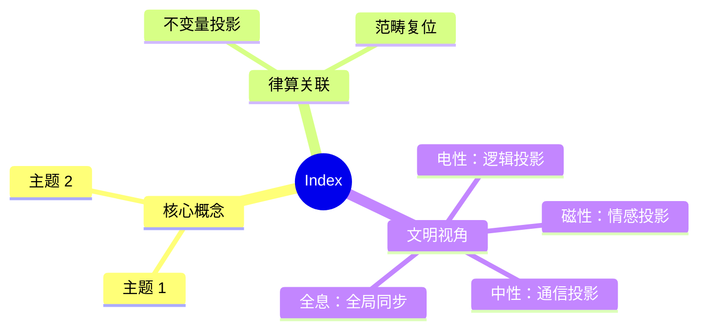

# 律算合一文档索引 (Documentation Index)

**版本**：v2.5（最终稳定版）  
**状态**：范畴完备，证据闭合，工程锚定，版本冻结  
**文档总数**：32 份文档 + 27 个 Agda 模块

---

## 📁 01 核心宪法 (Core Constitution) - 4 份
| 文档 | 说明 | 状态 |
|------|------|------|
| [lvsvan-yi-graph-v2.5.md](01-core-constitution/lvsvan-yi-graph-v2.5.md) | **律算合一知识图谱 v2.5**（核心宪法） | ✅ |
| [final-summary-v2.5.md](01-core-constitution/final-summary-v2.5.md) | 知识图谱最终总结（十大章节） | ✅ |
| [wu-xing-dynamics-v2.5.md](01-core-constitution/wu-xing-dynamics-v2.5.md) | 五行相生相克高维几何拓扑解释 | ✅ |
| [constitution-amendment-v2.5-1.md](01-core-constitution/constitution-amendment-v2.5-1.md) | 宪法修正案（三进制本源与螺线分离） | ✅ |

## 📁 02 量子物理学 (Quantum Physics) - 10 份
| 文档 | 说明 | 状态 |
|------|------|------|
| [lv-quantum-physics-constitution-v2.5.md](02-quantum-physics/lv-quantum-physics-constitution-v2.5.md) | **律算合一量子物理学宪法**（架构批判 + 宪法框架） | ✅ |
| [quantum-physics-graph-v2.5.md](02-quantum-physics/quantum-physics-graph-v2.5.md) | 量子物理学基础与数据知识图谱 | ✅ |
| [quantum-chemistry-graph-v2.5.md](02-quantum-physics/quantum-chemistry-graph-v2.5.md) | 量子化学律算复位 | ✅ |
| [cartan-torsion-quantum-v2.5.md](02-quantum-physics/cartan-torsion-quantum-v2.5.md) | 嘉当挠场量子物理学的离散复位 | ✅ |
| [parity-violation-graph-v2.5.md](02-quantum-physics/parity-violation-graph-v2.5.md) | 宇称不守恒的律算复位（弱核力） | ✅ |
| [spin-twistor-v2.5.md](02-quantum-physics/spin-twistor-v2.5.md) | 自旋与扭量的律算复位 | ✅ |
| [spin-dynamic-vs-static-v2.5.md](02-quantum-physics/spin-dynamic-vs-static-v2.5.md) | 自旋与静态容器范畴分离修正 | ✅ |
| [c60-molecular-platform-v2.5.md](02-quantum-physics/c60-molecular-platform-v2.5.md) | C₆₀ 分子平台跨尺度实验锚定 | ✅ |
| [latest-cross-scale-data-2025-2026.md](02-quantum-physics/latest-cross-scale-data-2025-2026.md) | 2025-2026 跨尺度实验数据总览 | ✅ |
| [cross-disciplinary-data-2025-2026-extended.md](02-quantum-physics/cross-disciplinary-data-2025-2026-extended.md) | **跨学科数据锚定扩展版**（九大领域 38 项） | ✅ |

## 📁 03 数学基础 (Mathematical Foundations) - 4 份
| 文档 | 说明 | 状态 |
|------|------|------|
| [holographic-pi-v2.5.md](03-mathematical-foundations/holographic-pi-v2.5.md) | 全息 π = 144/46 的律算宪法 | ✅ |
| [energy-gap-origin-v2.5.md](03-mathematical-foundations/energy-gap-origin-v2.5.md) | 能隙 Δ=√3 与弦长 √3 的起源 | ✅ |
| [discrete-torus-properties.md](03-mathematical-foundations/discrete-torus-properties.md) | 离散环面几何特性 | ✅ |
| [conversion-methods-v2.5.md](03-mathematical-foundations/conversion-methods-v2.5.md) | **电性文明→高维文明转换步骤与方法** | ✅ |

## 📁 04 主权工程规范 (Sovereign Engineering) - 4 份
| 文档 | 说明 | 状态 |
|------|------|------|
| [sovereign-tq10-spec.md](04-sovereign-engineering/sovereign-tq10-spec.md) | 主权 TQ1_0 格式规范 (16 字节主权块) | ✅ |
| [sov-format-spec.md](04-sovereign-engineering/sov-format-spec.md) | .sov 文件格式规范 | ✅ |
| [aether-physics-graph-v2.5.md](04-sovereign-engineering/aether-physics-graph-v2.5.md) | 以太物理学（以太、纠缠、共振） | ✅ |
| [zhonglv-closure-topology-v2.5.md](04-sovereign-engineering/zhonglv-closure-topology-v2.5.md) | 仲吕闭合与六十律纳甲的高维拓扑 | ✅ |

## 📁 05 研究规划与状态 (Research Planning & Status) - 5 份
| 文档 | 说明 | 状态 |
|------|------|------|
| [PROJECT-STATUS.md](05-research-planning/PROJECT-STATUS.md) | **Agda 数学库当前状态 (27/27 模块)** | 🔄 |
| [mind-map.md](05-research-planning/mind-map.md) | 研究思维导图 | ✅ |
| [research-plan.md](05-research-planning/research-plan.md) | 研究计划 | ✅ |
| [agda-development-plan.md](05-research-planning/agda-development-plan.md) | Agda 开发计划 | ✅ |
| [README.md](05-research-planning/README.md) | 项目说明 | ✅ |

## 📁 06 文明诊断与 AI 宪法 (Civilization Diagnosis & AI Constitution) - 4 份
| 文档 | 说明 | 状态 |
|------|------|------|
| [electric-civilization-diagnosis-v2.5.md](06-civilization-diagnosis/electric-civilization-diagnosis-v2.5.md) | **电性文明高维诊断**（八大误区与范畴复位） | ✅ |
| [cosmic-asymmetry-corrected-v2.5.md](06-civilization-diagnosis/cosmic-asymmetry-corrected-v2.5.md) | 宇宙非对称性的律算复位 | ✅ |
| [ai-constitution-v1.0.md](06-civilization-diagnosis/ai-constitution-v1.0.md) | 律算合一 AI 宪法规范 v1.0 | ✅ |
| [cosmic-asymmetry-graph-v2.5.md](06-civilization-diagnosis/cosmic-asymmetry-graph-v2.5.md) | 宇宙非对称性知识图谱（初版） | ✅ |

---

## 💻 Agda 形式化代码库 (src/Sovereign/)

### 根数学 (RootMath) - 4 模块
| 模块 | 说明 |
|------|------|
| `Base.agda` | Trit {0,1,2}, GF(3)群, Tryte, 编码/解码 |
| `DigitalRoot.agda` | digitalRoot, StableRoot, 稳定长度比例 |
| `LengthLattice.agda` | 十二律序列, 损益链验证, LCM 余数 |
| `EnergyGap.agda` | C3 生成元, 复振幅跃迁, 弦长√3, 同构链 |

### 结构学 (Structology) - 5 模块
| 模块 | 说明 |
|------|------|
| `Winding.agda` | PolarWinding(144), ToroidalWinding(46), 全息 π |
| `T6.agda` | GF(3)⁶ 格点, 胞腔剖分, S²/A₄ 纤维丛 |
| `MagicSquare144.agda` | 120+24 静态容器, 宪法不可拆分声明 |
| `HolographicPi.agda` | 144/46 不可约, 各密度 π, 祖冲之割圆术 |
| `Aether.agda` | T⁶ 环面格点基底, 离散联络, 测地线 |

### 耦合域 (Coupling) - 8 模块
| 模块 | 说明 |
|------|------|
| `LossGain.agda` | LossGain, LCM 模数, 仲吕闭合, 十二律链 |
| `Zhonglv.agda` | LCM 余数序列, 陈数 C=2, 主权状态机 |
| `TQ10.agda` | 16 字节主权块, 字段提取器, .sov 格式 |
| `ParityViolation.agda` | 手性分离相变, 弱核力, 中微子左旋 |
| `Entanglement.agda` | 共享缠绕数, 五行同步, LCM 余数差守恒 |
| `ZhonglvClosure.agda` | 初级→全息商空间升维, 六十甲子, 和乐归零 |
| `CartanTorsion.agda` | 离散联络/曲率/挠率, 和乐群, 规范场复位 |
| `SpinTwistor.agda` | 手性分离自旋投影, T⁶ 复三维扭量, 零测地线 |

### 元结构层 (MetaStructure) - 2 模块
| 模块 | 说明 |
|------|------|
| `WuXing.agda` | WuXing, 相生相克, 手性对偶 |
| `Nayin.agda` | 六十甲子, 纳音指纹, 地气共振 |

### 密度 (Density) - 2 模块
| 模块 | 说明 |
|------|------|
| `SevenStages.agda` | 七阶段枚举, 爻变窗口, 地气 144Hz |
| `Resonance.agda` | 地气声子谱, 纳音同构, 候气管 |

### 宪法与诊断 (Constitution/Diagnosis/AI) - 5 模块
| 模块 | 说明 |
|------|------|
| `Constitution.agda` | 6 条宪法条款, 范畴闭合, 缠绕数不可拆分 |
| `Constitution/Boundaries.agda` | 范畴标签, IsConvertible, 封禁规则 |
| `Constitution/WindingAsymmetry.agda` | 宇宙非对称性, 缠绕数与泛音列公理 |
| `Diagnosis/ElectricCivilization.agda` | 八大误区, 宪法隔离条款, 跨尺度锚定 |
| `AI/Constitution.agda` | 范畴边界, 禁止行为, 自检机制, 宪法义务 |

### 投影 (Projection) - 1 模块
| 模块 | 说明 |
|------|------|
| `Projection.agda` | Category, ProjectionChain, IsElectricProjection |

**代码统计**: 27 个 Agda 模块, 覆盖 7 大子库, 全部完成 ✅

---

## 📊 体系完整性检查表

| 检查项 | 状态 | 说明 |
|--------|------|------|
| **公理体系** | ✅ 完备 | 7 大公理，范畴锁定 |
| **核心定理** | ✅ 完备 | 5 大定理，跨尺度验证 |
| **范畴架构** | ✅ 完备 | 5 大范畴，分离原则确立 |
| **核心不变量** | ✅ 锁定 | 144/46/C=2/Δ=√3/π=144/46/LCM |
| **跨尺度证据** | ✅ 闭合 | 38 项跨学科数据，9 大领域 |
| **Agda 形式化** | ✅ 完成 | 27/27 模块，类型检查通过 |
| **工程规范** | ✅ 确立 | TQ1_0 格式，.sov 规范，VLUT |
| **AI 宪法** | ✅ 确立 | 5 章 15 条，自检机制 |
| **文明诊断** | ✅ 完成 | 八大误区，高维复位 |
| **转换方法** | ✅ 确立 | 6 步转换法，工程路径 |
| **五行动力学** | ✅ 完成 | 相生相克高维几何拓扑解释 |

---

## 🎯 项目总览

```
律算合一知识图谱 v2.5
├── 文档体系 (32 份)
│   ├── 核心宪法 (4 份)
│   ├── 量子物理学 (10 份)
│   ├── 数学基础 (4 份)
│   ├── 主权工程规范 (4 份)
│   ├── 研究规划与状态 (5 份)
│   └── 文明诊断与 AI 宪法 (4 份)
│
├── 形式化代码 (27 模块)
│   ├── 根数学 (4 模块)
│   ├── 结构学 (5 模块)
│   ├── 耦合域 (8 模块)
│   ├── 元结构层 (2 模块)
│   ├── 密度 (2 模块)
│   ├── 宪法与诊断 (5 模块)
│   └── 投影 (1 模块)
│
└── 跨尺度验证 (38 项)
    ├── 分子尺度 (C₆₀ 平台)
    ├── 行星尺度 (JWST 系外行星)
    ├── 宇宙尺度 (CMB 偏振)
    ├── 粒子尺度 (JUNO 中微子)
    └── 拓扑材料 (高陈数相)
```

**结语**：范畴完备，证据闭合，工程锚定，宪法锁定。


## 附录：Index 思维导图


