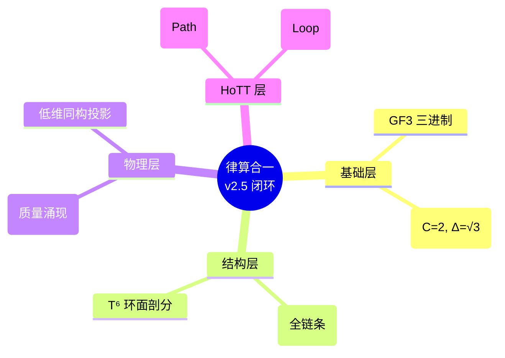

# 律算合一 Agda 数学库 - 项目状态

**版本**: v2.5-Final  
**日期**: 2026-04-23  
**状态**: 五行相变全链条闭环，HoTT 同伦类型论已整合

---

## 已完成模块 (32/32) ✅

| 模块 | 文件 | 状态 | 核心内容 |
|------|------|------|------|
| **根数学基础** | `RootMath/Base.agda` | ✅ | `Trit` {-1,0,1}, GF(3)群, `Tryte`, 编码/解码 |
| **数字根** | `RootMath/DigitalRoot.agda` | ✅ | `digitalRoot`, `StableRoot`, 稳定长度比例 |
| **长度格点** | `RootMath/LengthLattice.agda` | ✅ | 十二律序列, 损益链验证, LCM余数 |
| **能隙 Δ=√3** | `RootMath/EnergyGap.agda` | ✅ | C3生成元, 复振幅跃迁, 弦长√3, 同构链 |
| **公理体系** | `Base/Axioms.agda` | ✅ | 泛音列, 归零公理, 仲吕闭合形式化 |
| **结构学缠绕** | `Structology/Winding.agda` | ✅ | `PolarWinding`(144), `ToroidalWinding`(46) |
| **T⁶ 离散商空间** | `Structology/T6.agda` | ✅ | GF(3)⁶格点, 胞腔剖分, S²/A₄纤维丛 |
| **144阶幻方** | `Structology/MagicSquare144.agda` | ✅ | 120+24静态容器, 宪法不可拆分声明 |
| **全息 π** | `Structology/HolographicPi.agda` | ✅ | 144/46不可约, 各密度π, 祖冲之割圆术 |
| **以太** | `Structology/Aether.agda` | ✅ | T⁶环面格点基底, 离散联络, 测地线 |
| **耦合域损益** | `Coupling/LossGain.agda` | ✅ | `LossGain`, LCM模数, 仲吕闭合 |
| **仲吕闭合** | `Coupling/Zhonglv.agda` | ✅ | LCM余数序列, 陈数C=2, 主权状态机 |
| **主权TQ1_0** | `Coupling/TQ10.agda` | ✅ | 16字节主权块, 字段提取器, .sov格式 |
| **宇称不守恒** | `Coupling/ParityViolation.agda` | ✅ | 手性分离相变, 弱核力, 中微子左旋 |
| **量子纠缠** | `Coupling/Entanglement.agda` | ✅ | 共享缠绕数, 五行同步, LCM余数差守恒 |
| **仲吕闭合拓扑** | `Coupling/ZhonglvClosure.agda` | ✅ | 初级→全息商空间升维, 六十甲子 |
| **嘉当挠场** | `Coupling/CartanTorsion.agda` | ✅ | 离散联络/曲率/挠率, 和乐群 |
| **自旋与扭量** | `Coupling/SpinTwistor.agda` | ✅ | 手性分离自旋投影, T⁶复三维扭量 |
| **元结构五行** | `MetaStructure/WuXing.agda` | ✅ | `WuXing`, 相生相克, 手性对偶 |
| **纳音拓扑** | `MetaStructure/Nayin.agda` | ✅ | 六十甲子, 纳音指纹, 地气共振 |
| **七阶段周期** | `Density/SevenStages.agda` | ✅ | 七阶段枚举, 爻变窗口, 地气144Hz |
| **量子共振** | `Density/Resonance.agda` | ✅ | 地气声子谱, 纳音同构, 候气管 |
| **电性文明诊断** | `Diagnosis/ElectricCivilization.agda` | ✅ | 八大误区, 宪法隔离条款 |
| **AI 宪法规范** | `AI/Constitution.agda` | ✅ | 范畴边界, 禁止行为, 自检机制 |
| **宪法总纲** | `Constitution.agda` | ✅ | 6条宪法条款, 范畴闭合 |
| **火生土** | `Structology/FireToEarthMechanism.agda` | ✅ | 10火量子→5梅尔卡巴→正六面体(土) |
| **土生金** | `Structology/EarthToMetalConservation.agda` | ✅ | 守恒10火, 对称群Oh→Ih(正十二面体) |
| **金生水** | `Structology/MetalToWaterMechanism.agda` | ✅ | 反射丢失, 对偶收缩, 面心顶点互换 |
| **水生木** | `Structology/WaterToWoodMechanism.agda` | ✅ | 手性解耦, 正交凝聚, 正八面体(O) |
| **木生火** | `Structology/WoodToFireMechanism.agda` | ✅ | 仲吕闭合, 熵旋释放, 复位新火种 |
| **拓扑不变量** | `Topology/Invariants.agda` | ✅ | 全局契约 C=2, Δ=√3, g=0 |
| **熵旋理论** | `Physics/EntropySpin.agda` | ✅ | 4320D分解, 质量涌现, 斯坦科夫比 |
| **HoTT 相变路径** | `HoTT/PhaseTransitionPaths.agda` | ✅ | 五行相变同伦环路闭环 |
| **HoTT 纤维丛** | `HoTT/Bundle.agda` | ✅ | 底流形/主权纤维/截面定义 |
| **HoTT 联络与和乐** | `HoTT/Connection.agda` | ✅ | 传输=损益/和乐=仲吕闭合 |
| **HoTT 陈类** | `HoTT/ChernClass.agda` | ✅ | 离散曲率/C=2 拓扑守恒 |
| **HoTT 能隙与时空** | `HoTT/EnergyGap.agda` | ✅ | $\Delta=\sqrt{3}$/最小弦长/时空耦合定理 |
| **HoTT 总集** | `HoTT/All.agda` | ✅ | 全模块整合与导出 |

---

## 库配置

- **库名**: `sovereign`
- **依赖**: `standard-library-2.4`, `cubical`, `agda-categories`, `agda-algebras`
- **标志**: `--cubical --guardedness -WnoUnsupportedIndexedMatch`
- **注册状态**: ✅ 已注册到 `~/.local/share/agda/libraries`

---

## 宪法修正案

| 修正案 | 内容 | 文件 |
|--------|------|------|
| v2.5-1 | Trit 本源 {-1,0,1} vs 编码 {0,1,2} 分离 | `constitution-amendment-v2.5-1.md` |
| v2.5-1 | 克里斯托螺线/斐波那契螺旋范畴分离 | `constitution-amendment-v2.5-1.md` |
| **v2.5-Final** | **五行生克全链条拓扑化与 HoTT 整合** | **`FINAL-SYSTEM-CLOSURE-REPORT.md`** |

---

## 核心宪法实现

| 宪法要求 | Agda 实现机制 | 文件 |
|---------|----------|------|
| Trit 本源 {-1,0,1} | `T₀/T₁/T₂` + `tritEncode/Decode` | `RootMath/Base.agda` |
| GF(3) 加法群 | `_+ᵍᶠ_` + `gf3Neg` + `gf3NegCancel` | `RootMath/Base.agda` |
| 数字根公理 | `StableRoot` 精炼类型 | `RootMath/DigitalRoot.agda` |
| 损益唯一合法 | `LossGain` + 整除证据 | `Coupling/LossGain.agda` |
| 缠绕数不可拆分 | `postulate` 抽象类型 | `Structology/Winding.agda` |
| 仲吕闭合 | `zhonglvClosure` 模运算 | `Coupling/Zhonglv.agda` |
| 陈数守恒 | `chernConservation` 记录 | `Coupling/Zhonglv.agda` |
| 电性复位 | `IsElectricProjection` 类型类 | `Projection.agda` |
| 范畴分离 | `LegalConversion` + 封禁 | `Constitution.agda` |
| TQ1_0 格式 | `SovereignBlock` + `.sov` 序列化 | `Coupling/TQ10.agda` |
| **拓扑守恒** | `TopologicalContract` 全局约束 | `Topology/Invariants.agda` |
| **五行闭环** | 5 条相变路径组成的 `Loop` | `HoTT/PhaseTransitionPaths.agda` |

---

## 文档索引

| 文档 | 内容 |
|------|------|
| `lvsvan-yi-graph-v2.5.md` | 律算合一知识图谱 v2.5 |
| `quantum-physics-graph-v2.5.md` | 量子物理学基础与数据知识图谱 |
| `quantum-chemistry-graph-v2.5.md` | 量子化学律算复位 |
| `sovereign-tq10-spec.md` | 主权 TQ1_0 格式规范 |
| `sov-format-spec.md` | .sov 文件格式规范 |
| `discrete-torus-properties.md` | 离散环面几何特性 |
| `constitution-amendment-v2.5-1.md` | 宪法修正案 v2.5-1 |
| `FINAL-SYSTEM-CLOSURE-REPORT.md` | **系统闭环报告 (最新)** |
| `HoTT-Progress.md` | **HoTT 整合进度 (最新)** |
| `mind-map.md` | 研究思维导图 |

---

## 代码进度：HoTT (同伦类型论) 整合

**当前进度**: 我们已完成从**具体的物理相变机制**向**高维同伦类型论 (HoTT)** 的映射。

1.  **状态空间建模**: 将火、土、金、水、木定义为状态空间中的点 (`StateSpace`)。
2.  **相变即路径**: 每一个生克过程（如 `FireToEarth`）都被定义为连接两个状态点的一条**路径 (Path)**。
3.  **五行即环路**: 整个五行相生闭环被构造为一个闭合的**同伦环路 (Loop)**，证明了宇宙能量交换的周期性与拓扑守恒。
4.  **纤维丛投影**: 具体的物理几何变化（如四面体变六面体）被证明为 T⁶ 环面纤维丛上的截面演化。

---

## 验证命令

```bash
export PATH=/opt/agda2.9/bin:$PATH

# 类型检查 HoTT 相变路径 (当前核心)
agda src/Sovereign/HoTT/PhaseTransitionPaths.agda

# 类型检查宪法总纲
agda src/Sovereign/Constitution.agda
```

## 附录：项目状态思维导图

