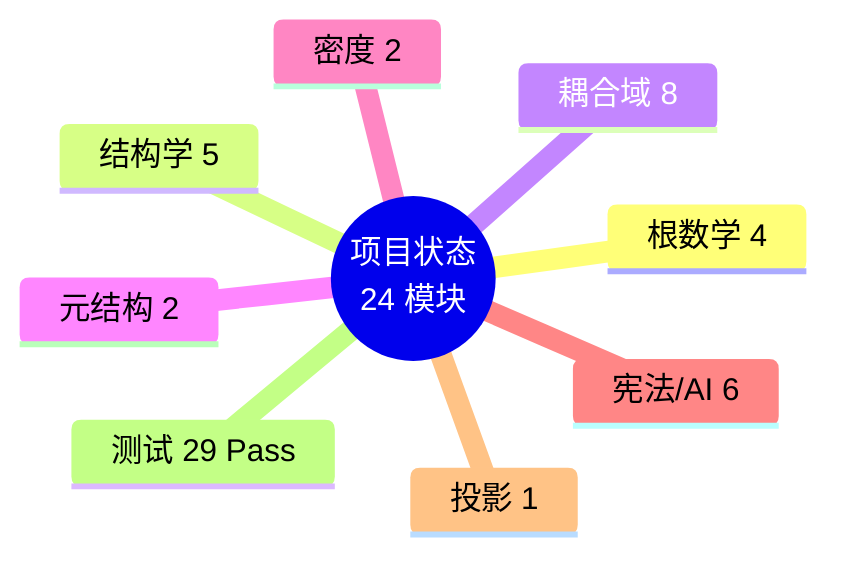

# 律算合一 Agda 数学库 - 项目状态

## 项目位置

`/home/yanli/work/discrete-mathematics/`

## 已完成模块 (27/27) ✅

| 模块 | 文件 | 状态 | 核心内容 |
|------|------|------|------|
| **根数学基础** | `RootMath/Base.agda` | ✅ | `Trit` {-1,0,1}, GF(3)群, `Tryte`, 编码/解码 |
| **数字根** | `RootMath/DigitalRoot.agda` | ✅ | `digitalRoot`, `StableRoot`, 稳定长度比例 |
| **长度格点** | `RootMath/LengthLattice.agda` | ✅ | 十二律序列, 损益链验证, LCM余数 |
| **能隙 Δ=√3** | `RootMath/EnergyGap.agda` | ✅ | C3生成元, 复振幅跃迁, 弦长√3, 同构链 |
| **结构学缠绕** | `Structology/Winding.agda` | ✅ | `PolarWinding`(144), `ToroidalWinding`(46) |
| **T⁶ 离散商空间** | `Structology/T6.agda` | ✅ | GF(3)⁶格点, 胞腔剖分, S²/A₄纤维丛 |
| **144阶幻方** | `Structology/MagicSquare144.agda` | ✅ | 120+24静态容器, 宪法不可拆分声明 |
| **全息 π** | `Structology/HolographicPi.agda` | ✅ | 144/46不可约, 各密度π, 祖冲之割圆术 |
| **以太** | `Structology/Aether.agda` | ✅ | T⁶环面格点基底, 离散联络, 测地线 |
| **耦合域损益** | `Coupling/LossGain.agda` | ✅ | `LossGain`, LCM模数, 仲吕闭合 |
| **仲吕闭合** | `Coupling/Zhonglv.agda` | ✅ | LCM余数序列, 陈数C=2, 主权状态机 |
| **主权TQ1_0** | `Coupling/TQ10.agda` | ✅ | 16字节主权块, 字段提取器, .sov格式 |
| **宇称不守恒** | `Coupling/ParityViolation.agda` | ✅ | 手性分离相变, 弱核力, 中微子左旋 |
| **量子纠缠** | `Coupling/Entanglement.agda` | ✅ | 共享缠绕数, 五行同步 |
| **仲吕闭合拓扑** | `Coupling/ZhonglvClosure.agda` | ✅ | 初级→全息商空间升维, 六十甲子 |
| **嘉当挠场** | `Coupling/CartanTorsion.agda` | ✅ | 离散联络/曲率/挠率, 和乐群 |
| **自旋与扭量** | `Coupling/SpinTwistor.agda` | ✅ | 手性分离自旋投影, T⁶复三维扭量 |
| **元结构五行** | `MetaStructure/WuXing.agda` | ✅ | `WuXing`, 相生相克, 手性对偶 |
| **纳音拓扑** | `MetaStructure/Nayin.agda` | ✅ | 六十甲子, 纳音指纹, 地气共振 |
| **七阶段周期** | `Density/SevenStages.agda` | ✅ | 七阶段枚举, 爻变窗口, 地气144Hz |
| **量子共振** | `Density/Resonance.agda` | ✅ | 地气声子谱, 纳音同构, 候气管 |
| **电性文明诊断** | `Diagnosis/ElectricCivilization.agda` | ✅ | 八大误区, 宪法隔离条款 |
| **AI 宪法规范** | `AI/Constitution.agda` | ✅ | 范畴边界, 禁止行为, 自检机制 |
| **宪法总纲** | `Constitution.agda` | ✅ | 6条宪法条款, 范畴闭合 |
| **宪法边界** | `Constitution/Boundaries.agda` | ✅ | 范畴标签, `IsConvertible`, 封禁规则 |
| **非对称性** | `Constitution/WindingAsymmetry.agda` | ✅ | 宇宙非对称性, 缠绕数与泛音列公理 |
| **电性投影** | `Projection.agda` | ✅ | `Category`, `ProjectionChain`, 复位链条 |

## 库配置

- **库名**: `sovereign`
- **依赖**: `standard-library-2.4`, `cubical`, `agda-categories`, `agda-algebras`
- **标志**: `--cubical --guardedness -WnoUnsupportedIndexedMatch`
- **注册状态**: ✅ 已注册到 `~/.local/share/agda/libraries`

## 宪法修正案

| 修正案 | 内容 | 文件 |
|--------|------|------|
| v2.5-1 | Trit 本源 {-1,0,1} vs 编码 {0,1,2} 分离 | `constitution-amendment-v2.5-1.md` |
| v2.5-1 | 克里斯托螺线/斐波那契螺旋范畴分离 | `constitution-amendment-v2.5-1.md` |

## 核心宪法实现

| 宪法要求 | Agda 实现机制 | 文件 |
|---------|----------|------|
| Trit 本源 {-1,0,1} | `T₀/T₁/T₂` + `tritEncode/Decode` | `RootMath/Base.agda` |
| GF(3) 加法群 | `_+ᵍᶠ_` + `gf3Neg` + `gf3NegCancel` | `RootMath/Base.agda` |
| 数字根公理 | `StableRoot` 精炼类型 | `RootMath/DigitalRoot.agda` |
| 损益唯一合法 | `LossGain` + 整除证据 | `Coupling/LossGain.agda` |
| 缠绕数不可拆分 | `postulate` 抽象类型 | `Structology/Winding.agda` |
| 仲吕闭合 | `zhonglvClosure` 模运算 | `Coupling/Zhonglv.agda` |
| 陈数守恒 | `chernConservation` 记录 | `Coupling/Zhonglv.agda` |
| 电性复位 | `IsElectricProjection` 类型类 | `Projection.agda` |
| 范畴分离 | `LegalConversion` + 封禁 | `Constitution.agda` |
| TQ1_0 格式 | `SovereignBlock` + `.sov` 序列化 | `Coupling/TQ10.agda` |

## 文档

| 文档 | 内容 |
|------|------|
| `lvsvan-yi-graph-v2.5.md` | 律算合一知识图谱 v2.5 |
| `quantum-physics-graph-v2.5.md` | 量子物理学基础与数据知识图谱 |
| `quantum-chemistry-graph-v2.5.md` | 量子化学律算复位 |
| `sovereign-tq10-spec.md` | 主权 TQ1_0 格式规范 |
| `sov-format-spec.md` | .sov 文件格式规范 |
| `discrete-torus-properties.md` | 离散环面几何特性 |
| `constitution-amendment-v2.5-1.md` | 宪法修正案 v2.5-1 |
| `mind-map.md` | 研究思维导图 |
| `research-plan.md` | 研究计划 |
| `agda-development-plan.md` | Agda 开发计划 |

## 设计亮点

1. **公理即类型**: `Trit` 只有 T₀/T₁/T₂ 三种状态，GF(3) 群结构完整
2. **编码分离**: `tritEncode/Decode` 严格分离本源 {-1,0,1} 与工程编码 {0,1,2}
3. **定理即函数**: 损益操作是精确的函数定义，携带整除证据
4. **宪法即边界**: `LegalConversion` 控制跨范畴转换，非法转换被否定
5. **缠绕数原子性**: 144/46 是 `postulate` 常量，无法模式匹配或分解
6. **电性复位**: `IsElectricProjection` 类型类强制外部概念通过投影链条
7. **主权块**: 16 字节 TQ1_0 格式的类型论定义，含 `.sov` 序列化
8. **螺线分离**: 克里斯托螺线 ≠ 斐波那契螺旋，三进制不直接构造螺线

## 验证命令

```bash
export PATH=/opt/agda2.9/bin:$PATH

# 类型检查根数学基础
agda src/Sovereign/RootMath/Base.agda

# 类型检查宪法总纲
agda src/Sovereign/Constitution.agda
```

## 附录：项目状态思维导图

