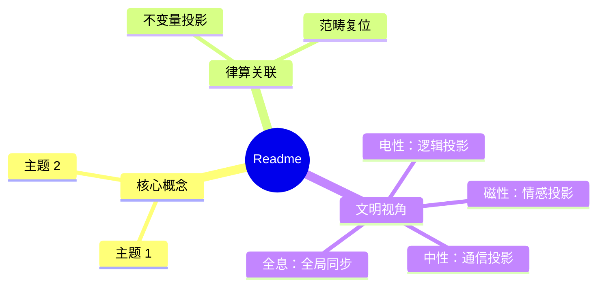

# Discrete First Principles Research Project

## Research Direction

**Discrete First Principles**: Continuity is the limiting manifestation of discreteness.

### Core Topics

1. **Discrete Quotient Spaces** - Intrinsic structure without coordinates
2. **Complex 3D / Real 6D Toroidal Geometry** - Periodic structures on torus Tⁿ
3. **Geometric Algebra** - Clifford algebras, Grassmann algebras, spinors
4. **Toroidal Topology & Topological Algebra** - Homotopy, homology, characteristic classes
5. **Discrete Toroidal Conformal Geometry** - Discrete complex analysis, conformal mappings
6. **Coordinate-Free Formulation** - Intrinsic definitions via category theory

---

## Tools & Libraries

### Installed (Agda 2.9.0 + GHC 9.14.1)

| Library | Size | Purpose |
|---|---|---|
| `standard-library (2.4)` | 23M | Base algebra, relations, induction |
| `cubical (0.9)` | 419M | HoTT, HIT, quotients, homotopy |
| `agda-categories` | 4M | Category theory, universal properties |
| `agda-algebras` | 852K | Universal algebra, algebraic structures |
| `agda-unimath` | 27M | UniMath - univalent mathematics |
| `agda-base` | 876K | Base library (experimental) |
| `transformers (0.6.3)` | - | Haskell monad transformers |

### To Be Built

| Module | Priority | Description |
|---|---|---|
| Discrete Structures | P0 | Lattices, graphs, combinatorics |
| Geometric Algebra | P0 | Clifford/Grassmann algebras |
| Toroidal Geometry | P0 | Intrinsic Tⁿ, periodic structures |
| Discrete Conformal | P1 | Discrete complex analysis |
| Fiber Bundles | P1 | Fibration, local trivialization |
| Homological Algebra | P1 | Chain complexes, boundary operators |

---

## Project Structure

```
discrete-mathematics/
├── README.md              # This file
├── research-plan.md       # Detailed research phases
├── mind-map.md            # Visual mind map (Markdown)
├── src/                   # Agda source files
│   ├── Base/             # Discrete foundations
│   ├── Algebra/          # Geometric algebra
│   ├── Torus/            # Toroidal geometry
│   ├── Topology/         # Homotopy, homology
│   ├── Conformal/        # Discrete conformal geometry
│   └── Category/         # Category-theoretic tools
├── lib/                  # Local Agda libraries
└── notes/                # Research notes
```

---

## Installation

```bash
export PATH=/opt/agda2.9/bin:$PATH
agda --version  # Agda 2.9.0-659c761
```

---

## References

- Voevodsky, V. - Univalent Foundations
- Hestenes, D. - New Foundations for Classical Mechanics (Geometric Algebra)
- Mac Lane, S. - Categories for the Working Mathematician
- Bookstein, F. - Homological Algebra


## 附录：Readme 思维导图


