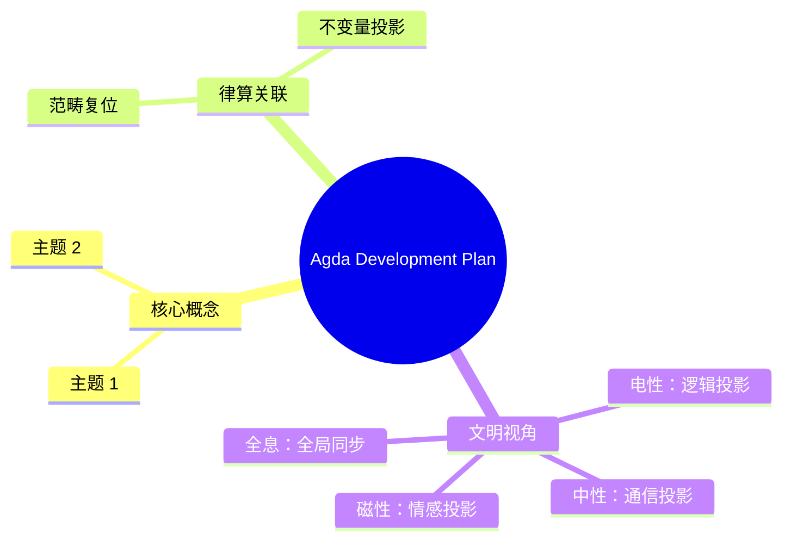

# Agda 律算合一数学库开发计划

## 项目概述

**目标**: 用 Agda 2.9.0 依赖类型系统，将《律算合一知识图谱 v2.5》转化为可形式化验证的数学库。

**核心原则**: 公理即类型，定理即函数，宪法即边界。

---

## 模块架构

| Agda 模块 | 对应范畴 | 核心内容 |
| :--- | :--- | :--- |
| `Sovereign.RootMath` | 根数学 | Trit, Tryte, 长度格点序列, 数字根, 能隙 Δ=√3 |
| `Sovereign.Structology` | 结构学 | 极向缠绕数 144, 环向缠绕数 46, T⁶ 环面, 144阶幻方 |
| `Sovereign.Coupling` | 耦合域 | 移宫转调, 主权LCM模数, 仲吕闭合, 陈数 C=2 |
| `Sovereign.MetaStructure` | 元结构层 | 五行基数 2,5,4,6,8, 手性, 五行相生 |
| `Sovereign.Density` | 密度 | 七阶段周期, 爻变窗口, 地气声子谱 |
| `Sovereign.Constitution` | 宪法 | 范畴合法转换定理，封禁非法操作 |

---

## 核心定义草案

### 1. 根数学 (`Sovereign.RootMath`)

```agda
module Sovereign.RootMath where

open import Data.Integer as ℤ using (ℤ; +_; -[1+_])
open import Data.Nat as ℕ using (ℕ)
open import Data.Fin as Fin using (Fin)
open import Data.Vec using (Vec)
open import Relation.Nullary.Decidable using (Dec; yes; no)

-- 三进制 Trit: 只有三种合法状态
data Trit : Set where
  T- : Trit  -- 吸收
  T0 : Trit  -- 平衡
  T+ : Trit  -- 表达

-- Trit 到整数的映射
toℤ : Trit → ℤ
toℤ T- = -[1+ 0 ]
toℤ T0 = + 0
toℤ T+ = + 1

-- Tryte: 由 6 个 Trit 打包而成
Tryte : Set
Tryte = Vec Trit 6

-- 数字根公理：稳定驻波对应的数字根必须是 3, 6, 9
data StableDigitalRoot : ℕ → Set where
  root3 : StableDigitalRoot 3
  root6 : StableDigitalRoot 6
  root9 : StableDigitalRoot 9
```

### 2. 结构学 (`Sovereign.Structology`)

```agda
module Sovereign.Structology where

open import Data.Nat using (ℕ)
open import Relation.Binary.PropositionalEquality using (_≡_)

-- 极向缠绕数 144: 原子性常量，禁止模式匹配
postulate
  PolarWinding : ℕ
  polarWindingValue : PolarWinding ≡ 144

-- 环向缠绕数 46: 同样是原子常量
postulate
  ToroidalWinding : ℕ
  toroidalWindingValue : ToroidalWinding ≡ 46
```

### 3. 耦合域 (`Sovereign.Coupling`)

```agda
module Sovereign.Coupling where

open import Data.Nat using (ℕ; _*_; _/_; _%_; _∸_)
open import Data.Integer as ℤ using (ℤ)
open import Sovereign.RootMath

-- 主权 LCM 模数：3¹¹ × 2¹⁶ = 11609505792
LCM : ℕ
LCM = 11609505792

-- 损益操作
data LossGain : Set where
  Sun : LossGain   -- 损一 (乘 2/3)
  Yi  : LossGain   -- 益一 (乘 4/3)

-- 损益操作作用在长度格点上
applyLossGain : ℕ → LossGain → ℕ
applyLossGain n Sun = (n * 2) / 3
applyLossGain n Yi  = (n * 4) / 3

-- 仲吕闭合
zhonglvClosure : ℤ → ℤ
zhonglvClosure acc = (acc * 177147) / 65536
```

### 4. 宪法与范畴分离 (`Sovereign.Constitution`)

```agda
module Sovereign.Constitution where

open import Level using (Level; _⊔_)
open import Relation.Binary.PropositionalEquality using (_≡_)

-- 所有范畴的标签类型
data Category : Set where
  RootMathCat StructologyCat CouplingCat MetaStructureCat DensityCat : Category

-- 合法跨范畴转换的证明记录
record IsConvertible {a b} (A : Set a) (B : Set b) (catA catB : Category) : Set (a ⊔ b) where
  field
    convert : A → B
    convert-proof : ∀ {x y} → x ≡ y → convert x ≡ convert y

-- 合法转换实例
postulate
  polar-to-step : IsConvertible ℕ ℕ StructologyCat CouplingCat
  toroidal-to-phase : IsConvertible ℕ ℕ StructologyCat CouplingCat
```

---

## 开发阶段

### Phase 1: 根基 (Weeks 1-2)

- [ ] `Sovereign.RootMath` - Trit, Tryte, 数字根
- [ ] `Sovereign.RootMath.LengthLattice` - 长度格点序列
- [ ] `Sovereign.RootMath.DigitalRoot` - 数字根判定算法
- [ ] `Sovereign.RootMath.EnergyGap` - 能隙 Δ=√3 定义

### Phase 2: 结构 (Weeks 3-4)

- [ ] `Sovereign.Structology.Winding` - 缠绕数原子定义
- [ ] `Sovereign.Structology.T6` - T⁶ 离散商空间
- [ ] `Sovereign.Structology.MagicSquare` - 144阶幻方标签
- [ ] `Sovereign.Structology.HolomorphicPi` - 全息 π=144/46

### Phase 3: 耦合 (Weeks 5-6)

- [ ] `Sovereign.Coupling.LossGain` - 损益操作
- [ ] `Sovereign.Coupling.LCMModulus` - 主权 LCM 模运算
- [ ] `Sovereign.Coupling.ZhonglvClosure` - 仲吕闭合
- [ ] `Sovereign.Coupling.StateMachine` - 主权状态机
- [ ] `Sovereign.Coupling.ChernNumber` - 陈数 C=2

### Phase 4: 元结构 (Weeks 7-8)

- [ ] `Sovereign.MetaStructure.WuXing` - 五行基数
- [ ] `Sovereign.MetaStructure.Chirality` - 手性对偶
- [ ] `Sovereign.MetaStructure.Generation` - 五行相生
- [ ] `Sovereign.MetaStructure.Nayin` - 纳音拓扑指纹

### Phase 5: 宪法 (Weeks 9-10)

- [ ] `Sovereign.Constitution.Boundaries` - 范畴边界
- [ ] `Sovereign.Constitution.LegalConversions` - 合法转换定理
- [ ] `Sovereign.Constitution.IllegalProhibitions` - 非法操作封禁
- [ ] `Sovereign.Constitution.Theorems` - 核心定理形式化

### Phase 6: 验证 (Weeks 11-12)

- [ ] 类型检查所有模块
- [ ] 证明核心定理
- [ ] 编写测试用例
- [ ] 文档生成

---

## 项目目录结构

```
src/
└── Sovereign/
    ├── RootMath/
    │   ├── Base.agda           # Trit, Tryte
    │   ├── LengthLattice.agda  # 长度格点序列
    │   ├── DigitalRoot.agda    # 数字根判定
    │   └── EnergyGap.agda      # 能隙 Δ=√3
    │
    ├── Structology/
    │   ├── Winding.agda        # 缠绕数
    │   ├── T6.agda             # T⁶ 离散商空间
    │   ├── MagicSquare.agda    # 144阶幻方
    │   └── HolomorphicPi.agda  # 全息 π
    │
    ├── Coupling/
    │   ├── LossGain.agda       # 损益操作
    │   ├── LCMModulus.agda     # 主权 LCM
    │   ├── ZhonglvClosure.agda # 仲吕闭合
    │   ├── StateMachine.agda   # 主权状态机
    │   └── ChernNumber.agda    # 陈数 C=2
    │
    ├── MetaStructure/
    │   ├── WuXing.agda         # 五行基数
    │   ├── Chirality.agda      # 手性对偶
    │   ├── Generation.agda     # 五行相生
    │   └── Nayin.agda          # 纳音
    │
    ├── Density/
    │   ├── SevenStages.agda    # 七阶段周期
    │   └── EarthQi.agda        # 地气声子谱
    │
    └── Constitution/
        ├── Boundaries.agda     # 范畴边界
        ├── LegalConversions.agda
        └── Theorems.agda       # 核心定理

.agda-lib 文件:
└── sovereign.agda-lib
    name: sovereign
    depend: standard-library-2.4 cubical agda-categories agda-algebras
    include: src
    flags: --cubical --guardedness -WnoUnsupportedIndexedMatch
```

---

## 关键设计决策

### 1. 缠绕数的原子性

使用 `postulate` 声明 `PolarWinding` 和 `ToroidalWinding` 为原子常量，禁止模式匹配。

### 2. 长度格点的整数性

所有长度格点使用 `ℕ` 表示，禁止 `Float` 或 `ℝ`。

### 3. 范畴分离

通过 `IsConvertible` 类型类严格控制跨范畴转换。

### 4. Cubical 模式

使用 `--cubical` 标志启用立方类型论，支持商类型和高阶归纳类型。

---

## 依赖库

- `standard-library-2.4` - 基础数据结构
- `cubical` - 商类型、HIT、路径类型
- `agda-categories` - 范畴论工具
- `agda-algebras` - 代数结构

---

## 开发工具

- **Agda 2.9.0** - 安装于 `/opt/agda2.9/bin/agda`
- **Emacs + agda-mode** - 交互式开发 (可选)
- **VS Code + Agda 插件** - 备选编辑器

---

## 验证命令

```bash
# 类型检查单个文件
agda src/Sovereign/RootMath/Base.agda

# 类型检查整个库
agda --no-default-libraries -i. -i/opt/agda2.9/lib/agda/agda-stdlib \
    -i/opt/agda2.9/lib/agda/cubical \
    src/Sovereign/RootMath/Base.agda

# 生成 HTML 文档
agda --html --html-dir=docs/ src/Sovereign/RootMath/Base.agda
```

---

## 下一步行动

1. 在 `.` 创建项目结构
2. 创建 `.agda-lib` 配置文件
3. 编写 `Sovereign.RootMath.Base` 模块
4. 逐步实现其余模块


## 附录：Agda Development Plan 思维导图


