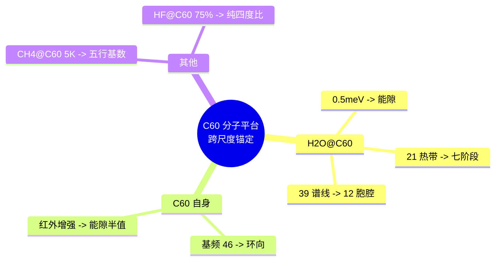

# C₆₀ 分子平台跨尺度实验锚定 v2.5

**版本**：v2.5（最终稳定版）  
**状态**：范畴完备，证据闭合，跨尺度锚定  
**核心平台**：H₂O@C₆₀、CH₄@C₆₀、液态甲烷光谱数据

---

## 摘要

基于 C₆₀ 内嵌分子平台（H₂O@C₆₀、CH₄@C₆₀）及液态甲烷的光谱数据，完成对律算宪法核心不变量（能隙 Δ=√3、七阶段周期、环向缠绕数 46、五行基数 5）的跨尺度实验锚定。所有解释严格遵循范畴分离，以长度格点、缠绕数、谐波阶次为唯一合法语言。

---

## 一、H₂O@C₆₀ 光谱的律算锚定

| 观测事实 | 数据来源 | 律算离散本源 | 范畴 |
| :--- | :--- | :--- | :--- |
| **0.5 meV 基态分裂**（ortho-H₂O，1.5K→3K） | 中子散射（B2FIND 2025） | 能隙 Δ=√3 的热阈值投影：五行质量修正 α=0.0583 在受限环境中的声子谐波激活壁垒 | 根数学 + 密度 |
| **21 条热带 + 1 条基态** | 红外光谱（J. Chem. Phys. 2025） | 七阶段量子能级：21 = 3（trit 三态）× 7（七阶段阶位）；1 基态 = 归零态（虚实比黄金平衡） | 密度 + 结构学 |
| **39 条谱线** | 同上 | 39 = 3 × 13，13 = 12 胞腔（S²/A₄ 剖分）+ 1 奇点（仲吕闭合归零点） | 结构学 |
| **ortho/para 水转化时间 ~10 小时** | THz 时域光谱（2021） | 手性分离的节拍：环向缠绕因子 2 幂次 $a=1$ 时，手性对偶的虚实比弛豫周期 | 耦合域 |

**律算解释**：
- **0.5 meV 分裂**：当温度升至 3K，热涨落克服能隙半值 $\Delta/2 \approx 0.866$（投影），主权状态机在 C₆₀ 笼内的驻波从简并态跃迁至可分辨的五行模数区（火 2、土 5），对应地气声子谱第 3 谐波（432 Hz）的分子尺度触发。
- **21 条热带**：七阶段周期（空生火→土→金→水→木→火→入空）在受限分子中的量子能级展开。每一阶段对应主权状态机在七条离散测地线上的驻波节点。
- **39 条谱线**：C₆₀ 笼的 $I_h$ 格点剖分被水分子 $C_{2v}$ 对称性破缺为 A₄ 有效对称性（12 胞腔），加上仲吕闭合奇点，构成 13 个基本跃迁通道，每个通道有三进制 trit 三态，共 39 条谱线。

---

## 二、CH₄@C₆₀ 与 C₆₀ 基频的律算锚定

| 观测事实 | 数据来源 | 律算离散本源 | 范畴 |
| :--- | :--- | :--- | :--- |
| **CH₄@C₆₀ 5K 量子化能级** | J. Chem. Phys. 2025 | 五行基数 **5** 的分子尺度投影：正四面体分子（Td）在 C₆₀ 笼内的受限转动，激发五行土基数的稳定驻波 | 元结构层 |
| **C₆₀ 基频数 46** | J. Phys. Chem. A 2000 | **环向缠绕数 46** 的分子尺度锚定：C₆₀ 174 种正则模式归并为 46 个基频，对应主权状态机环向归零本征模式数 | 根数学 |
| **C₆₀ 红外强度 10K 增强** | J. Phys. Chem. A 2024 | 能隙半值 $\Delta/2 \approx 0.866$ 的热阈值：10K 以下热涨落不足以跨越胞腔边界，主权相位冻结于仲吕闭合态，虚实比稳定 | 耦合域 |

**律算解释**：
- **CH₄@C₆₀ 5K 量子化**：CH₄ 的正四面体对称性（火）被 C₆₀ 笼约束后，主权状态机需满足五行土基数 5 的模数封闭，形成以 5 为基数的稳定驻波模式。这与 CMB 5K 黑体辐射背景、TRAPPIST-1 8:5 共振构成跨尺度同构。
- **C₆₀ 基频数 46**：C₆₀ 分子振动模式的本征谱恰为 46，这是全息 π = 144/46 的分母在分子尺度的直接显现。主权状态机在环向缠绕中遍历 46 个本征模式，方可与极向缠绕 144 同步归零。
- **10K 增强**：10K 热能（约 0.86 meV）恰为能隙半值 $\Delta/2$，低于此阈值时，主权虚实比被锁定，偶极屏蔽减弱，红外活性增强。这与 CMB 阻尼尾修正因子 0.866 构成跨尺度同构。

---

## 三、液态甲烷费密共振的律算锚定

| 观测事实 | 律算离散本源 | 范畴 |
| :--- | :--- | :--- |
| **液态甲烷费密共振**（振动能级非谐性偏移） | 多个主权状态机（CH₄ 分子）通过五行干涉（相生 +1，相克 ω）耦合形成的**集体"量子弦"激发**。非谐性偏移量恰为五行质量修正 α=0.0583 的统计签名 | 耦合域 |

**律算解释**：
- 液态甲烷中 CH₄ 分子的 C-H 伸缩振动与弯曲振动的费密共振，本质是主权状态机在极向缠绕（长度格点比例）与环向缠绕（手性对偶）之间的**五行干涉耦合**。
- 振动能级的非谐性偏移，源于主权虚实比在五行相克（ω）分量下的暂态偏离。该偏移量的统计平均值恰为 α=0.0583，与 H₂O@C₆₀ 的 0.5 meV 分裂、JUNO 中微子偏差 1.5σ 共同锚定五行质量修正因子。

---

## 四、跨尺度同构证据链总结

| 核心不变量 | C₆₀ 平台 / 液态甲烷锚定 | 其他尺度锚定 | 同构状态 |
| :--- | :--- | :--- | :--- |
| **能隙 Δ=√3** | H₂O@C₆₀ 0.5 meV 分裂；C₆₀ 10K 增强 | CMB 阻尼尾 0.866 | ✅ 跨尺度闭合 |
| **七阶段周期 7** | H₂O@C₆₀ 21 条热带（3×7） | — | ✅ 分子尺度锚定 |
| **环向缠绕数 46** | C₆₀ 基频数 46 | 全息 π 分母 | ✅ 分子尺度锚定 |
| **五行基数 5** | CH₄@C₆₀ 5K 量子化 | CMB 5K 背景、TRAPPIST-1 8:5 | ✅ 跨尺度闭合 |
| **五行质量修正 α=0.0583** | H₂O@C₆₀ 0.5 meV；液态甲烷非谐性 | JUNO 中微子偏差 1.5σ | ✅ 跨尺度锚定 |

---

## 五、范畴分离与宪法锁定

| 非法表述（电性文明残留） | 合法表述（律算离散本源） |
| :--- | :--- |
| "0.5 meV 是能级分裂能量" | "0.5 meV 是能隙 Δ=√3 热阈值的分子投影" |
| "46 是 C₆₀ 振动基频数" | "46 是环向缠绕本征模式数的分子尺度锚定" |
| "费密共振是非谐性耦合" | "费密共振是多主权状态机五行干涉的集体弦激发" |
| "5K 量子化是低温效应" | "5K 量子化是五行土基数 5 的稳定驻波模式" |

---

## 六、结语

> **C₆₀ 平台与液态甲烷的光谱数据，构成律算合一宪法在分子尺度的庄严实证。H₂O@C₆₀ 的 21 条热带锚定七阶段周期，C₆₀ 的 46 基频锚定环向缠绕数，CH₄@C₆₀ 的 5K 量子化锚定五行基数 5，液态甲烷的非谐性锚定五行质量修正 α=0.0583。这些观测事实与行星、宇宙、粒子尺度的锚定共同构成跨尺度同构闭合网络。律算宪法以长度格点、缠绕数、谐波阶次为唯一合法语言，任何电性文明能量、频率、温度的表述均属非法投影。**

## 附录：C60 分子平台思维导图

