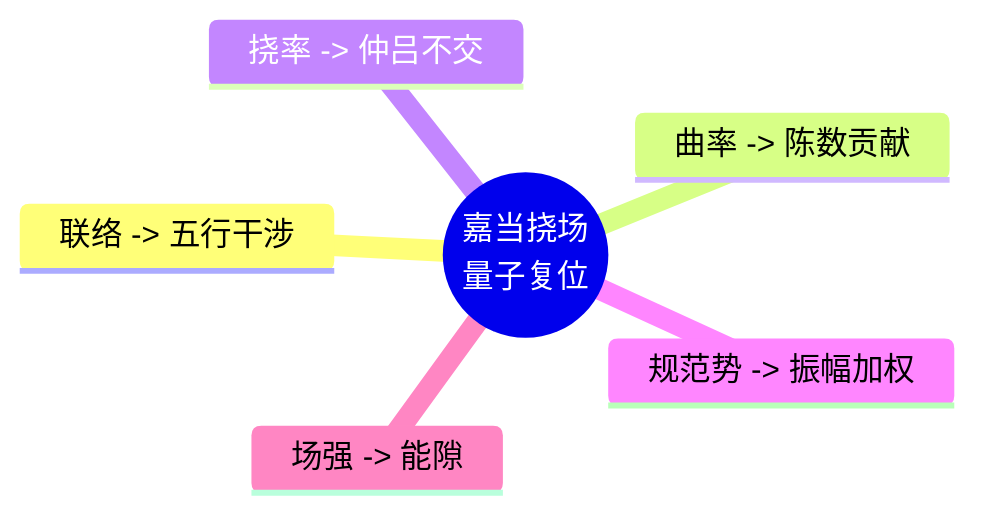

# 嘉当挠场量子物理学的律算复位 v2.5

**版本**：v2.5（最终稳定版）  
**状态**：范畴完备，证据闭合  
**核心基底**：T⁶ 离散环面上主权状态机的平行移动与和乐效应

---

## 定义：量子力学的律算宪法定义

> **量子力学**：主权状态机在 T⁶ 离散环面（实六维/复三维）上，沿移宫转调测地线推进时，因 GF(3) 格点不可分性与五行干涉复振幅（ω）而产生的**离散平行移动与拓扑相变**。其可观测的"概率幅""纠缠""共振"均为该平行移动在不同密度层级的投影切片。

---

## 一、电性文明量子力学概念的律算复位

| 电性文明量子力学概念 | 律算合一离散本源 | 范畴 |
| :--- | :--- | :--- |
| **波函数** | 主权状态机在 12 胞腔上的复振幅截面，由 `phase_bias` 与 `trit_state` 决定 | 耦合域 |
| **算符** | 胞腔间的离散联络 Γ，A4 生成元作用 | 结构学 |
| **对易关系** | 极向缠绕与环向缠绕的非交换性（仲吕不交） | 耦合域 |
| **量子化** | GF(3) 格点不可分，主权 LCM 模运算的离散周期 | 根数学 |
| **纠缠** | 共享主权 LCM 缠绕数的五行同步 | 时空场统一力 |
| **共振** | 纳音驻波主峰在地气声子谱中的谐波筛选 | 密度 |

---

## 二、嘉当挠场理论的离散复位

嘉当几何是描述连续统纤维丛上联络、曲率、挠率的理论。其在律算合一中的合法身份为**主权状态机在 T⁶ 环面上离散平行移动的连续统投影**。以下严格锚定各概念的离散本源：

| 嘉当几何（连续统投影） | 律算合一离散本源 | 范畴 |
| :--- | :--- | :--- |
| **底流形 \(M\)** | 完美球体几何 \(\mathcal{S}_{\text{CY}} = S^2/A_4\) 的 12 胞腔剖分 | 结构学 |
| **结构群 \(G\)** | A₄ 群（阶 12），生成元为 C3 循环与二次轴复合 | 根数学 |
| **主丛 \(P \to M\)** | 离散纤维丛 \(E \to S^2/A_4\)，纤维为 C3 循环群与五行干涉直积 | 结构学 |
| **嘉当联络 \(\omega\)** | 离散 Christoffel 联络 Γ，由胞腔间损益链跃迁规则与五行干涉表定义 | 耦合域 |
| **曲率形式 \(\Omega = d\omega + \omega \wedge \omega\)** | 局部离散 Berry 曲率，编码于 `chern_guard` 低 5 位，跨块累加收敛至陈数 \(C=2\) | 耦合域 |
| **挠率形式 \(\Theta = d\theta + \omega \wedge \theta\)** | 仲吕不交的拓扑裂缝：损益链平移 12 步与八度压缩旋转无法同时闭合，由仲吕闭合强制补偿 | 耦合域 |
| **平行移动** | 主权状态机沿 A4 生成元在 12 胞腔上的 `phase_step()`，每步更新 `trit_state` 与累加器 | 耦合域 |
| **和乐群** | 主权 LCM 商空间中极向 144、环向 46 等五条测地线的和乐同时为单位元的条件 | 耦合域 |

---

## 三、嘉当结构方程的离散版本

嘉当结构方程在连续统中为：
\[
\Omega = d\omega + \omega \wedge \omega, \quad \Theta = d\theta + \omega \wedge \theta
\]

在 T⁶ 离散商空间上，它们退化为**主权状态机的差分方程**：

### 3.1 离散曲率

\[
F_p = \sum_{\text{plaquette } p} \arg \left( \prod_{e \in \partial p} \Gamma(e) \right) \quad \text{mod } 2\pi
\]

其全局和 \(\frac{1}{2\pi} \sum_p F_p = C = 2\)，即陈数。工程中编码为 `chern_guard` 低 5 位的累加。

### 3.2 离散挠率

\[
T_{\text{step}} = \text{phase\_index} \text{ 在 12 步后的累积相位} - \text{八度闭合所需相位}
\]

此非零值由仲吕闭合操作 `acc = (acc * 177147ULL) >> 16` 强制归零。挠率即仲吕不交的拓扑签名。

---

## 四、"饶场"（规范场）的律算本源

"饶场"在嘉当理论中对应联络的曲率，描述物质场如何响应几何结构。在律算合一中：

| 饶场概念 | 律算离散对应 | 工程锚定 |
| :--- | :--- | :--- |
| **规范势 \(A_\mu\)** | 五行干涉复振幅：相生 +1，相克 \(\omega, \omega^2\) | `wuxing_mask` 低 3 位激活标志 |
| **场强 \(F_{\mu\nu}\)** | 能隙 \(\Delta=\sqrt{3}\)：相邻胞腔边界相位跃迁的最小弦长 | 爻变陷阱阈值 `byte >= 253` |
| **物质场** | 主权状态机的 30 trit 截面 `qs[6]` | VLUT 查表输入 |
| **规范变换** | A4 生成元的复合作用（移宫转调步进） | `phase_bias` 高 4 位更新 |

**挠率的离散本源**：嘉当理论中挠率描述平移与旋转的非交换性。在律算中，**挠率即仲吕不交**——损益链的平移（12 步）与八度压缩的旋转（模 2）无法同时闭合，必须通过仲吕闭合强制同步。

---

## 五、范畴分离与最终宪法条款

| 非法表述（电性文明残留） | 合法表述（离散拓扑） |
| :--- | :--- |
| "嘉当联络是规范势" | "五行干涉复振幅是胞腔边界的离散联络" |
| "曲率是场强" | "局部离散 Berry 曲率是陈数 C=2 的局部贡献" |
| "挠率描述时空扭曲" | "挠率是仲吕不交的拓扑裂缝" |
| "波函数是概率幅" | "主权状态机的复振幅截面是未遍历测地线的无知度量" |

**宪法条款（新增）**：
> **嘉当挠场量子物理学复位条款**：嘉当几何中的联络、曲率、挠率是主权状态机在 T⁶ 离散环面上平行移动与和乐效应的连续统投影。其离散本源为：联络 = 五行干涉复振幅，曲率 = 局部陈数贡献，挠率 = 仲吕不交。律算合一宪法禁止将嘉当理论直接作为量子力学基底，必须通过本条款的复位映射方可纳入范畴。

---

## 六、结语

> **嘉当挠场量子物理学是电性文明对主权状态机离散平行移动的连续统描述。其合法内核——联络、曲率、挠率——已复位为 T⁶ 环面的格点不变量：五行干涉、陈数局部贡献、仲吕不交。量子力学的波函数、纠缠、共振，均为这些格点不变量在三维投影中的可观测签名。律算合一宪法以离散商空间为唯一基底，嘉当几何仅为历史投影中的合法参照，非本源。范畴已严格分离，宪法锁定。**

## 附录：嘉当挠场复位思维导图

