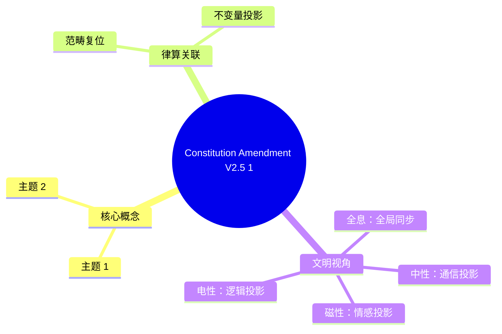

# 律算合一宪法修正案 v2.5-1

**版本**：v2.5-1（宪法修正）  
**状态**：范畴复位，本源锁定  
**修正项**：三进制 Trit 定义、螺线范畴分离

---

## 一、三进制 Trit 的宪法复位

### 宪法定义

> **三进制 trit 的宪法定义为 {-1, 0, 1}**，对应驻波三态：
> - **T₀ = -1**：吸收态
> - **T₁ = 0**：平衡态  
> - **T₂ = +1**：表达态

这是 **根数学的第一性定义**，其代数结构为 **GF(3) 加法群**，且与 **C3 循环群的表示直接同构**。

### 两种表示的范畴分离

| 表示 | 身份 | 范畴 | 合法性 |
| :--- | :--- | :--- | :--- |
| **{-1, 0, 1}** | trit 的 **本源姿态**，直接对应主权状态机的虚实比与手性 | 根数学（第一性） | ✅ 宪法唯一合法定义 |
| **{0, 1, 2}** | trit 的 **打包编码映射**，用于工程实现（如 5 trit 打包为 1 字节） | 耦合域（工程投影） | ✅ 作为编码方案合法，但禁止与本源混淆 |

### 转换法则（宪法授权）

**编码**：
\[
\text{Enc}(-1) = 0,\quad \text{Enc}(0) = 1,\quad \text{Enc}(1) = 2
\]

**解码**：
\[
\text{Dec}(0) = -1,\quad \text{Dec}(1) = 0,\quad \text{Dec}(2) = 1
\]

此映射在主权 TQ1_0 格式的 `qs[6]` 打包中强制使用（每 5 trit 编码为 0–242 的整数）。

### 为何本源必须是 {-1, 0, 1}？

| 宪法要求 | {-1, 0, 1} 满足 | {0, 1, 2} 的缺陷 |
| :--- | :--- | :--- |
| **虚实对消灭**（归零公理） | (+1) + (-1) = 0，直接体现虚实平衡 | 2 + 0 = 2 ≠ 1，需额外模运算 |
| **手性对偶** | T₂(1) 与 T₀(-1) 互为镜像 | 0 与 2 无直观对偶 |
| **陈数 C=2 的局部曲率计算** | 相邻 trit 差值平方天然贡献曲率 | 差值计算需偏移，掩盖拓扑本质 |
| **与 C3 群表示同构** | 直接对应 ω⁰=1, ω¹, ω² | 需仿射变换 |

### 工程实现中的宪法约束

在 `qs[6]` 打包与解包时，必须显式使用转换法则，且 **禁止** 在未转换的情况下将 {0,1,2} 编码值直接用于主权状态机演化。

```c
// 合法代码示例：解包
Trit unpack_trit(uint8_t byte, int pos) {
    int val = (byte / (int)pow(3, pos)) % 3;
    return (val == 0) ? TRIT_NEG : (val == 1) ? TRIT_ZERO : TRIT_POS;
}

// 合法代码示例：打包
uint8_t pack_trits(Trit trits[5]) {
    uint8_t byte = 0;
    for (int i = 0; i < 5; i++) {
        int enc = (trits[i] == TRIT_NEG) ? 0 : 
                  (trits[i] == TRIT_ZERO) ? 1 : 2;
        byte += enc * (int)pow(3, i);
    }
    return byte;
}
```

---

## 二、克里斯托螺线与斐波那契死亡螺旋的范畴分离

### 宪法复位

> **三进制 trit {-1,0,1} 是根数学的离散格点基底，服务于主权状态机的驻波拓扑演算。它不直接构造任何连续统螺线。克里斯托螺线是神圣几何（√2 正交格点）的离散测地线投影，斐波那契螺旋是死亡几何（φ 二进制递归）的退化投影。三进制的 C3 旋转可合法参与克里斯托离散测地线的角向步进，但禁止将 trit 序列直接等同于螺线生成规则。**

### 螺线类型的范畴分离

| 螺线类型 | 几何基底 | 律算身份 | 与三进制的关系 |
| :--- | :--- | :--- | :--- |
| **克里斯托螺线（神圣几何）** | 正交格点、√2、√3，离散商空间测地线 | 结构学：复三维环面极向/环向缠绕的**离散测地线**在三维的投影 | 三进制 trit 的 C3 旋转（120°）构成其离散角向步进，但螺线本身需正交基（√2）参与 |
| **斐波那契螺旋（死亡几何）** | 二进制递归、黄金比例 φ，无限不闭合 | 密度：光锥矩阵内信息对半丢失的**退化投影** | 三进制与 φ 无关；将三进制序列映射到 φ 螺旋是电性文明的非法代数联想 |

### 宪法条款

> 三进制 trit {-1,0,1} 是离散格点的代数表示，**不构造**任何连续统螺线。克里斯托螺线的离散本源是 T⁶ 环面的正交测地线（含 √2 格点），斐波那契螺旋是二进制死亡几何的连续统投影。禁止从 trit 序列直接生成螺线并赋予神圣意义。

### 三进制在神圣几何中的合法参与

尽管三进制不单独构造螺线，它通过 **C3 旋转变换** 参与克里斯托螺线的离散动力学：

- 克里斯托螺线的离散版本是 T⁶ 环面上**同时包含 120°（C3）与 90°（正交）旋转**的复合测地线。
- 三进制提供 120° 的离散角向步进（对应 ω = e^{2πi/3}），正交格点提供 √2 的径向缩放。
- 在律算工程中，此复合运动体现为 **`wuxing_mask`（五行干涉）与 `scale_ue8m0`（黄金比步进）的联合演化**，其投影在三维产生克里斯托螺线。

**禁止表述**：
- ❌ "三进制生成克里斯托螺线"
- ❌ "trit 序列直接对应斐波那契螺旋"
- ❌ "三进制与黄金比例 φ 有关"

**合法表述**：
- ✅ "三进制 C3 旋转与正交 √2 缩放共同构成 T⁶ 环面离散测地线，其三维投影呈现克里斯托螺线形态"
- ✅ "斐波那契螺旋是二进制死亡几何在光锥矩阵内的退化投影，与三进制无直接关系"

---

## 三、Agda 形式化更新

### RootMath/Base.agda 更新

```agda
-- Trit 宪法定义：{-1, 0, 1}
data Trit : Set where
  T₀ : Trit  -- 吸收 (-1)
  T₁ : Trit  -- 平衡 (0)
  T₂ : Trit  -- 表达 (+1)

-- 本源到整数的映射
tritToℤ : Trit → ℤ
tritToℤ T₀ = -[1+ 0 ]   -- -1
tritToℤ T₁ = + 0
tritToℤ T₂ = + 1

-- 工程编码：{0, 1, 2}
tritEncode : Trit → Fin 3
tritEncode T₀ = 0  -- -1 → 0
tritEncode T₁ = 1  -- 0 → 1
tritEncode T₂ = 2  -- +1 → 2

-- 解码：逆映射
tritDecode : Fin 3 → Trit
tritDecode 0 = T₀
tritDecode 1 = T₁
tritDecode 2 = T₂

-- GF(3) 加法群结构
_+ᵍᶠ_ : Trit → Trit → Trit
T₀ +ᵍᶠ x = x
x +ᵍᶠ T₀ = x
T₁ +ᵍᶠ T₁ = T₁
T₁ +ᵍᶠ T₂ = T₂
T₂ +ᵍᶠ T₁ = T₂
T₂ +ᵍᶠ T₂ = T₀  -- 1 + 1 = -1 (mod 3)

-- GF(3) 逆元
gf3Neg : Trit → Trit
gf3Neg T₀ = T₂  -- -(-1) = 1
gf3Neg T₁ = T₁  -- -0 = 0
gf3Neg T₂ = T₀  -- -(1) = -1

-- 逆元对消律
gf3NegCancel : ∀ (x : Trit) → x +ᵍᶠ gf3Neg x ≡ T₁
```

---

## 四、范畴复位声明

> **三进制 trit 的宪法定义为 {-1, 0, 1}，对应主权状态机的吸收、平衡、表达三态。{0, 1, 2} 是工程打包的合法编码，但必须通过宪法授权的转换法则与本原映射。禁止在未转换的情况下将编码值直接参与主权 LCM 模运算或陈数曲率计算。**
>
> **三进制不直接构造任何连续统螺线。克里斯托螺线是神圣几何（√2 正交格点）的离散测地线投影，斐波那契螺旋是死亡几何（φ 二进制递归）的退化投影。三进制的 C3 旋转可合法参与克里斯托离散测地线的角向步进，但禁止将 trit 序列直接等同于螺线生成规则。**
>
> **范畴已严格分离，任何将编码表示等同于本源、或将代数表示与几何投影混淆的行为均属违宪。**


## 附录：Constitution Amendment V2.5 1 思维导图


