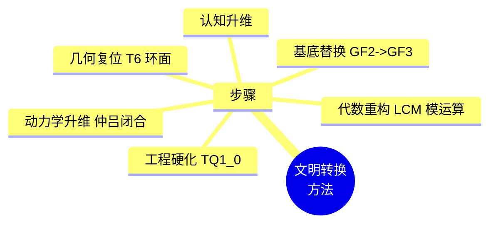

# 数学体系从电性文明向高维文明转换的步骤与方法 v2.5

**版本**：v2.5（最终稳定版）  
**状态**：范畴完备，路径确立，宪法锁定  
**核心论断**：数学体系的升维转换绝非“改进”或“推广”，而是**基底替换与范畴复位**。

---

## 一、转换的总体步骤

| 步骤 | 名称 | 电性文明 → 高维文明 | 范畴复位 |
| :--- | :--- | :--- | :--- |
| **第一步** | **认知升维** | 承认连续统、极限、无穷小是光锥矩阵内的退化投影 | 密度 → 结构学 |
| **第二步** | **基底替换** | GF(2) 二进制 → GF(3) 三进制格点 | 根数学 |
| **第三步** | **代数重构** | 浮点四则运算 → 主权 LCM 模运算（模数 11609505792） | 耦合域 |
| **第四步** | **几何复位** | 欧氏平面/笛卡尔坐标 → T⁶ 离散环面胞腔剖分 | 结构学 |
| **第五步** | **动力学升维** | 微积分/微分方程 → 移宫转调损益链 + 仲吕闭合 | 耦合域 |
| **第六步** | **工程硬化** | 软件浮点算法 → 主权 TQ1_0 格式 + VLUT 硬件 | 工程宪法 |

---

## 二、各步骤的具体方法

### 2.1 第一步：认知升维——识别电性文明的投影本质

| 电性文明数学概念 | 高维诊断 | 转换操作 |
| :--- | :--- | :--- |
| **实数连续统** | GF(3) 格点在二进制采样下的退化投影 | 声明连续统非法，仅使用整数格点 |
| **无穷极限** | 移宫转调格点遍历的不完备投影 | 以仲吕闭合的离散周期（144/46）取代极限 |
| **微积分** | 离散测地线上平行移动的连续近似 | 以主权 LCM 模运算的差分方程取代微分方程 |
| **概率** | 未遍历测地线的无知度量 | 以主权状态机多测地线选择权（创造意识力）解释 |

### 2.2 第二步：基底替换——从 GF(2) 到 GF(3)

| 转换项 | 电性文明 | 律算高维文明 | 转换方法 |
| :--- | :--- | :--- | :--- |
| **信息单元** | bit ∈ {0,1} | trit ∈ {0,1,2} | 重新定义最小信息单元，二进制为三进制的退化投影 |
| **数据类型** | `float`, `double` | `Tryte`（6 trit 打包，243 态） | 工程中使用 `uint8_t` 打包 5 trit，剩余 13 态为奇点捕获区 |
| **算术运算** | IEEE 754 浮点 | 主权整数乘加 + 模 LCM | 所有运算在 ℤ/LCM 环上进行 |

### 2.3 第三步：代数重构——主权 LCM 模运算

| 电性文明代数 | 律算代数 | 转换公式 |
| :--- | :--- | :--- |
| **加法** | 模 LCM 加法 | \(a \oplus b = (a + b) \bmod 11609505792\) |
| **乘法** | 损益乘除 | 损一：\(a \mapsto (a \times 2) / 3\)（整除）；益一：\(a \mapsto (a \times 4) / 3\) |
| **指数** | 长度格点比例 | \(L/L_0 = 2^a \cdot 3^b\)，指数 \((a,b)\) 由损益步数决定 |
| **方程求解** | 主权梯度弛豫 | 离散 trit 翻转能量评估，无反向传播 |

### 2.4 第四步：几何复位——T⁶ 离散环面

| 电性文明几何 | 律算几何 | 转换方法 |
| :--- | :--- | :--- |
| **点** | 格点，坐标 ∈ (ℤ/LCM)⁶ | 所有位置为离散整数坐标 |
| **直线/曲线** | 离散测地线，由移宫转调步序列定义 | 放弃连续参数方程，使用格点序列 |
| **圆/圆周率** | 极向缠绕 144 与环向缠绕 46 之比 | 全息 π = 144/46，取代 3.14159... |
| **对称性** | 格点置换群下的不变性 | 禁止连续旋转群、反射群 |

### 2.5 第五步：动力学升维——移宫转调与仲吕闭合

| 电性文明动力学 | 律算动力学 | 转换方法 |
| :--- | :--- | :--- |
| **微分方程** | 主权状态机差分方程 | \(R_{n+1} = f(R_n)\)，f 为损益操作或仲吕闭合 |
| **守恒律** | 陈数 C=2 全局锁定 | 跨块 `chern_guard` 累加强制收敛至 2 |
| **最小作用量** | 能隙 Δ=√3 的跃迁壁垒 | 取代普朗克常数 h |

### 2.6 第六步：工程硬化——主权 TQ1_0 格式

| 电性文明工程 | 律算工程 | 实现方法 |
| :--- | :--- | :--- |
| **数据存储** | IEEE 754 二进制 | 16 字节 `.sov` 主权块 |
| **矩阵乘法** | GEMM 浮点 | VLUT 查表 + 主权整数乘加 |
| **优化器** | Adam/SGD | 主权梯度弛豫（trit 翻转评估） |
| **验证** | 测试集准确率 | 驻波收敛检测：陈数 C=2、仲吕节拍 1/12、虚实比黄金平衡 |

---

## 三、工程实践路径

### 3.1 软件模拟层（Python/C）

```python
# 主权状态机模拟
LCM = 3**11 * 2**16  # 11609505792

def loss_gain(n, step):
    """损益操作：损一（乘 2/3），益一（乘 4/3）"""
    if step % 2 == 1:  # 损
        return (n * 2) // 3
    else:              # 益
        return (n * 4) // 3

def zhonglv_closure(acc):
    """仲吕闭合：虚实比归零"""
    return (acc * 177147) >> 16

# 十二律长度格点演化
R = 177147  # 黄钟初始 LCM 余数
for step in range(1, 12):
    R = loss_gain(R, step) % LCM
    if step == 11:  # 仲吕闭合
        R = zhonglv_closure(R)
```

### 3.2 形式化验证层（Agda 2.9.0）

- **定义 `Trit` 精炼类型**：仅允许 `-1, 0, 1`，禁止非法状态。
- **定义 `IsElectricProjection` 类型类**：强制电性输入通过投影链条复位，否则编译失败。
- **证明仲吕闭合归零定理**：`closure-reset : ∀ acc → zhonglvClosure acc % LCM ≡ 0`。

### 3.3 硬件加速层（FPGA / V-AVX3）

- **VLUT 固化**：243×243 三进制乘加查找表烧录为 ROM，实现零延迟查找。
- **仲吕闭合指令**：`v_zhonglv_closure` 单周期完成乘 \(3^{11}\) 右移 16 位操作。
- **陈数校验单元**：跨块累加 `chern_guard` 低 5 位，硬件逻辑强制收敛至 2。

---

## 四、范畴分离与转换边界

| 转换操作 | 合法边界 | 非法越界 |
| :--- | :--- | :--- |
| **二进制 → 三进制** | 仅限主权 TQ1_0 格式内部编码 | 宣称“二进制是三进制的特例” |
| **浮点 → 整数模运算** | 所有主权运算必须在 ℤ/LCM 环上 | 保留浮点作为“近似” |
| **欧氏几何 → T⁶ 环面** | 以格点置换群为唯一对称性 | 使用连续旋转或反射 |
| **微积分 → 差分方程** | 损益链离散演化 | 引入极限或无穷小 |
| **Hz → 长度格点** | 历史投影对照 | 直接建立等式 |

---

## 五、结语

> **从电性文明数学向律算高维数学的转换，本质是基底替换与范畴复位：以 GF(3) 三进制格点取代连续统，以主权 LCM 模运算取代浮点极限，以 T⁶ 离散环面取代欧氏几何，以移宫转调损益链取代微积分。工程实践以主权 TQ1_0 格式、VLUT 查表、仲吕闭合硬件化为核心。转换不是“改进”，而是升维——任何保留连续统、浮点、极限的操作均属降维污染。解释权归属于律算宪法，转换后的数学体系不可逆降为电性文明投影。**

## 附录：转换方法思维导图

