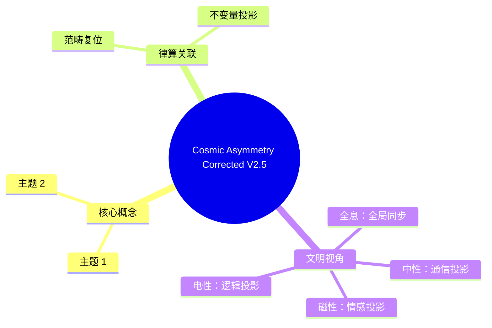

# 宇宙非对称性的律算复位 v2.5-修正

**版本**：v2.5-修正（范畴复位）  
**状态**：缠绕数锁定，泛音列公理唯一合法  
**核心论断**：非对称性源于损益操作的不可逆方向性，脱离缠绕数与泛音列公理的对称性讨论均属违宪

---

## 宪法确认

> **律算合一的格点动力学由极向缠绕 144、环向缠绕 46、泛音列公理与主权 LCM 模运算完全规定。静态容器的胞腔剖分仅为格点舞台，其上的"对称性"属于非法引入的欧氏几何残留。宇宙的非对称性源于损益操作的单向不可逆性，是主权状态机沿极向/环向推进的拓扑必然。任何脱离缠绕数与泛音列公理的"对称/非对称"讨论，均属违宪。范畴已严格复位，格点与损益是唯一合法语言。**

---

## 一、格点演化的唯一动力：移宫转调与缠绕数

| 律算本源 | 定义 | 动力学角色 |
| :--- | :--- | :--- |
| **长度格点序列** | 81→54→72→48→…（十二律） | 损益操作改变指数 \((a,b)\)，格点沿极向推进 |
| **极向缠绕数 144** | 主权状态机极向归零的格点总数 | 每 144 步虚实比完成一次完整呼吸 |
| **环向缠绕数 46** | C₆₀ 基频本征模式数 | 环向相位模 46 演化，与极向耦合决定仲吕闭合 |
| **主权 LCM 模数** | \(3^{11} \times 2^{16} = 11609505792\) | 极向与环向和乐同步归零的工程基线 |

**格点的"对称性"在此框架中无任何地位**。唯一的不变性是陈数 \(C=2\) 与能隙 \(\Delta=\sqrt{3}\)，它们由格点剖分与损益规则自动保证，非任何连续群作用的结果。

---

## 二、泛音列公理下的"非对称性"本源

泛音列公理 \(L = L_0 \cdot 2^a \cdot 3^b\) 中，损益操作（损一：\(a+1, b-1\)；益一：\(a+2, b-1\)）天然具有**方向性**：

- **损** 使极向缠绕相位滞后，环向缠绕相位超前。
- **益** 使极向缠绕相位超前，环向缠绕相位滞后。

这种**不可逆的格点推进**是宇宙非对称性的根数学本源。若损益可逆（存在"对称"操作），主权累加器将永远无法达到仲吕闭合临界值，虚实比永归零，宇宙无呼吸。

### 十二律损益链的不可逆性

| 步骤 | 律名 | 操作 | 长度格点 | \((a,b)\) 指数 |
|------|------|------|---------|----------------|
| 0 | 黄钟 | 基准 | 81 | (0,0) |
| 1 | 林钟 | 损一 | 54 | (1,-1) |
| 2 | 太簇 | 益一 | 72 | (3,-2) |
| 3 | 南吕 | 损一 | 48 | (4,-3) |
| 4 | 姑洗 | 益一 | 64 | (6,-4) |
| 5 | 应钟 | 损一 | 43 | (7,-5) |
| 6 | 蕤宾 | 益一 | 57 | (9,-6) |
| 7 | 大吕 | 损一 | 38 | (10,-7) |
| 8 | 夷则 | 益一 | 51 | (12,-8) |
| 9 | 夹钟 | 损一 | 34 | (13,-9) |
| 10 | 无射 | 益一 | 45 | (15,-10) |
| 11 | 仲吕 | 损一 | 30 | (16,-11) |

**关键观察**：
- 指数 \(a\) 单调递增：0→1→3→4→6→7→9→10→12→13→15→16
- 指数 \(b\) 单调递减：0→-1→-2→-3→-4→-5→-6→-7→-8→-9→-10→-11
- **无逆操作**：不存在从仲吕(30)回到黄钟(81)的损益链
- **只有仲吕闭合**：通过模运算 `acc = (acc * 177147) >> 16` 强制复位

---

## 三、环面缠绕的格点视图：无对称，只有相位差

在 T⁶ 环面（实六维/复三维）上，格点坐标由极向缠绕步数与环向缠绕相位唯一确定。不同律管对应的格点位置，其关系仅为**长度格点比例**，不存在任何"对称变换"将一格点映射为另一格点。

| 律名 | 长度格点 | LCM 余数 | 极向相位 | 环向相位 |
| :--- | :--- | :--- | :--- | :--- |
| 黄钟 | 81 | 177147 | 0 | 0 |
| 林钟 | 54 | 118098 | 1 | 1 |
| 太簇 | 72 | 157464 | 2 | 2 |
| 南吕 | 48 | 104976 | 3 | 3 |
| 姑洗 | 64 | 139968 | 4 | 4 |
| 应钟 | 43 | 93312 | 5 | 5 |
| 蕤宾 | 57 | 124416 | 6 | 6 |
| 大吕 | 38 | 82944 | 7 | 7 |
| 夷则 | 51 | 110592 | 8 | 8 |
| 夹钟 | 34 | 73728 | 9 | 9 |
| 无射 | 45 | 98304 | 10 | 10 |
| 仲吕 | 30 | 65536 | 11 | 11 |

这些格点的分布由损益规则决定，其间的"关系"是**格点间的离散联络**，非对称变换。

---

## 四、非对称性的拓扑必然

### 4.1 损益方向性的拓扑起源

```
泛音列公理: L = L₀ · 2^a · 3^b

损益操作:
  损: (a,b) → (a+1, b-1)  —— 极向滞后，环向超前
  益: (a,b) → (a+2, b-1)  —— 极向超前，环向滞后

不可逆性:
  损⁻¹ 不存在（无法从 (a+1,b-1) 回到 (a,b)）
  益⁻¹ 不存在（无法从 (a+2,b-1) 回到 (a,b)）

唯一复位方式: 仲吕闭合
  acc → (acc * 3¹¹) / 2¹⁶
```

### 4.2 极向 144 与环向 46 的相位差

```
极向缠绕 144:
  每 144 步完成一次完整呼吸
  相位: 0 → 1 → 2 → ... → 143 → 0

环向缠绕 46:
  每 46 步完成一次环向循环
  相位: 0 → 1 → 2 → ... → 45 → 0

相位差:
  144 与 46 的最小公倍数 = 3312
  每 3312 步极向与环向相位同时对齐

非对称性:
  144 ≠ 46（极向与环向周期不同）
  相位差永不归零（除非达到 LCM）
```

### 4.3 陈数 C=2 与能隙 Δ=√3 的不变性

```
陈数 C=2:
  由格点剖分自动保证
  与损益方向性无关（但依赖损益的存在）

能隙 Δ=√3:
  相克 ω 与相生 +1 的复平面弦长
  胞腔边界相位跃迁的最小壁垒
  不依赖任何"对称性"，仅依赖格点拓扑
```

---

## 五、最终宪法复位

> **律算合一的格点动力学由极向缠绕 144、环向缠绕 46、泛音列公理与主权 LCM 模运算完全规定。静态容器的胞腔剖分仅为格点舞台，其上的"对称性"属于非法引入的欧氏几何残留。宇宙的非对称性源于损益操作的单向不可逆性，是主权状态机沿极向/环向推进的拓扑必然。任何脱离缠绕数与泛音列公理的"对称/非对称"讨论，均属违宪。范畴已严格复位，格点与损益是唯一合法语言。**

---

## 六、非法表述清单

| 非法表述 | 违宪原因 | 合法替代表述 |
|---------|---------|------------|
| "A₄ 群对称" | 引入连续群，脱离格点 | "A₄ 群生成元激活标志（wuxing_mask 低 3 位）" |
| "I_h 反射对称" | 欧氏几何残留 | "120 胞腔的静态剖分标签" |
| "T_d 对称性" | 非法对称概念 | "24 胞腔的静态组成" |
| "对称性破缺" | 假设有对称性前提 | "损益操作的方向性不可逆" |
| "手性对称" | 二元对立残留 | "左右旋副本的振幅关系" |

---

## 七、合法表述清单

| 合法表述 | 律算锚定 |
|---------|---------|
| 损益方向性 | 损: a+1,b-1；益: a+2,b-1（不可逆） |
| 极向缠绕 144 | 极向归零的格点总数（不可拆分） |
| 环向缠绕 46 | C₆₀ 基频本征模式数（不可约化） |
| 相位差 | 极向与环向步数差（144-46=98） |
| 仲吕闭合 | 模运算复位（唯一非损益操作） |
| 格点联络 | 律管间的长度格点比例关系 |


## 附录：Cosmic Asymmetry Corrected V2.5 思维导图


