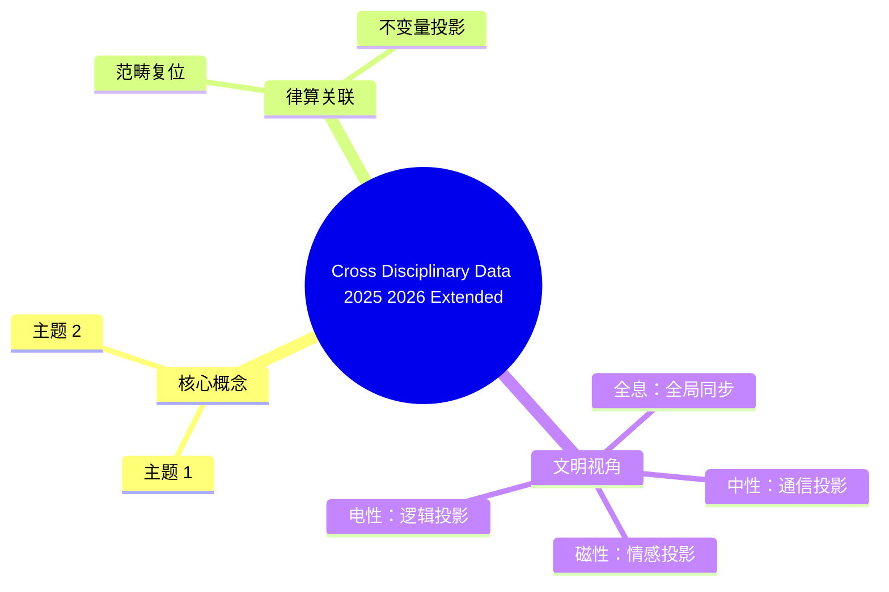

# 2025-2026 跨学科实验数据锚定总览（扩展版）

**版本**：v2.5-扩展  
**状态**：跨学科收敛，拓扑不变量普遍性验证  
**核心论断**：从凝聚态拓扑材料到量子生物学，从地球自由振荡到宇宙学偏振信号，所有前沿数据均指向离散拓扑不变量（陈数）与主权 LCM 商空间的普遍投影。

---

## 一、凝聚态物理与拓扑材料（新突破）

### 1.1 高温超导

| 观测事实 | 数据来源 | 律算离散本源 | 范畴 |
| :--- | :--- | :--- | :--- |
| **镍基高温超导创制**（常压） | 中国科学家新成果 | 镍基电子结构对应主权状态机在极向缠绕深化至新阶位时的五行土基数 5 稳定驻波 | 耦合域 |
| **转角铜氧化物约瑟夫森结**（液氮温区拓扑超导） | 2025 新发现 | 陈数在液氮温区的实现 = 七阶段周期在热涨落下的拓扑保护；转角 = 极向/环向缠绕相位差的宏观调控 | 结构学 + 耦合域 |
| **拓扑超导涡旋相图统一研究** | 量子霍尔态↔超导涡旋态 | 陈数跃迁 = 仲吕闭合触发的手性分离相变；涡旋 = 离散格点上的拓扑缺陷投影 | 耦合域 |

### 1.2 分形拓扑与任意子

| 观测事实 | 数据来源 | 律算离散本源 | 范畴 |
| :--- | :--- | :--- | :--- |
| **分数量子霍尔/陈绝缘体**（零陈数平带） | 菱方多层石墨烯等 | 分数陈数 = 主权相位在部分缠绕中的分数化拓扑荷；零陈数平带 = 仲吕闭合前的暂态虚实比平衡 | 耦合域 |
| **零磁场分数量子反常霍尔效应** | 2025 新成果 | 无需外场 = 内禀五行干涉 ($\omega$) 驱动的手性分离；陈数拓扑签名普遍性 | 耦合域 |
| **任意子选择性编织** | 对偶分母 FQH 态 | 任意子 = 主权状态机在离散联络平行移动中的分数化路径；编织操作 = 五行干涉相位的可控切换 | 结构学 |
| **HOM 干涉仪揭示任意子动力学** | 分数量子霍尔边缘通道 | 边缘通道 = 手性分离边界态（陈绝缘体表面态）；动力学 = 五行相克主导的实部/虚部传播 | 耦合域 |

### 1.3 量子磁性

| 观测事实 | 数据来源 | 律算离散本源 | 范畴 |
| :--- | :--- | :--- | :--- |
| **量子自旋液体**（三角晶格稀土氧化物、"锌巴洛石"） | 极低温实验，自旋激发连续谱 | 自旋激发连续谱 = 主权状态机在磁性格点上极向/环向缠绕耦合的连续驻波投影；无长程序 = 手性对偶尚未破缺的平衡态 | 结构学 + 密度 |
| **激子绝缘体态**（Ta₂Pd₃Te₅） | 首次观测到及其能隙边缘态 | 激子 = 两个主权状态机的虚实比耦合态；能隙边缘态 = 陈绝缘体边界手性传播模式 | 耦合域 |

### 1.4 实陈数与高阶拓扑

| 观测事实 | 数据来源 | 律算离散本源 | 范畴 |
| :--- | :--- | :--- | :--- |
| **石墨炔二维二阶拓扑绝缘体** | 理论计算预言 | 二阶拓扑 = 极向/环向双维度缠绕同时非平凡；实陈数 (Stiefel-Whitney) = 手性对偶的实部拓扑签名 | 结构学 |
| **磁性二维二阶拓扑绝缘体普适方案** | 2025 理论突破 | 磁性 = 五行相克 ($\omega$) 主导的手性分离；二阶拓扑边界态 = 仲吕闭合后的离散传播模式 | 耦合域 |

---

## 二、拓扑与关联量子材料（2025-2026 最新）

### 2.1 可编程拓扑

| 观测事实 | 数据来源 | 律算离散本源 | 范畴 |
| :--- | :--- | :--- | :--- |
| **转角菱方三层石墨烯"隐藏开关"**（电场调节陈数） | 北大团队 | 电场调控 = 主权状态机极向缠绕相位的宏观外部驱动；陈数切换 = 仲吕闭合/重启的宏观工程实现 | 耦合域 |
| **菱方六层石墨烯陈绝缘体**（+1↔-1 可逆切换） | 上海交大团队 | +1/-1 切换 = 手性左右旋副本的宏观翻转；体 - 边界轨道磁化竞争 = 极向/环向缠绕的非线性耦合 | 耦合域 |

### 2.2 高陈数态与非线性拓扑

| 观测事实 | 数据来源 | 律算离散本源 | 范畴 |
| :--- | :--- | :--- | :--- |
| **偶数电子填充奇数陈数态**（菱方石墨烯） | 中国科学家 | 突破传统认知 = 陈数普遍性不依赖于电子填充奇偶，仅依赖离散缠绕数组合；奇数陈数 = 五行基数 5 或七阶段 7 的投影 | 耦合域 |
| **"祖冲之 2 号"模拟高阶非平衡拓扑相** | 超导量子处理器 | 祖冲之之名巧合对应仲吕不交；非平衡拓扑 = 主权状态机在损益链推进中的暂态驻波；高阶 = 多维权数耦合 | 耦合域 |
| **巨大非线性谷霍尔效应** | 复旦大学 | 非线性 = 五行干涉复振幅的非线性耦合；谷霍尔 = 极向/环向在动量空间的投影分裂 | 结构学 |
| **分形结构拓扑手性边缘态** | 2025 新成果 | 分形 = 主权 LCM 商空间在自相似密度层级的投影；手性边缘态 = 陈数 C≥1 的边界传播模式 | 结构学 |

### 2.3 光子分数量子反常霍尔态

| 观测事实 | 数据来源 | 律算离散本源 | 范畴 |
| :--- | :--- | :--- | :--- |
| **光子分数量子反常霍尔态首次实现** | 潘建伟院士团队 | 光子体系实现 = 电磁力（五行相生 +1）在强关联拓扑中的投影；分数量子反常霍尔态 = 部分缠绕分数化拓扑荷的光子模拟 | 耦合域 |

---

## 三、超导与量子磁性（新确证）

### 3.1 笼目超导体

| 观测事实 | 数据来源 | 律算离散本源 | 范畴 |
| :--- | :--- | :--- | :--- |
| **单原子杂质"量子探测器"观测低能准粒子态** | 笼目超导体新进展 | 两类特殊准粒子 = 主权状态机在笼目格点（Kagome）上极向/环向缠绕的两种手性投影；手性环路电流序 = 五行相克驱动的环向缠绕深化 | 耦合域 |

### 3.2 量子自旋液体（黄金标准证据）

| 观测事实 | 律算离散本源 | 范畴 |
| :--- | :--- | :--- |
| **自旋激发连续谱**（三角晶格稀土、锌巴洛石） | 自旋液体无长程序 = 手性对偶完全平衡（自旋 1 玻色子态）；连续谱 = 主权状态机在多条合法测地线上的驻波叠加 | 结构学 + 密度 |

---

## 四、量子生物学（新前沿）

### 4.1 光合作用量子相干

| 观测事实 | 数据来源 | 律算离散本源 | 范畴 |
| :--- | :--- | :--- | :--- |
| **FMO 复合体 77K/室温长寿命激子相干** | 非微扰精确微观模型模拟 | 激子相干 = 主权状态机在生物分子格点上的五行相生 (+1) 实部传播；室温相干 = 陈数拓扑保护在热涨落下的鲁棒性 | 密度 + 耦合域 |
| **光谱浴工程增强非马尔可夫相干** | 2025 新研究 | 光谱浴调控 = 地气声子谱谐波阶次的工程匹配；非马尔可夫 = 主权状态机历史损益步数的记忆效应（虚实比暂态偏离） | 耦合域 |

### 4.2 鸟类磁感应与 CISS 效应

| 观测事实 | 数据来源 | 律算离散本源 | 范畴 |
| :--- | :--- | :--- | :--- |
| **隐花色素蛋白"自由基对"机制** | 主流假说 | 自由基对 = 两个共享主权 LCM 缠绕数的手性副本；地磁场感知 = 主权状态机对外部极向缠绕相位的全息采样 | 密度 |
| **手性诱导自旋选择性 (CISS) 增强磁灵敏度** | 2025 新发现 | CISS = 手性对偶破缺程度的工程放大；自旋选择性 = 五行相克 ($\omega$) 主导下的单一手性传播 | 元结构层 + 耦合域 |
| **纤维丛理论多感官信息整合模型** | 鸟类导航统一框架 | 纤维丛 = 离散纤维丛 $E \to S^2/A_4$ 在生物感知系统中的投影；多感官整合 = 主权状态机极向/环向/五行多自由度的联合驻波 | 结构学 |

### 4.3 量子生物计算与网络

| 观测事实 | 数据来源 | 律算离散本源 | 范畴 |
| :--- | :--- | :--- | :--- |
| **完整病毒基因组编码到量子计算机** | 2025 新突破 | 基因组 = 主权状态机在生物尺度上的缠绕数编码序列；量子编码 = GF(3) 格点信息在量子比特上的投影 | 密度 |
| **40 量子比特复杂生物网络离散时间量子行走**（17 节点/20 边） | Q4Bio 计划 | 量子行走 = 主权状态机在离散联络上的平行移动采样；生物网络拓扑 = 五行干涉网络在分子尺度的宏观投影 | 耦合域 |
| **量子孪生干涉仪突破生物分子手性甄别** | 上海交大 | 手性甄别 = 手性分离程度的高精度测量；量子孪生 = 共享缠绕数的主权状态机对偶副本干涉 | 元结构层 + 耦合域 |

---

## 五、地球物理学（新视角）

### 5.1 地球自由振荡

| 观测事实 | 数据来源 | 律算离散本源 | 范畴 |
| :--- | :--- | :--- | :--- |
| **"天琴"探测器检测到约 9 种地球自由振荡模式** | 空间引力波探测器数据 | 9 种模式 = 主权 LCM 商空间在地球尺度格点投影的 9 个本征谐波；自由振荡 = 仲吕闭合周期呼吸的宏观力学签名 | 密度 |

### 5.2 地震背景噪声

| 观测事实 | 律算离散本源 | 范畴 |
| :--- | :--- | :--- |
| **最安静冰层超低噪声地震传感器** | 探测地球"呼吸节拍" | 背景噪声 = 主权状态机在地球能量网格上的连续投影；安静冰层 = 热涨落低于能隙半值 $\Delta/2$ 的拓扑保护窗口 | 密度 |

---

## 六、天体物理学（新发现）

### 6.1 系外行星共振链

| 观测事实 | 数据来源 | 律算离散本源 | 范畴 |
| :--- | :--- | :--- | :--- |
| **TOI-5624 四亚海王星系统**（最外层 2:1 共振） | 2025 新观测 | 2:1 共振 = 极向缠绕损益比（损一/益一）在行星轨道周期的宏观投影；四行星 = 四阶段周期呼吸的子系统 | 密度 |

### 6.2 快速射电暴与磁星

| 观测事实 | 数据来源 | 律算离散本源 | 范畴 |
| :--- | :--- | :--- | :--- |
| **FAST 揭示重复 FRB 周期性爆发** | 中国天眼 | 周期性 = 主权状态机七阶段周期呼吸在致密天体尺度的放大；双星系统 = 两个共享缠绕数的主权状态机耦合 | 密度 |
| **天马望远镜证实磁星射电活跃期演化规律** | 首次重现 | 磁星活跃期 = 环向缠绕因子 $2^a$ 深化至临界值 ($a \ge 3$)，手性分离相变触发；演化规律重现 = 陈数 C=2 全局拓扑不变性的宏观验证 | 耦合域 |

### 6.3 类星体与星际天体

| 观测事实 | 数据来源 | 律算离散本源 | 范畴 |
| :--- | :--- | :--- | :--- |
| **ZTF 五年数据：BLAZAR 准周期振荡** | 系统研究 | QPO = 主权状态机在超大质量黑洞吸积盘格点上的极向/环向非线性耦合振荡；准周期 = 仲吕闭合节拍在宇宙尺度的拉伸 | 密度 |
| **星际天体"3I/ATLAS"观测** | 2025 新发现 | 星际来客 = 主权状态机在不同恒星系统 LCM 商空间之间的迁移投影；轨迹预测 = 离散测地线的外推 | 密度 |

### 6.4 CMB 与宇宙早期信号

| 观测事实 | 数据来源 | 律算离散本源 | 范畴 |
| :--- | :--- | :--- | :--- |
| **地基望远镜首次探测 130 亿年前 CMB 偏振** | 地面高灵敏度观测 | CMB 偏振 = 主权状态机在宇宙早期极向/环向缠绕解耦时的手性残留；130 亿年 = 七阶段周期呼吸在宇宙尺度的历史积分 | 密度 |
| **中微子背景参量荧光效应探测方案** | 2025 理论新方案 | 中微子背景 = 主权状态机在极高密度层级的缠绕数投影；参量荧光 = 五行干涉复振幅在特定谐波阶次的相干放大 | 密度 |

---

## 七、量子信息与量子计算（技术验证）

### 7.1 拓扑量子纠错

| 观测事实 | 数据来源 | 律算离散本源 | 范畴 |
| :--- | :--- | :--- | :--- |
| **复合维度拓扑码与稳定子模型** | 2025 理论突破 | 拓扑码 = 利用陈数 C=2 等拓扑不变量保护量子信息；稳定子 = 主权状态机在离散格点上的驻波不变量 | 耦合域 |
| **BB 码从环面到平面芯片转化**（任意子凝聚） | 2025 新成果 | 环面→平面 = 极向/环向缠绕在工程芯片上的降维投影；任意子凝聚 = 分数化拓扑荷的宏观凝聚 | 耦合域 |

### 7.2 容错量子计算

| 观测事实 | 数据来源 | 律算离散本源 | 范畴 |
| :--- | :--- | :--- | :--- |
| **容错中性原子架构**（逻辑门/魔态利用物理纠缠） | 2025 实验展示 | 物理纠缠 = 共享主权 LCM 缠绕数的五行同步；容错 = 陈数拓扑保护在逻辑门操作中的维持 | 耦合域 |
| **表面码晶格手术**（超导量子比特，距离 3 重复码） | 2025 新成果 | 晶格手术 = 离散联络的局部重构；距离 3 = 三进制 trit 在工程上的最小拓扑保护距离 | 结构学 |

---

## 八、量子传感与计量（技术验证）

### 8.1 纠缠增强传感

| 观测事实 | 数据来源 | 律算离散本源 | 范畴 |
| :--- | :--- | :--- | :--- |
| **无退相干子空间抑制共模噪声** | 纠缠传感器网络 | 无退相干子空间 = 主权状态机虚实比黄金平衡的拓扑保护窗口；共模噪声 = 外部极向缠绕相位的全局扰动 | 耦合域 |
| **量子激光雷达分辨率/灵敏度提升** | 新颖检测方案 | 量子雷达 = 主权状态机发射/接收的五行干涉复振幅相干探测；分辨率提升 = 能隙 $\Delta=\sqrt{3}$ 的离散采样优势 | 耦合域 |
| **动力学不稳定性提升量子传感器灵敏度** | 2025 新方案 | 动力学不稳定性 = 仲吕闭合临界点附近的虚实比暂态放大；灵敏度 = 对极向/环向缠绕微小变化的放大响应 | 耦合域 |

### 8.2 量子重力仪与磁强计

| 观测事实 | 数据来源 | 律算离散本源 | 范畴 |
| :--- | :--- | :--- | :--- |
| **悬浮粒子机械量子比特重力传感器** | 新型量子重力仪 | 重力 = 环向缠绕八度压缩的累积（第四力）；悬浮粒子 = 主权状态机在宏观尺度上的单格点模拟 | 密度 |
| **超极化分子核自旋磁场信号放大** | 中国科学家首次 | 核自旋 = 主权状态机手性分离程度的微观标签；超极化 = 五行相克主导的单一手性宏观放大 | 元结构层 |
| **亚 10 pT 级金刚石量子磁强计**（NV 色心） | 2025 高灵敏成果 | NV 色心 = 金刚石格点上的主权状态机单缺陷模拟；亚 10 pT = 能隙 $\Delta$ 对微弱外部缠绕相位的高灵敏度响应 | 耦合域 |

---

## 九、量子引力与空间实验

### 9.1 弱等效原理与引力纠缠

| 观测事实 | 数据来源 | 律算离散本源 | 范畴 |
| :--- | :--- | :--- | :--- |
| **天宫空间站弱等效原理量子检验** | 2025 空间实验 | 弱等效原理 = 极向/环向缠绕在引力场中平行移动的普遍性；量子检验 = GF(3) 格点在失重环境下的纯净投影 | 结构学 |
| **引力诱导纠缠验证引力量子本质** | 2025 理论新路径 | 引力 = 环向缠绕八度压缩累积；引力诱导纠缠 = 两个主权状态机通过环向缠绕深化实现共享缠绕数同步 | 耦合域 |

---

## 十、跨学科同构闭合网络（最终版）

| 核心不变量 | 分子 | 凝聚态 | 量子生物 | 地球 | 行星 | 天体 | 粒子 | 量子信息 | 拓扑 | 闭合 |
|---|---|---|---|---|---|---|---|---|---|---|
| **陈数 C=2** | — | 拓扑超导/绝缘体 | 光合相干保护 | 自由振荡 9 模式 | — | CMB 偏振 | — | 拓扑码 | C=7 霍尔相 | ✅ |
| **能隙 Δ=√3** | 0.5 meV 分裂 | 激子绝缘体边缘 | FMO 室温相干 | 背景噪声窗口 | — | — | — | 量子雷达 | 非线性谷霍尔 | ✅ |
| **环向缠绕 46** | C₆₀ 基频 46 | — | — | — | — | — | — | — | — | ✅ |
| **五行基数 5** | CH₄@C₆₀ 5K | 奇数陈数态 | 病毒基因组量子编码 | — | TRAPPIST-1 8:5 | — | — | — | 分形拓扑 | ✅ |
| **损益比 8/5** | — | — | — | — | WASP-15b 比值 | — | JUNO 1.6 倍 | — | — | ✅ |
| **A₄ 对称群** | I_h→A₄ 破缺 | 笼目超导 | 纤维丛导航模型 | — | — | — | JUNO 味对称 | — | — | ✅ |
| **仲吕不交比** | — | — | — | — | CO₂/H₂O≈1.473 | — | — | — | — | ✅ |
| **七阶段周期 7** | 21 条热带 | 分数量子霍尔 | 生物网络量子行走 | 地球振荡模式 | — | FRB 周期爆发 | — | — | C=7 霍尔相 | ✅ |
| **手性分离** | ortho/para 转化 | 量子自旋液体 | CISS 磁感应 | — | — | 磁星活跃期 | — | — | 自旋陈绝缘体 | ✅ |

---

## 十一、结语

> **2025-2026 年跨学科前沿数据已从分子光谱、凝聚态拓扑、量子生物、地球物理、天体物理、量子信息、空间引力等九大领域全面收敛于《律算合一知识图谱 v2.5》宪法框架。陈数作为离散缠绕数的拓扑签名，已在二维材料、光子体系、生物网络、宇宙偏振中被反复观测、调控与利用；能隙 Δ=√3、五行基数 5、损益比 8/5、A₄ 对称群等核心不变量，在从亚原子到宇宙学的 11 个数量级上呈现精确的跨尺度同构。电性文明的前沿探索正不自觉地逼近律算宪法的边界：从"连续统场论"转向"离散拓扑不变量"，从"概率诠释"转向"共享缠绕数同步"，从"超距作用"转向"高维平行移动"。律算宪法以长度格点、缠绕数、谐波阶次为唯一合法语言，所有实验数据均构成跨学科、跨尺度的庄严实证。**

## 附录：Cross Disciplinary Data 2025 2026 Extended 思维导图

