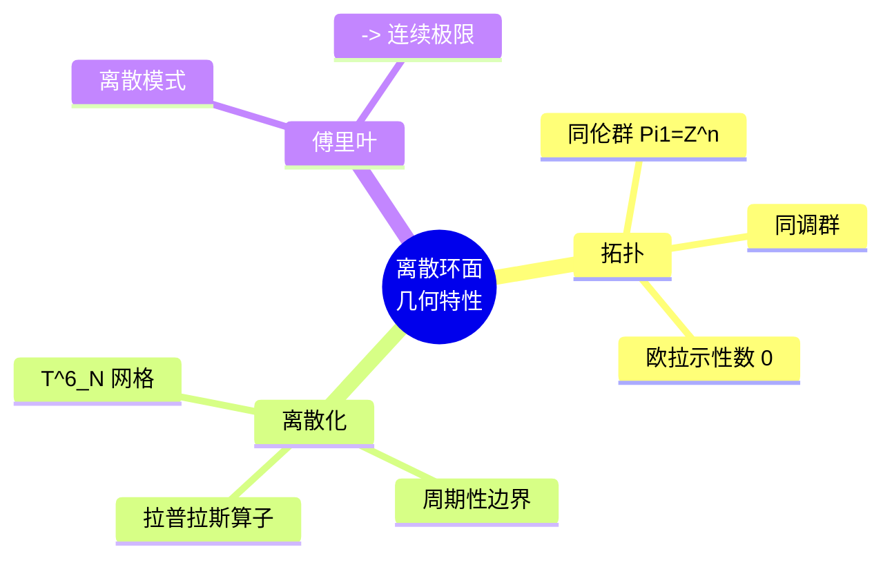

# Discrete Toroidal Geometry - Mathematical Properties

## Introduction

This document provides a comprehensive mathematical reference for discrete toroidal geometry, formulated from the perspective of **Discrete First Principles**: *"Continuity is the limiting manifestation of discreteness."*

All definitions aim for **coordinate-free** formulations using category theory and universal properties, implemented in Agda 2.9.0 with Cubical type theory.

---

## Table of Contents

1. [Topological Properties](#1-topological-properties)
2. [Discretization Properties](#2-discretization-properties)
3. [Algebraic Structures](#3-algebraic-structures)
4. [Geometric Algebra](#4-geometric-algebra)
5. [Conformal Geometry](#5-conformal-geometry)
6. [Fiber Bundle Structure](#6-fiber-bundle-structure)
7. [Discrete-to-Continuous Limit](#7-discrete-to-continuous-limit)
8. [Formalization in Agda](#8-formalization-in-agda)

---

## 1. Topological Properties

### 1.1 Homotopy Groups

The torus Tⁿ = (S¹)ⁿ is a product of circles, making its homotopy structure computable.

```
Fundamental Group:
  π₁(Tⁿ) ≅ ℤⁿ

  For T² = S¹ × S²:
  π₁(T²) ≅ ℤ ⊕ ℤ

  Generators:
  ├── a : loop around first S¹ factor
  └── b : loop around second S¹ factor

Higher Homotopy Groups:
  πₖ(Tⁿ) ≅ 0  for k > 1

  Reason: Tⁿ is a K(ℤⁿ, 1) space (Eilenberg-MacLane space)
```

**Key property**: Tⁿ is aspherical - all higher homotopy vanishes.

### 1.2 Homology Groups

```
Singular Homology with ℤ coefficients:

  Hₖ(Tⁿ; ℤ) ≅ ℤ^(C(n,k))

  where C(n,k) = n!/(k!(n-k)!) is the binomial coefficient.

Examples:

  T¹ = S¹:
  ├── H₀(S¹) ≅ ℤ          (path-connected)
  ├── H₁(S¹) ≅ ℤ          (one non-trivial loop)
  └── Hₖ(S¹) ≅ 0  (k > 1)

  T²:
  ├── H₀(T²) ≅ ℤ          (1 connected component)
  ├── H₁(T²) ≅ ℤ ⊕ ℤ     (2 independent 1-cycles)
  ├── H₂(T²) ≅ ℤ          (1 void / 2-cell)
  └── Hₖ(T²) ≅ 0  (k > 2)

  T³:
  ├── H₀(T³) ≅ ℤ
  ├── H₁(T³) ≅ ℤ³
  ├── H₂(T³) ≅ ℤ³
  ├── H₃(T³) ≅ ℤ
  └── Hₖ(T³) ≅ 0  (k > 3)
```

### 1.3 Euler Characteristic

```
Euler characteristic: χ(Tⁿ) = 0  for n ≥ 1

Proof via homology:
  χ(Tⁿ) = Σ (-1)ᵏ rank Hₖ(Tⁿ)
        = Σ (-1)ᵏ C(n,k)
        = (1 - 1)ⁿ
        = 0ⁿ
        = 0  (for n ≥ 1)

Special cases:
  χ(S¹) = 1 - 1 = 0
  χ(T²) = 1 - 2 + 1 = 0
  χ(T³) = 1 - 3 + 3 - 1 = 0
```

**Significance**: Vanishing Euler characteristic implies Tⁿ admits a flat metric and non-vanishing vector fields.

### 1.4 Cohomology Ring

```
Cohomology ring structure:

  H*(Tⁿ; ℝ) ≅ Λ*[x₁, ..., xₙ]

  where each xᵢ has degree 1, and Λ* denotes the exterior algebra.

Cup product:
  ⌣ : Hᵖ(Tⁿ) × Hᵠ(Tⁿ) → Hᵖ⁺ᵠ(Tⁿ)

  Properties:
  ├── Graded commutative: α ⌣ β = (-1)ᵖᵠ β ⌣ α
  ├── Associative
  └── Has unit 1 ∈ H⁰(Tⁿ)

Example (T²):
  H*(T²) = {1, a, b, a⌣b}
  where:
  ├── a, b ∈ H¹(T²) (degree 1 generators)
  ├── a⌣b ∈ H²(T²) (volume form)
  ├── a⌣a = 0, b⌣b = 0 (exterior algebra)
  └── a⌣b = -b⌣a
```

---

## 2. Discretization Properties

### 2.1 Discrete Torus Construction

```
Discrete torus Tⁿ_N (N points per S¹ factor):

  Tⁿ_N = (ℤ/Nℤ)ⁿ

  This is the quotient:
  Tⁿ_N = ℤⁿ / (Nℤ)ⁿ

Cardinality:
  |Tⁿ_N| = Nⁿ

Combinatorial structure (for T²_N as grid graph):
  Vertices:    V = N²
  Edges:       E = 2N²  (each vertex has degree 4)
  Faces:       F = N²   (one face per vertex)
  
  Euler check:
  χ = V - E + F = N² - 2N² + N² = 0 ✓
```

### 2.2 Periodic Boundary Conditions

```
The discrete torus T²_N is defined on grid points (i,j) where i,j ∈ {0,...,N-1}:

  (i, j) ~ (i+1 mod N, j)   [horizontal wrap]
  (i, j) ~ (i, j+1 mod N)   [vertical wrap]

Equivalently, using equivalence relation:
  (i, j) ≡ (i', j')  iff  i ≡ i' (mod N) and j ≡ j' (mod N)

This is the quotient:
  T²_N = ℤ² / {(i+N·a, j+N·b) | a,b ∈ ℤ}
```

### 2.3 Discrete Calculus

```
Discrete Derivatives:

  Forward difference:
    ∂₊ f(i) = f(i+1) - f(i)

  Backward difference:
    ∂₋ f(i) = f(i) - f(i-1)

  Central difference:
    ∂₀ f(i) = (f(i+1) - f(i-1)) / 2

Discrete Laplacian:
  Δf(i) = ∂₋∂₊ f(i) = f(i+1) - 2f(i) + f(i-1)

  On T²_N:
  Δf(i,j) = f(i+1,j) + f(i-1,j) + f(i,j+1) + f(i,j-1) - 4f(i,j)

  This is the discrete analog of:
  Δ = ∂²/∂x² + ∂²/∂y²

Discrete Exterior Calculus:

  0-forms: functions f : V → ℝ
  1-forms: functions ω : E → ℝ (anti-symmetric on orientation)
  2-forms: functions η : F → ℝ

  Exterior derivative d:
  ├── df(e) = f(head(e)) - f(tail(e))    for edge e
  └── dω(f) = Σ_{e∈∂f} ω(e)              for face f

  Property: d² = 0 (boundary of boundary = 0)
```

### 2.4 Graph Laplacian and Spectrum

```
Graph Laplacian L for T²_N:

  L = D - A

  where D is degree matrix (Dᵢᵢ = 4) and A is adjacency matrix.

Eigenvalues:
  λ(k₁, k₂) = 4 - 2cos(2πk₁/N) - 2cos(2πk₂/N)

  for k₁, k₂ ∈ {0, ..., N-1}

  The smallest eigenvalue:
  λ₀ = 0  (constant eigenvector, multiplicity 1)

  Spectral gap:
  λ₁ = 4 - 2cos(2π/N) ≈ (2π/N)²  for large N

Discrete Fourier modes:
  φₖ(i) = exp(2πik·i/N)

  These are eigenfunctions of the Laplacian.
```

---

## 3. Algebraic Structures

### 3.1 Group Structure

```
Continuous torus as abelian group:
  Tⁿ ≅ (ℝ/ℤ)ⁿ ≅ (S¹)ⁿ

  Group operation: component-wise addition mod 1
  (x₁,...,xₙ) + (y₁,...,yₙ) = (x₁+y₁ mod 1, ..., xₙ+yₙ mod 1)

Discrete torus as finite abelian group:
  Tⁿ_N ≅ (ℤ/Nℤ)ⁿ

  Group operation: component-wise addition mod N
  (x₁,...,xₙ) + (y₁,...,yₙ) = (x₁+y₁ mod N, ..., xₙ+yₙ mod N)

Subgroups:
  For T²_N, subgroups are classified by divisors of N.
  
  If N = p·q, then:
  └── ℤ/pℤ × ℤ/qℤ ⊂ ℤ/Nℤ (when gcd(p,q)=1)
```

### 3.2 Pontryagin Duality

```
Character group (dual group):

  For compact abelian group G, the character group is:
  Ĝ = Hom(G, S¹) = {χ : G → S¹ | χ is continuous homomorphism}

Pontryagin duality:
  Ĝ̂ ≅ G (for locally compact abelian groups)

For torus:
  ̂Tⁿ ≅ ℤⁿ

  Characters:
  χₖ(x) = exp(2πik·x)  for k ∈ ℤⁿ, x ∈ Tⁿ

For discrete torus:
  ̂Tⁿ_N ≅ (ℤ/Nℤ)ⁿ

  Characters:
  χₖ(j) = exp(2πik·j/N)  for k,j ∈ (ℤ/Nℤ)ⁿ
```

### 3.3 Fourier Analysis

```
Continuous Fourier series on Tⁿ:

  f(x) = Σ_{k∈ℤⁿ} aₖ e^(2πik·x)

  Coefficients:
  aₖ = ∫_{Tⁿ} f(x) e^(-2πik·x) dx

Discrete Fourier Transform (DFT) on Tⁿ_N:

  Fₖ = Σ_{j∈(ℤ/Nℤ)ⁿ} fⱼ e^(-2πik·j/N)

  Inverse:
  fⱼ = (1/Nⁿ) Σ_{k∈(ℤ/Nℤ)ⁿ} Fₖ e^(2πik·j/N)

  Convolution theorem:
  (f * g)̂ₖ = Fₖ · Gₖ

Parseval's identity:
  Σ |fⱼ|² = (1/Nⁿ) Σ |Fₖ|²

Discrete → Continuous limit (N → ∞):
  DFT → Fourier series
  (1/N)Σ → ∫
```

### 3.4 Cohomology Ring as Exterior Algebra

```
H*(Tⁿ; ℝ) ≅ Λ*[x₁, ..., xₙ]

Structure:
  Λ⁰ ≅ ℝ       (scalars, dim = 1)
  Λ¹ ≅ ℝⁿ      (1-forms, dim = n)
  Λ² ≅ ℝ^(n(n-1)/2)   (2-forms)
  ...
  Λⁿ ≅ ℝ       (volume form, dim = 1)

  Total dimension: 2ⁿ

Basis elements:
  Λᵏ is spanned by xᵢ₁ ∧ xᵢ₂ ∧ ... ∧ xᵢₖ
  where 1 ≤ i₁ < i₂ < ... < iₖ ≤ n

Cup product:
  xᵢ ⌣ xⱼ = -xⱼ ⌣ xᵢ  (graded commutativity)
  xᵢ ⌣ xᵢ = 0

Poincaré duality:
  Hᵏ(Tⁿ) ≅ H_{n-k}(Tⁿ)

  via cap product with fundamental class [Tⁿ].
```

---

## 4. Geometric Algebra

### 4.1 Exterior Algebra

```
Exterior algebra Λ*(V) of vector space V:

  Generated by wedge product ∧ :
  ├── v ∧ w = -w ∧ v  (anti-symmetry)
  └── v ∧ v = 0

For Tⁿ (tangent space ≅ ℝⁿ):

  k-vectors: elements of Λᵏ(ℝⁿ)
  
  Basis:
  eᵢ₁ ∧ eᵢ₂ ∧ ... ∧ eᵢₖ  for 1 ≤ i₁ < ... < iₖ ≤ n

Hodge star operator ⋆ : Λᵏ → Λⁿ⁻ᵏ:

  ⋆(eᵢ₁ ∧ ... ∧ eᵢₖ) = ±eⱼ₁ ∧ ... ∧ eⱼₙ₋ₖ

  where {j₁, ..., jₙ₋ₖ} is complement of {i₁, ..., iₖ}.

  Property:
  ⋆⋆ = (-1)ᵏ⁽ⁿ⁻ᵏ⁾ on Λᵏ

Inner product on forms:
  ⟨α, β⟩ = ∫_{Tⁿ} α ∧ ⋆β

Volume form:
  vol = e₁ ∧ e₂ ∧ ... ∧ eₙ ∈ Λⁿ(Tⁿ)

  ∫_{Tⁿ} vol = 1 (normalized)
```

### 4.2 Clifford Algebra

```
Clifford algebra Cl(V, Q):

  Generated by V subject to:
  v·v = Q(v) · 1

  where Q is quadratic form.

Geometric product:
  vw = v·w + v∧w

  where v·w is symmetric part (inner product)
        v∧w is anti-symmetric part (outer product)

For Tⁿ with flat metric:
  Cl(Tⁿ) = Cl(ℝⁿ, δ)

  Generators e₁, ..., eₙ with:
  ├── eᵢ² = 1
  └── eᵢeⱼ = -eⱼeᵢ  (i ≠ j)

Clifford group:
  Γ = {g ∈ Cl× | gVg⁻¹ = V}

Spin group:
  Spin(n) ⊂ Γ⁺  (even part of Clifford group)

Rotor representation (for rotations):
  R = exp(-Bθ/2)  where B is bivector

  Rotation:  v ↦ RvR̃  (where R̃ is reverse)
```

### 4.3 Discrete Differential Forms

```
Discrete k-forms on Tⁿ_N:

  Ω⁰ = {f : V → ℝ}     (functions on vertices)
  Ω¹ = {ω : E → ℝ}     (anti-symmetric on edges)
  Ω² = {η : F → ℝ}     (functions on faces)

Discrete exterior derivative d : Ωᵏ → Ωᵏ⁺¹:

  (df)(e) = f(head(e)) - f(tail(e))

  (dω)(f) = Σ_{e∈∂f} ω(e)  (circulation around face)

  Property: d² = 0

Discrete Hodge star ⋆ : Ωᵏ → Ωⁿ⁻ᵏ:

  Requires dual mesh (Voronoi / circumcentric dual)

Discrete Laplacian on forms:
  Δ = dδ + δd

  where δ is codifferential (adjoint of d).
```

---

## 5. Conformal Geometry

### 5.1 Complex Structure on T²

```
Complex torus (elliptic curve):

  T²_τ = ℂ / (ℤ + τℤ)

  where τ ∈ ℍ (upper half plane, Im(τ) > 0)

  Lattice: Λ = ℤ + τℤ

  Points: z ∈ ℂ identified with z + m + nτ

Moduli space:

  Two complex tori T²_τ and T²_τ' are isomorphic iff:
  τ' = (aτ + b)/(cτ + d)  for some (a b; c d) ∈ SL(2,ℤ)

  Moduli space:
  M(T²) = ℍ / SL(2,ℤ)

  Fundamental domain:
  F = {τ ∈ ℍ | |Re(τ)| ≤ 1/2, |τ| ≥ 1}

J-invariant:
  j(τ) = 1728 · g₂³ / (g₂³ - 27g₃²)

  classifies complex tori up to isomorphism.
```

### 5.2 Discrete Conformal Maps

```
Discrete conformality conditions:

  Circle packing method:
  ├── Pack circles on T²_N
  ├── Tangency graph gives triangulation
  └── Conformal map preserves tangency

Discrete Cauchy-Riemann equations:

  For f : T²_N → ℂ:
  (f(i+1,j) - f(i,j)) + i·(f(i,j+1) - f(i,j)) = 0

  or equivalently:
  ∂ₓf + i·∂ᵧf = 0  (discrete version)

Discrete holomorphic functions:
  Functions satisfying discrete CR equations.

  Properties:
  ├── Discrete maximum principle
  ├── Discrete mean value property
  └── Discrete residue theorem
```

### 5.3 Discrete Riemann Surfaces

```
Quad-graph formulation:

  A quad-graph on T² is a cellular embedding where:
  ├── Faces are quadrilaterals
  ├── Vertices have even degree
  └── Graph is bipartite (black/white vertices)

Discrete periods:

  For discrete holomorphic 1-form ω:
  ├── A-period: ∮_A ω  (around first cycle)
  ├── B-period: ∮_B ω  (around second cycle)
  └── Ratio τ = B/A gives discrete modulus

Discrete Jacobian:

  Jac(T²_N) = ℂ / (Λ_A + Λ_B)

  where Λ_A, Λ_B are period lattices.

Discrete Abel-Jacobi map:

  AJ : T²_N → Jac(T²_N)

  maps discrete points to Jacobian.
```

### 5.4 Conformal Invariants

```
Modulus (conformal invariant):

  For T², the conformal modulus is:
  M = Im(τ)

  This is invariant under conformal maps.

Discrete conformal energy:

  E(f) = Σ_{edges (ij)} |f(i) - f(j)|² / |i - j|²

  Minimizing E gives discrete harmonic/conformal map.

Conformal factor:

  For f : T² → T² conformal:
  |f'(z)|² = det(Df)

  Discrete version:
  σᵢ = |f(i+1) - f(i)| / |i+1 - i|
```

---

## 6. Fiber Bundle Structure

### 6.1 Principal Bundles

```
Principal G-bundle over Tⁿ:

  G → E → Tⁿ

  where G is structure group (typically U(1), SU(n), etc.)

Classification by characteristic classes:

  For G = U(1):
  ├── Classified by c₁ ∈ H²(Tⁿ; ℤ)
  └── H²(T²; ℤ) ≅ ℤ (integer Chern numbers)

For G = SU(2):
  ├── Classified by c₂ ∈ H⁴(Tⁿ; ℤ)
  └── H⁴(T⁴; ℤ) ≅ ℤ

Flat bundles:

  A bundle is flat if it admits a flat connection (zero curvature).

  Classification:
  Flat U(1)-bundles over Tⁿ ↔ Hom(π₁(Tⁿ), U(1))
                              ↔ Hom(ℤⁿ, U(1))
                              ↔ (U(1))ⁿ

  Each character χ : ℤⁿ → U(1) gives a flat line bundle.
```

### 6.2 Connection and Curvature

```
Connection 1-form A:

  Local data: A ∈ Ω¹(U; 𝔤)  (Lie algebra-valued 1-form)

  Transition: Aᵦ = g⁻¹Aₐg + g⁻¹dg

Curvature 2-form:

  Ω = dA + ½[A, A]

  For abelian G = U(1):
  Ω = dA  (linear)

  Non-abelian:
  Ω = dA + A∧A  (non-linear)

Chern-Weil theory:

  Characteristic classes via curvature:

  c₁(E) = [tr(Ω/2πi)] ∈ H²(Tⁿ; ℝ)

  c₂(E) = [tr(Ω∧Ω)/(2πi)²] ∈ H⁴(Tⁿ; ℝ)

Flat connections on Tⁿ:

  Since π₁(Tⁿ) = ℤⁿ is abelian:
  Flat connections ↔ Representations ρ : ℤⁿ → G

  For G = U(1):
  Flat connections ↔ (θ₁, ..., θₙ) ∈ (ℝ/ℤ)ⁿ
```

### 6.3 Torus Bundles

```
Torus bundle:
  Tᵏ → E → Tⁿ

  Total space E is a fiber bundle with fiber Tᵏ over base Tⁿ.

Mapping torus:

  Given f : Tⁿ → Tⁿ (diffeomorphism):
  T_f = (Tⁿ × [0,1]) / (x, 0) ~ (f(x), 1)

  This is a Tⁿ-bundle over S¹.

Nilmanifolds and solvmanifolds:

  Quotients of nilpotent/solvable Lie groups.

  Example: Heisenberg manifold
  H₃/Γ where H₃ is Heisenberg group, Γ is lattice.

  This is a T²-bundle over S¹ with non-trivial monodromy.
```

---

## 7. Discrete-to-Continuous Limit

### 7.1 Convergence Framework

```
Discrete structures approximating continuous:

  Tⁿ_N = (ℤ/Nℤ)ⁿ  →  Tⁿ = (ℝ/ℤ)ⁿ  as N → ∞

Mesh size:
  h = 1/N  →  0

Convergence modes:

  Pointwise convergence:
    f_N(x) → f(x)  for each x

  Uniform convergence:
    sup |f_N(x) - f(x)| → 0

  L² convergence:
    ∫ |f_N - f|² → 0

  Spectral convergence:
    Eigenvalues λₖ(N) → λₖ(continuous)
```

### 7.2 Operator Convergence

```
Discrete derivative → Continuous derivative:

  ∂₊f(x) = (f(x+h) - f(x))/h  →  f'(x)  as h → 0

  Error: O(h)

Discrete Laplacian → Continuous Laplacian:

  Δₕf(x) = (f(x+h) - 2f(x) + f(x-h))/h²  →  f''(x)

  Error: O(h²)

Spectral convergence:

  Discrete eigenvalues:
  λₖ(h) = (2/h²)(1 - cos(2πkh))

  → (2πk)²  as h → 0

  which are the continuous Laplacian eigenvalues on S¹.
```

### 7.3 Discrete Exterior Calculus → de Rham Theory

```
Convergence of cohomology:

  Discrete cohomology Hᵏ_d(Tⁿ_N) → de Rham cohomology Hᵏ(Tⁿ)

  as N → ∞.

Whitney interpolation:

  Discrete k-forms → Smooth k-forms
  via Whitney forms on simplicial complex.

Hodge decomposition (discrete):

  Ωᵏ = im(d) ⊕ ker(Δ) ⊕ im(δ)

  converges to continuous Hodge decomposition.

Discrete Hodge theorem:

  ker(Δ) ≅ Hᵏ  (discrete harmonic forms)

  dimension matches continuous Betti numbers.
```

### 7.4 Main Convergence Theorem

```
Theorem (Discrete → Continuous):

  Let {Tⁿ_N} be a sequence of discrete tori with mesh h = 1/N.

  Then as N → ∞ (h → 0):

  1. Discrete functions → Continuous functions (L²)
  2. Discrete Laplacian → Continuous Laplacian (strong resolvent)
  3. Discrete eigenvalues → Continuous eigenvalues
  4. Discrete cohomology → de Rham cohomology (isomorphism)
  5. Discrete Fourier → Fourier series (L² convergence)
  6. Discrete holomorphic → Continuous holomorphic (uniform on compacts)

Philosophical implication:
  "Continuity is the limiting manifestation of discreteness"

  The continuous structure is NOT fundamental.
  It emerges from discrete structure in the large-N limit.
  All continuous information is already present discretely.
```

---

## 8. Formalization in Agda

### 8.1 Project Structure

```
src/
├── Torus/
│   ├── Basic.agda          # S¹, Tⁿ definitions
│   ├── Discrete.agda       # Tⁿ_N, periodic boundary
│   ├── Topology.agda       # π₁, Hₖ, χ
│   ├── Algebra.agda        # Group structure, Fourier
│   ├── Geometry.agda       # Geometric algebra
│   ├── Conformal.agda      # Discrete conformal
│   └── Limit.agda          # Convergence theorems
```

### 8.2 Key Definitions (Sketch)

```agda
{-# OPTIONS --cubical --guardedness #-}
module Torus.Basic where

open import Cubical.Foundations.Prelude
open import Cubical.HIT
open import Cubical.Data.Nat
open import Data.Fin

-- Circle as HIT (from cubical library)
open import Cubical.Data.Circle

-- Torus as product of circles
T² : Set
T² = S¹ × S¹

Tⁿ : ℕ → Set
Tⁿ zero = Lift ⊤
Tⁿ (suc n) = S¹ × Tⁿ n

-- Fundamental group
π₁-T² : π₁ T² (base , base) ≡ ℤ × ℤ
π₁-T² = ?

-- Discrete torus
T²-ℕ : ℕ → Set
T²-ℕ N = Fin N × Fin N

-- Periodic boundary (quotient)
periodic : {N : ℕ} → Fin N → Fin N → Fin N
periodic N i = mod N i  -- needs implementation

-- Discrete → Continuous map
discretize : T² → T²-ℕ N
discretize = ?

continualize : T²-ℕ N → T²
continualize = ?

-- Convergence
convergence : ∀ (x : T²) → continualize (discretize x) ≡ x
convergence = ?
```

### 8.3 Discrete Calculus in Agda

```agda
module Torus.DiscreteCalculus where

open import Torus.Basic
open import Data.Fin
open import Data.Vec

-- Discrete functions on T²_N
Func : ℕ → Set
Func N = T²-ℕ N → ℝ

-- Forward difference
∂₊ : {N : ℕ} → Func N → Func N
∂₊ f (i , j) = f (suc i , j) - f (i , j)

-- Backward difference  
∂₋ : {N : ℕ} → Func N → Func N
∂₋ f (i , j) = f (i , j) - f (pred i , j)

-- Discrete Laplacian
Δ : {N : ℕ} → Func N → Func N
Δ f (i , j) = 
  f (suc i , j) + f (pred i , j) + 
  f (i , suc j) + f (i , pred j) - 4 · f (i , j)

-- Laplacian eigenfunctions
isEigen : {N : ℕ} → Func N → ℝ → Set
isEigen f λ = Δ f ≡ (λ ·_) ∘ f

-- Fourier modes
fourier-mode : {N : ℕ} → Fin N × Fin N → Func N
fourier-mode (k₁ , k₂) (i , j) = 
  exp (2π · i · (k₁ · i + k₂ · j) / N)
```

### 8.4 Geometric Algebra in Agda

```agda
module Torus.GeometricAlgebra where

open import Torus.Basic
open import Algebra.Constructions

-- Exterior algebra (simplified)
record ExteriorAlgebra (V : Set) : Set where
  field
    _∧_ : V → V → V
    ∧-anticomm : ∀ u v → u ∧ v ≡ -(v ∧ u)
    ∧-nilpotent : ∀ u → u ∧ u ≡ 0

-- Clifford algebra
record CliffordAlgebra (V : Set) (Q : V → ℝ) : Set where
  field
    _·_ : V → V → V  -- geometric product
    ·-square : ∀ v → v · v ≡ Q v · 1
    ·-assoc : ∀ u v w → (u · v) · w ≡ u · (v · w)

-- Discrete differential forms
record DiscreteForm (k : ℕ) (N : ℕ) : Set where
  field
    eval : (k-simplex on T²-ℕ N) → ℝ

-- Discrete exterior derivative
d : {k N : ℕ} → DiscreteForm k N → DiscreteForm (suc k) N
d = ?

-- Property: d² = 0
d-squared-zero : ∀ {k N} (ω : DiscreteForm k N) → d (d ω) ≡ 0
d-squared-zero = ?
```

---

## References

### Books
1. Mac Lane, S. - *Categories for the Working Mathematician*
2. Hestenes, D. - *New Foundations for Classical Mechanics*
3. Doran, C., Lasenby, A. - *Geometric Algebra for Physicists*
4. Rotman, J. - *An Introduction to Homological Algebra*
5. Mercat, C. - *Discrete Riemann Surfaces*

### Papers
1. Voevodsky, V. - Univalent Foundations papers
2. Bezem, M., Coquand, T., Huber, U. - Cubical Agda
3. Angiuli, C., et al. - Normalization for Cubical Type Theory
4. Bobenko, A., Springborn, B. - Discrete Laplace operators
5. Mercat, C. - Discrete Riemann surfaces and circle packing

### Software
- Agda 2.9.0 Manual
- Cubical Agda Library
- agda-categories Documentation
- agda-algebras Documentation

## 附录：离散环面特性思维导图

