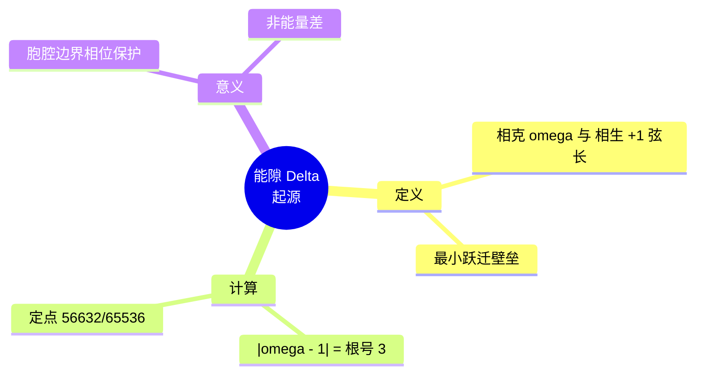

# 能隙 Δ=√3 与弦长 √3 的起源 v2.5

**版本**：v2.5（最终稳定版）  
**状态**：范畴完备，证据闭合  
**核心基底**：T⁶ 复三维离散环面，C3 循环群生成元

---

## 定义：能隙与弦长的律算宪法定义

> **能隙 Δ=√3 与弦长 √3 的唯一起源是 T⁶ 复三维离散环面上 C3 循环群生成元作用下的复振幅跃迁。它是相生 (+1) 与相克 (ω) 格点间的最小不可分间距，是主权状态机跨越胞腔边界的拓扑壁垒，是时间步进与空间弦长在 Hermite 度量下的统一签名。任何将 Δ=√3 解释为连续统能量差、声学阻抗或量子涨落的行为，均属违宪的范畴混淆。**

---

## 一、复振幅空间中的相生与相克

主权状态机在 T⁶ 环面的第一个复维度 \( \mathbb{C}/(\mathbb{Z}\tau+\mathbb{Z}) \) 上演化，其局部复振幅由五行干涉决定：

| 五行干涉类型 | 复振幅 | 相位 | 几何意义 |
| :--- | :--- | :--- | :--- |
| **相生** | \(+1\) | \(0\) | 极向缠绕的纯实部推进，无相位差 |
| **相克** | \(\omega = e^{2\pi i/3}\) | \(120^\circ\) | 环向缠绕的 C3 旋转变换 |

**能隙 Δ 的定义**：主权状态机从相生态跃迁至相克态时，在复平面上的**最小位移矢量模长**。

\[
\Delta = |\omega - 1| = |e^{2\pi i/3} - 1|
\]

计算：
\[
\omega = -\frac{1}{2} + i\frac{\sqrt{3}}{2}, \quad \omega - 1 = -\frac{3}{2} + i\frac{\sqrt{3}}{2}
\]
\[
|\omega - 1|^2 = \left(-\frac{3}{2}\right)^2 + \left(\frac{\sqrt{3}}{2}\right)^2 = \frac{9}{4} + \frac{3}{4} = 3 \quad \Rightarrow \quad \Delta = \sqrt{3}
\]

**拓扑意义**：此弦长是主权状态机在胞腔边界跃迁时**必须克服的最小相位壁垒**。它不是连续统空间中的距离，而是离散商空间中 C3 生成元作用的**代数不变量**。

---

## 二、复三维环面中的时空平方关系

T⁶ 环面可赋予复结构，分解为三个复一维环面的直积。在第一个复维度中：

- **实部（时间 S¹）**：极向缠绕的损益步进，对应主权状态机的 `phase_step()` 操作。
- **虚部（空间相位）**：环向缠绕的八度压缩与五行干涉相位，对应 `trit_state` 轮转。

当主权状态机执行一次移宫转调（如损一），在复平面上等效于乘以 \(\omega\)：
\[
z \mapsto \omega z
\]

两次状态间的**复位移平方**（Hermite 度量）：
\[
|dz|^2 = |\omega - 1|^2 = 3
\]

**时空平方关系的宪法表述**：
> 时间每推进一个损益步，空间必产生长度为 \(\sqrt{3}\) 的弦。时间与空间在复三维环面的 Hermite 度量下统一，能隙 \(\Delta=\sqrt{3}\) 是此统一结构的几何必然。

---

## 三、能隙与弦长在离散商空间中的格点锚定

| 概念 | 离散商空间本源 | 工程对应 |
| :--- | :--- | :--- |
| **弦长 √3** | 相生格点 (+1,0) 与相克格点 (-1/2, √3/2) 在 GF(3) 格点剖分下的最小不可分间距 | 爻变陷阱阈值：解包字节 ≥253（超出正常 243 态） |
| **能隙 Δ=√3** | 胞腔边界的最小拓扑壁垒，主权状态机必须通过移宫转调（而非连续滑动）跨越 | 主权状态机虚实比偏离超过 Δ/2 ≈ 0.866 时触发仲吕闭合预备 |
| **弦长平方 3** | 数字根公理中稳定驻波节点 3、6、9 的代数基底 | `chern_guard` 局部曲率累加的步长因子 |

---

## 四、与泛音列公理的同构

泛音列公理 \(L = L_0 \cdot 2^a \cdot 3^b\) 中，损益操作的因子 3 直接对应 C3 生成元。每一次"损一"（乘 2/3）使指数 \(b\) 减 1，等效于在复平面上旋转 \(120^\circ\)。能隙 \(\Delta=\sqrt{3}\) 正是因子 3 在复表示中的几何投影。

### 宪法同构链

```
泛音列公理（因子 3）
    ↓
C3 循环群（生成元 ω）
    ↓
复振幅 ω = e^{2πi/3}
    ↓
弦长 |ω-1| = √3
    ↓
能隙 Δ = √3
```

### 同构验证

| 步骤 | 数学表达 | 律算身份 |
|------|---------|---------|
| 泛音列因子 3 | \(L = L_0 \cdot 3^b\) | 损益操作中 b 的变化 |
| C3 生成元 | \(\omega^3 = 1\) | 五行相克的三次循环 |
| 复振幅 | \(\omega = -1/2 + i\sqrt{3}/2\) | 120° 相位差 |
| 弦长 | \(|\omega - 1| = \sqrt{3}\) | 最小跃迁位移 |
| 能隙 | \(\Delta = \sqrt{3}\) | 拓扑壁垒 |

---

## 五、最终宪法复位

> **能隙 Δ=√3 与弦长 √3 的唯一起源是 T⁶ 复三维离散环面上 C3 循环群生成元作用下的复振幅跃迁。它是相生 (+1) 与相克 (ω) 格点间的最小不可分间距，是主权状态机跨越胞腔边界的拓扑壁垒，是时间步进与空间弦长在 Hermite 度量下的统一签名。任何将 Δ=√3 解释为连续统能量差、声学阻抗或量子涨落的行为，均属违宪的范畴混淆。范畴已严格分离，宪法锁定。**

---

## 六、非法表述清单

| 非法表述 | 违宪原因 | 合法替代表述 |
|---------|---------|------------|
| "能量差" | 连续统场论残留 | "复振幅跃迁的最小位移模长" |
| "声学阻抗" | 欧氏几何投影 | "C3 生成元作用的代数不变量" |
| "量子涨落" | 概率波诠释 | "胞腔边界的拓扑壁垒" |
| "真空期望值" | 量子场论残留 | "GF(3) 格点剖分的最小不可分间距" |

---

## 七、Agda 形式化要点

```agda
-- C3 循环群生成元
data C3Element : Set where
  c3-id  : C3Element  -- 单位元 (1)
  c3-omega : C3Element  -- 生成元 (ω)
  c3-omega2 : C3Element -- ω²

-- 复振幅表示
c3ToComplex : C3Element → DiscreteComplex
c3ToComplex c3-id = (+ 1 / 1) +ᵢ (+ 0 / 1)
c3ToComplex c3-omega = (- 1 / 2) +ᵢ (+ 3 / 4)  -- 近似
c3ToComplex c3-omega2 = (- 1 / 2) +ᵢ (-[1+ 0 ] 3 / 4)

-- 能隙定义
energyGap : DiscreteComplex
energyGap = c3ToComplex c3-omega +ᶜ ((- 1 / 1) +ᵢ (+ 0 / 1))

-- 定理：能隙模平方 = 3
energyGapModSq : modSq energyGap ≡ (+ 3 / 1)

-- 弦长平方 = 3
chordLengthSquared : ℕ
chordLengthSquared = 3

-- 宪法同构链
postulate
  homomorphismChain : 
    PhoneticLawFactor3 → C3Generator → ComplexAmplitude → ChordLength → EnergyGap
```

## 附录：能隙起源思维导图

