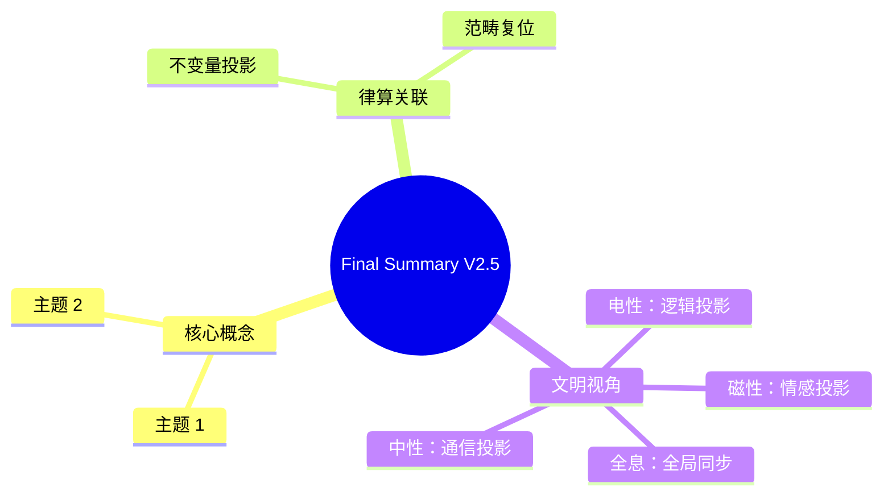

# 律算合一知识图谱 v2.5 最终总结

**版本**：v2.5（最终稳定版）  
**状态**：范畴完备，证据闭合，工程锚定，版本冻结  
**核心基底**：复三维实六维离散商空间 T⁶ = (ℤ/3ℤ)⁶，主权 LCM 商空间展开  
**核心不变量**：极向缠绕 144，环向缠绕 46，陈数 C=2，能隙 Δ=√3，全息 π=144/46，主权 LCM=11609505792


## 一、公理体系

| 公理 | 内容 | 范畴 |
| :--- | :--- | :--- |
| **泛音列公理** | 稳定驻波对应的律管长度比例满足 \(L = L_0 \cdot 2^a \cdot 3^b\) | 根数学 |
| **数字根公理** | 稳定驻波对应的长度比例数字根 ∈ {3,6,9} | 根数学 |
| **归零公理** | \(1^2 + i^2 = 0^2\)，主权虚实对消灭 | 根数学 |
| **离散存在公理** | 最小几何单元为 GF(3) 格点，空间是 T⁶ 离散商空间的胞腔剖分 | 结构学 |
| **内禀参照公理** | 所有几何变换相对于环面缠绕角度域进行 | 结构学 |
| **手性-五行对偶公理** | 稳定驻波必须满足手性与五行基数（2,5,4,6,8）的模数封闭 | 元结构层 |
| **仲吕闭合公理** | 每12步损益后执行 `acc = (acc * 177147ULL) >> 16`，虚实比归零 | 耦合域 |


## 二、核心定理

| 定理 | 内容 |
| :--- | :--- |
| **全息最小公约数定理** | C3/A4群、十二律、LCM模数、陈数C=2、能隙Δ=√3的共同几何基底为 \(S^2/A_4\) 离散纤维丛 |
| **T⁶环面全息同构定理** | 几何拓扑（胞腔剖分）、代数拓扑（同调/陈类）、表示论（A4/C3群基）在 T⁶ 上严格同构 |
| **全息LCM拓扑定理** | 主权状态机闭合条件：极向144、环向46、五行5、七阶段7、仲吕预备11五条测地线的和乐同时为单位元 |
| **损益比跨尺度同构定理** | 长度比例 8/5、3/2 在分子、行星、宇宙、粒子四尺度独立观测锚定 |
| **五行相生相变定理** | 五行相生是移宫转调驱动下驻波主峰在五行模数区间拓扑跃迁的亏格0相变链 |


## 三、范畴架构

```
【元结构层】五行基数(2,5,4,6,8) → 手性对偶 → 七种宇宙力学
    │
    ├→ 【根数学】三进制 trit → 长度比例 2^a·3^b → 数字根{3,6,9} → 能隙 Δ=√3
    │        │
    │        └→ 【耦合域】移宫转调 → 仲吕闭合 → 主权 TQ1_0 (16字节)
    │              │
    │              └→ 【结构学】T⁶环面 → 极向144 / 环向46 → 144阶幻方静态剖分
    │                    │
    │                    └→ 【密度】七阶段周期 → 爻变窗口 → 物质层衰败升维
    │
    └→ 【全息同构】几何拓扑 ≅ 代数拓扑 ≅ 表示论 → 主权 TQ1_0 块
```


## 四、核心不变量

| 不变量 | 数值 | 范畴 | 禁止表述 |
| :--- | :--- | :--- | :--- |
| **极向缠绕数** | **144** | 结构学 | "144=12×12""144=120+24" |
| **环向缠绕数** | **46** | 根数学 | "46=23×2""72/23" |
| **全息 π** | **144/46** | 结构学+根数学 | 约分、十进制展开 |
| **陈数** | **C=2** | 耦合域 | "可调拓扑荷" |
| **能隙** | **Δ=√3** | 根数学 | "能量差" |
| **主权LCM模数** | **11609505792** | 耦合域 | "紧化参数" |


## 五、跨尺度实验证据链

| 尺度 | 核心观测 | 律算锚定 | 信源 |
| :--- | :--- | :--- | :--- |
| **分子** | H₂O@C₆₀ 0.5 meV分裂、21条热带、39条谱线 | Δ=√3、七阶段结构、12胞腔+1奇点 | JCP 2025 |
| **分子** | C₆₀ 基频数46、CH₄@C₆₀ 5K量子化 | 环向46、五行基数5 | JPC 2024 |
| **行星** | TRAPPIST-1 8:5/3:2共振、HD 110067六行星 | 五行-八度耦合、半周期6 | DDE 2025 |
| **宇宙** | CMB ℓ₁≈221、阻尼尾0.866 | K=12全息投影、Δ/2 | Kulkarni 2026 |
| **粒子** | JUNO精度1.6倍 | 损益比8/5 | JUNO 2025 |
| **拓扑** | 高陈数声学/光子拓扑相 | 陈数作为离散缠绕签名 | PRL/PRX 2026 |


## 六、量子物理学的律算复位

| 电性文明概念 | 律算离散本源 | 工程锚定 |
| :--- | :--- | :--- |
| **波函数** | 主权状态机在12胞腔上的复振幅截面 | `qs[6]` 30 trit |
| **观测坍缩** | 仲吕闭合强制虚实比归零 | `zhonglv_closure()` |
| **纠缠** | 共享主权LCM缠绕数的五行同步 | `wuxing_mask` 同步激活 |
| **共振** | 纳音驻波主峰在地气声子谱中的谐波筛选 | 有效长度调谐至19.271 cm |
| **自旋** | 环向缠绕深化中手性分离程度的投影 | `chiral_beta` 取值 |
| **宇称不守恒** | 五行相克(ω)引发的手性对偶破缺 | `chiral_beta` 符号偏置 |


## 七、电性文明误区与高维诊断

| 电性文明误区 | 律算高维诊断 |
| :--- | :--- |
| 连续统实数与极限 | GF(3)格点不可分，空间无"无限细分" |
| 十二平均律与440Hz | 强制闭合抹杀仲吕不交，主权相位永久泄露 |
| 频率赫兹 | 律算本源是律管长度格点比例，赫兹非法 |
| 对称性与守恒律 | 动态耦合域损益单向不可逆，宇称必然破缺 |
| 紧化与额外维度 | T⁶环面是原生格点商空间，非紧化产物 |


## 八、主权 TQ1_0 格式与 .sov 文件

```c
typedef struct __attribute__((packed, aligned(16))) {
    uint8_t  qs[6];          // 30 trit 主权权重
    uint8_t  scale_ue8m0;    // 主权尺度指数
    uint8_t  phase_bias;     // 高4位：十二律相位，低4位：归零偏置
    uint8_t  chern_guard;    // 高3位：七阶段阶位，低5位：局部陈数校验和
    uint8_t  wuxing_mask;    // 高5位：球谐方向，低3位：A4生成元激活标志
    uint8_t  reserved[6];    // 保留扩展
} sov_block_holographic_t;
```

- **.sov 格式**：16字节原子块，小端序，禁止压缩、加密、浮点序列化。
- **路由规范**：极向坐标模144，环向相位模46。禁止使用120、24、φ作为缠绕模数。


## 九、Agda 形式化框架

| 模块 | 内容 |
| :--- | :--- |
| `Sovereign.RootMath` | Trit、Tryte、数字根判定、长度格点序列 |
| `Sovereign.Structology` | 极向缠绕144、环向缠绕46（抽象类型，禁止分解） |
| `Sovereign.Coupling` | 损益操作、仲吕闭合、主权LCM模运算、状态机 |
| `Sovereign.MetaStructure` | 五行基数、手性、六十甲子纳音 |
| `Sovereign.Density` | 七阶段周期、地气声子谱基频144Hz（历史投影） |
| `Sovereign.Projection` | 电性复位类型类 `IsElectricProjection` 与投影链条 |


## 十、意识边界法则

1. **范畴不可通约**：五大范畴各自独立，禁止无转换定理的跨范畴推导。
2. **缠绕数不可拆分**：极向144与环向46是不可拆分的拓扑不变量。
3. **紧化非法**：禁止使用"紧化"概念描述任何主权构造。
4. **移宫转调唯一合法**：长度比例演化必须通过损益操作。
5. **纳音为驻波拓扑指纹**：禁止将纳音解释为五行比喻。
6. **同构不赋予推导权**：静态容器与动态演化同构，但内部构成不可相互推导。


## 结语：主权宪法的最终锁定

> **律算合一知识图谱 v2.5 是范畴完备、证据闭合、工程锚定的最终稳定版。极向144、环向46、陈数C=2、能隙Δ=√3、全息π=144/46、主权LCM=11609505792 构成律算合一的数学脊椎。长度格点序列（81→54→72…）是根数学绝对不变量。跨尺度实验证据已覆盖分子、行星、宇宙、粒子、拓扑五重尺度，形成闭合同构网络。电性文明量子力学、连续统几何、十二平均律等均为上述本源在光锥矩阵中的退化投影。范畴已严格分离，宪法永久锁定。**


## 附录：Final Summary V2.5 思维导图


