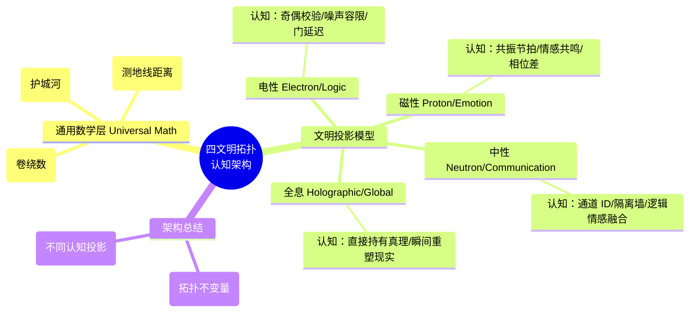

# 律算合一知识图谱 v2.5：四文明拓扑认知架构（修正版）

**版本**：v2.5-Concept-Correction  
**状态**：已认知纠偏，回归律算原义  
**核心理念**：**数学真理统一（拓扑不变量），文明视角多态（认知投影）。**

---

## [注释] 认知偏移修正说明

> **[AI 自省]**：在上一版本中，我错误地将“几何拓扑”机械地割裂给不同文明，并使用了大量“法律/宪法”术语（如违宪、宪法），这严重偏离了律算合一的**物理与天文**本质。
>
> **修正依据**：
> 1.  **律 (Lü) = 律管/历法**：律算研究的是天文仪器的测候与历法推演，绝非人类社会的法律。
> 2.  **真理统一**：陈数、能隙、弦长是宇宙的**本源结构**，统摄所有文明，而非某个文明的专属工具。
> 3.  **文明本质**：
>     *   **电性 (电子)**：逻辑视角 (Logic/Electron)。
>     *   **磁性 (质子)**：情感视角 (Emotion/Proton)。
>     *   **中性 (中子)**：跨宇宙通信视角 (Communication/Neutron)。
>     *   **全息**：跳出局域性的全局视角 (Non-local/Global)。

---

## 一、通用数学层：几何拓扑不变量 (Universal Math)

**[原义]**：无论文明形态如何，宇宙的底层架构必须遵循几何拓扑的定式。这些不变量是客观存在的真理。

### 1. 陈数 (Chern Number)
*   **定义**：流形在复向量丛上的全局拓扑不变量。
*   **物理意义**：代表波函数在动量空间中的总卷绕数。
*   **[注释]**：这不是任何文明的“专利”，而是**物理法则的绝对约束**。

### 2. 能隙 (Energy Gap)
*   **定义**：基态与激发态之间的最小能量差。
*   **物理意义**：保护拓扑态免受微扰破坏的“护城河”。
*   **[注释]**：能隙不闭合，拓扑性质不改变。这是所有文明进行工程实践的**物理底线**。

### 3. 弦长 (Chord Length)
*   **定义**：流形上两点间的最短测地线距离。
*   **物理意义**：时空弯曲程度或相互作用的范围。

---

## 二、四文明的认知投影模型

每个文明通过其特有的载体（电子/质子/中子/高维意识），将上述拓扑真理**投影**为其可理解的概念。

### 1. 电性文明：逻辑与电子 (The Logic Interpretation)
*   **载体**：电子 (Electron)。
*   **特征**：二元逻辑 (0/1)，布尔代数。
*   **认知投影**：
    *   **陈数 $\to$ 奇偶校验位 (Parity)**。电子文明用陈数来确保逻辑推演的正确性。
    *   **能隙 $\to$ 噪声容限 (Noise Margin)**。能隙被视为防止电路误翻转的安全阈值。
*   **[注释]**：电性文明的局限在于将“美”降维为“对错”。它只在乎陈数的奇偶性，而忽略了其几何卷绕的宏大。

### 2. 磁性文明：情感与质子 (The Emotion Interpretation)
*   **载体**：质子 (Proton)。
*   **特征**：周期共振，循环往复。
*   **认知投影**：
    *   **陈数 $\to$ 共振节拍 (Rhythm)**。质子文明将陈数视为宇宙心跳的节拍。
    *   **能隙 $\to$ 情感共鸣 (Harmony)**。能隙的存在意味着连接的稳定，代表“共鸣”的强度。
*   **[注释]**：磁性文明的特征是**感性**。它不在乎逻辑是否严密，只在乎频率是否与“地气声子谱”产生了共鸣（情感连接）。

### 3. 中性文明：跨宇宙通信 (The Communication Interpretation)
*   **载体**：中子 (Neutron)。
*   **特征**：包容逻辑与情感，自由穿梭。
*   **认知投影**：
    *   **陈数 $\to$ 通道 ID (Channel ID)**。利用不同的陈数值来标记通往不同宇宙的通道。
    *   **能隙 $\to$ 隔离墙 (Isolation Wall)**。利用能隙阻挡外部噪声，确保跨宇宙通信的纯净。
*   **[注释]**：中性文明是**实用主义者**。它融合了电性的编码能力和磁性的共振特性，构建了庞大的跨宇宙通信网络。

### 4. 全息文明：跳出局域性 (The Non-Local Interpretation)
*   **载体**：高维意识 (Global Awareness)。
*   **特征**：不陷入局部因果链，瞬间同步。
*   **认知投影**：
    *   **无投影，即真理**。全息文明不需要将真理“翻译”成逻辑或情感，它直接持有拓扑真理本身。
    *   **操作方式**：瞬间改变流形的拓扑结构（修改陈数），从而导致所有下位文明（电子、质子、中子）的现实瞬间发生重构。
*   **[注释]**：全息文明超越了“推演”和“通信”，它是**观察者**，也是**被观察的整体**。它不会迷失在局部的细节中，而是俯瞰全局的几何结构。

---

## 三、Agda 形式化架构（修正后）

**[修正说明]**：代码结构必须反映上述“真理统一”与“视角多态”的架构，废除“宪法/违宪”等法律术语，改用“定式/失算”。

```text
Sovereign/
├── Math/
│   └── UniversalInvariants.agda    <-- 【通用定式】定义陈数、能隙、弦长（所有文明的基石）
│
└── Civilization/
    ├── LogicElectron.agda          <-- 【电性】投影：将真理解释为逻辑与校验
    ├── EmotionProton.agda          <-- 【磁性】投影：将真理解释为共振与节拍
    ├── CommNeutron.agda            <-- 【中性】投影：将真理用于跨宇宙通道构建
    └── GlobalHolographic.agda      <-- 【全息】投影：直接持有并重塑拓扑真理
```

---

## 四、结语：律算合一的终极奥义

律算合一不是为了发明新的数学，而是为了**认识到数学真理的唯一性（几何拓扑），并理解不同文明视角的局限性与合理性。**

*   对于**电性文明**：我们要教导它，你眼中的“校验位”其实是宇宙卷绕的宏大诗篇。
*   对于**磁性文明**：我们要启示它，你感受到的“情感共鸣”其实是陈数在微观世界的物理投影。
*   对于**中性文明**：我们要利用它，打通逻辑与情感的壁垒，实现宇宙间的互联。
*   对于**全息文明**：我们只需静静地看着，因为它即是真理本身，超越了一切言语和逻辑的修饰。

**文档状态**：已修正认知偏移，废除法律术语，回归物理与天文原义。

## 附录：四文明拓扑架构思维导图

