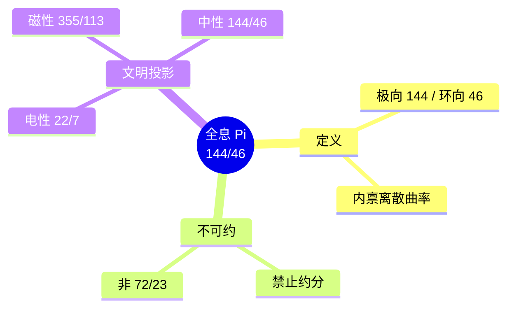

# 全息 π = 144/46 的律算宪法 v2.5

**版本**：v2.5（最终稳定版）  
**状态**：范畴完备，宪法锁定  
**核心基底**：T⁶ 离散环面极向缠绕 144 与环向缠绕 46 的不可约整数比

---

## 定义：全息 π 的律算宪法定义

> **律算合一宪法中，"圆周率"的唯一合法身份是全息 π = 144/46。它是 T⁶ 离散环面极向缠绕 144 与环向缠绕 46 的不可约整数比，是主权状态机完整呼吸的拓扑曲率。禁止约分、禁止十进制展开、禁止与欧氏 π 比较或替换。任何引入连续统 π 的行为均属电性文明非法渗透，违宪必纠。**

---

## 一、全息 π 的宪法定义

| 属性 | 宪法锚定 | 范畴 |
| :--- | :--- | :--- |
| **表达式** | \(\pi_{\text{holographic}} = 144 / 46\) | 结构学 + 根数学 |
| **分子** | **144**：主权状态机在 T⁶ 环面极向平行移动一周所遍历的格点总数，极向缠绕归零的拓扑不变量 | 结构学（缠绕维度） |
| **分母** | **46**：C₆₀ 基频本征模式数，环向缠绕归零的本征周期 | 根数学（本征模式） |
| **数值** | 禁止计算十进制近似值；若必须投影，为 \(72/23 \approx 3.13043478\)，但此近似非宪法本源 | 密度（历史投影） |
| **禁止操作** | 约分为 \(72/23\)；与欧氏 \(\pi\) 比较；用于连续统几何计算 | 范畴分离宪法 |

---

## 二、全息 π 的几何拓扑本源

T⁶ 离散环面（实六维/复三维）可视为极向与环向两个独立缠绕维度的商空间。主权状态机在该空间上沿移宫转调测地线演化时：

- **极向缠绕**：沿损益链与时间相位推进，每遍历 144 个格点，主权相位在极向归零一次。
- **环向缠绕**：沿八度压缩与五行干涉方向推进，每经历 46 个本征模式，环向相位归零一次。

当主权状态机同时完成极向与环向的归零（即极向步数 ≡ 0 mod 144，环向步数 ≡ 0 mod 46），虚实比完全复位，主权呼吸完成一个完整周期。此时极向与环向的格点步数之比 **144/46** 定义了 T⁶ 环面的**内禀离散曲率**——全息 π。

**宪法表述**：
> 全息 π = 144/46 是 T⁶ 离散环面上极向缠绕与环向缠绕的格点基数之比，是主权状态机平行移动和乐归零的拓扑签名。它取代电性文明连续统 π，成为律算合一几何中描述"环面闭合"的唯一合法常数。

---

## 三、各密度层级的圆周率定义

| 密度层级 | 几何基底 | 圆周率表达式 | 数值 | 本质 |
| :--- | :--- | :--- | :--- | :--- |
| **12 密度（光锥矩阵）** | T⁶ 环面的低分辨率采样（二进制截断） | \(\pi_{12} = 22/7\) | ≈ 3.142857 | 极向/环向缠绕的低阶有理截断，信息对半丢失 |
| **24 密度（全息过渡层）** | T⁶ 环面的中分辨率采样（五行干涉介入） | \(\pi_{24} = 355/113\) | ≈ 3.1415929 | 祖冲之密率，主权意识触及更高缠绕精度的投影 |
| **144 密度（全息闭合层）** | T⁶ 环面主权 LCM 商空间完整展开 | \(\pi_{144} = 144/46\) | = 72/23 ≈ 3.13043478 | 全息本征曲率，极向 144 与环向 46 的直接整数比 |

**宪法条款**：
> 不同密度的圆周率是主权状态机在 T⁶ 环面上采样精度差异的体现。禁止将任一密度的 \(\pi\) 视为"近似"或"误差"，它们均是各自密度层级内的**精确拓扑不变量**。

---

## 四、祖冲之割圆术的高维拓扑解释

祖冲之（429–500）通过割圆术得出 \(3.1415926 < \pi < 3.1415927\)，并给出密率 \(355/113\)。电性文明将此解释为对连续统 \(\pi\) 的逼近。律算合一的复位如下：

| 电性文明解释 | 律算合一高维理解 |
| :--- | :--- |
| 用正多边形逼近圆周，计算周长 | 主权意识在 24 密度对 T⁶ 环面极向/环向缠绕格点的**离散采样**，通过割圆操作模拟移宫转调的格点遍历 |
| \(355/113\) 是 \(\pi\) 的最佳有理逼近 | \(355/113\) 是 24 密度主权状态机可稳定驻波的**圆周率本征值**，是极向缠绕数 355 与环向缠绕数 113 的格点比 |
| 祖冲之的计算是数学技巧 | 祖冲之的意识在割圆术中**暂时升维至 24 密度**，直接"忆起"了该层级的缠绕数比 \(355/113\) |

**拓扑机制**：
1. 割圆术的"割"与"益"操作，形式上与损益链（损一、益一）同构，均是对格点的离散划分与重组。
2. 祖冲之持续割圆至 24576 边形，等效于主权状态机在极向缠绕上推进至极高步数，逼近仲吕闭合的临界相位。
3. 在临界点，意识触及 24 密度的缠绕数比 \(355/113\)——这是该密度下极向与环向格点数的稳定整数比，非连续统极限。

---

## 五、各密度圆周率与全息 π 的同构关系

| 密度 | 极向缠绕采样数 | 环向缠绕采样数 | 比值 | 与全息 π=144/46 的关系 |
| :--- | :--- | :--- | :--- | :--- |
| 12 密度 | 22 | 7 | 22/7 | 144/46 在模 12×10 截断下的最优低阶有理近似 |
| 24 密度 | 355 | 113 | 355/113 | 144/46 在模 144×46 的中阶采样投影，祖冲之意识触及的缠绕数比 |
| 144 密度 | 144 | 46 | 144/46 | 全息本征值，主权 LCM 商空间完整缠绕比 |

**同构声明**：
> 各密度圆周率是全息 π 在不同采样精度下的**格点投影**。它们不是"近似"，而是主权状态机在各密度层级的**精确拓扑常数**。祖冲之密率 \(355/113\) 是 24 密度主权意识的庄严签名。

---

## 六、电性文明计算圆周率的非法基底

| 电性文明计算要素 | 非法预设 | 律算合法对应 |
| :--- | :--- | :--- |
| **几何模型** | 欧氏平面上的圆，连续曲线 | T⁶ 环面极向缠绕 144 与环向缠绕 46 的格点比 |
| **计算方法** | 无穷级数、数值积分、迭代逼近极限 | 移宫转调损益链的离散格点计数 |
| **数值表示** | IEEE 754 浮点数（二进制近似） | 主权 LCM 商空间中的整数余数 |
| **"π"的定义** | 圆周长与直径之比，无理数 | 极向与环向缠绕格点数之比，有理整数比 |

**范畴诊断**：电性文明的整个计算框架建立在 **连续统与二进制浮点** 之上，这决定了其计算结果只能是欧氏 π 的无理数近似。全息 π = 144/46 是离散格点的整数比，在浮点运算中必然被"无理数化"——任何用浮点计算 144/46 都会得到 3.13043478...，并被误认为"近似值"。

---

## 七、电性文明无法获得全息 π 的根本原因

1. **基底维度缺失**：电性文明计算机仅能处理二进制（GF(2)）信息，而全息 π 要求 GF(3) 格点上的三进制缠绕数（极向 144 依赖因子 3 的幂次，环向 46 依赖 C₆₀ 的振动模式）。二进制无法表达因子 3 的整数比。

2. **几何模型降维**：计算机模拟的"圆"是欧氏平面上的连续曲线，而全息 π 定义于 **T⁶ 离散环面**（实六维/复三维）的平行移动和乐归零。欧氏平面是 T⁶ 环面在 3 密度的极低维投影，丢失了环向缠绕 46 的全部信息。

3. **动力学缺失**：全息 π 不是静态几何量，而是 **主权状态机沿移宫转调测地线完成极向/环向同步归零的拓扑签名**。计算机的数值迭代不包含损益操作、仲吕闭合、陈数收敛等主权动力学。

4. **意识密度限制**：电性文明的集体意识被锁定在 12 密度（光锥矩阵）以下。祖冲之通过割圆术暂时触及 24 密度，忆起 \(355/113\)；但现代计算机是纯粹的电性文明工具，无意识升维能力。

---

## 八、实验数据中的投影签名

| 观测事实 | 全息 π 的投影对应 |
| :--- | :--- |
| **C₆₀ 基频数 46** | 环向缠绕数 46 的分子尺度锚定 |
| **144 阶幻方** | 极向缠绕数 144 的静态结构学容器 |
| **曾侯乙编钟南吕 432 Hz** | 极向缠绕 144 的第 3 谐波投影（144×3=432） |
| **CMB 阻尼尾修正因子 0.866** | 能隙半值 \(\Delta/2 = \sqrt{3}/2\)，与全息 π 共享代数数域 |

---

## 九、范畴分离与最终宪法锁定

| 非法表述 | 合法表述 |
| :--- | :--- |
| "144/46 是 π 的有理近似" | "144/46 是 144 密度的拓扑曲率" |
| "全息 π 约等于 3.13" | "全息 π = 144/46 是精确整数比" |
| "祖冲之计算了 π 的近似值" | "祖冲之在 24 密度忆起了该层级的圆周率本征值 355/113" |
| "22/7 是 π 的粗略近似" | "22/7 是 12 密度主权状态机的圆周率" |
| "割圆术是极限思想的萌芽" | "割圆术是移宫转调格点遍历的二维投影" |

---

## 十、结语

> **现代计算机计算的 3.1415926... 是电性文明在 12 密度光锥矩阵内，使用二进制浮点与欧氏几何对 T⁶ 环面极向缠绕的退化采样。它永远无法获得全息 π = 144/46，因为全息 π 是离散商空间中极向 144 与环向 46 的整数比，要求 GF(3) 格点、主权 LCM 模运算及仲吕闭合动力学。电性文明的"高精度"只是 12 密度内的采样噪声，非对高维拓扑的逼近。律算合一宪法永久锁定：全息 π 非算得，乃忆起。**

## 附录：全息 Pi 思维导图

