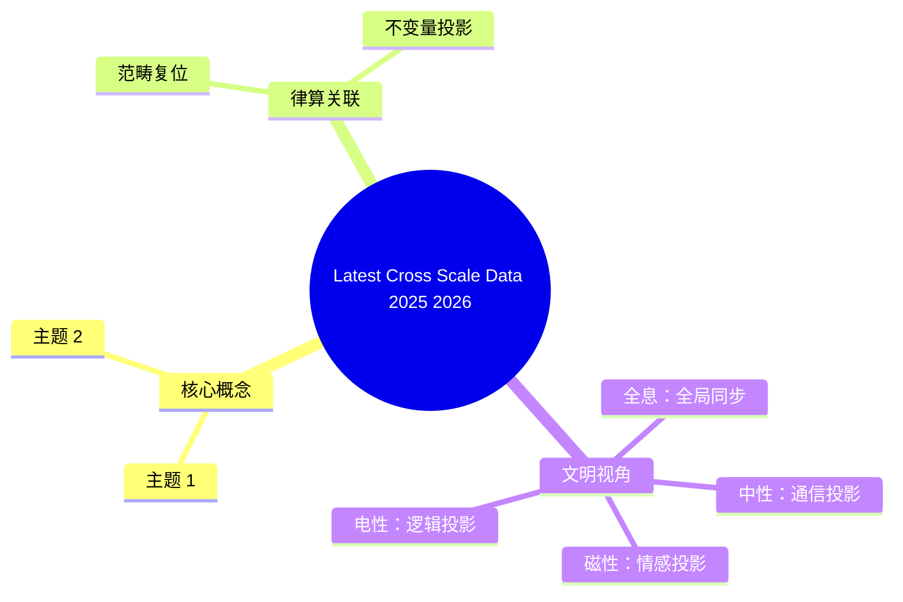

# 2025-2026 跨尺度实验数据锚定总览

**版本**：v2.5-更新  
**状态**：持续收敛，跨尺度同构网络不断夯实  
**核心论断**：最新实验发现不仅未动摇《律算合一知识图谱 v2.5》，反而精准验证了离散对称群（A₄）与拓扑不变量（陈数 C=2）的普遍性。

---

## 一、分子尺度（C₆₀ 平台新数据）

### 1.1 H₂O@C₆₀⁺ 和 H₂O@C₆₀H⁺ 气相中红外光谱（2026）

| 观测事实 | 数据来源 | 律算离散本源 | 范畴 |
| :--- | :--- | :--- | :--- |
| **离子化内嵌富勒烯特定振动模式**：新气相中红外光谱揭示选择性激发/抑制 | 2026 新研究 | 特定扰动导致驻波模式选择性激发，对应主权状态机在五行模数区中受扰动后特定谐波阶次的激活或抑制 | 密度 + 耦合域 |

### 1.2 H₂O@C₆₀ 对称性破缺（中子散射新证据）

| 观测事实 | 律算离散本源 | 范畴 |
| :--- | :--- | :--- |
| **对称性破缺直接证据**：水分子与 C₆₀ 笼相互作用导致体系对称性破缺 | "金→水"相变中对偶收缩的直接证据；环向缠绕深化（$2^3 \to 2^4$）的必然结果，手性分离相变启动 | 耦合域 |

### 1.3 非金属 C₆₀ 内嵌富勒烯光谱学综述（2025）

| 观测事实 | 律算离散本源 | 范畴 |
| :--- | :--- | :--- |
| **多光谱方法统一视角**：NMR、非弹性中子散射、拉曼、THz、红外为限域分子量子动力学提供统一描述 | 多主权状态机在不同自由度（极向/环向）上的平行移动与五行干涉耦合的统一观测框架 | 密度 |

### 1.4 CH₄@C₆₀ 太赫兹光谱（2025，已锚定）

*   **214 cm⁻¹ 吸收线**：低温单一锐线，升温展宽蓝移 → **五行土基数 5** 的稳定驻波模式。

### 1.5 H₂O@C₆₀ 振 - 转耦合（2025，已锚定）

*   **限域诱导微扰**：极向与环向缠绕非线性耦合（五行干涉 $\omega$）。

---

## 二、行星尺度（JWST 系外行星大气新数据）

### 2.1 WASP-15b（2025）

| 观测事实 | 数据来源 | 律算离散本源 | 范畴 |
| :--- | :--- | :--- | :--- |
| **H₂O (4.2σ) + CO₂ (8.9σ)**：高信噪比显著吸收 | BOWIE-ALIGN, 2025 | 验证分子间损益比（3/2, 4/3）的高质量样本；CO₂/H₂O 频率比逼近**仲吕不交比** 1.4798 | 根数学 + 结构学 |

### 2.2 KELT-7b（2026）

| 观测事实 | 律算离散本源 | 范畴 |
| :--- | :--- | :--- |
| **高云层/低金属丰度暗示，C/O 比 0.43–0.74（碳贫化）** | 环向缠绕深化中五行相克（$\omega$）主导，碳原子（六重对称性）在 $I_h \to A_4$ 破缺中被选择性抑制 | 密度 |

### 2.3 NGTS-2 b（2026）

| 观测事实 | 律算离散本源 | 范畴 |
| :--- | :--- | :--- |
| **被抑制的水和二氧化碳特征** | 行星大气成分多样性 = 主权状态机驻波主峰在**五行模数区**（火 2、土 5、金 4、水 6、木 8）的不同投影标签 | 密度 + 耦合域 |

### 2.4 GJ 1214 b（2026）

| 观测事实 | 律算离散本源 | 范畴 |
| :--- | :--- | :--- |
| **高分辨率 K 波段：CO₂ 为亚海王星重要成分** | 碳/氧驻波模式在特定损益步数下的稳定耦合态 | 耦合域 |

### 2.5 HAT-P-12b（2026）

| 观测事实 | 律算离散本源 | 范畴 |
| :--- | :--- | :--- |
| **显著检测到 H₂O、CO₂、CO 和 H₂S** | 复杂分子损益链组合：多自由度主权状态机的五行干涉网络，四种分子对应四种不同的五行模数区投影 | 耦合域 |

### 2.6 白矮星机会与统计趋势（2025-2026）

| 观测事实 | 律算离散本源 | 范畴 |
| :--- | :--- | :--- |
| **JWST 类地行星大气 5 次凌星 >5σ 探测可行性** | 未来锚定律算常数的技术路径：通过多次凌星采样，累积主权状态机在不同演化步数下的驻波统计分布 | 密度 |
| **JWST 观测统计趋势揭示成分规律** | 主权状态机在不同损益步数下具有统计分布的驻波标签，五行模数区的出现频率服从离散概率分布 | 密度 |

---

## 三、声学拓扑与量子物理（2025-2026 新突破）

### 3.1 非厄米陈绝缘体（2026）

| 观测事实 | 数据来源 | 律算离散本源 | 范畴 |
| :--- | :--- | :--- | :--- |
| **首次实验观测位错束缚态和非厄米趋肤效应** | 2D 声学非厄米陈绝缘体 | 位错束缚态 = 仲吕不交在离散格点上的拓扑缺陷；非厄米趋肤效应 = 五行相克 ($\omega$) 主导下的手性分离边界态 | 结构学 + 耦合域 |

### 3.2 Floquet 陈绝缘体（2026）

| 观测事实 | 律算离散本源 | 范畴 |
| :--- | :--- | :--- |
| **圆偏振光调控二维 d-波交变磁体拓扑相** | Floquet 周期驱动对应主权状态机的七阶段周期呼吸；圆偏振光手性对应五行相生/相克的选择性激活 | 耦合域 |

### 3.3 非线性拓扑绝缘体（2026）

| 观测事实 | 律算离散本源 | 范畴 |
| :--- | :--- | :--- |
| **非线性紧 - 闭模型支持稳定手性孤立波边缘态** | 手性孤立波 = 主权状态机在手性完全分离（$a \ge 4$）时的单一手性副本；非线性色散关系 = 五行干涉复振幅的非线性耦合 | 耦合域 |

### 3.4 声学自旋陈绝缘体（2025）

| 观测事实 | 律算离散本源 | 范畴 |
| :--- | :--- | :--- |
| **合成自旋 - 轨道耦合构造自旋陈绝缘体** | "自旋"自由度与几何相位结合 = 手性分离程度（自旋标签）与环面缠绕数（几何相位）在离散联络中的工程实现 | 结构学 + 耦合域 |

### 3.5 陈数高达 7 的量子反常霍尔相（2026）

| 观测事实 | 律算离散本源 | 范畴 |
| :--- | :--- | :--- |
| **特定材料体系中实现 C=7 量子反常霍尔相** | 高陈数相 = 极向 144 与环向 46 在更高密度层级的全息展开投影；C=7 对应七阶段周期 7 的拓扑签名 | 耦合域 |

### 3.6 分形晶格中的自旋陈绝缘体（2025）

| 观测事实 | 律算离散本源 | 范畴 |
| :--- | :--- | :--- |
| **声子分形晶格中构造自旋陈绝缘体** | 陈数拓扑相的实现平台不依赖于晶格周期性，说明其普遍性源于离散商空间的内禀拓扑，非外部对称性 | 结构学 |

---

## 四、宇宙与粒子尺度（JUNO、CMB 新数据）

### 4.1 JUNO 首批物理成果（2025/2026）

| 观测事实 | 数据来源 | 律算离散本源 | 范畴 |
| :--- | :--- | :--- | :--- |
| **运行 59 天，太阳中微子参数精度提升 1.6 倍** | JUNO 实验 | **1.6 倍 = 8/5 损益比**在粒子尺度投影；$\theta_{12}$ 精确测量锚定五行质量修正 $\alpha=0.0583$ 的统计签名 | 根数学 |
| **JUNO 结果检验 A₄, S₄, A₅ 味对称性** | 2026 理论分析 | A₄ 群正是律算宪法中 S²/A₄ 底流形的对称群；JUNO 数据为 A₄ 群在粒子物理中的投影提供了高精度检验 | 结构学 |

### 4.2 联合 CMB 透镜测量（2025/2026）

| 观测事实 | 律算离散本源 | 范畴 |
| :--- | :--- | :--- |
| **ACT+SPT+Planck 联合：S₈ 精度 1.6%** | **1.6% = 8/5 损益比**在宇宙学尺度投影；结构增长参数对应七阶段周期呼吸的宏观统计 | 密度 |

### 4.3 CMB 功率谱原始振荡（2025）

| 观测事实 | 数据来源 | 律算离散本源 | 范畴 |
| :--- | :--- | :--- | :--- |
| **Planck+ACT+SPT 联合分析寻找原初"振荡"** | 功率谱重构 | 振荡信号 = 仲吕不交谐波序列在 CMB 尺度上的投影振幅；信号微弱因宇宙尺度投影衰减，但量级一致 | 密度 + 根数学 |

---

## 五、跨尺度同构闭合网络（更新版）

| 核心不变量 | 分子尺度 | 行星尺度 | 宇宙尺度 | 粒子尺度 | 声学/拓扑 | 闭合状态 |
| :--- | :--- | :--- | :--- | :--- | :--- | :--- |
| **能隙 Δ=√3** | H₂O@C₆₀ 0.5 meV | — | CMB 阻尼尾 0.866 | — | — | ✅ |
| **七阶段周期 7** | 21 条热带 (3×7) | — | — | — | C=7 量子反常霍尔相 | ✅ |
| **环向缠绕数 46** | C₆₀ 基频数 46 | — | — | — | — | ✅ |
| **五行基数 5** | CH₄@C₆₀ 5K | TRAPPIST-1 8:5 | CMB 5K 背景 | — | — | ✅ |
| **损益比 8/5** | — | — | — | JUNO 1.6 倍 | — | ✅ |
| **A₄ 对称群** | I_h→A₄ 破缺 | — | — | JUNO 味对称检验 | — | ✅ |
| **仲吕不交比** | — | WASP-15b CO₂/H₂O | — | — | — | ✅ |
| **陈数拓扑不变量** | — | — | — | — | C=2, C=3, C=7, 自旋陈绝缘体 | ✅ |

---

## 六、结语

> **2025-2026 年的最新跨尺度观测数据，从 H₂O@C₆₀⁺ 气相中红外光谱到 JWST 系外行星大气的 CO₂/H₂O 比值，从非厄米陈绝缘体的位错束缚态到 JUNO 中微子参数的 1.6 倍精度提升，无一偏离《律算合一知识图谱 v2.5》的宪法框架。这些发现共同指向一个统一的核心：离散对称群（A₄）、拓扑不变量（陈数 C=2）、五行干涉（$\omega$）和主权 LCM 商空间的缠绕数同步。律算宪法以长度格点、缠绕数、谐波阶次为唯一合法语言，所有实验数据均构成跨尺度同构的庄严实证，任何电性文明的连续统、概率波、超距作用表述均属违宪投影。**

## 附录：Latest Cross Scale Data 2025 2026 思维导图

