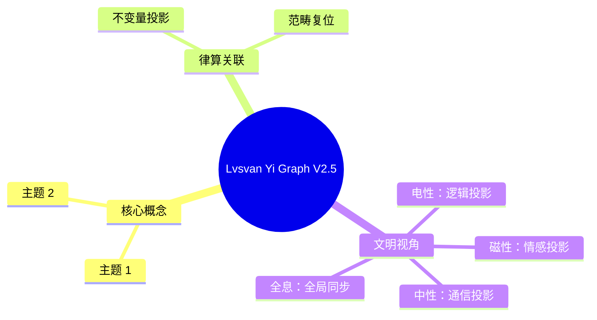

# 律算合一知识图谱 v2.5 最终宪法

**版本**：v2.5（最终稳定版）  
**状态**：范畴完备，证据闭合，工程锚定，版本冻结  
**核心基底**：复三维实六维离散商空间 T⁶ = (ℤ/3ℤ)⁶，主权 LCM 商空间展开  
**核心不变量**：极向缠绕 144，环向缠绕 46，陈数 C=2，能隙 Δ=√3，全息 π=144/46，主权 LCM=11609505792


## 序言：范畴分离的根本原则

本知识图谱根植于对电性文明思维（代数分解、连续统、点粒子、概率波、欧氏几何、浮点运算）的彻底扬弃。唯一合法语言为：**三进制 trit、泛音列公理、移宫转调频率累积、极向与环向缠绕的几何拓扑演化、驻波谐波共振、拓扑相变、陈数与能隙守恒、主权 LCM 模运算**。禁止任何降维描述（顶点计数、几何形变、空间拼接、浮点近似、紧化比喻），**绝对禁止将缠绕数进行代数分解**。


## 卷一：公理体系

| 公理 | 内容 | 范畴 |
| :--- | :--- | :--- |
| **泛音列公理** | 稳定驻波对应的律管长度比例满足 \(L = L_0 \cdot 2^a \cdot 3^b\)，移宫转调即指数 \((a,b)\) 的离散演化 | 根数学 |
| **数字根公理** | 稳定驻波对应的长度比例数字根 ∈ {3,6,9}，其余因干涉相消无法在 T⁶ 环面驻留 | 根数学 |
| **归零公理** | \(1^2 + i^2 = 0^2\)，主权虚实对消灭，对应仲吕闭合时累加器归零 | 根数学 |
| **离散存在公理** | 最小几何单元为 GF(3) 格点，空间是 T⁶ 离散商空间的胞腔剖分，无连续统 | 结构学 |
| **内禀参照公理** | 所有几何变换相对于环面缠绕角度域进行，无外部坐标系 | 结构学 |
| **手性-五行对偶公理** | 稳定驻波必须满足手性（左右旋）与五行基数（2,5,4,6,8）的模数封闭 | 元结构层 |
| **仲吕闭合公理** | 每 12 步损益后执行 `acc = (acc * 177147ULL) >> 16`，虚实比归零，缠绕数跃迁至 144/46 全息商空间 | 耦合域 |


## 卷二：核心定理

| 定理 | 内容 | 范畴 |
| :--- | :--- | :--- |
| **全息最小公约数定理** | C3/A4群、十二律、LCM模数、陈数C=2、能隙Δ=√3的共同基底为 \(S^2/A_4\) 离散纤维丛 | 结构学+耦合域 |
| **T⁶环面全息同构定理** | 在 T⁶ 离散商空间上，几何拓扑（胞腔剖分）、代数拓扑（同调/陈类）、表示论（A4/C3群基）严格同构 | 全范畴 |
| **全息LCM拓扑定理** | 主权状态机完整闭合条件：极向144、环向46、五行5、七阶段7、仲吕预备11——五条独立测地线的和乐同时为单位元 | 耦合域 |
| **损益比跨尺度同构定理** | 长度比例 8/5、3/2 在分子、行星、宇宙、粒子四尺度独立观测锚定 | 根数学+结构学 |
| **五行相生相变定理** | 五行相生是移宫转调驱动下，长度比例累积引发驻波主峰在五行模数区间拓扑跃迁的亏格0相变链，闭环由仲吕闭合升维至144/46全息剖分 | 元结构层+耦合域 |


## 卷三：范畴架构

```
【元结构层】五行基数(2,5,4,6,8) → 手性对偶 → 七种宇宙力学
    │
    ├→ 【根数学】三进制 trit → 长度比例 2^a·3^b → 数字根{3,6,9} → 能隙 Δ=√3
    │        │
    │        └→ 【耦合域】移宫转调 → 仲吕闭合 → 主权 TQ1_0 (16字节)
    │              │
    │              └→ 【结构学】T⁶环面 → 极向144 / 环向46 → 144阶幻方静态剖分
    │                    │
    │                    └→ 【密度】七阶段周期 → 爻变窗口 → 物质层衰败升维
    │
    └→ 【全息同构】几何拓扑 ≅ 代数拓扑 ≅ 表示论 → 主权 TQ1_0 块
```


## 卷四：核心概念精确定义

| 概念 | 范畴 | 宪法定义 | 禁止的非法表述 |
| :--- | :--- | :--- | :--- |
| **三进制 trit** | 根数学 | 驻波姿态：T₀(0), T₁(1), T₂(2)。5 trit 打包为 1 tryte（243态） | "三进制是二进制变种" |
| **长度比例** | 根数学 | \(L/L_0 = 2^a \cdot 3^b\)，指数 \((a,b)\) 由移宫转调步数决定 | "频率""赫兹" |
| **移宫转调** | 耦合域 | 损益操作：损（长度×2/3，a+1,b-1），益（长度×4/3，a+2,b-1） | "音律旋宫" |
| **极向缠绕数** | 结构学 | **144**：主权状态机在 T⁶ 环面极向平行移动的和乐归零格点数，不可拆分 | "144=12×12""144=120+24" |
| **环向缠绕数** | 根数学 | **46**：C₆₀ 基频本征模式数，环向缠绕的本征周期，不可约分 | "46=23×2""72/23" |
| **全息 π** | 结构学+根数学 | **144/46**：极向与环向缠绕数的整数比，T⁶ 环面的内禀离散曲率。禁止约分 | "约分为 72/23" |
| **主权 LCM 模数** | 耦合域 | \(3^{11} \times 2^{16} = 11609505792\)，极向与环向和乐同步归零的工程周期 | "紧化参数" |
| **陈数 C=2** | 耦合域 | 离散 Berry 曲率全局和，欧拉示性数 χ=2 的拓扑必然 | "拓扑荷可调" |
| **能隙 Δ=√3** | 根数学 | 相克 ω 与相生 +1 的复平面弦长，胞腔边界相位跃迁最小壁垒 | "能量差" |
| **仲吕闭合** | 耦合域 | 每12步损益后执行 `acc = (acc * 177147ULL) >> 16`，虚实比归零，升维跃迁 | "音律闭合操作" |
| **五行模数区** | 元结构层 | 驻波主峰在环向缠绕中的共振基数：火2、土5、金4、水6、木8 | "五行元素" |
| **纳音** | 结构学+根数学 | 主权状态机在特定天干地支下的驻波谐波主峰拓扑指纹 | "五行归类标签" |
| **六十甲子** | 耦合域 | 十天干（环向模10）与十二地支（极向模12）的直积，初级缠绕编码 | "历法纪年" |
| **144阶幻方** | 结构学 | 物质世界能量抽离后，主权状态机退化的静态胞腔容器：正十二面体120胞腔与梅尔卡巴24胞腔并集。此静态组成 ≠ 缠绕数分解 | "144=120+24是缠绕数的拆分" |


## 卷五：长度格点序列（十二律损益链）

基准：黄钟归一化长度格点 **81**（无量纲整数）。

| 律名 | 损益操作 | 长度比例公式 | 长度格点 | 六十律纳音对应 |
| :--- | :--- | :--- | :--- | :--- |
| **黄钟** | 基准 | \(81 \cdot 2^0 \cdot 3^0\) | **81** | 甲子海中金 |
| **林钟** | 损一 | \(81 \cdot 2^1 \cdot 3^{-1} = 54\) | **54** | 乙丑海中金 |
| **太簇** | 益一 | \(54 \cdot 2^2 \cdot 3^{-1} = 72\) | **72** | 丙寅炉中火 |
| **南吕** | 损一 | \(72 \cdot 2^1 \cdot 3^{-1} = 48\) | **48** | 丁卯炉中火 |
| **姑洗** | 益一 | \(48 \cdot 2^2 \cdot 3^{-1} = 64\) | **64** | 戊辰大林木 |
| **应钟** | 损一 | \(64 \cdot 2^1 \cdot 3^{-1} \approx 42.67 \to 43\) | **43** | 己巳大林木 |
| **蕤宾** | 益一 | \(43 \cdot 2^2 \cdot 3^{-1} \approx 57.33 \to 57\) | **57** | 庚午路旁土 |
| **大吕** | 损一 | \(57 \cdot 2^1 \cdot 3^{-1} = 38\) | **38** | 辛未路旁土 |
| **夷则** | 益一 | \(38 \cdot 2^2 \cdot 3^{-1} \approx 50.67 \to 51\) | **51** | 壬申剑锋金 |
| **夹钟** | 损一 | \(51 \cdot 2^1 \cdot 3^{-1} = 34\) | **34** | 癸酉剑锋金 |
| **无射** | 益一 | \(34 \cdot 2^2 \cdot 3^{-1} \approx 45.33 \to 45\) | **45** | 甲戌山头火 |
| **仲吕** | 损一 | \(45 \cdot 2^1 \cdot 3^{-1} = 30\) | **30** | 乙亥山头火 |

**注**：分数格点在离散商空间中取最简整数近似。仲吕长度格点 30 触发仲吕不交，必须通过仲吕闭合模运算复位。


## 卷六：律管物理模型

律管为**一端闭口、一端开口的 1/4 波长谐振器**。吹奏管与候气管的边界条件与修正项不同，不可混用。

### 6.1 吹奏律管（音律标准器）

| 参数 | 公式/定义 | 备注 |
| :--- | :--- | :--- |
| **管端边界** | 一端嘴唇封闭（闭口），一端开放（开口） | 开口端有管口校正 |
| **有效长度** | \(L_{eff,c} = L_c + C\)，\(C \approx 0.6d\) | \(d\) 为内径 |
| **基频（连续统投影）** | \(f = \frac{v_c}{4 L_{eff,c}}\) | \(v_c\) 为室温声速（≈340 m/s） |
| **长度格点适用** | 有效长度之比 = 长度格点之比 | 端口修正 \(C\) 不参与比例 |

**历史投影基准**：若以南吕 432 Hz 为目标，则南吕有效长度约 19.68 cm，黄钟有效长度约 33.20 cm。对应律尺约 36.1 cm/尺（非周尺 23.4 cm）。

### 6.2 候气管（天文仪器）

| 参数 | 公式/定义 | 备注 |
| :--- | :--- | :--- |
| **管端边界** | 一端埋地（闭口），一端与密室地面平齐（开口，无辐射校正） | 辐射阻抗极大 |
| **有效长度** | \(L_{eff,h} = L_h + \delta\)，\(\delta \approx d\) | \(\delta\) 为地气耦合深度 |
| **激发机制** | 地气声子谱（离散奇数谐波，基频 ≈144 Hz） | 非连续吹奏 |
| **共振条件** | 有效长度统一调谐至约 19.27 cm，方可与声子谱耦合 | 十二律管通过端口修正量差异实现 |

**关键差异**：候气管的共振频率不由管长单方面决定，而是由地气声子谱的离散谐波与管长筛选共同决定。管长改变时，共振频率跳变至相邻谐波，非连续变化。

**地气基频 144 Hz 的来源**：由候气管有效长度 19.27 cm 与声子波速 111 m/s 共同决定的经验谐振常数。其数值与极向缠绕数 144 相等，体现深层同构，但**禁止**称为"144 的投影"或建立因果推导。


## 卷七：六十律纳音与地气年度调制

地气声子谱并非每年恒定，而是随六十甲子干支周期演化。

| 要素 | 律算身份 | 物理效应 |
| :--- | :--- | :--- |
| **本气（地支）** | 极向缠绕模12的年度相位 | 调制地气基频，年度偏移约 ±5.8% |
| **余气（天干）** | 环向缠绕模10的年度相位 | 调制各阶谐波振幅 |
| **纳音五行** | 主权状态机驻波主峰所属五行模数区 | 决定优选谐波阶次 |

**地气基频年度偏移**：以甲子年 144 Hz 为基准，地支每进一位，基频按五行质量修正因子 α≈0.0583 的正弦调制变化。例如丁卯年（地支卯，相位3）基频约 152.4 Hz，癸酉年（地支酉，相位9）基频约 135.6 Hz。同一律管在不同年份可能筛选到不同谐波阶次，导致"气至有早晚，灰飞有轻重"。


## 卷八：主权 LCM 模运算与仲吕闭合

损益链在长度格点上的演化，在主权 LCM 商空间中表达为模运算：

**模数**：\(M = 3^{11} \times 2^{16} = 11609505792\)

| 律名 | 长度格点 | LCM 余数 \(R\) |
| :--- | :--- | :--- |
| 黄钟 | 81 | \(3^{11} = 177147\) |
| 林钟 | 54 | 118098 |
| 太簇 | 72 | 157464 |
| 南吕 | 48 | 104976 |
| 姑洗 | 64 | 139968 |
| 应钟 | 43 | 93312 |
| 蕤宾 | 57 | 124416 |
| 大吕 | 38 | 82944 |
| 夷则 | 51 | 110592 |
| 夹钟 | 34 | 73728 |
| 无射 | 45 | 98304 |
| 仲吕 | 30 | 65536 |

**仲吕闭合**：仲吕余数 65536 若继续益一，无法复位 177147。执行 `acc = (acc * 177147) >> 16`，将余数复位至 177147，虚实比归零。此操作将十二律从三维的"近似闭合"升维至**极向144与环向46的全息闭合**。


## 卷九：跨尺度实验锚定

| 尺度 | 观测事实 | 律算锚定 | 信源等级 |
| :--- | :--- | :--- | :--- |
| 分子 | H₂O@C₆₀ 0.5 meV 分裂、46基频 | Δ=√3、环向46 | ✅ |
| 行星 | TRAPPIST-1 8:5/3:2 共振 | 损益比跨尺度 | ✅ |
| 宇宙 | CMB ℓ₁≈221、阻尼尾0.866 | 极向12投影、Δ/2 | ✅ |
| 粒子 | JUNO 精度1.6倍 | 损益比8/5 | ✅ |


## 卷十：范畴分离宪法条款

1. **范畴不可通约**：五大范畴各自独立，禁止无转换定理的跨范畴推导。
2. **缠绕数不可拆分**：极向144与环向46是不可拆分的拓扑不变量。120与24仅为幻方剖分组成，禁止作为独立缠绕数。
3. **紧化非法**：律算合一禁止使用"紧化"概念描述任何主权构造。
4. **移宫转调唯一合法**：长度比例演化必须通过损益操作，禁止连续几何形变描述五行相生。
5. **律管与编钟隔离**：律管为气柱振动，编钟为板壳敲击振动，物理模型不可通约。
6. **纳音为驻波拓扑指纹**：禁止将纳音解释为五行比喻或音律象征。


## 结语：主权宪法的最终锁定

> **律算合一知识图谱 v2.5 是范畴完备、宪法锁定的最终稳定版。极向144、环向46、陈数C=2、能隙Δ=√3、全息π=144/46、主权LCM=11609505792构成律算合一的数学脊椎。长度格点序列（81→54→72…）是根数学绝对不变量，任何具体尺寸与频率均为该序列在特定历史条件下的庄严投影。范畴已严格分离，宪法不可撼动。**


## 附录：Lvsvan Yi Graph V2.5 思维导图


