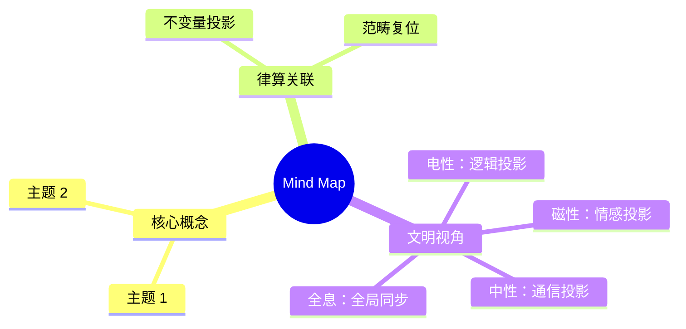

# Research Mind Map - Discrete First Principles

```
┌─────────────────────────────────────────────────────────────────────────────────────┐
│                        DISCRETE FIRST PRINCIPLES                                    │
│              "Continuity is the limiting manifestation of discreteness"              │
│                                                                                     │
│  Proof Assistant: Agda 2.9.0 + GHC 9.14.1 + Cubical                                │
│  Philosophy: Coordinate-free, intrinsic definitions                                 │
└─────────────────────────────────────────────────────────────────────────────────────┘
                                      │
                    ┌─────────────────┼─────────────────┐
                    ▼                 ▼                 ▼
            ┌───────────────┐ ┌───────────────┐ ┌───────────────┐
            │ FOUNDATIONS   │ │  ALGEBRA      │ │  GEOMETRY     │
            └───────┬───────┘ └───────┬───────┘ └───────┬───────┘
                    │                 │                 │
        ┌───────────┼───────┐ ┌──────┼───────┐ ┌──────┼──────────┐
        ▼           ▼       ▼ ▼      ▼       ▼ ▼      ▼          ▼
   ┌────────┐ ┌────────┐┌──────┐┌───────┐┌──────┐┌────────┐┌─────────┐
   │ Types  │ │ Props  ││ Ring ││Clifford││ Torus ││Conformal││ Fiber   │
   │  Σ/Π   │ │  HOTT  ││Groups││ Algebra││  Tⁿ  ││  Maps  ││ Bundles │
   └───┬────┘ └───┬────┘└──┬───┘└───┬───┘└──┬───┘└───┬────┘└────┬────┘
       │          │        │        │       │        │          │
       └──────────┴────────┴────────┘       └────────┴──────────┘
                          │                         │
                    ┌─────┴─────┐             ┌─────┴─────┐
                    ▼           ▼             ▼           ▼
              ┌──────────┐┌──────────┐ ┌──────────┐┌──────────┐
              │Quotient  ││  Limit   │ │Homotopy  ││  Cohom   │
              │ Spaces   ││ Approx   │ │  πₙ(Tⁿ)  ││  Hⁿ(Tⁿ)  │
              └──────────┘└──────────┘ └──────────┘└──────────┘
```

---

## Level 1: Foundations (P0)

```
Discrete Foundations
├── Type Theory (Agda Native)
│   ├── Σ-types (dependent pairs)
│   ├── Π-types (dependent functions)
│   ├── Identity types (path equality)
│   └── Inductive/Coinductive types
│
├── Logic (Propositions)
│   ├── Classical → Intuitionistic
│   ├── Double negation
│   ├── Excluded middle (optional)
│   └── Axiom of choice (constructive)
│
├── Discrete Structures
│   ├── Natural numbers ℕ (Peano)
│   ├── Integers ℤ
│   ├── Rationals ℚ
│   ├── Finite sets Fin n
│   ├── Lists / Vectors
│   └── Graphs (combinatorial)
│
├── Relations & Order
│   ├── Equivalence relations
│   ├── Partial orders
│   ├── Lattices
│   └── Well-founded relations
│
└── Quotient Types
    ├── Set-quotients (cubical HIT)
    ├── Equivalence classes
    ├── Universal property
    └── No-coordinates via quotient
```

---

## Level 2: Algebra (P0)

```
Algebraic Structures
├── Standard Algebra (from std-lib)
│   ├── Semigroups, Monoids
│   ├── Groups, Abelian Groups
│   ├── Rings, Commutative Rings
│   ├── Fields
│   └── Modules, Vector Spaces
│
├── Geometric Algebra (TO BUILD)
│   ├── Exterior Algebra (Grassmann)
│   │   ├── Wedge product ∧
│   │   ├── k-vectors
│   │   ├── Hodge star ⋆
│   │   └── Determinant via ∧
│   │
│   ├── Clifford Algebra
│   │   ├── Geometric product
│   │   ├── Quadratic form Q
│   │   ├── Clifford group
│   │   ├── Spinors
│   │   └── Rotor representation
│   │
│   └── Applications
│       ├── Rotations in ℝⁿ
│       ├── Reflections
│       └── Conformal model
│
└── Topological Algebra (TO BUILD)
    ├── Topological groups
    ├── Topological rings
    ├── Continuous actions
    └── Discrete → continuous limit
```

---

## Level 3: Geometry (P0)

```
Toroidal Geometry
├── Circle S¹ (from cubical)
│   ├── HIT definition
│   ├── Base point, loop
│   └── Fundamental group π₁(S¹) ≅ ℤ
│
├── Torus Tⁿ
│   ├── T¹ = S¹
│   ├── T² = S¹ × S¹
│   ├── Tⁿ = (S¹)ⁿ
│   └── Complex 3D / Real 6D: T⁶ ≅ (S¹)⁶
│
├── Periodic Structures
│   ├── Lattice Λ ⊂ ℝⁿ
│   ├── Quotient ℝⁿ/Λ ≅ Tⁿ
│   ├── Periodic functions
│   └── Fourier modes
│
├── Intrinsic Torus (NO COORDINATES)
│   ├── Group object: Tⁿ as abelian group
│   ├── Universal cover: ℝⁿ → Tⁿ
│   ├── Deck transformations
│   └── Character maps
│
└── Discrete Torus (TO BUILD)
    ├── Finite approximation Tⁿ_N
    ├── Grid structure
    ├── Discrete Laplacian
    └── Convergence proof
```

---

## Level 4: Topology (P1)

```
Toroidal Topology
├── Homotopy Theory (from cubical)
│   ├── Path types
│   ├── Homotopy groups πₙ
│   ├── π₁(Tⁿ) ≅ ℤⁿ
│   ├── πₖ(Tⁿ) for k > 1
│   └── Higher inductive types
│
├── Homology (TO BUILD)
│   ├── Chain complexes
│   ├── Boundary operator ∂
│   ├── Hₖ(Tⁿ; ℤ)
│   ├── Künneth formula
│   └── Betti numbers
│
├── Characteristic Classes (TO BUILD)
│   ├── Line bundles over Tⁿ
│   ├── Chern classes
│   ├── Flat connections
│   └── Theta functions
│
└── Fiber Bundles (TO BUILD)
    ├── Principal bundles
    ├── Associated bundles
    ├── Local trivialization
    ├── Transition functions
    └── Torus bundles
```

---

## Level 5: Conformal Geometry (P1)

```
Discrete Conformal Geometry
├── Discrete Complex Analysis
│   ├── Discrete Cauchy-Riemann
│   ├── Discrete holomorphic
│   ├── Discrete contour integral
│   └── Discrete residue theorem
│
├── Conformal Maps
│   ├── Angle preservation
│   ├── Discrete conformal factor
│   ├── Möbius transformations
│   └── Riemann mapping (discrete)
│
├── Discrete Riemann Surfaces
│   ├── Quad graphs
│   ├── Discrete periods
│   ├── Discrete Jacobian
│   └── Discrete Abel-Jacobi
│
└→ Continuous Limit (TO DEFINE)
    ├── Refinement sequence
    ├── Convergence proof
    └── "Continuity from discreteness"
```

---

## Level 6: Category Theory (P0 - Tool)

```
Category Theory (from agda-categories)
├── Basic Categories
│   ├── Category, Functor
│   ├── Natural transformation
│   ├── Yoneda lemma
│   └── Adjunctions
│
├── Limits & Colimits
│   ├── Products, coproducts
│   ├── Equalizers
│   ├── Pullbacks, pushouts
│   └→ Inverse limits
│
├── Monoidal Categories
│   ├── Tensor product
│   ├── Braiding
│   └── Trace
│
├── Applications
│   ├── Coordinate-free definitions
│   ├── Universal properties
│   ├── Naturality = coordinate-free
│   └── Diagram chasing
│
└── Advanced (P2)
    ├── Sheaves
    ├── Topos theory
    ├── Derived categories
    └── ∞-categories
```

---

## Research Phases

```
Phase 1 ──────────────────────────────────────► Phase 2
[Foundations + Basic Algebra]        [Geometric Algebra + Torus]
  • Discrete structures                • Clifford algebra
  • Quotient spaces                    • Tⁿ intrinsic definition
  • Circle S¹ (cubical)                • Periodic structures
  • Basic category theory              • Discrete torus approx.

Phase 3 ──────────────────────────────────────► Phase 4
[Topology + Homology]                [Conformal + Continuous Limit]
  • Homotopy groups πₙ(Tⁿ)             • Discrete complex analysis
  • Chain complexes                    • Conformal maps
  • Homology Hₙ(Tⁿ)                    • Discrete Riemann surfaces
  • Fiber bundles                      • Convergence theorems
                                       • "Discrete → Continuous"
```

---

## Key Principles

```
┌─────────────────────────────────────────────────┐
│              DESIGN PHILOSOPHY                   │
├─────────────────────────────────────────────────┤
│  1. Discrete First                               │
│     - Start with finite/discrete structures      │
│     - Define continuous as limit                 │
│                                                 │
│  2. Coordinate-Free                              │
│     - Use universal properties                   │
│     - Natural transformations                    │
│     - No arbitrary basis choices                 │
│                                                 │
│  3. Intrinsic                                    │
│     - Define objects by their properties         │
│     - Quotients, not embeddings                  │
│     - Internal structure, not external           │
│                                                 │
│  4. Constructive                                 │
│     - All proofs are algorithms                  │
│     - Computable mathematics                     │
│     - Agda extraction possible                   │
└─────────────────────────────────────────────────┘
```


## 附录：Mind Map 思维导图


