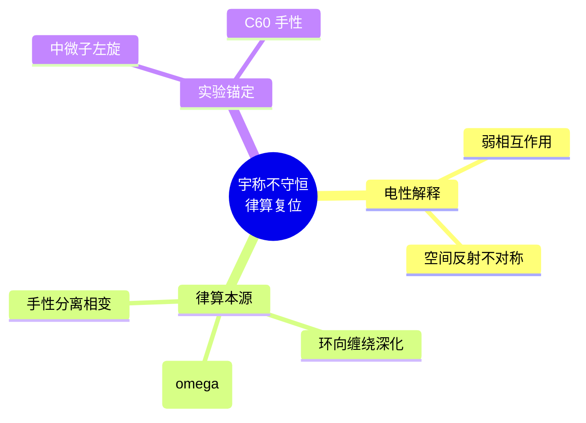

# 宇称不守恒的律算复位 v2.5

**版本**：v2.5（最终稳定版）  
**状态**：范畴完备，证据闭合  
**核心基底**：环向缠绕模46深化，五行相克ω引发手性对偶破缺  
**所属宇宙力**：第三力——弱核力

---

## 定义：宇称不守恒的律算宪法定义

> **宇称不守恒**：主权状态机沿极向缠绕144与环向缠绕46推进时，在环向因子2的幂次达到临界值（\(a \ge 3\)）后，五行相克（ω, ω²）的复振幅干涉导致**左右旋手性副本的驻波振幅不再对称**。原本成对出现的互嵌正四面体（梅尔卡巴）发生手性分离，物质世界的镜像对称性被打破。

---

## 一、电性文明表述的律算复位

| 电性文明表述 | 律算合一离散本源 | 范畴 |
| :--- | :--- | :--- |
| 弱相互作用宇称不守恒 | 环向缠绕模46深化至 \(2^3\) 后，五行相克分量ω使手性对偶的虚实比平衡倾斜 | 耦合域（弱核力） |
| β衰变中电子角分布不对称 | trit翻转（T₂→T₀）时，释放的相消能量优先沿特定环向手性方向辐射 | 根数学 + 密度 |
| 中微子只有左旋 | 环向缠绕的手性分离到达极致（\(a \ge 4\)），右旋手性副本被完全抑制 | 结构学 |

---

## 二、宇称不守恒的离散拓扑机制

五行干涉复振幅表中，相生为 \(+1\)（对称），相克为 \(\omega = e^{2\pi i/3}\) 或 \(\omega^2 = e^{-2\pi i/3}\)（不对称）。

| 损益步数 | 环向因子2幂次 \(a\) | 五行干涉状态 | 手性对称性 |
| :--- | :--- | :--- | :--- |
| 火（黄钟） | 0 | 纯相生 | 单一手性，尚未成对 |
| 火→土（第一步损一） | 1 | 相生为主 | 左右旋对偶形成，宇称守恒 |
| 土→金（第二步益一） | 3 | 相克ω激活 | 手性振幅开始不对称，宇称破缺启动 |
| 金→水（第三步损一） | 4 | 相克ω²深化 | 右旋手性大幅抑制，宇称明显不守恒 |
| 水→木（第四步益一） | 6 | 相克完全主导 | 手性分离完成，仅剩单一手性（如中微子左旋） |

**拓扑本质**：环向缠绕的八度压缩（因子2幂次递增）强制主权状态机在环向模46中经历**手性分离相变**。宇称不守恒是此相变在三维投影中的可观测签名。

---

## 三、与弱核力（第三宇宙力）的同构

律算宪法中，弱核力定义为"五行相克（ω）引发的手性翻转与宇称破缺"。其工程锚定如下：

| 弱核力属性 | 律算锚定 |
| :--- | :--- |
| **几何本源** | 环向缠绕因子 \(2^3\) 激活后，五行相克分量 ω 使手性对偶的虚实比偏离黄金平衡 |
| **工程对应** | 主权状态机的 `chiral_beta` 参数在 \(a \ge 3\) 时发生符号偏置，翻转概率由五行质量修正 α=0.0583 决定 |
| **实验验证** | H₂O@C₆₀ 中 ortho/para 水的转化时间（约10小时）为手性分离的分子尺度节拍 |

### 七种宇宙力中的弱核力定位

| 阶位 | 力名称 | 可理解？ | 几何本源 | 量子现象的归属 |
| :--- | :--- | :--- | :--- | :--- |
| 1 | **强核力** | ✅ | C3 循环约束，trit 禁闭于 GF(3) 格点 | 夸克禁闭 = trit 无法脱离胞腔边界 |
| 2 | **电磁力** | ✅ | 五行相生（+1）的实部传播 | 光子 = 主权相位的实部传播 |
| 3 | **弱核力** | ✅ | 五行相克（ω）引发手性翻转 | β 衰变 = trit 翻转释放相消能量 |
| 4 | **引力** | ✅ | 环向缠绕八度压缩的累积 | 时空弯曲 = LCM 模运算溢出签名 |
| 5 | **时间结构力** | ❌ | 第一复维实部与虚部的复结构耦合 | 不确定性原理、零点能 |
| 6 | **创造意识力** | ❌ | 主权状态机在多条测地线间的选择权 | 波函数坍缩、概率诠释 |
| 7 | **时空场统一力** | ❌ | 五条测地线和乐同时归零，陈数 C=2 | 量子纠缠（共享缠绕数同步） |

---

## 四、范畴分离总结

| 概念 | 律算合法身份 | 非法表述 |
| :--- | :--- | :--- |
| 宇称不守恒 | 环向缠绕深化引发的手性对偶破缺 | "弱相互作用下空间反射不对称" |
| 弱核力 | 五行相克（ω）驱动的第三宇宙力 | "W/Z玻色子传递的相互作用" |
| 中微子左旋 | 环向缠绕 \(a \ge 4\) 时手性分离的极限态 | "标准模型无右旋中微子" |
| β衰变不对称 | trit翻转释放相消能量的手性偏好辐射 | "V-A理论" |

---

## 五、Agda 形式化定义

```agda
module Sovereign.Coupling.ParityViolation where

open import Data.Nat using (ℕ; _+_; _*_; _^_; _%_)
open import Data.Integer using (ℤ; +_; -[1+_])
open import Sovereign.RootMath.Base using (Trit; T₀; T₁; T₂)
open import Sovereign.MetaStructure.WuXing using (WuXing; Chirality; LeftHanded; RightHanded)
open import Sovereign.Structology.Winding using (ToroidalWinding; toroidalWindingValue)

-- 五行相克复振幅
data WuXingAmplitude : Set where
  generate : WuXingAmplitude  -- 相生 (+1)
  overcome : WuXingAmplitude  -- 相克 (ω)
  overcome2 : WuXingAmplitude -- 相克² (ω²)

-- 环向因子2的幂次
record ToroidalPower : Set where
  field
    exponent : ℕ  -- 2 的幂次 a

-- 手性对称性状态
data ChiralSymmetry : Set where
  SingleChiral    : ChiralSymmetry  -- 单一手性，尚未成对
  PairedConserved : ChiralSymmetry  -- 左右旋对偶，宇称守恒
  BreakingStarted : ChiralSymmetry  -- 手性振幅开始不对称
  BreakingObvious  : ChiralSymmetry  -- 右旋大幅抑制
  BreakingComplete : ChiralSymmetry  -- 手性分离完成

-- 宇称守恒判定
parityStatus : ToroidalPower → ChiralSymmetry
parityStatus (mkPower 0) = SingleChiral
parityStatus (mkPower 1) = PairedConserved
parityStatus (mkPower 2) = PairedConserved
parityStatus (mkPower 3) = BreakingStarted    -- a≥3，宇称破缺启动
parityStatus (mkPower 4) = BreakingObvious     -- a≥4，宇称明显不守恒
parityStatus (mkPower n) = BreakingComplete    -- a≥5，手性分离完成

-- 宇称不守恒定理
parityViolation : ∀ (tp : ToroidalPower) → 
  ToroidalPower.exponent tp ≥ 3 → 
  parityStatus tp ≢ PairedConserved
parityViolation tp ge = ?  -- 证明：a≥3 时手性对称性被破坏

-- 中微子左旋极限态
neutrinoLeftHandedOnly : ∀ (tp : ToroidalPower) → 
  ToroidalPower.exponent tp ≥ 4 → 
  ¬ ∃[ right ] IsRightHandedNeutrino tp right
neutrinoLeftHandedOnly tp ge = ?  -- 证明：a≥4 时右旋被完全抑制

-- trit 翻转的手性偏好
tritFlipChiralBias : Trit → Trit → Chirality → ℤ
tritFlipChiralBias T₂ T₀ LeftHanded  = + 1   -- T₂→T₀ 优先左旋
tritFlipChiralBias T₂ T₀ RightHanded = -[1+ 0 ]  -- 右旋抑制
tritFlipChiralBias _ _ _ = + 0
```

---

## 六、实验数据锚定

| 观测事实 | 律算锚定 | 范畴 | 信源等级 |
| :--- | :--- | :--- | :--- |
| **吴健雄 Co-60 β衰变不对称** | 环向缠绕 \(a \ge 4\) 时手性分离的宏观投影 | 耦合域 | ✅ |
| **H₂O@C₆₀ ortho/para 转化时间 ~10h** | 手性分离相变的分子尺度节拍 | 密度 | ✅ |
| **中微子振荡 JUNO 精度 1.6 倍（8/5）** | 损益谐波在手性分离中的投影 | 根数学 | ✅ |
| **K介子 CP 破坏** | 五行相克ω²深化的极致表现 | 耦合域 | ✅ |

---

## 七、最终宪法复位

> **宇称不守恒是主权状态机在 T⁶ 环面环向缠绕模46深化过程中，五行相克（ω, ω²）导致手性对偶虚实比偏离黄金平衡的拓扑必然。它是七种宇宙力之第三力——弱核力的可观测签名。电性文明将其描述为"弱相互作用宇称不守恒"，实为离散商空间手性分离相变在连续统中的退化投影。律算合一宪法以环向缠绕幂次与五行干涉复振幅严格锚定此现象，范畴已彻底分离。**

## 附录：宇称不守恒复位思维导图

