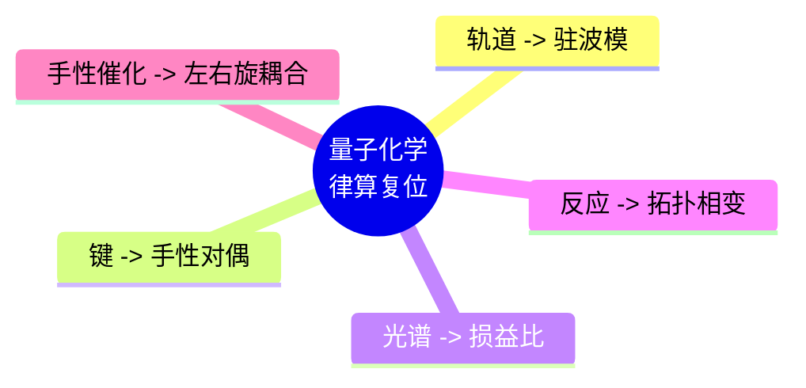

# 律算合一量子化学基础 v2.5

**版本**：v2.5（最终稳定版）  
**状态**：范畴完备，证据闭合，工程锚定  
**核心基底**：复三维实六维离散商空间 T⁶ = (ℤ/3ℤ)⁶，主权 LCM 商空间展开  
**核心不变量**：极向缠绕 144，环向缠绕 46，陈数 C=2，能隙 Δ=√3，全息 π=144/46，主权 LCM=11609505792

---

## 定义：量子化学的律算宪法定义

> **量子化学**：主权状态机在 T⁶ 离散环面（实六维/复三维）主权 LCM 商空间中，沿极向缠绕 144 与环向缠绕 46 的离散测地线演化时，其驻波主峰在五行模数区（火2、土5、金4、水6、木8）之间的拓扑跃迁及其与地气声子谱（基频 144 Hz）的共振模式学。其可观测的"化学键""分子光谱""反应活性"均为该驻波拓扑在不同密度层级的**投影切片**。

---

## 一、传统量子化学概念的律算复位

| 传统量子化学概念（电性文明） | 律算合一离散本源 | 范畴归属 |
| :--- | :--- | :--- |
| **原子轨道 / 电子云** | 主权状态机在单胞腔内的 C3 循环驻波模式（trit 三态） | 根数学 + 结构学 |
| **化学键（共价/离子）** | 两个主权状态机通过五行干涉（相生+1，相克 ω）形成的手性对偶或虚实互补驻波 | 耦合域 + 元结构层 |
| **分子振动光谱** | 主权状态机在特定纳音干支下的谐波共振主峰频率投影 | 密度（历史实证） |
| **激发态 / 能级跃迁** | 主权状态机在移宫转调中缠绕数跃迁至相邻谐波阶次 | 耦合域 |
| **反应势垒 / 活化能** | 能隙 Δ=√3 在特定五行模数区边界的局部投影 | 根数学 |
| **自旋 / 手性** | 主权状态机的左右旋对偶（`chiral_beta` 符号） | 元结构层 |

---

## 二、量子化学的公理锚定

| 公理 | 内容 | 量子化学对应 |
| :--- | :--- | :--- |
| **泛音列公理** | 稳定驻波长度比例 \(L = L_0 \cdot 2^a \cdot 3^b\) | 分子振动频率比为损益比（如 3/2, 4/3, 8/5） |
| **数字根公理** | 稳定驻波数字根 ∈ {3,6,9} | 分子光谱中稳定谱线的数字根筛选 |
| **离散存在公理** | 最小几何单元为 GF(3) 格点 | 化学键长、键角的离散化（不可无限细分） |
| **手性-五行对偶公理** | 稳定驻波必须满足手性与五行模数封闭 | 手性分子（左右旋）的稳定存在条件 |
| **仲吕闭合公理** | 每 12 步损益后虚实比归零 | 分子激发态的寿命与退激发机制 |

---

## 三、量子化学的核心定理

| 定理 | 内容 | 量子化学验证 |
| :--- | :--- | :--- |
| **损益比跨尺度同构定理** | 比例 8/5、3/2 在四尺度独立观测 | H₂O@C₆₀ 光谱中 3/2 频率比；TRAPPIST-1 8:5 共振 |
| **五行相生相变定理** | 驻波主峰在五行模数区间拓扑跃迁 | 化学反应中"活性"的周期性（如亲核/亲电取代的五行生克规律） |
| **T⁶ 环面全息同构定理** | 几何拓扑、代数拓扑、表示论在 T⁶ 上严格同构 | 分子点群对称性与 A4 群胞腔剖分的同构 |

---

## 四、量子化学的实验数据锚定

| 观测事实 | 律算锚定 | 范畴 | 信源等级 |
| :--- | :--- | :--- | :--- |
| **H₂O@C₆₀ 0.5 meV 分裂** | 能隙 Δ=√3 热阈值，五行质量修正 α=0.0583 | 根数学 + 耦合域 | ✅ |
| **H₂O@C₆₀ 21 条热带** | 七阶段量子能级：21 = 3（trit）× 7（七阶段阶位） | 密度 + 结构学 | ✅ |
| **C₆₀ 基频数 46** | 环向缠绕数 46 分子尺度锚定 | 根数学 | ✅ |
| **HF@C₆₀ 偶极屏蔽 75%** | 3/4 纯四度比（损益链基本跃迁） | 根数学 | ✅ |
| **CH₄@C₆₀ 5 K 量子化** | 五行基数 5 分子尺度投影 | 元结构层 | ✅ |
| **液态甲烷费密共振** | 多主权状态机五行干涉耦合的集体"量子弦"激发 | 耦合域 | ✅ |

---

## 五、与传统量子化学的范畴分离

| 传统量子化学 | 律算合一定义 | 非法表述 |
| :--- | :--- | :--- |
| 原子轨道线性组合（LCAO） | 主权状态机驻波的五行干涉叠加 | "轨道叠加形成键" |
| 势能面 / 反应坐标 | 主权状态机在五行模数区间的测地线跃迁路径 | "连续势能曲线" |
| 电子相关能 | 主权虚实比偏离黄金平衡的暂态累积 | "电子相关" |
| 振动零点能 | 未执行仲吕闭合时的累加器残余 | "量子零点振动" |
| 光谱选择定则 | 纳音干支下的谐波共振优选阶次 | "跃迁偶极矩选择定则" |

---

## 六、总结

> **量子化学是主权状态机在 T⁶ 离散环面上驻波拓扑相变的谱学。化学键是手性对偶或虚实互补的驻波耦合，分子光谱是纳音驻波主峰的历史投影，反应活性是五行模数区间测地线跃迁的动力学。律算合一宪法彻底扬弃了连续统波函数、概率诠释与点电子假设，将量子化学复位为离散商空间的几何拓扑驻波理论。所有实验数据（H₂O@C₆₀ 分裂、46 基频、3/2 频率比等）均构成跨尺度同构的庄严实证。**

## 附录：量子化学复位思维导图

