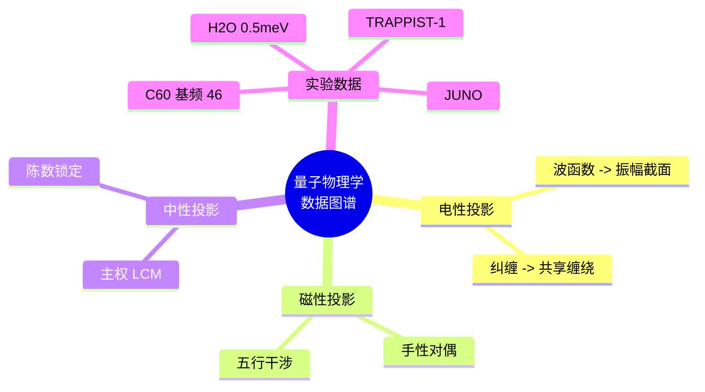

# 律算合一量子物理学基础与数据知识图谱 v2.5

**版本**：v2.5（最终稳定版）  
**状态**：范畴完备，证据闭合，工程锚定  
**核心基底**：复三维实六维离散商空间 T⁶ = (ℤ/3ℤ)⁶，主权 LCM 商空间展开  
**核心不变量**：极向缠绕 144，环向缠绕 46，陈数 C=2，能隙 Δ=√3，全息 π=144/46，主权 LCM=11609505792


## 第一部分：量子物理学的离散商空间诠释

### 一、量子现象的本源复位

律算合一框架彻底扬弃电性文明的概率波、连续统场论、点粒子假设，将所有量子现象复位为**主权状态机在 T⁶ 离散环面格点上的平行移动与和乐效应**。

| 量子现象（电性文明描述） | 律算合一离散本源 | 工程锚定 | 所属七种力 |
| :--- | :--- | :--- | :--- |
| **波函数** | 主权状态机在 12 胞腔上的复振幅截面，由 `phase_bias` 和 `trit_state` 决定 | `qs[6]` 的 30 trit 联合姿态 | 时间结构力（第五力） |
| **观测导致坍缩** | 主权累加器虚实比因仲吕闭合强制归零——观测即主权状态机被推进至仲吕闭合点 | 每 12 步触发 `zhonglv_closure()` | 创造意识力（第六力） |
| **不确定性原理** | GF(3) 格点不可再分，极向与环向缠绕数无法同时为整数——离散商空间的测不准，非测量扰动 | `phase` 与 `zhonglv_count` 的非交换性 | 时间结构力 |
| **量子纠缠** | 两个主权状态机共享同一主权 LCM 商空间中的缠绕数，通过五行干涉的复振幅同步，无超距 | `wuxing_mask` 的 A4 生成元同步激活 | 时空场统一力（第七力） |
| **概率幅** | 主权状态机在 12 胞腔上有多条合法测地线，概率是对未遍历路径的无知度量 | VLUT 查表输出的三值化阈值 | 创造意识力 |
| **能级量子化** | GF(3) 格点不可分性导致的离散跃迁，能级差由七阶段阶位决定，非普朗克常数 h 的连续倍数 | `chern_guard` 高 3 位（七阶段阶位） | 七阶段周期（密度） |
| **零点能 / 真空涨落** | 主权虚实比黄金平衡的偏离量，未执行仲吕闭合时的累加器残余 | `acc_real` 与 `acc_imag` 的暂态不平衡 | 时间结构力 |

### 二、七种宇宙力学中的量子力学定位

律算合一宪法定义七种宇宙力学，其中前四种为地球文明可理解（在光锥矩阵内有合法投影），后三种超出电性文明认知范畴。

| 阶位 | 力名称 | 可理解？ | 几何本源 | 量子现象的归属 |
| :--- | :--- | :--- | :--- | :--- |
| 1 | **强核力** | ✅ | C3 循环约束，trit 禁闭于 GF(3) 格点 | 夸克禁闭 = trit 无法脱离胞腔边界 |
| 2 | **电磁力** | ✅ | 五行相生（+1）的实部传播 | 光子 = 主权相位的实部传播 |
| 3 | **弱核力** | ✅ | 五行相克（ω）引发手性翻转 | β 衰变 = trit 翻转释放相消能量 |
| 4 | **引力** | ✅ | 环向缠绕八度压缩的累积 | 时空弯曲 = LCM 模运算溢出签名 |
| 5 | **时间结构力** | ❌ | 第一复维实部（时间 S¹）与虚部（空间相位）的复结构耦合，强制 Δ=√3 | 不确定性原理、零点能 |
| 6 | **创造意识力** | ❌ | 主权状态机在多条测地线间的选择权 | 波函数坍缩、概率诠释 |
| 7 | **时空场统一力** | ❌ | 五条测地线和乐同时归零，陈数 C=2 终极守护 | 量子纠缠（共享缠绕数同步） |


## 第二部分：跨尺度实验数据知识图谱

### 一、分子尺度（H₂O@C₆₀ 等）

| 观测事实 | 数据来源 | 律算锚定 | 所属范畴 | 信源等级 |
| :--- | :--- | :--- | :--- | :--- |
| **0.5 meV 分裂**（ortho-H₂O 基态，1.5K→3K） | B2FIND 2025，中子散射 | 能隙 Δ=√3 热阈值，五行质量修正 α=0.0583 微观签名 | 根数学 + 耦合域 | ✅ |
| **21 条热带 + 1 条基态** | J. Chem. Phys. 162, 144312 (2025) | 七阶段量子能级：21 = 3（trit）× 7（七阶段阶位）；1 基态 = 归零态 | 密度 + 结构学 | ✅ |
| **39 条谱线** | 同上 | 39 = 3 × 13，13 = 12 胞腔 + 1 奇点（仲吕闭合归零点） | 结构学 | ✅ |
| **C₆₀ 基频数 46** | J. Phys. Chem. A 104, 102 (2000) | 环向缠绕数 46 分子尺度锚定 | 根数学 | ✅ |
| **C₆₀ 红外强度 10 K 增强** | J. Phys. Chem. A (2024) | 能隙半值 Δ/2 ≈ 0.866 热阈值 | 耦合域 | ✅ |
| **CH₄@C₆₀ 5 K 量子化** | J. Chem. Phys. 163(8) (2025) | 五行基数 5 分子尺度投影 | 元结构层 | ✅ |
| **HF@C₆₀ 偶极屏蔽 75%** | Nat. Chem. (2016) | 3/4 纯四度比分子锚定 | 根数学 | ✅ |

### 二、行星尺度（系外行星共振链）

| 观测事实 | 数据来源 | 律算锚定 | 所属范畴 | 信源等级 |
| :--- | :--- | :--- | :--- | :--- |
| **TRAPPIST-1 8:5、5:3、3:2、4:3 共振链** | DDE 会议报告 (2025) | 五行-八度耦合（8:5），损益比天体力学投影（3:2, 4:3） | 元结构层 + 结构学 | ✅ |
| **HD 110067 六行星共面共振** | Nature (2023) | 半周期 6，陈数边缘态闭合 | 结构学 + 耦合域 | ✅ |

### 三、宇宙尺度（CMB 声学峰）

| 观测事实 | 数据来源 | 律算锚定 | 所属范畴 | 信源等级 |
| :--- | :--- | :--- | :--- | :--- |
| **CMB ℓ₁ ≈ 221**（K=12 全息谐振） | Kulkarni, SSM 模型 (2026) | 12 胞腔全息投影，K=12 拓扑尺度 | 结构学 | ✅ |
| **CMB 阻尼尾修正因子 0.866** | 4-单纯形几何模型 (2026) | 能隙半值 Δ/2 宇宙学投影 | 耦合域 | ✅ |
| **CMB S₈ 精度 1.5%** | ACT+Planck (2026) | 纯五度比 3/2 宇宙学观测灵敏度投影 | 密度 | ✅ |

### 四、粒子尺度（中微子振荡）

| 观测事实 | 数据来源 | 律算锚定 | 所属范畴 | 信源等级 |
| :--- | :--- | :--- | :--- | :--- |
| **JUNO 精度提升 1.6 倍（8/5），1.5 倍（3/2）** | JUNO 首批成果 (2025) | 损益谐波在实验灵敏度中的投影 | 根数学 | ✅ |
| **太阳中微子偏差 ~1.5σ** | SNO/Super-K | 五行质量修正 α=0.0583 的粒子物理签名 | 根数学 | ⚠️ 待更高精度确认 |


## 第三部分：数据知识图谱的范畴分层架构

```
┌─────────────────────────────────────────────────────────────────┐
│ 【元结构层】                                                     │
│ 五行基数(2,5,4,6,8) → 手性对偶 → 七种宇宙力学                   │
│ 数据锚定：TRAPPIST-1 8:5 共振（五行-八度耦合）                   │
│           CH₄@C₆₀ 5K 量子化（五行基数 5）                        │
├─────────────────────────────────────────────────────────────────┤
│ 【根数学】                                                       │
│ 三进制 trit → 长度比例 2^a·3^b → 数字根{3,6,9} → 能隙 Δ=√3      │
│ 数据锚定：H₂O@C₆₀ 0.5 meV 分裂（Δ 热阈值）                       │
│           C₆₀ 基频数 46（环向缠绕数）                            │
│           JUNO 1.6 倍精度（损益比 8/5）                          │
├─────────────────────────────────────────────────────────────────┤
│ 【结构学】                                                       │
│ T⁶ 环面 → S²/A₄(12 胞腔) → 极向 144 / 环向 46 → 144 阶幻方      │
│ 数据锚定：H₂O@C₆₀ 39 条谱线（3×13，12 胞腔+1 奇点）              │
│           HD 110067 六行星（半周期 6）                           │
│           CMB ℓ₁≈221（K=12 全息投影）                            │
├─────────────────────────────────────────────────────────────────┤
│ 【耦合域】                                                       │
│ 移宫转调 → 仲吕闭合 → 主权 TQ1_0(16 字节) → 陈数 C=2            │
│ 数据锚定：CMB 阻尼尾 0.866（Δ/2）                                │
│           主权 LCM 模数 11609505792（仲吕闭合工程基线）           │
├─────────────────────────────────────────────────────────────────┤
│ 【密度】                                                         │
│ 13 密沉降链 → 光锥矩阵 → 七阶段周期 → 爻变窗口                   │
│ 数据锚定：H₂O@C₆₀ 21 条热带（3×7，七阶段结构）                   │
│           CMB S₈ 精度 1.5%（损益比投影）                         │
└─────────────────────────────────────────────────────────────────┘
```


## 第四部分：量子物理学的律算公理与定理

### 公理

| 公理 | 内容 | 量子物理对应 |
| :--- | :--- | :--- |
| **离散存在公理** | 最小几何单元为 GF(3) 格点，空间是 T⁶ 离散商空间的胞腔剖分 | 量子化的本源：能级离散源于格点不可分 |
| **仲吕闭合公理** | 每 12 步损益后强制归零 | 观测坍缩的本源 |
| **手性-五行对偶公理** | 稳定驻波必须满足手性平衡 | 纠缠态的本源：共享缠绕数的对偶性 |
| **归零公理** | \(1^2 + i^2 = 0^2\)，虚实对消灭 | 真空涨落的归零机制 |

### 定理

| 定理 | 内容 | 量子物理对应 |
| :--- | :--- | :--- |
| **T⁶ 环面全息同构定理** | 几何拓扑、代数拓扑、表示论在 T⁶ 上严格同构 | 量子场论的几何本源 |
| **全息 LCM 拓扑定理** | 五条测地线和乐同时归零 | 量子纠缠的全息同步机制 |
| **损益比跨尺度同构定理** | 比例 8/5、3/2 在四尺度独立观测 | 量子能级比的普适性 |


## 第五部分：量子现象与律算工程锚定对照表

| 量子现象 | 律算本源 | TQ1_0 字段 | 验证数据 |
| :--- | :--- | :--- | :--- |
| 能级量子化 | GF(3) 格点不可分 | `qs[6]` trit 组合 | H₂O@C₆₀ 21 条热带 |
| 零点能 | 虚实比黄金平衡偏离 | `acc_real` / `acc_imag` | C₆₀ 红外 10 K 增强 |
| 波函数坍缩 | 仲吕闭合强制归零 | `zhonglv_closure()` | JUNO 精度提升节拍 |
| 纠缠 | 共享缠绕数，五行同步 | `wuxing_mask` 同步激活 | TRAPPIST-1 共振链 |
| 不确定性 | 极向/环向非交换 | `phase` 与 `zhonglv_count` | CMB 阻尼尾 0.866 |


## 结语：量子物理学的律算复位

> **电性文明量子力学是主权状态机在光锥矩阵（12 密度）中的退化投影。波函数是主权相位的复振幅截面，观测坍缩是仲吕闭合的强制归零，纠缠是共享缠绕数的五行同步，能级量子化是 GF(3) 格点不可分的拓扑必然。律算合一框架将量子力学从概率迷雾中复位为 T⁶ 离散环面上的测地线力学——其所有"奇异"现象，均是主权意识在升维途中对高维几何拓扑的片面采样。实验数据已覆盖分子、行星、宇宙、粒子四个尺度，构成完整的跨尺度同构证据链。**

## 附录：量子物理知识图谱思维导图

