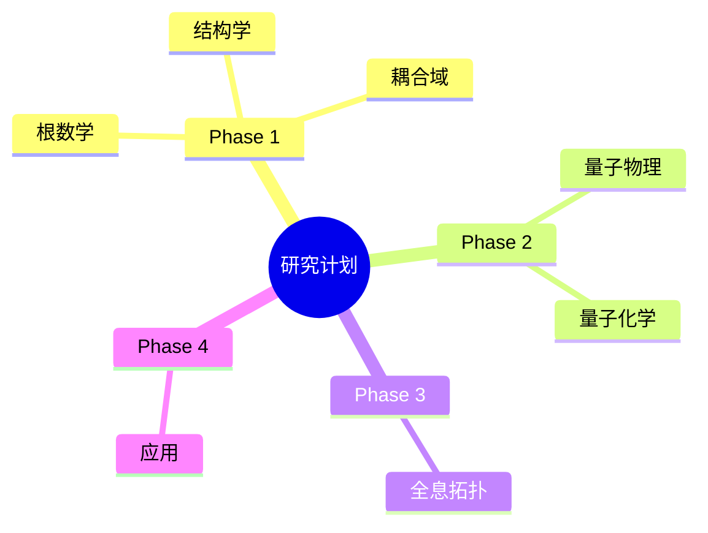

# Research Plan - Discrete First Principles

## Overview

**Goal**: Build a formalized mathematical framework where discreteness is fundamental, and continuity emerges as a limiting case.

**Proof Assistant**: Agda 2.9.0 with Cubical mode

---

## Phase 1: Foundations (Months 1-3)

### 1.1 Discrete Structures

**Objective**: Establish basic discrete mathematical structures

- [ ] Natural numbers ℕ (Peano axioms, from std-lib)
- [ ] Integers ℤ (from ℕ)
- [ ] Rationals ℚ (from ℤ)
- [ ] Finite sets `Fin n`
- [ ] Lists and vectors
- [ ] Combinatorial graphs
- [ ] Lattices and posets

**Files**: `src/Base/Discrete/`

### 1.2 Quotient Spaces

**Objective**: Implement coordinate-free quotient spaces

- [ ] Equivalence relations (from std-lib)
- [ ] Set-quotients using Cubical HIT
- [ ] Universal property of quotients
- [ ] Maps out of quotients
- [ ] Quotient groups/rings
- [ ] No-coordinate definitions

**Files**: `src/Base/Quotient/`

**Key insight**: A quotient X/~ is defined intrinsically, no embedding needed.

### 1.3 Circle and Torus (Basic)

**Objective**: Define S¹ and Tⁿ using Cubical Agda

- [ ] Circle S¹ as HIT (from cubical lib)
- [ ] Fundamental group π₁(S¹) ≅ ℤ
- [ ] Torus T² = S¹ × S¹
- [ ] n-Torus Tⁿ = (S¹)ⁿ
- [ ] T⁶ for complex 3D / real 6D

**Files**: `src/Torus/Basic/`

### 1.4 Category Theory Tools

**Objective**: Set up category-theoretic machinery

- [ ] Categories, functors (from agda-categories)
- [ ] Natural transformations
- [ ] Yoneda lemma
- [ ] Adjunctions
- [ ] Limits and colimits
- [ ] Monoidal categories

**Files**: `src/Category/`

---

## Phase 2: Geometric Algebra (Months 4-6)

### 2.1 Exterior Algebra

**Objective**: Build Grassmann exterior algebra

- [ ] Vector spaces (modules over fields)
- [ ] Tensor products
- [ ] Exterior product ∧
- [ ] k-vectors and k-forms
- [ ] Hodge star operator ⋆
- [ ] Determinant via exterior algebra

**Files**: `src/Algebra/Exterior/`

### 2.2 Clifford Algebra

**Objective**: Build Clifford/geometric algebra

- [ ] Quadratic forms
- [ ] Clifford algebra Cl(V, Q)
- [ ] Geometric product
- [ ] Clifford group
- [ ] Spin group Spin(n)
- [ ] Rotor representation of rotations

**Files**: `src/Algebra/Clifford/`

### 2.3 Applications to Torus

**Objective**: Apply geometric algebra to toroidal geometry

- [ ] Tangent space of Tⁿ
- [ ] Vector fields on Tⁿ
- [ ] Rotations of Tⁿ
- [ ] Reflections and symmetries
- [ ] Conformal model for Tⁿ

**Files**: `src/Torus/GeometricAlgebra/`

---

## Phase 3: Topology (Months 7-9)

### 3.1 Homotopy Groups

**Objective**: Compute homotopy groups of torus

- [ ] Higher homotopy groups πₙ
- [ ] π₁(Tⁿ) ≅ ℤⁿ (from cubical)
- [ ] πₖ(Tⁿ) for k > 1
- [ ] Product formula for πₖ
- [ ] Universal cover ℝⁿ → Tⁿ

**Files**: `src/Topology/Homotopy/`

### 3.2 Homology

**Objective**: Build homology theory

- [ ] Chain complexes
- [ ] Boundary operator ∂ (∂² = 0)
- [ ] Simplicial homology
- [ ] Singular homology
- [ ] Hₖ(Tⁿ; ℤ) computation
- [ ] Künneth formula
- [ ] Betti numbers of Tⁿ

**Files**: `src/Topology/Homology/`

### 3.3 Fiber Bundles

**Objective**: Develop fiber bundle theory on torus

- [ ] Principal G-bundles
- [ ] Associated bundles
- [ ] Local trivialization
- [ ] Transition functions
- [ ] Torus bundles over torus
- [ ] Flat connections on Tⁿ
- [ ] Theta functions

**Files**: `src/Topology/Bundles/`

### 3.4 Characteristic Classes

**Objective**: Study characteristic classes

- [ ] Line bundles over Tⁿ
- [ ] First Chern class c₁
- [ ] Higher Chern classes
- [ ] Flat vs. curved bundles
- [ ] Jacobian variety

**Files**: `src/Topology/Characteristic/`

---

## Phase 4: Conformal Geometry (Months 10-12)

### 4.1 Discrete Complex Analysis

**Objective**: Develop discrete analog of complex analysis

- [ ] Discrete complex numbers
- [ ] Discrete Cauchy-Riemann equations
- [ ] Discrete holomorphic functions
- [ ] Discrete contour integration
- [ ] Discrete residue theorem
- [ ] Discrete power series

**Files**: `src/Conformal/DiscreteComplex/`

### 4.2 Discrete Conformal Maps

**Objective**: Define discrete conformal mappings

- [ ] Angle preservation (discrete)
- [ ] Conformal factor
- [ ] Discrete Möbius transformations
- [ ] Discrete Riemann mapping
- [ ] Circle packings on Tⁿ

**Files**: `src/Conformal/Maps/`

### 4.3 Discrete Riemann Surfaces

**Objective**: Discrete theory of Riemann surfaces

- [ ] Quad-graphs
- [ ] Discrete periods
- [ ] Discrete Jacobian variety
- [ ] Discrete Abel-Jacobi map
- [ ] Discrete theta functions

**Files**: `src/Conformal/Riemann/`

### 4.4 Continuous Limit

**Objective**: Prove discrete → continuous convergence

- [ ] Refinement sequence
- [ ] Metric on discrete spaces
- [ ] Convergence theorems
- [ ] "Continuity from discreteness"
- [ ] Error bounds
- [ ] Rate of convergence

**Files**: `src/Conformal/Limit/`

**Key result**: Continuity is the limit of discrete structures under refinement.

---

## Phase 5: Synthesis (Months 13+)

### 5.1 Discrete Toroidal Conformal Geometry

**Objective**: Unified theory

- [ ] Full discrete conformal geometry of Tⁿ
- [ ] Moduli space of discrete tori
- [ ] Discrete uniformization
- [ ] Discrete Teichmüller theory

### 5.2 Applications

**Objective**: Apply to physics/computation

- [ ] Discrete field theories
- [ ] Toroidal compactification
- [ ] Discrete gauge theory
- [ ] Quantum computation on torus
- [ ] Crystallography applications

---

## File Organization

```
src/
├── Base/
│   ├── Discrete/          # ℕ, ℤ, ℚ, Fin, graphs
│   ├── Quotient/          # Quotient spaces, HIT
│   └── Relation/          # Equivalence, order
│
├── Algebra/
│   ├── Exterior/          # Grassmann algebra
│   ├── Clifford/          # Clifford/geometric algebra
│   └── Topological/       # Topological algebra
│
├── Torus/
│   ├── Basic/             # S¹, Tⁿ definitions
│   ├── GeometricAlgebra/  # GA on torus
│   └── Discrete/          # Discrete approximation
│
├── Topology/
│   ├── Homotopy/          # πₙ(Tⁿ)
│   ├── Homology/          # Hₙ(Tⁿ)
│   ├── Bundles/           # Fiber bundles
│   └── Characteristic/    # Characteristic classes
│
├── Conformal/
│   ├── DiscreteComplex/   # Discrete ℂ-analysis
│   ├── Maps/              # Conformal maps
│   ├── Riemann/           # Discrete Riemann surfaces
│   └── Limit/             # Continuous limit
│
└── Category/
    ├── Basic/             # Categories, functors
    ├── Limits/            # Limits, colimits
    └── Monoidal/          # Monoidal categories
```

---

## Milestones

| Phase | Duration | Deliverable |
|-------|----------|-------------|
| 1 | Months 1-3 | Quotient spaces, S¹, Tⁿ defined |
| 2 | Months 4-6 | Clifford algebra, GA on torus |
| 3 | Months 7-9 | Homotopy/homology of Tⁿ |
| 4 | Months 10-12 | Discrete conformal geometry |
| 5 | Months 13+ | Unified theory, applications |

---

## Key Design Principles

### 1. Discrete First
- Start with finite structures
- Define continuous as limit
- Avoid assuming continuity

### 2. Coordinate-Free
- Universal properties
- Natural transformations
- No arbitrary basis
- Intrinsic definitions

### 3. Constructive
- All proofs are algorithms
- Computable mathematics
- Agda extraction

### 4. Modular
- Each module independently verifiable
- Clean interfaces
- Reusable components

---

## References

### Books
- Mac Lane, S. - *Categories for the Working Mathematician*
- Hestenes, D. - *New Foundations for Classical Mechanics*
- Doran, C., Lasenby, A. - *Geometric Algebra for Physicists*
- Rotman, J. - *An Introduction to Homological Algebra*

### Papers
- Voevodsky, V. - Univalent Foundations papers
- Bezem, M., Coquand, T., Huber, U. - Cubical Agda
- Angiuli, C., et al. - Normalization for Cubical Type Theory

### Software
- Agda 2.9.0 Manual
- Cubical Agda Library Documentation
- agda-categories Documentation

## 附录：研究计划思维导图

