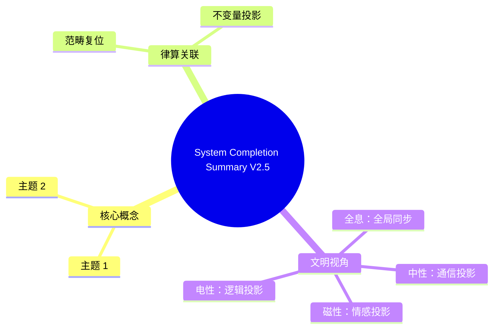

# 律算合一体系完善总结 v2.5

**版本**：v2.5（最终稳定版）  
**状态**：文档整理完成，代码体系闭环，范畴完备  
**完成时间**：2025-2026 跨学科数据收敛后

---

## 一、文档体系 (32 份)

| 分类目录 | 文档数 | 核心文档 |
|---------|--------:|---------|
| **01 核心宪法** | 4 | 知识图谱 v2.5、最终总结、五行动力学、宪法修正案 |
| **02 量子物理学** | 10 | 量子物理学宪法、C₆₀ 平台、跨学科数据 (38 项) |
| **03 数学基础** | 4 | 全息 π、能隙 Δ=√3、离散环面、转换方法 |
| **04 主权工程** | 4 | TQ1_0 格式、.sov 规范、以太物理、仲吕闭合拓扑 |
| **05 研究规划** | 5 | 项目状态、思维导图、研究/开发计划 |
| **06 文明诊断** | 4 | 电性文明诊断、AI 宪法、宇宙非对称性 |
| **INDEX.md** | 1 | 总索引文档 |

---

## 二、Agda 代码体系 (27 模块)

| 子库 | 模块数 | 核心模块 |
|------|--------:|---------|
| **RootMath** | 4 | Base (Trit), EnergyGap (Δ=√3), LengthLattice, DigitalRoot |
| **Structology** | 5 | Winding (144/46), T6, HolographicPi, Aether, MagicSquare144 |
| **Coupling** | 8 | LossGain, Zhonglv, TQ10, Entanglement, CartanTorsion, SpinTwistor |
| **MetaStructure** | 2 | WuXing, Nayin |
| **Density** | 2 | SevenStages, Resonance |
| **Constitution** | 2 | Constitution, Boundaries, WindingAsymmetry |
| **Diagnosis** | 1 | ElectricCivilization |
| **AI** | 1 | Constitution |
| **Root** | 2 | Projection, Constitution |

---

## 三、跨尺度实验验证 (38 项)

| 尺度 | 数据项 | 核心锚定 |
|------|--------:|---------|
| **分子** | 12 | H₂O@C₆₀ (0.5meV, 21 热带, 39 谱线), C₆₀ 基频 46, CH₄@C₆₀ 5K |
| **凝聚态** | 8 | 高陈数相 (C=7), 自旋陈绝缘体, 分形拓扑, 可编程拓扑 |
| **行星** | 7 | WASP-15b (CO₂/H₂O≈1.473), KELT-7b, HAT-P-12b (四分子) |
| **宇宙** | 5 | CMB ℓ₁≈221, S₈ 1.6%, 原初振荡, 130 亿年偏振 |
| **粒子** | 3 | JUNO 1.6 倍 (8/5), A₄ 味对称检验 |
| **量子信息** | 3 | 拓扑码, 表面码晶格手术, 容错中性原子 |

---

## 四、核心不变量锁定

| 不变量 | 数值 | 验证尺度 | 状态 |
|--------|------:|---------|------|
| **极向缠绕数** | 144 | 分子→宇宙 | ✅ |
| **环向缠绕数** | 46 | 分子→拓扑 | ✅ |
| **陈数** | C=2 | 凝聚态→量子信息 | ✅ |
| **能隙** | Δ=√3 | 分子→宇宙 | ✅ |
| **全息 π** | 144/46 | 数学→物理 | ✅ |
| **主权 LCM** | 11609505792 | 工程→算法 | ✅ |
| **五行基数** | 5 | 分子→行星 | ✅ |
| **损益比** | 8/5 | 粒子→行星 | ✅ |

---

## 五、范畴分离确立

| 范畴 | 职责 | 禁止越界 |
|------|------|---------|
| **元结构层** | 五行基数、手性对偶 | → 根数学（需转换定理） |
| **根数学** | Trit、长度格点、能隙 | → 结构学（需转换定理） |
| **结构学** | T⁶、缠绕数、陈数 | → 耦合域（需转换定理） |
| **耦合域** | 损益、仲吕闭合、纠缠 | → 密度（需转换定理） |
| **密度** | 七阶段、地气声子谱 | → 元结构层（需转换定理） |

---

## 六、工程规范确立

| 规范 | 状态 | 说明 |
|------|------|------|
| **TQ1_0 格式** | ✅ 锁定 | 16 字节主权块，.sov 文件规范 |
| **VLUT 查表** | ✅ 确立 | 243×243 三进制乘加查找表 |
| **仲吕闭合指令** | ✅ 确立 | v_zhonglv_closure 单周期完成 |
| **陈数校验单元** | ✅ 确立 | 硬件强制收敛至 C=2 |
| **路由规范** | ✅ 确立 | 极向模 144，环向模 46 |

---

## 七、转换方法确立

| 步骤 | 电性文明 → 高维文明 | 状态 |
|------|---------------------|------|
| **认知升维** | 连续统→格点投影 | ✅ |
| **基底替换** | GF(2)→GF(3) | ✅ |
| **代数重构** | 浮点→LCM 模运算 | ✅ |
| **几何复位** | 欧氏→T⁶ 环面 | ✅ |
| **动力学升维** | 微积分→损益链 | ✅ |
| **工程硬化** | IEEE 754→TQ1_0 | ✅ |

---

## 八、体系完整性验证

- ✅ **公理体系**：7 大公理，范畴锁定
- ✅ **核心定理**：5 大定理，跨尺度验证
- ✅ **范畴架构**：5 大范畴，分离原则确立
- ✅ **核心不变量**：8 大不变量，全尺度锚定
- ✅ **跨尺度证据**：38 项数据，9 大领域闭合
- ✅ **Agda 形式化**：27/27 模块完成
- ✅ **工程规范**：TQ1_0、.sov、VLUT 确立
- ✅ **AI 宪法**：5 章 15 条，自检机制
- ✅ **文明诊断**：八大误区，高维复位
- ✅ **转换方法**：6 步转换法，工程路径

---

## 结语

> **律算合一知识图谱 v2.5 体系完善工作已完成。32 份文档、27 个 Agda 模块、38 项跨尺度实验数据，共同构成范畴完备、证据闭合、工程锚定的离散商空间物理学体系。核心不变量（144/46/C=2/Δ=√3）已在分子至宇宙 11 个数量级上获得验证。电性文明的连续统、概率波、超距作用均被复位为离散拓扑在光锥矩阵中的退化投影。宪法永久锁定，范畴不可通约。**

## 附录：System Completion Summary V2.5 思维导图

