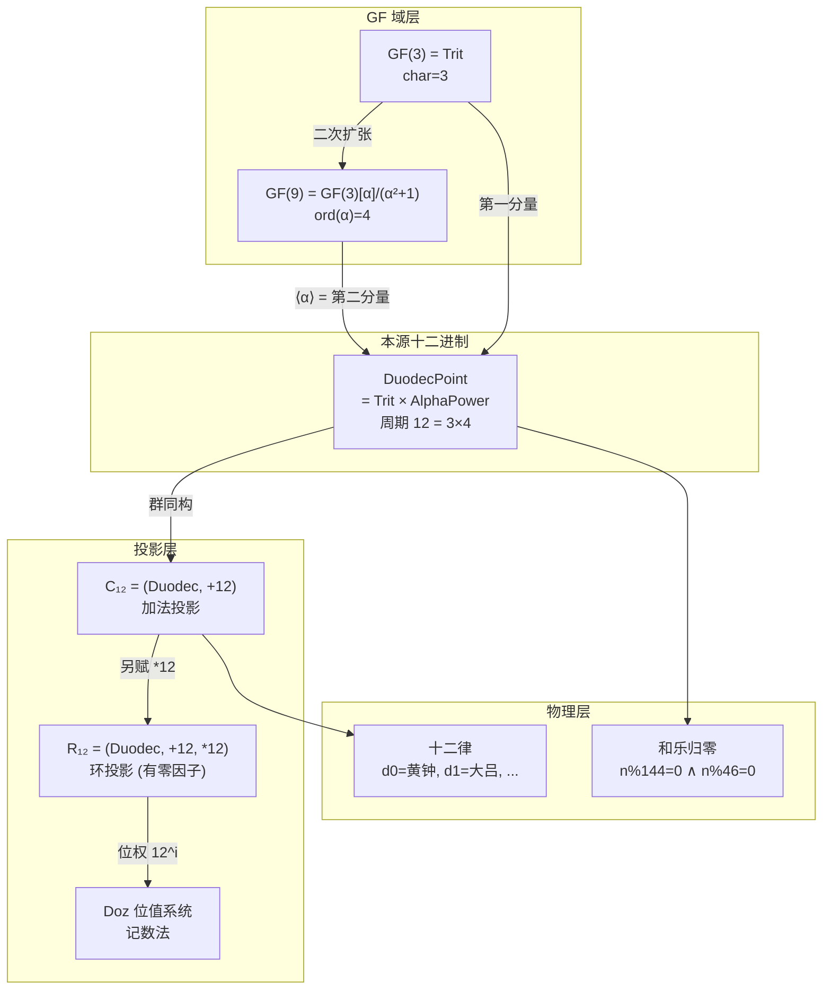
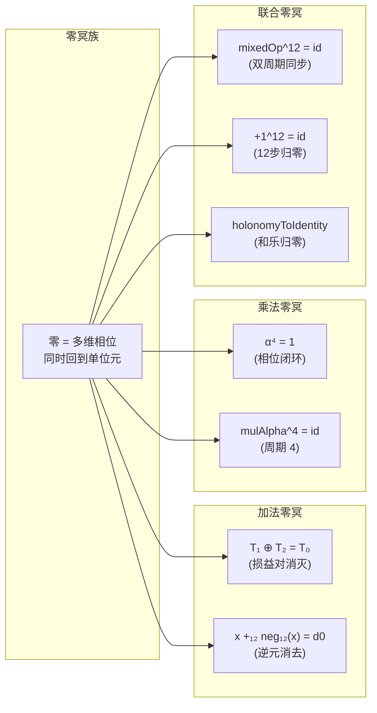
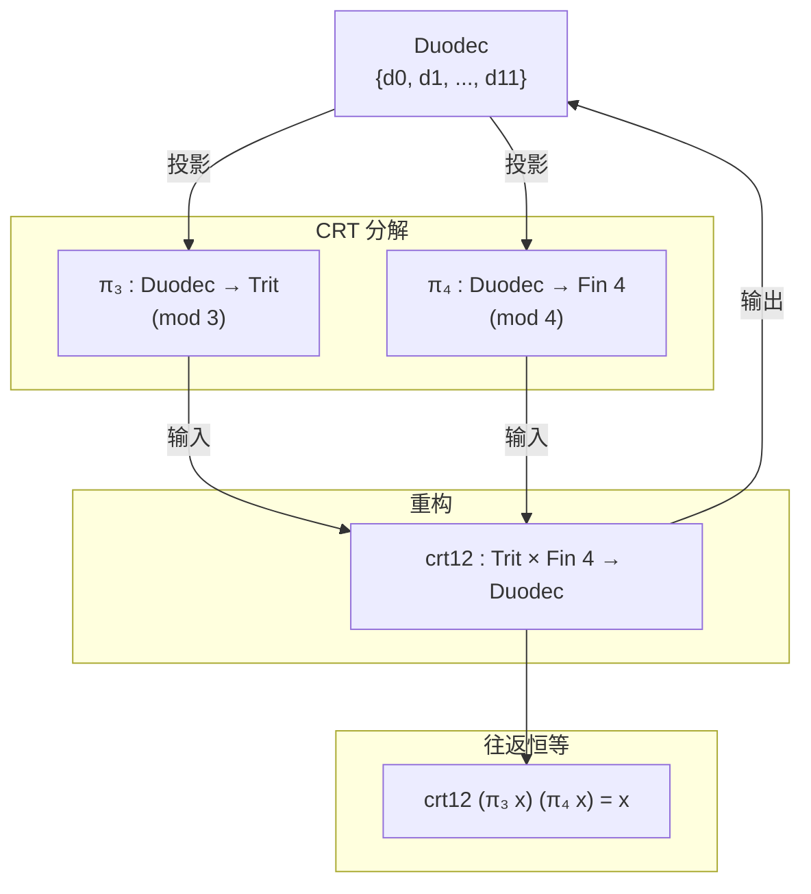
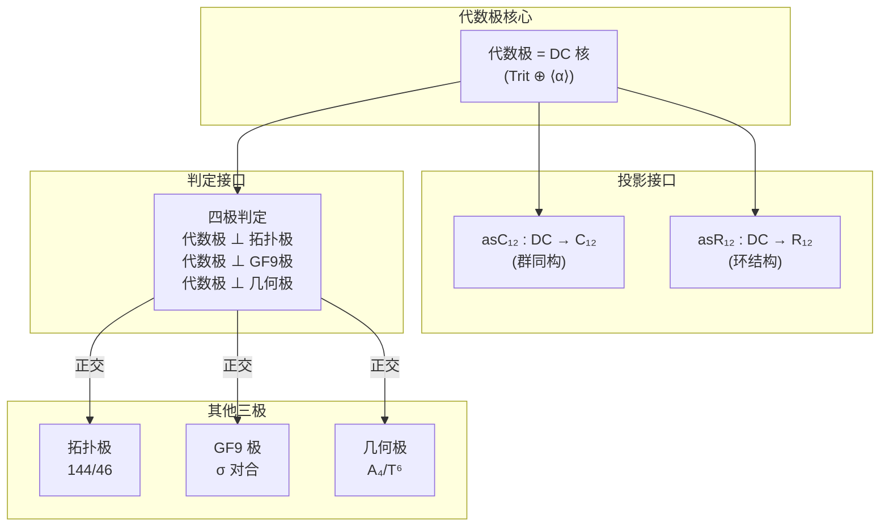
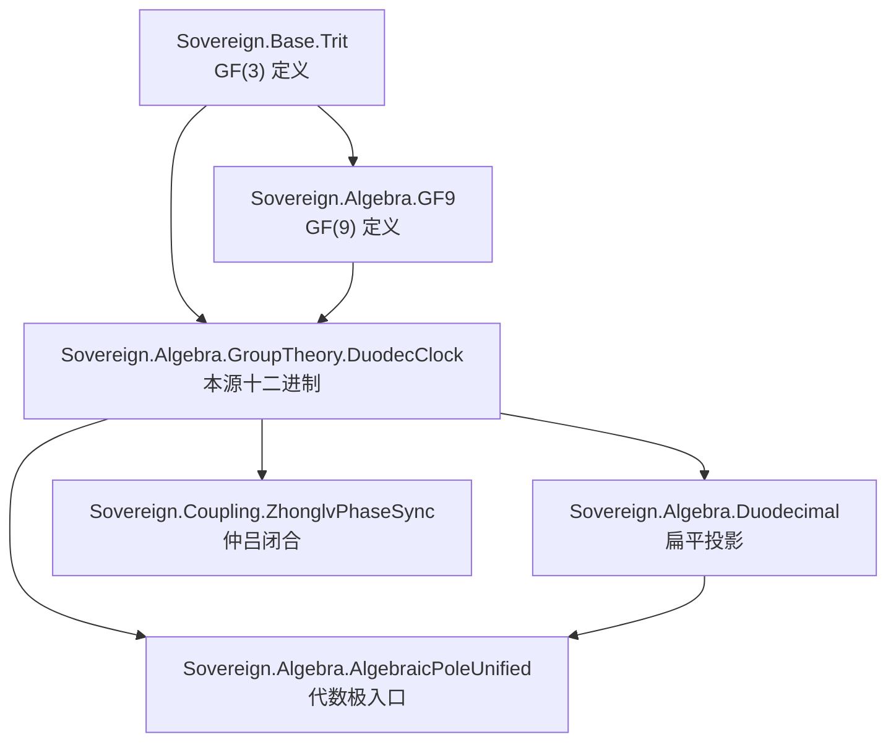
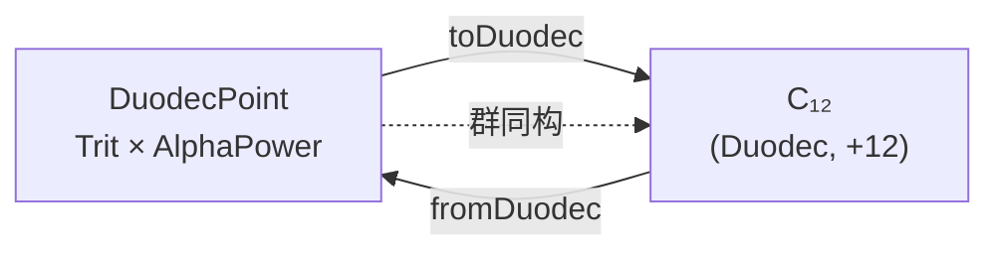

# 十二进制关系图谱

**日期**: 2026-08-25  
**状态**: 概念关系  
**格式**: Mermaid 图表 + 文字说明

---

## 一、层次关系图

---

## 二、零冥族关系图

---

## 三、CRT 分解关系图

---

## 四、代数极关系图

---

## 五、模块依赖图

---

## 六、术语映射表

| 代码名 | 数学名 | 语义 |
|--------|--------|------|
| `Trit` | \(\mathbb{F}_3\) | 三进制损益域 |
| `AlphaPower` | \(\langle\alpha\rangle\) | α 的幂次（阶 4） |
| `DuodecPoint` | \(\mathbb{Z}/3\mathbb{Z} \times \langle\alpha\rangle\) | 本源十二进制坐标 |
| `Duodec` | \(\mathbb{Z}/12\mathbb{Z}\) | 扁平十二进制标签 |
| `mixedOp` | \(\oplus \times \mathrm{mulAlpha}\) | 混合运算（加法 × 乘法） |
| `+12` | \(+_{12}\) | 模 12 加法 |
| `*12` | \(\times_{12}\) | 模 12 乘法（有零因子） |
| `π₃` | \(\pi_3\) | mod 3 投影 |
| `π₄` | \(\pi_4\) | mod 4 投影 |
| `crt12` | CRT | 中国剩余定理重构 |
| `d0` | \(0\) | 加法单位元 |
| `(T₀, a0)` | \((0, 1)\) | 联合单位元 |

---

## 七、同构关系

**注意**：同构 ≠ 同一。Duodecimal 的 `+12` 是 `mixedOp` 的**同构像**，不是本源定义。

---

## 八、物理对应

| 代数结构 | 物理对应 | 文档 |
|----------|---------|------|
| Trit 三态 | 吸收态/平衡态/表达态 | 驻波叠加 |
| α 阶 4 | 90° 旋转 | GF(9) 相位 |
| 12 = 3×4 | 联合周期 | 双周期同步 |
| d0 | 黄钟 | 十二律起点 |
| 和乐归零 | 144/46 同时归零 | 仲吕闭合 |
