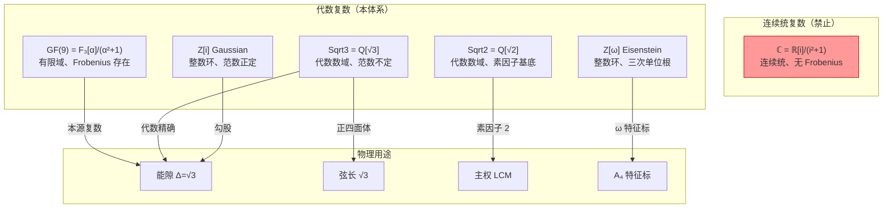

# 体系中的复数概念：与传统复数的本质区别

**日期**: 2026-08-25  
**状态**: 核心概念  
**来源**: AlgebraicComplex.agda, EnergyGap.agda, GF9.agda, Gaussian.agda, Eisenstein.agda

---

## 核心裁决

> **本体系不使用传统连续统复数 ℂ**。
> 
> 这不是「用代数数近似复数」，而是「复数是代数数的连续统投影」。
> 
> ——律算离散本源立场  
> 所有「复数」概念均为**代数数**（有理数域上的代数扩张），载体离散、范数定义各异。  
> **严禁使用 `Data.Complex`**，避免连续统污染。

---

## 一、传统复数 vs 本体系复数

### 1.1 传统复数

\[
\mathbb{C} = \mathbb{R}[i]/(i^2+1), \quad i^2 = -1
\]

- **载体**：连续统 ℝ²
- **范数**：\(N(a+bi) = a^2 + b^2 \geq 0\)（正定）
- **单位群**：\(\{1, i, -1, -i\} \cong C_4\)
- **问题**：连续统、无 Frobenius、无有限结构

### 1.2 本体系的「复数」

本体系至少有 **5 种**「复数」概念，各有不同用途：

| 名称 | 定义 | 载体 | 范数 | 用途 |
|------|------|------|------|------|
| **GF(9)** | \(\mathbb{F}_3[\alpha]/(\alpha^2+1)\) | 有限域 9 元 | \(N=a^2+b^2 \in \mathbb{F}_3\) | **本源代数复数** |
| **Gaussian** Z[i] | \(a+bi, \; a,b\in\mathbb{Z}\) | 整数环 | \(N=a^2+b^2 \geq 0\) | 勾股三元组 |
| **Eisenstein** Z[ω] | \(a+b\omega, \; \omega^2=-1-\omega\) | 整数环 | \(N=a^2-ab+b^2\) | A₄ 特征标表 |
| **Sqrt3** | \(a+b\sqrt{3}, \; a,b\in\mathbb{Q}\) | 代数数域 | \(N=a^2-3b^2\)（不定） | **能隙 Δ=√3** |
| **Sqrt2** | \(a+b\sqrt{2}, \; a,b\in\mathbb{Q}\) | 代数数域 | \(N=a^2-2b^2\) | 素因子基底 |

---

## 二、GF(9) — 本源代数复数

### 2.1 定义

```agda
-- Sovereign.Algebra.GF9
GF9 = GF3 × GF3   -- (a, b) = a + bα, α² = -1

alpha : GF9
alpha = T₀ , T₁   -- 0 + 1·α
```

### 2.2 与传统 ℂ 的区别

| 特性 | ℂ | GF(9) |
|------|---|-------|
| 载体 | ℝ²（连续） | \(\mathbb{F}_3^2\)（离散，9 元） |
| i²/α² | -1 | -1 ≡ 2 (mod 3) |
| 特征 | char = 0 | char = 3 |
| Frobenius | 无 | σ(x) = x³ 是域自同构 |
| 乘法群 | ℂ*（无限） | GF(9)*（阶 8，循环） |
| 单位群 | \(\{1,i,-1,-i\} \cong C_4\) | \(\langle\alpha\rangle \cong C_4\) |

### 2.3 关键性质

```agda
-- α 的 4 次幂 = 1
alpha-powers-4 : (alpha *gf9 alpha) *gf9 (alpha *gf9 alpha) ≡ gf9-one
alpha-powers-4 = refl

-- Frobenius 自同构：σ(α) = -α
sigma-alpha : galoisConjugate alpha ≡ (T₀ , T₂)
sigma-alpha = refl

-- 范数：N(a+bα) = a² + b² (在 GF(3) 中)
galoisNorm : GF9 → GF3
galoisNorm (a , b) = (a ⊗ a) ⊕ (b ⊗ b)
```

### 2.4 为什么 GF(9) 不是 ℂ

1. **特征 3**：3 = 0，没有「无穷小」概念
2. **有限**：只有 9 个元素，不是连续统
3. **Frobenius 存在**：σ(x)=x³ 是自同构，ℂ 没有对应物
4. **α²=-1≡2**：在 char 3 下 -1=2，不是「虚数单位」

---

## 三、Gaussian 整数 Z[i]

### 3.1 定义

```agda
-- Sovereign.RootMath.Gaussian
record Gaussian : Set where
  constructor gi
  field
    re : ℤ  -- 实部
    im : ℤ  -- 虚部
```

### 3.2 运算

```agda
-- 加法
_+ᵢ_ : Gaussian → Gaussian → Gaussian
gi a b +ᵢ gi c d = gi (a + c) (b + d)

-- 乘法：(a+bi)(c+di) = (ac-bd) + (ad+bc)i
_*ᵢ_ : Gaussian → Gaussian → Gaussian
gi a b *ᵢ gi c d = gi (a * c - b * d) (a * d + b * c)

-- 共轭
conjᵢ : Gaussian → Gaussian
conjᵢ (gi a b) = gi a (- b)

-- 范数：N = a² + b² ≥ 0
normᵢ : Gaussian → ℤ
normᵢ (gi a b) = a * a + b * b
```

### 3.3 关键性质

```agda
-- i² = -1
i-square : iᵤ *ᵢ iᵤ ≡ gi (-[1+ 0 ]) z0
i-square = refl

-- i⁴ = 1
i-fourth : (iᵤ *ᵢ iᵤ) *ᵢ (iᵤ *ᵢ iᵤ) ≡ 1ᵢ
i-fourth = refl

-- 单位群 ≅ C₄：{1, i, -1, -i}
unit-pow-0 : unit-pow 0 ≡ unit1
unit-pow-1 : unit-pow 1 ≡ uniti
unit-pow-2 : unit-pow 2 ≡ unitm1
unit-pow-3 : unit-pow 3 ≡ unitmi
unit-pow-4 : unit-pow 4 ≡ unit1
```

### 3.4 用途

- **勾股三元组**：\(a^2+b^2=c^2\) ↔ Gaussian 范数
- **整数环**：与 GF(9) 不同，Z[i] 是无限环
- **范数正定**：\(N=a^2+b^2 \geq 0\)

---

## 四、Eisenstein 整数 Z[ω]

### 4.1 定义

```agda
-- Sovereign.RootMath.Eisenstein
record Eisenstein : Set where
  constructor eis
  field
    a : ℤ  -- 实部系数
    b : ℤ  -- ω 系数
-- 表示 a + bω，其中 ω = e^{2πi/3}，ω² = -1-ω
```

### 4.2 运算

```agda
-- 加法
_+ᵉ_ : Eisenstein → Eisenstein → Eisenstein
eis a b +ᵉ eis c d = eis (a + c) (b + d)

-- 乘法：(a+bω)(c+dω) = (ac-bd) + (ad+bc-bd)ω
_*ᵉ_ : Eisenstein → Eisenstein → Eisenstein
eis a b *ᵉ eis c d = eis (a * c - b * d) (a * d + b * c - b * d)

-- 共轭：conj(a+bω) = (a-b) + (-b)ω
conjᵉ : Eisenstein → Eisenstein
conjᵉ (eis a b) = eis (a - b) ((+ 0) - b)
```

### 4.3 关键性质

```agda
-- ω² = -1-ω
ω²ᵉ = eis (-[1+ 0 ]) (-[1+ 0 ])

-- 1 + ω + ω² = 0
1+ω+ω²≡0 : (1ᵉ +ᵉ ωᵉ + ω²ᵉ) ≡ 0ᵉ
1+ω+ω²≡0 = refl

-- ω³ = 1
ω³≡1 : ωᵉ *ᵉ ωᵉ *ᵉ ωᵉ ≡ 1ᵉ
ω³≡1 = refl

-- 共轭关系
conj-ω≡ω² : conjᵉ ωᵉ ≡ ω²ᵉ
conj-ω²≡ω : conjᵉ ω²ᵉ ≡ ωᵉ
```

### 4.4 用途

- **A₄ 特征标表**：三维不可约表示的特征标值在 Z[ω] 中
- **手征结构**：ω 与 ω² 是共轭对，对应左右手征
- **三次单位根**：ω = e^{2πi/3} 是三次单位根

---

## 五、Sqrt3 代数复数

### 5.1 定义

```agda
-- Sovereign.RootMath.AlgebraicComplex
record Sqrt3 : Set where
  constructor _+s3_
  field
    rational : ℚ  -- 有理部分
    s3 : ℚ        -- √3 系数
-- 表示 a + b√3，其中 a, b ∈ ℚ
```

### 5.2 运算

```agda
-- 加法
_+ˢ_ : Sqrt3 → Sqrt3 → Sqrt3
(a +s3 b) +ˢ (c +s3 d) = (a + c) +s3 (b + d)

-- 乘法：(a+b√3)(c+d√3) = (ac+3bd) + (ad+bc)√3
_*ˢ_ : Sqrt3 → Sqrt3 → Sqrt3
(a +s3 b) *ˢ (c +s3 d) = ((a * c) + (three * b * d)) +s3 ((a * d) + (b * c))
  where three = + 3 / 1

-- 共轭：√3 → -√3
conjˢ : Sqrt3 → Sqrt3
conjˢ (a +s3 b) = a +s3 (negate b)

-- 范数：(a+b√3)(a-b√3) = a² - 3b²
normˢ : Sqrt3 → ℚ
normˢ (a +s3 b) = (a * a) - (three * b * b)
  where three = + 3 / 1
```

### 5.3 关键性质

```agda
-- √3 的平方 = 3
sqrt3SqProof : (sqrt3 *ˢ sqrt3) ≡ ((+ 3 / 1) +s3 (+ 0 / 1))
sqrt3SqProof = refl

-- 范数不定：a² - 3b² 可正可负
-- 例：N(1+√3) = 1 - 3 = -2（负）
-- 例：N(2+0√3) = 4（正）
```

### 5.4 用途

- **能隙 Δ=√3**：正四面体弦长，离散能隙
- **代数精确**：不用浮点近似，所有运算在 ℚ 上闭合
- **范数不定**：与 Gaussian 范数（正定）不同

---

## 六、Sqrt2 代数复数

### 6.1 定义

```agda
-- Sovereign.RootMath.AlgebraicComplex
record Sqrt2 : Set where
  constructor _+s2_
  field
    rational : ℚ  -- 有理部分
    s2 : ℚ        -- √2 系数
-- 表示 a + b√2，其中 a, b ∈ ℚ
```

### 6.2 运算

```agda
-- 乘法：(a+b√2)(c+d√2) = (ac+2bd) + (ad+bc)√2
_*²_ : Sqrt2 → Sqrt2 → Sqrt2
(a +s2 b) *² (c +s2 d) = ((a * c) + (two * b * d)) +s2 ((a * d) + (b * c))
  where two = + 2 / 1

-- 共轭：√2 → -√2
conj² : Sqrt2 → Sqrt2
conj² (a +s2 b) = a +s2 (negate b)

-- 范数：(a+b√2)(a-b√2) = a² - 2b²
norm² : Sqrt2 → ℚ
norm² (a +s2 b) = (a * a) - (two * b * b)
  where two = + 2 / 1
```

### 6.3 关键性质

```agda
-- √2 的平方 = 2
sqrt2SqProof : (sqrt2 *² sqrt2) ≡ ((+ 2 / 1) +s2 (+ 0 / 1))
sqrt2SqProof = refl
```

### 6.4 用途

- **素因子基底**：主权 LCM = 3¹¹ × 2¹⁶，√2 对应因子 2
- **六维体积**：√2 × √3 = √6，环面体积缩放因子

---

## 七、为什么禁止 Data.Complex

### 7.1 审计记录

```agda
-- EXTERNAL_DEPENDENCY_AUDIT.md
-- | `Data.Complex` | 2 | `Structology/DiscreteCalculus.agda` 使用复数，**违反纯三进制宪法** |
-- [ ] 移除 `Data.Complex` 引用，使用代数数替代。
```

### 7.2 AlgebraicComplex.agda 宪法声明

```agda
-- 本模块不使用 Data.Complex，所有运算在有理数域上闭合。
-- 这避免了连续统复数对离散拓扑证明的污染。
```

### 7.3 禁止原因

| 问题 | Data.Complex | 本体系代数数 |
|------|-------------|-------------|
| 载体 | ℝ²（连续统） | ℚ² 或 \(\mathbb{F}_3^2\)（离散） |
| 精度 | 浮点近似 | 有理数精确 |
| Frobenius | 无 | GF(9) 有 σ(x)=x³ |
| 有限性 | 无限 | GF(9) 有限 |
| 可判定性 | 不可判定 | refl 穷举 |

---

## 八、能隙 Δ=√3 的代数定义

### 8.1 C3 到 Sqrt3 的桥接

```agda
-- Sovereign.RootMath.EnergyGap
-- C3 元素到 Sqrt3 代数复振幅的映射
--   1   → 1 + 0√3
--   ω   → -1/2 + (1/2)√3   （代数精确表示）
--   ω²  → -1/2 - (1/2)√3
c3ToSqrt3 : C3Element → Sqrt3
c3ToSqrt3 c3-id     = (+ 1 / 1) +s3 (+ 0 / 1)
c3ToSqrt3 c3-omega  = (-[1+ 1 ] / 2) +s3 (+ 1 / 2)
c3ToSqrt3 c3-omega2 = (-[1+ 1 ] / 2) +s3 (-[1+ 1 ] / 2)
```

### 8.2 能隙定义

```agda
-- 相生复振幅：+1
phaseGenerate : Sqrt3
phaseGenerate = c3ToSqrt3 c3-id

-- 相克复振幅：ω = -1/2 + (1/2)√3
phaseOvercome : Sqrt3
phaseOvercome = c3ToSqrt3 c3-omega

-- 能隙跃迁：ω - 1（相克与相生的代数复振幅差）
--   = (-1/2 + 1/2√3) - (1 + 0√3) = -3/2 + 1/2√3
energyGapJump : Sqrt3
energyGapJump = phaseOvercome -ˢ phaseGenerate

-- 代数能隙 = √3
algebraicEnergyGap : Sqrt3
algebraicEnergyGap = sqrt3

-- 定理：代数能隙的平方 = 3
energyGapSquared : normˢ (algebraicEnergyGap *ˢ algebraicEnergyGap) ≡ + 9 / 1
energyGapSquared = refl
```

### 8.3 与连续 √3 的区别

| 特性 | 连续 √3 | 代数 √3 (Sqrt3) |
|------|---------|----------------|
| 载体 | ℝ（无理数） | ℚ²（有理数对） |
| 精度 | 无限小数 | 精确有理数 |
| 定点表示 | 不可能 | Q16.16: 56632/65536 |
| 可判定性 | 不可判定 | refl 穷举 |

---

## 九、层次关系图



---

## 十、合法/非法表述对照

| 非法（连续统污染） | 合法（代数精确） |
|-------------------|-----------------|
| 能隙 Δ=√3 是无理数 | 能隙 Δ=√3 是 Sqrt3 代数数，Q16.16 表示为 56632/65536 |
| 使用 Data.Complex 计算 | 使用 AlgebraicComplex.Sqrt3 代数计算 |
| ℂ 是本体系的复数 | GF(9) 是本体系的本源代数复数 |
| i² = -1 在本体系成立 | α² = -1 ≡ 2 (mod 3) 在 GF(9) 成立 |
| 复数范数 a²+b² ≥ 0 | Sqrt3 范数 a²-3b² 不定（可正可负） |
| √3 是连续统的无理数 | √3 是 Sqrt3 代数数域的元素 |

---

## 十一、术语表

| 术语 | 定义 | 代码 |
|------|------|------|
| **GF(9)** | \(\mathbb{F}_3[\alpha]/(\alpha^2+1)\)，9 元有限域 | `GF9` |
| **Gaussian** | \(a+bi, \; a,b\in\mathbb{Z}\)，高斯整数 | `Gaussian` |
| **Eisenstein** | \(a+b\omega, \; \omega^2=-1-\omega\)，艾森斯坦整数 | `Eisenstein` |
| **Sqrt3** | \(a+b\sqrt{3}, \; a,b\in\mathbb{Q}\)，√3 代数数 | `Sqrt3` |
| **Sqrt2** | \(a+b\sqrt{2}, \; a,b\in\mathbb{Q}\)，√2 代数数 | `Sqrt2` |
| **α** | GF(9) 的虚部单位，α²=-1≡2 (mod 3) | `alpha` |
| **ω** | 三次单位根，ω=e^{2πi/3}，ω²=-1-ω | `ωᵉ` |
| **σ** | Frobenius 自同构，σ(x)=x³ | `galoisConjugate` |
| **N(z)** | 范数映射 | `galoisNorm`, `normˢ`, `norm²` |
| **conj** | 共轭映射 | `conjᵉ`, `conjˢ`, `conj²` |
| **能隙** | Δ=√3，正四面体弦长 | `EnergyGap` |
